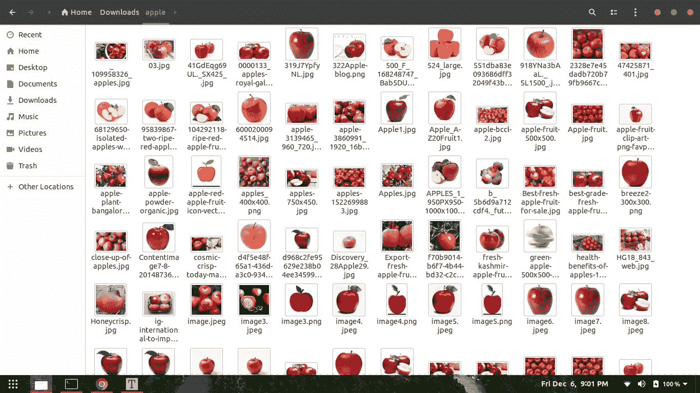
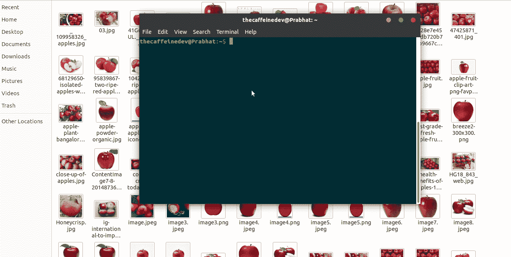

# 使用 Google Colab 的 Tensorflow 进行自定义对象检测

> 原文：<https://medium.com/analytics-vidhya/custom-object-detection-with-tensorflow-using-google-colab-7cbc484f83d7?source=collection_archive---------2----------------------->


[ja ma](https://unsplash.com/@ja_ma?utm_source=medium&utm_medium=referral) 在 [Unsplash](https://unsplash.com?utm_source=medium&utm_medium=referral) 上的照片

在这篇博文中，我们将使用 Tensorflow 对象检测 API 构建一个自定义的对象检测器。我会选择苹果果实的检测。但是你可以选择任何你想要的图像来检测你自己的自定义对象。

**需要的步骤是:**

1.  装置
2.  收集数据
3.  标签数据
4.  为培训生成 TFRecords
5.  配置培训
6.  培训模式
7.  导出推理图
8.  测试对象检测器

# 装置

确保你有 Python 3.6 或更高版本。我已经在我的 Ubuntu 18.04 机器上做到了这一点。如果你使用的是 Windows，那么这个过程会有一点不同。

如果你已经有了 ***pip*** 那么你就可以开始了。否则，通过以下方式安装 ***pip3***

```
sudo apt install python3-pip
```

# 1.1 张量流

然后使用以下命令安装 Tensorflow:

```
pip3 install tensorflow
```

如果您有可以与 Tensorflow 一起使用的 GPU:

```
pip install tensorflow-gpu
```

其余的库可以通过 apt-get 安装在 Ubuntu 18.04 上:

# 1.2 其他依赖关系

```
sudo apt-get install protobuf-compiler python3-pil python3-lxml python3-tk git
```

其他人

```
pip3 install pillow Cython lxml jupyter matplotlib contextlib2
```

确保 Cython 已经安装，然后再做

```
pip3 install pycocotools
```

# 1.3 克隆 Tensorflow 模型库

克隆 TensorFlow 模型库:

```
git clone [https://github.com/tensorflow/models.git](https://github.com/tensorflow/models.git)
```

**从此时起，该目录将被称为** `models` **目录。**

# 1.4 设置环境

在克隆了 tf models repo 之后，现在转到研究文件夹

```
cd models/research
```

**Protobuf 编译**

Tensorflow 对象检测 API 使用 Protobufs 来配置模型和训练参数。在使用框架之前，必须编译 Protobuf 库。这应该通过从 tensorflow/models/research/目录运行以下命令来完成:

```
# From tensorflow/models/research/
protoc object_detection/protos/*.proto --python_out=.
```

**向 PYTHONPATH 添加库**

在本地运行时，tensorflow/models/research/和 slim 目录应该附加到 PYTHONPATH 中。这可以通过从 tensorflow/models/research/运行以下命令来完成:

```
# From tensorflow/models/research/
export PYTHONPATH=$PYTHONPATH:`pwd`:`pwd`/slim
```

*注意:*这个命令需要在您启动的每个新终端上运行。如果您希望避免手动运行它，可以将它作为一个新行添加到~/的末尾。bashrc 文件，用您系统上 tensorflow/models/research 的绝对路径替换`pwd`。

**物体检测安装**

```
# From tensorflow/models/research/
sudo python3 setup.py install
```

**测试安装**

您可以通过运行以下命令来测试是否正确安装了 Tensorflow 对象检测 API:

```
python3 object_detection/builders/model_builder_test.py
```

如果结果如下所示，您就可以继续下一步了！

```
...............----------------------------------------------------------------------

Ran 15 tests in 0.120sOK
```

# 收集数据

**2.1** 打开你的谷歌 chrome 浏览器，安装一个名为[的扩展，下载所有图片](https://chrome.google.com/webstore/detail/download-all-images/ifipmflagepipjokmbdecpmjbibjnakm?hl=en)

**2.2** 。现在在谷歌图片中搜索你想要的图片，在我的例子中，是“苹果”。现在点击浏览器右上角的“下载所有图片”扩展按钮。你会得到一个包含你的图片的 zip 文件。然后提取它。



苹果文件夹

# 标签数据

打开你的终端，安装*标签*

```
pip3 install labelImg
```

LabelImg 是一个图形化的图像注释工具。

安装标签后，输入以下命令打开它

```
labelImg
```

在你的终端里



并且像我正在做的那样遵循上面的。对所有的图片都这样做。它正在做的是，生成一个 XML 文件，其中包含带有标签的对象坐标。

我标记了大约 100 张图片。

现在克隆我的仓库

```
git clone https://github.com/TheCaffeineDev/Tensorflow-Object-Detection-API-With-Custom-Dataset.git
```

克隆后进入目录。

您的目录结构应该如下所示:

```
├── ...
    ├── data                 
    ├── images
    │   ├── train
    │   ├── test
    ├── utils
    │	├── label_map_util.py
    │	├── visualization_utils.py
    ├── generate_tfrecord.py
    └── object-detection.pbtxt
    └── transform_image_resolution.py
    └── xml_csv.py
    └── webcam_inference.py
```

# 为培训生成 TFRecords

现在将 70%的图像文件复制到训练文件夹 *images/train* 中，剩下的 30%复制到测试文件夹中。

有了标记的图像，我们需要创建 TFRecords，它可以作为目标检测器训练的输入数据。为了创建 TFRecords，我们将使用来自 [Dat Tran 的浣熊检测器](https://github.com/datitran/raccoon_dataset)的两个脚本。即 *xml_to_csv.py* 和 *generate_tfrecord.py* 文件。

```
├── ...
├── data                 
├── images
│   ├── train
│		├── image1.jpg
│		├── image1.xml ..
│   ├── test
│		├── image5.jpg
│		├── image5.xml ..
├── generate_tfrecord.py
└── object-detection.pbtxt
└── transform_image_resolution.py
└── xml_csv.py
└── webcam_inference.py 
```

现在，在该文件夹中，我们可以通过打开命令行并键入以下命令，将 XML 文件转换为 train_label.csv 和 test_label.csv:

```
python xml_to_csv.py
```

这将在数据目录中创建两个文件。一个叫做 *test_labels.csv* ，另一个叫做 *train_labels.csv* 。

在我们能够将新创建的文件转换成 TFRecords 之前，我们需要修改 *generate_tfrecords.py* 文件中的几行。

出发地:

```
# TO-DO replace this with label map , replace with your own classes
def class_text_to_int(row_label):
    if row_label == 'apple':
        return 1
    else:
        return 0
```

如果你有多门课，

```
# TO-DO replace this with label map
def class_text_to_int(row_label):
    if row_label == 'apple':
        return 1
    elif row_label == 'banana':
        return 2
    elif row_label == 'orange':
        return 3
    else:
        return None
```

现在，您可以通过键入以下命令来生成 TFRecords:

```
python3 generate_tfrecord.py --csv_input=data/train_labels.csv  --output_path=train.record --image_dir=images/trainpython3 generate_tfrecord.py --csv_input=data/test_labels.csv  --output_path=test.record --image_dir=images/test
```

这两个命令生成一个 *train.record* 和一个 *test.record* 文件，可用于训练我们的目标探测器。

# 配置培训

在训练之前，我们需要做的最后一件事是创建一个标签映射和一个训练配置文件。

# 创建标注地图

标签映射将 id 映射到名称。我已经为培训创建了一个标签映射文件。看起来是这样的:

编辑 *object-detection.pbtxt*

```
item{
  id:1
  name:"apple"

}
```

如果您使用多个类，请遵循这个模式。

```
item {
    id: 1
    name: 'apple'
}
item {
    id: 2
    name: 'banana'
}
item {
    id: 3
    name: 'orange'
}
item {
    id: 4
    name: 'etc'
}
```

每个项目的 id 号应该与 *generate_tfrecord.py* 文件中指定的 id 相匹配。

# 创建培训配置

我们将在 Google Colab 中训练我们的模型。

请点击下面的链接。我已经做了适当的记录。

[在 Colab 中打开](https://colab.research.google.com/drive/1o7JB0pWanEMn6qnRnEXphu0T4YbuKLL2)

我使用“SSD_MOBILENET_V2”进行训练，批量大小为 4。您可以更改步骤的数量，使用哪个预训练模型&批次和大小。

然后你需要运行下面的单元格。将有一个上传 TF 记录标题。下面你需要上传你生成的 *train.record* ，*test . record*&*object-detection . Pb txt*文件。

# 培训模式

上传完所有文件后，运行下面的单元格。它会被训练的。

# 导出推理图

如果你已经运行了所有的单元格，那么，最后，一个名为*frozen _ inference _ graph . Pb*file 的文件将被下载。

# 测试对象检测器

现在将那个*freezed _ inference _ graph . Pb*文件复制到我的 GitHub 克隆文件夹中。然后你需要在那个 *webcam_inference.py* 中编辑一些东西来测试你自己的物体检测器。打开文件并检查代码。我已经提到你需要改变的线。你几乎可以做到。

如果您正确遵循了上述所有步骤，那么您将能够通过网络摄像头测试您的模型。

# 结论

Tensorflow 对象检测 API 允许您使用迁移学习技术创建自己的对象检测器。

下面是抢码链接。

[Github 回购](https://github.com/TheCaffeineDev/Tensorflow-Object-Detection-API-With-Custom-Dataset)

如果你有任何问题、建议或批评，可以通过推特或邮件联系我。

*原贴于我的* [*博客*](https://thecodemonk.in/software/object-detection) *。*

谢谢你

# 参考

1.  [https://github . com/tensor flow/models/tree/master/research/object _ detection](https://github.com/tensorflow/models/tree/master/research/object_detection)
2.  [https://medium . com/@ WuStangDan/step-by-step-tensor flow-object-detection-API-tutorial-part-1-selecting-a-model-a 02 b 6 aabe 39 e](/@WuStangDan/step-by-step-tensorflow-object-detection-api-tutorial-part-1-selecting-a-model-a02b6aabe39e)
3.  [https://python programming . net/introduction-use-tensor flow-object-detection-API-tutorial/](https://pythonprogramming.net/introduction-use-tensorflow-object-detection-api-tutorial/)
4.  [https://towards data science . com/creating-your-own-object-detector-ad 69 DDA 69 c 85](https://towardsdatascience.com/creating-your-own-object-detector-ad69dda69c85)