# 使用 YoloV3 构建自定义对象检测器的指南

> 原文：<https://medium.com/analytics-vidhya/custom-object-detection-with-yolov3-8f72fe8ced79?source=collection_archive---------0----------------------->

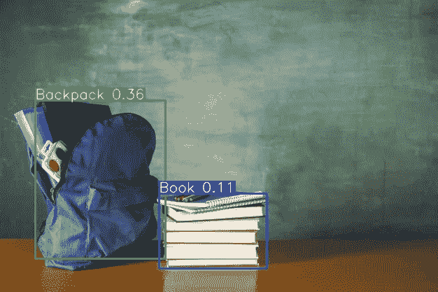

目标探测

在本文中，我将向您展示如何使用 YoloV3 创建您自己的自定义对象检测器。

我假设你已经知道深度学习计算机视觉的基本知识。

我打算在我自己的 GPU 上训练我的模型。

**需要的步骤有:**

1.  收集数据
2.  转换为 YoloV3 格式
3.  设置培训渠道
4.  培训模式
5.  导出权重文件。
6.  测试对象检测器

# 1.收集数据

我们将从 [OpenImagesV5](https://storage.googleapis.com/openimages/web/visualizer/index.html?set=train&type=detection&c=%2Fm%2F0k5j) 获取数据。它于 2016 年首次推出，是一个合作发布，包含约 900 万张图片，标注了覆盖数千种对象类别的标签。新版本是对 2018 年[公开图像 V4](https://storage.googleapis.com/openimages/web/factsfigures_v4.html) 的更新。

Open Image V5 为 350 个类别中的 280 万个对象的图像分割遮罩新增了注释。与仅识别对象所在的大致区域的边界框不同，这些图像分割掩模跟踪目标对象的轮廓，以更高的细节水平表征其空间范围。

我将从 OpenImagesV5 中选择 4 个类别，即*背包、手表、书和耳机*。你想选多少就选多少。

我们必须先下载那些图像。GitHub 有一个很棒的[工具包，里面有如何使用它的完整解释。这个工具包将帮助我们下载图像。工具包的安装很容易。](https://github.com/pythonlessons/OIDv4_ToolKit)[这个家伙](https://pylessons.com/YOLOv3-introduction/)写了一个使用 yolov3 使用 Keras 检测自定义对象的教程。你可以去看看，他已经解释了所有的步骤。在我的帖子中，我将使用 PyTorch，并尽可能简化事情。

1.  **下载工具包**

首先，打开您的终端并克隆工具包存储库

```
git clone [https://github.com/pythonlessons/OIDv4_ToolKit.git](https://github.com/pythonlessons/OIDv4_ToolKit.git)
```

然后去文件夹旁

```
cd OIDv4_ToolKit
```

通过以下方式安装所有依赖项

```
pip3 install -r requirements.txt
```

**2。使用工具箱** **&下载数据**

首先如何检查我们是否可以下载我们需要的合适的图像类？你需要进入 OIDv5 主页，点击“探索”,在搜索标签中找到你想要的课程。在我的例子中，我将搜索“手表”、“背包”、“书”和“耳机”。要下载它们，你只需运行

```
python3 main.py downloader --classes Watch Backpack Book Headphones --type_csv train --multiclasses 1 --limit 600
```

使用这个命令，每个班级的 600 个训练图像将被下载。如果您是第一次使用，它会要求您下载(训练-注释-bbox 或测试-注释-bbox) CSV 文件。在运行命令时键入 Y，以便下载该命令。

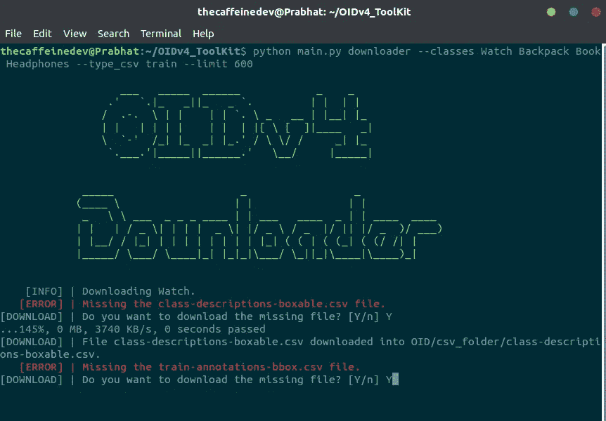

你需要等待一段时间来完成下载。

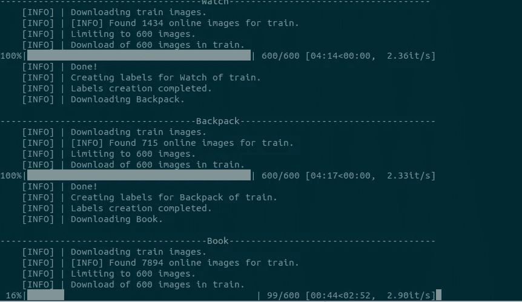

这是文件夹结构:

```
main_folder
│   - main.py
│   - oid_to_pascal_voc_xml.py
│   ..
└─── OID
    │
    └─── csv_folder
    │   │
    │   └─── class-descriptions-boxable.csv
    │   │
    │   └─── test-annotations-bbox.csv
    │   │
    │   └─── train-annotations-bbox.csv
    └─── OID
        │
        └─── Dataset
            │
            └─── train
                │
                └─── Watch_Backpack_Book_Headphones0
```

# 3.转换为 YoloV3 格式

打开`oid_to_pascal_voc_xml.py`并编辑第 9 行，然后

```
XML_DIR = 'TO_PASCAL_XML'
```

现在你需要跑

```
python3 oid_to_pascal_voc_xml.py
```

以生成 XML 格式的对象坐标。运行上述文件后，您将在 TO_PASCAL_XML 文件夹中获得 XML 格式的对象标签文件。

同样，我们需要将它转换成 YoloV3 格式。

要训练 Yolo 模型，需要满足以下要求:如何制作注释文件:

*   一个图像一行；
*   行格式:image _ file _ path box 1 box 2…boxN；
*   框格式:x_min，y_min，x_max，y_max，class_id(无空格)。

这里有一个例子:

*   path/to/img1.jpg 50，100，150，200，0 30，50，200，120，3
*   path/to/img2.jpg 120，300，250，600，4 …

现在你将不得不用这些做一些小工作。请耐心等待，现在需要一些手工操作。

我将使用 [Ultralytics](https://github.com/ultralytics/yolov3) 的代码来训练我们的 YoloV3 模型。一定要检查他们的仓库，这很好。我对文件夹结构做了一些修改，都是为了我们自己的模型。现在克隆我的存储库，以进行下一步。

```
git clone [https://github.com/TheCaffeineDev/YoloV3-Custom-Object-Detection.git](https://github.com/TheCaffeineDev/YoloV3-Custom-Object-Detection.git)
```

这是文件夹结构

```
main_folder
│   - detect.py
│   - models.py
│   - train.py
│  - test.py
│  - requirements.txt
│  ...
└─── cfg
└─── conversion
    │
    └─── output
    └─── xmls
    │  - classes.txt
    │  - xmltotxt.py
    │  ...
└─── data
└─── training
│ │
│ └─── images
│ └─── labels
│ - object.names
│ - trainer.data
│ - yolov3.cfg
│ - train_test.py
│
└─── utils
└─── weights
```

现在，在主文件夹中，并在您的终端中运行它来安装所有需要的依赖项。

```
pip3 install -r requirements.txt
```

然后您必须返回到 OIDV4_Toolkit 文件夹`OIDv4_ToolKit/OID/Dataset/train/Watch_Backpack_Book_Headphones/`。这里你需要将所有的图片复制到我们的克隆库`/YoloV3-Custom-Object-Detection/training/images`的以下文件夹中

您需要将文件夹中的所有 XML 文件复制到`/YoloV3-Custom-Object-Detection/conversion/xmls`文件夹中。不要对以上这些步骤感到困惑。

复制后，转到`conversion`文件夹。您需要编辑`classes.txt`文件，并将您自己的类放在那里。

看起来是这样的:

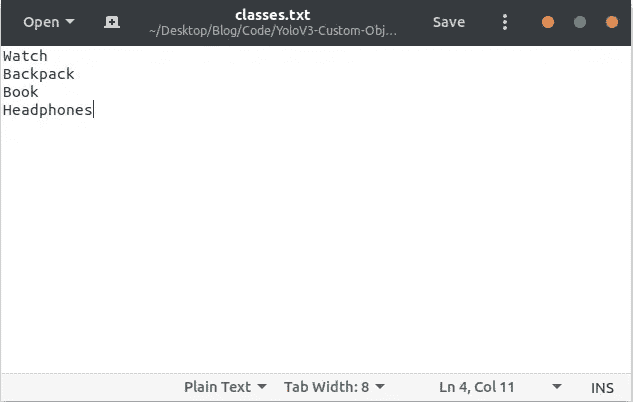

现在在转换文件夹运行

```
# In YoloV3-Custom-Object-Detection/conversion folder
python3 xmltotxt.py -xml xmls -out output
```

这将在输出文件夹中生成 yolov3 格式的所有标签文件。

# 3.设置培训渠道

现在你必须将`YoloV3-Custom-Object-Detection/conversion/output`文件夹中的所有`.txt`文件复制到`YoloV3-Custom-Object-Detection/training/labels`文件夹中。

现在转到`YoloV3-Custom-Object-Detection/training`文件夹。现在我们将在这里编辑一些文件。现在打开那个`object.names`文件，用你自己的类编辑它。

现在在

```
# In YoloV3-Custom-Object-Detection/training folder
python3 train_test.py
```

上面这个文件会生成`train.txt`和`test.txt`。您可以打开并检查文件以了解更多详细信息。基本上，我们将 70% & 30%分别用于培训和测试。

然后打开`trainer.data`。看起来是这样的。

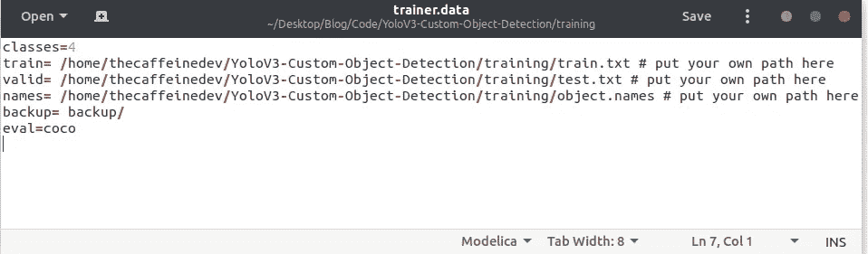

你需要在第一行输入你的班级号，`train.txt`和`test.txt`路径在第二和第三行，`object.names`路径在第四行。

现在您需要编辑`***.cfg**`文件。默认情况下，每个 YOLO 层有 255 个输出:每个锚点 85 个输出[4 个框坐标+ 1 个对象置信度+ 80 个类别置信度]，乘以 3 个锚点。

在我们的例子中，我们只使用了四个类，然后我们需要编辑过滤器。您可以将过滤器减少到`filters=[4 + 1 + n] * 3`，其中`n`是您的类计数。这种修改应该在三个 YOLO 层的每一层之前进行。此外，修改`classes=80`到`classes=n`在每个 YOLO 层，其中`n`是你的类计数。

在我们的案例中，在`yolov3.cfg`文件中，我更改了第 **6** 和 **7** 行中的批次大小&细分。然后是行号 **610** (类=4)和 **603** (过滤器=27)，然后是行号 **689** & **696** ，最后是行号**776**&783。如果您使用 tiny-yolo，行号会有所不同。

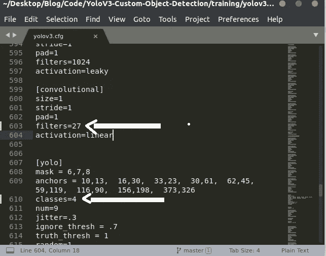

现在我们准备训练我们的 yolov3 模型。

# 4.培训模式

下面是我的桌面规范，我将在其中训练我的模型。

*   **GPU:**NVIDIA GeForce RTX*2080 超级* (8GB)
*   **内存:** 16GB DDR4
*   操作系统:Ubuntu 18.04

现在在`YoloV3-Custom-Object-Detection`文件夹中打开终端并运行

```
# In YoloV3-Custom-Object-Detection runpython3 train.py --epochs 110 --data training/trainer.data --cfg training/yolov3.cfg --batch 16 --accum 1
```

那里有可选的参数，你可以签入`train.py`文件。

此外，您还可以在`train.py`中为您的特定任务**更新超参数**，如 LR、LR 调度程序、优化程序、增强设置、multi_scale 设置等。我建议你先从所有默认设置开始更新。

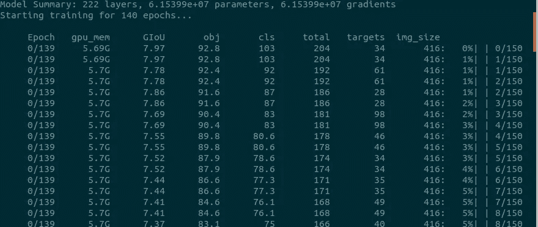

模特培训

要在训练时运行 tensorboard，请打开另一个终端并运行

```
# In YoloV3-Custom-Object-Detection do
tensorboard --logdir=runs
```

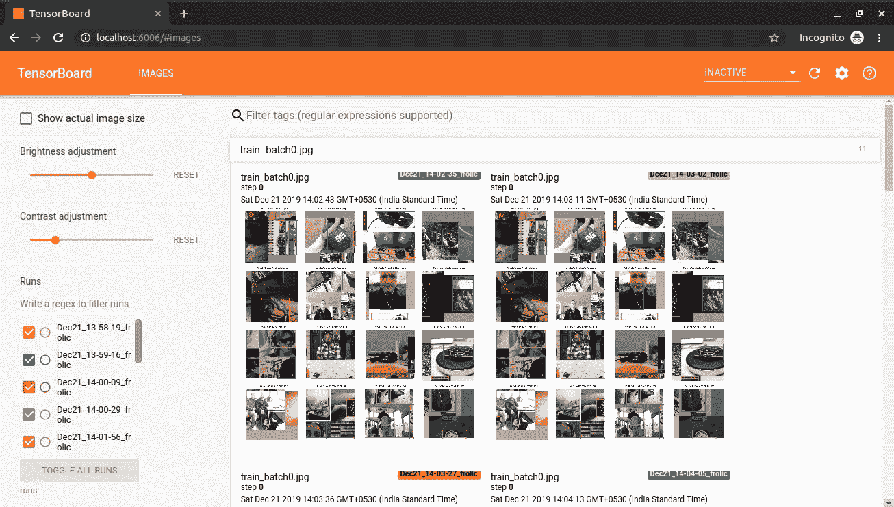

张量板

我花了 2 个小时，用 110 个历元训练了 4 个对象。

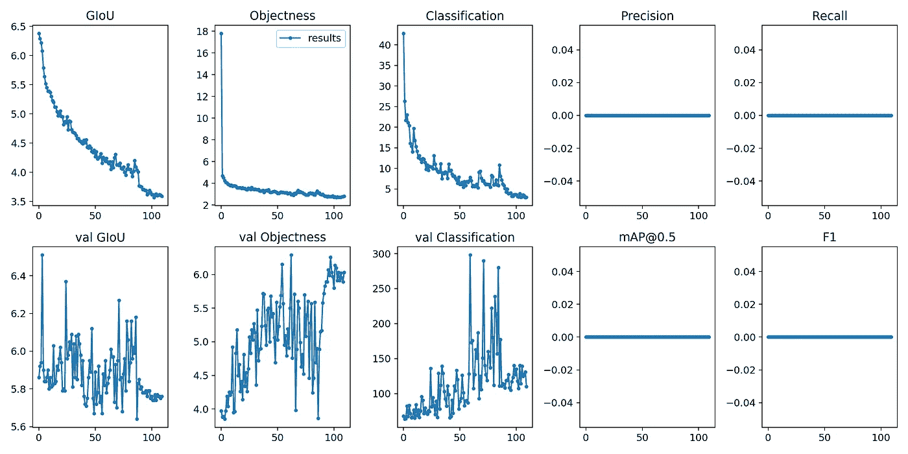

结果

如果你按照上面的步骤去做，你就能适当地训练出你自己的模型。

# 5.导出权重文件。

训练完模型后，我们可以在 weights 文件夹中获得权重文件。它是`PyTorch`模型格式的。我们需要把它转换成`darknet`格式来测试它。先换算一下吧。打开终端运行

```
# convert cfg/pytorch model to darknet weights
# In YoloV3-Custom-Object-Detection
python3  -c "from models import *; convert('training/yolov3.cfg', 'weights/best.pt')"
​
```

您将在转换后获得此消息。

```
Success: converted 'weights/yolov3-spp.pt' to 'converted.weights'
```

现在我们将测试我们的对象检测器。您将在`YoloV3-Custom-Object-Detection`文件夹中拥有`converted.weights`。

# 6.测试对象检测器

现在要运行推理，打开您的终端并运行

```
# In YoloV3-Custom-Object-Detection - for webcam
python3 detect.py --source 0 --weights converted.weights --cfg training/yolov3.cfg --names training/object.names --img-size 416
```

详情请查看`detect.py`。

*   图片:`--source file.jpg`
*   视频:`--source file.mp4`
*   目录:`--source dir/`
*   网络摄像头:`--source 0`
*   RTSP 流:`--source rtsp://192.168.0.1/rtp/470011235daa`

下面你可以看到一些图像推论:

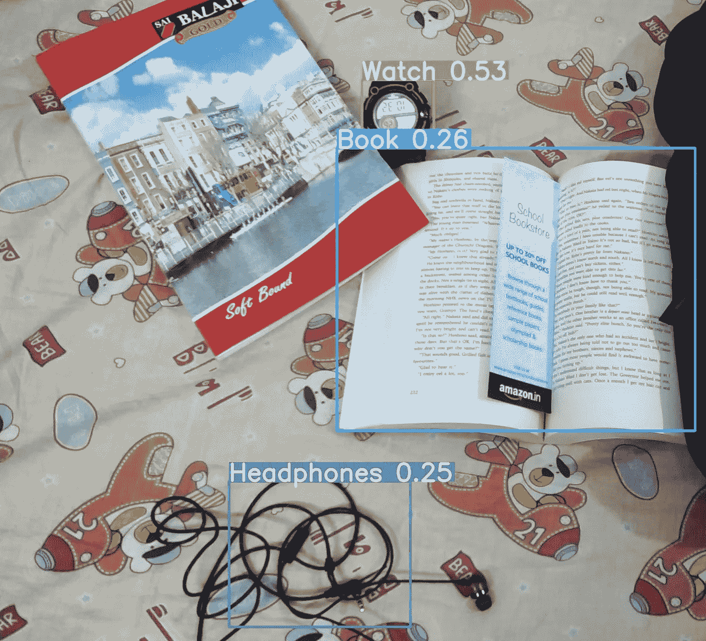

推理

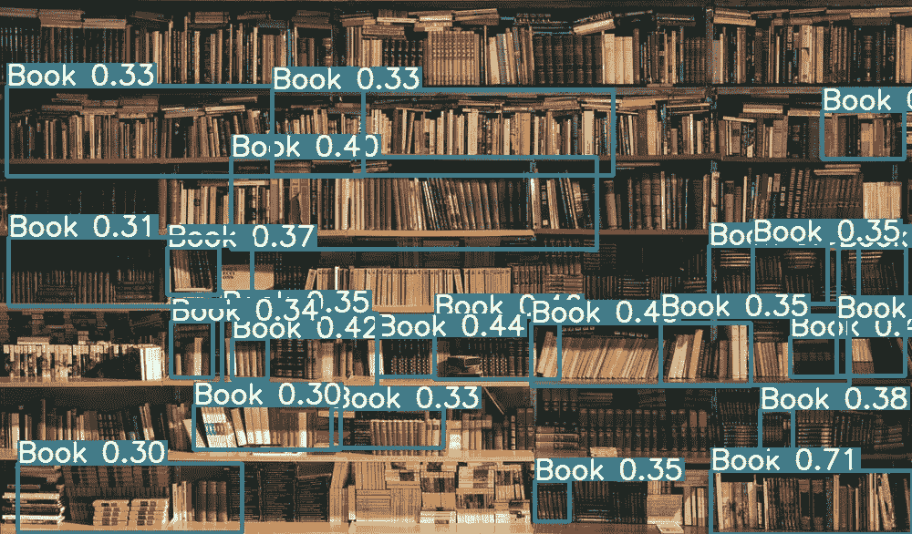

由于 GitHub 文件大小的限制，我无法上传到 GitHub。如果你想测试我的体重文件，你可以通过

```
wget [https://www.dropbox.com/s/903xy5ba5htitga/converted.weights](https://www.dropbox.com/s/tou8f0xvs8wdt8a/converted.weights?dl=0)
```

到存储库的链接:[https://github . com/TheCaffeineDev/yolo v3-Custom-Object-Detection](https://github.com/TheCaffeineDev/YoloV3-Custom-Object-Detection)

如果您想标记您自己的自定义图像，您可以使用 [LabelImg](https://github.com/tzutalin/labelImg) 。训练的过程和所有的几乎一样。

如果您有任何问题、建议或批评，可以通过 [Twitter](https://twitter.com/thecaffeinedev) 或通过我的[邮件](mailto:prabhat1015@gmail.com)联系我。请随时联系我。

*原贴于我的* [*博客*](https://thecodemonk.in/software/object-detection-yolov3) *。*

***【谢谢】***

# 证明人和信用

1.  [https://medium . com/synced review/Google-releases-open-image-V5-launches-open-image-challenge-91fa 802 f 0 EDF](/syncedreview/google-releases-open-image-v5-launches-open-image-challenge-91fa802f0edf)
2.  [https://github.com/ultralytics/yolov3](https://github.com/ultralytics/yolov3)
3.  [https://pylessons.com/](https://pylessons.com/)