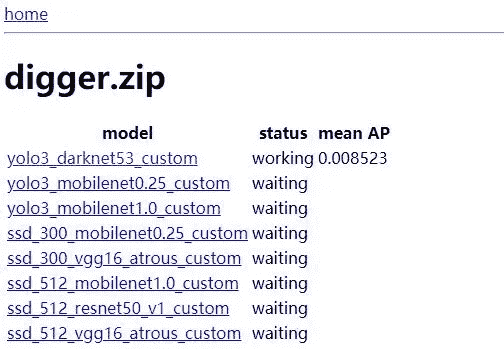
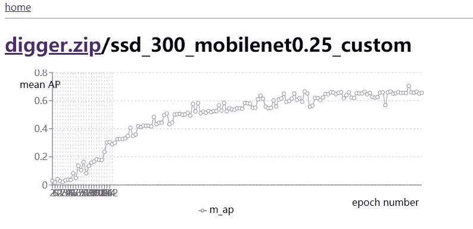

# 零代码自定义对象检测

> 原文：<https://medium.com/analytics-vidhya/custom-object-detection-with-zero-code-d12739569bf7?source=collection_archive---------23----------------------->

如果你想要一个自己的自定义对象检测，并且没有太多的时间编码(或者甚至不是一个编码器)，现在你可以使用我的项目

[](https://github.com/postor/ease-training) [## 岗位/轻松培训

### prepare a dataset and you are ready to train, zero coding | 只要准备好训练数据集，就可以开始训练了，无需编码 clone this project and cd project…

github.com](https://github.com/postor/ease-training) 

首先，让我们快速浏览一下

轻松训练一瞥

因此，您需要的只是包含您想要检测的内容的图像。

## 启动服务器

我自己用的是 Ubuntu 桌面，你可以用你喜欢的操作系统，但是我不确定软件是否能和其他软件兼容

我们需要 docker 和 docker-compose 来运行我的图像

[](https://docs.docker.com/v17.09/engine/installation/) [## 安装 Docker

### 预计阅读时间:8 分钟 Docker 有两个版本:社区版(CE)和企业版…

docs.docker.com](https://docs.docker.com/v17.09/engine/installation/) [](https://docs.docker.com/compose/install/) [## 安装 Docker 撰写

### 预计阅读时间:7 分钟您可以在 macOS、Windows 和 64 位 Linux 上运行 Compose。码头工人写作靠…

docs.docker.com](https://docs.docker.com/compose/install/) 

然后 GPU 驱动和 nvidia-docker，我直接装 CUDA 里面有 GPU 驱动，反正我有时候需要直接运行一些机器学习。

[](https://developer.nvidia.com/cuda-downloads) [## CUDA 工具包 10.2 下载

### 选择目标平台单击描述您的目标平台的绿色按钮。只有受支持的平台才会…

developer.nvidia.com](https://developer.nvidia.com/cuda-downloads) [](https://github.com/NVIDIA/nvidia-docker) [## 英伟达/英伟达-docker

### NVIDIA 容器工具包允许用户构建和运行 GPU 加速 Docker 容器。该工具包包括一个…

github.com](https://github.com/NVIDIA/nvidia-docker) 

当然需要 git

[](https://git-scm.com/downloads) [## 下载

### Git 是软件自由保护协会的成员，该协会处理该项目的法律和财务需求。保护…

git-scm.com](https://git-scm.com/downloads) 

然后下载代码并启动服务

```
git clone [https://github.com/postor/ease-training.git](https://github.com/postor/ease-training.git)
cd [ease-training](https://github.com/postor/ease-training.git)
. prepare.sh
docker-compose -d
```

然后访问 [http://localhost:3000](http://localhost:3000) 或将 localhost 替换为 LAN IP，应该是这样的:


主页

## 准备您的定制 VOC 格式数据集

关于这个有很多链接，你可以先参考这个指南

[](/deepquestai/object-detection-training-preparing-your-custom-dataset-6248679f0d1d) [## 对象检测培训—准备您的自定义数据集

### 以 Pascal VOC 格式注释自定义图像数据集的教程

medium.com](/deepquestai/object-detection-training-preparing-your-custom-dataset-6248679f0d1d) 

我认为这些链接也会有所帮助

[](https://gluon-cv.mxnet.io/build/examples_datasets/detection_custom.html#derive-from-pascal-voc-format) [## 为对象检测准备自定义数据集- gluoncv 0.6.0 文档

### 有了 GluonCV，我们已经不费吹灰之力就为广泛使用的公共数据集提供了内置支持，例如 Prepare…

胶子-cv.mxnet.io](https://gluon-cv.mxnet.io/build/examples_datasets/detection_custom.html#derive-from-pascal-voc-format) [](https://github.com/tzutalin/labelImg.git) [## 佐他林/标签

### LabelImg 是一个图形化的图像注释工具。它是用 Python 写的，使用 Qt 作为它的图形界面…

github.com](https://github.com/tzutalin/labelImg.git) 

给你的图片贴上标签后，确保你的结构是这样的

```
xxx.zip
 *├── Annotations*
 *│   └── 000001.xml*
 *├── ImageSets*
 *│   └── Main*
 *│       ├── train.txt
    │       └── val.txt* *└── JPEGImages*
 *└── 000001.jpg*
```

为了便于训练，您需要准备两个主图像集，这意味着“train.txt”包含用于训练的图像的基本名称，而“val.txt”用于验证

让我们点击“主页”中的“添加一个”,并通过“创建数据集”页面将我的挖掘数据集上传到服务器


创建数据集页面

然后服务器会自动训练它



数据集详细信息页面

一段时间后，您可以查看平均 AP 图表



训练后，训练的类文件和参数将出现在“ease-training/shared-files/params”中

```
~/ease-training/shared-files/params/digger.zip/yolo3_darknet53_custom# ls
classes.py                                 yolo3_darknet53_custom_best_map.log
yolo3_darknet53_custom_0000_0.0216.params  yolo3_darknet53_custom_best.params
yolo3_darknet53_custom_0010_0.2489.params  yolo3_darknet53_custom_train.log
```

你可能想修改一些参数，因为训练是一项复杂的任务，所以打开 [http://localhost:8080](http://localhost:8080) 并使用 root:ease_training 登录，这是一个 mysql 管理员，选择“模型”表并修改参数


修改参数的模型表

例如，如果每个`docker_cmd`中有两个 GPU，您可以指定`--gpus=0,1`

参数的含义请参考[https://github . com/postor/ease-training/blob/master/training/training _ yolo 3 . py](https://github.com/postor/ease-training/blob/master/training/train_yolo3.py)和[https://github . com/postor/ease-training/blob/master/training/training _ SSD . py](https://github.com/postor/ease-training/blob/master/training/train_ssd.py)

## 发现

如果您想用参数检测图像

```
~/ease-training-test# ls test/
11.jpg 12.jpg 17.jpg 1.jpg 7.jpg 9.jpg
```

你需要`classes.py`和`yolo3_darknet53_custom_best.params`

```
/ease-training# docker run -it — rm — gpus all -v $(pwd)/shared-files/params/digger.zip/yolo3_mobilenet0.25_custom:/training/parameters -v $(pwd)/../ease-training-test/test:/test -v $(pwd)/result:/result -v $(pwd)/shared-files/params/digger.zip/yolo3_mobilenet0.25_custom/classes.py:/training/classes.py postor/ease-training:predict — model=yolo3_mobilenet0.25 — data-shape=416 — input-folder=/test — output-folder=/result
/test/17.jpg
/test/11.jpg
/test/9.jpg
/test/12.jpg
/test/1.jpg
/test/7.jpg
```

在结果文件夹中，您可以看到检测到的对象(当然，如果有一个良好的结果，依赖于训练过程)


结果图像示例

您可能想要为您自己的用例修改检测代码，[https://github . com/postor/ease-training/blob/master/training/predict . py](https://github.com/postor/ease-training/blob/master/training/predict.py)

## 额外的

如果上传图片和在线标记会很好，并在训练后启动 restful API 会更好，我知道如何做，但对我来说太多的编码。一个供所有人测试的公共服务器是很棒的，但是我缺乏资金。所以真的希望一些帮助，编码或服务器。