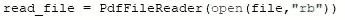

# 使用 Python 定制 PDF 分割器

> 原文：<https://medium.com/analytics-vidhya/custom-pdf-splitter-using-python-d2c1def7b311?source=collection_archive---------7----------------------->

每次当我们想分割 PDF 时，我们会去不同的网站，如 ilovepdf 或任何其他网站。想象一下，如果我们没有互联网接入，但仍然想做 pdf 的分割！！！

> 有没有想过我们可以使用 Python 制作自己的 PDF 分割器

pdf 拆分器图像

让我们构建 Python 脚本来帮助我们分割 PDF 文件。

在这个脚本中，我们将把 PDF 文件名、起始页、结束页作为命令行参数。

**PDF_File_name** :用户需要提供完整的路径和文件名。比如，如果你在 c 盘中存储了***【abc.pdf】***文件，那么你需要输入如下内容: ***"c:\\abc.pdf"***

**开始页面**:从哪一页开始分割 pdf

**结束页面**:您想要停止分割 pdf 的页面

所以我们的命令提示符屏幕看起来会像这样。

命令提示符

所以这里的文件名是“abc.pdf”(我给出了完整的路径，因为我的 pdf 文件在不同的位置，而 pdfsplits_1.py 文件在不同的位置。)

起始页= 1，结束页= 5。

所以现在让我们从头开始构建它。

我们要做的第一件事是导入一些库。

1.  PyPDF2
2.  [计]系统复制命令（system 的简写）

PyPDF2:我们将使用这个库来读写 PDF 文件。我们需要做的第一件事是使用下面的命令安装 PyPDF2 库。

> P yPDF2 : pip 安装 PyPDF2

sys:它内置在库中，所以任何安装都需要。

让我们创建 pdfsplit.py 文件。我们将把 pdf 文件名和起始页和结束页作为命令行参数。

1 .导入这两个库。

进口

2.现在，让我们检查用户需要提供的命令行输入，如 pdf_file_name、start-page、end-page。

为了检查这一点，我们将使用 sys 库，并且我们将使用 **argv** 来检查用户给出了多少个参数。

如果参数少于 4，我们将显示错误消息。

所以现在错误地使用了少于 4 个参数，那么我们将向他们显示错误。

现在，如果用户给出了正确的输入，那么我们将这样处理它

> 现在让我们看看我们创建的**“pdf _ splitter”**函数。

在 pdf_splitter 函数中，我们将做以下事情。

> 为分割的 pdf 设置新的 pdf 名称。

> 我们将阅读用户提供的 pdf 文件。

> 下一步是创建 pdf 文件编写器对象。

> 现在让我们以二进制形式打开 new_splitted_pdf。

现在让我们从给定的起始页到结束页循环通过所有页面。在循环浏览所有页面时，我们将阅读整个页面并将其添加到新的 pdf 中。当我们阅读所有页面并将其添加到我们的新 pdf 中时，我们将打印成功创建的 pdf。

现在让我们结合所有步骤，看看整个代码。(我已经添加了 try and catch 块)

现在让我们看看工作示例。

新的“abc splitted.pdf”文件仅包含 5 页。

你可以从给定的链接获得这个脚本。

[***https://github.com/raj1997/Python-PDF-Splitter-Scrip***](https://github.com/raj1997/Python-PDF-Splitter-Script)