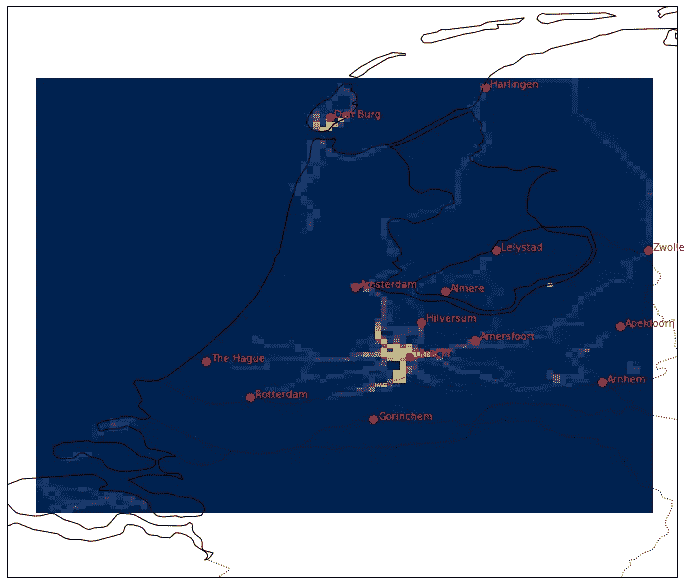
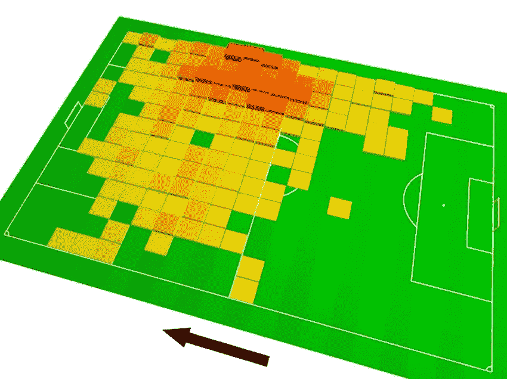
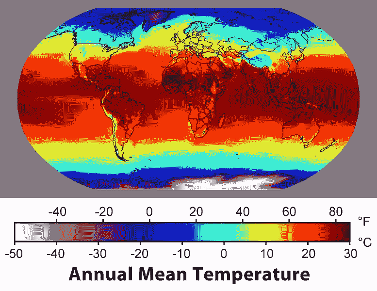

# 自定义 Strava 热图

> 原文：<https://medium.com/analytics-vidhya/custom-strava-heatmap-231267dcd084?source=collection_archive---------12----------------------->



> 我喜欢骑自行车。因为我住在世界上对自行车最友好的国家之一，所以我每周骑几次自行车。我也热爱数据。在过去的 3 年里，我用 Strava 监控我的自行车骑行，现在我有很多这样的工具了。我有很多很多对坐标，几乎是每次骑车的每一秒钟！那么当我把对骑行的热爱和数据结合起来会怎么样呢？当然是定制的 Strava 热图！

让我们一步一步来。

[Strava](https://www.strava.com/) 很乐意向我们提供我们的[数据](https://support.strava.com/hc/en-us/articles/216918437-Exporting-your-Data-and-Bulk-Export):[https://support . Strava . com/HC/en-us/articles/216918437-Exporting-your-Data-and-Bulk-Export](https://support.strava.com/hc/en-us/articles/216918437-Exporting-your-Data-and-Bulk-Export)。下载完之后，我得到了一堆 gpx 文件，每个活动一个(骑自行车)。我想做的是使用 Python 将我所有的骑行合并在一个热图中，并查看我在过去 3 年中在 NL 的什么地方骑行了多少次。出于这个原因，我不得不使用 [ElementTree](https://docs.python.org/3/library/xml.etree.elementtree.html) 和 [glob](https://docs.python.org/3/library/glob.html) 包加载并解析所有的 gpx 文件，并将它们组合成一个 [Pandas](https://pandas.pydata.org/) dataframe。最后一步是使用 [matplotlib](https://matplotlib.org/) 和 [cartopy](https://scitools.org.uk/cartopy/docs/latest/) 绘制一个很酷的热图。

一如既往，第一步是导入上述库:

```
import xml.etree.ElementTree as ET
import glob
import numpy as np
import pandas as pd
import matplotlib.pyplot as plt
import cartopy.crs as ccrs
import cartopy.feature as cfeature
```

然后，我想创建一个循环来打开并解析我下载的 Strava 数据文件夹中的每个 gpx 文件。最终，我想把我骑车的所有坐标存储在一个列表中。

```
coordlist = [] # Create an empty list

for file in glob.glob(".../export_30791752/activities/*.gpx"):
    tree = ET.parse(file) # Parse each of the gpx files
    root = tree.getroot() # Get the root of each file
    coords = [coord.attrib for coord in root.iter('{[http://www.topografix.com/GPX/1/1}trkpt'](http://www.topografix.com/GPX/1/1}trkpt'))] 
# Get the pairs of coordinates (lat & lon) from the elements of the gpx file that contain them. That means, several thousands of pairs per bike ride (gpx file). coordlist.extend(coords) 
# Add the coordinates from each gpx file to the list that I created above. I use extend because I don't care about separating the coordinates from different rides. I want to have them all in one big list.
```

**始终**检查您在上一步中创建的内容！

```
coordlist[:10]
```

让我们把这个列表变成一个漂亮、整洁的数据框架(我爱他们！):

```
df = pd.DataFrame(coordlist)
```

正如我之前所说:**总是**检查你在前一步创造了什么！

```
df.head() # Look at the first few rows of the dataframedf.shape # Check out the shape (rows, columns) of the dataframe
```

现在到了棘手的部分。我想绘制一张热图…



…但是热图需要 3 个变量，足球场的宽度、长度和在每个位置花费的时间，或者[经度、纬度和温度](https://commons.wikimedia.org/wiki/File:Annual_Average_Temperature_Map.jpg)。

我的数据框架只有两列:经度和纬度。因此，这意味着我还需要第三个变量，以便给我的热图添加颜色，嗯…我该如何解决这个问题呢？

[Numpy](https://numpy.org/doc/stable/index.html) 有个神奇的东西叫 [histogram2d](https://numpy.org/doc/stable/reference/generated/numpy.histogram2d.html) 。它允许我将我的数据分成 10，000 个正方形的箱(你可以选择想要多少个箱)，并计算每个箱包含多少个经度对。基本上，它将网络分成 10，000 个方块(一个有 100 行[lat] & 100 列[lon]的表格)，并计算我在每个方块中的次数！

```
Z, xedges, yedges = np.histogram2d(np.array(df.lon, dtype=float), 
                                   np.array(df.lat, dtype=float), bins = 100)# Z is the number of coordinate pairs each of the 10000 bins contains. You can imagine it as a 100 x 100 table, and in each cell there is a number telling how many times I've been in this cell during my bike rides.
```

正如我之前已经说过两次的:**总是**检查你在前一步中创建了什么！

```
Z.min(), Z.max(), Z.mean(), np.median(Z) 
# have a look at basic statistics of the Z thing (it's a numpy ndarray, or multidimensional array) you created, just to get a feeling of the values it contains.
```

然后我用几个荷兰城市的名字和坐标做了一个[字典](https://www.w3schools.com/python/python_dictionaries.asp)，然后[把它变成了一个漂亮整洁的数据框架](https://www.geeksforgeeks.org/how-to-create-dataframe-from-dictionary-in-python-pandas/)。我说过我有多喜欢整洁的数据框吗？

```
cities = pd.DataFrame({'City': ['Utrecht', 'Amsterdam', 'Rotterdam', 'The Hague', 'Arnhem', 'Hilversum', 'Amersfoort', 'Almere',  'Lelystad', 'Apeldoorn', 'Den Burg', 'Harlingen', 'Zwolle', 'Gorinchem'], 
                       'Lon': [5.1214, 4.9041, 4.4777, 4.3007, 5.8987, 5.1669, 5.3878, 5.2647, 5.4714, 5.9699, 4.7997, 5.4252, 6.0830, 4.9758], 
                       'Lat': [52.0907, 52.3676, 51.9244, 52.0705, 51.9851, 52.2292, 52.1561, 52.3508, 52.5185, 52.2112, 53.0546, 53.1746, 52.5168, 51.8372]})
```

正如我之前已经说过三次的:**总是**检查你在前一步中创建了什么！

```
cities # or print(cities), but I am too lazy to write it...
```

现在，是热图的时间了！首先，我准备了图形的尺寸。

```
fig = plt.figure(figsize=(12, 12)) # I created a new figure and set up its sizeax = fig.add_subplot(1, 1, 1, projection=ccrs.PlateCarree()) # I used the PlateCarree projection from cartopy
ax.set_extent([3.5, 6.2, 51.2, 53.5]) # I set the extent of the plot, using min and max coordinates
```

然后，我添加了所有我想要的特征:海岸线、湖泊和河流(虚线)。

```
ax.coastlines(resolution='10m', color='black', linewidth=1)lakes_50m = cfeature.NaturalEarthFeature('physical', 'lakes', '10m', edgecolor='black', facecolor='None')
ax.add_feature(lakes_50m)rivers_50m = cfeature.NaturalEarthFeature('physical',  'rivers_lake_centerlines', '10m')
ax.add_feature(rivers_50m, facecolor='None', edgecolor='black', linestyle = 'dotted')
```

我添加了热图(我使用了 [pcolormesh](https://matplotlib.org/3.3.3/api/_as_gen/matplotlib.pyplot.pcolormesh.html) )作为地图上的图层。我使用了“cividis”色图，因为这是我最喜欢的颜色之一，但也可以随意尝试[色图](https://matplotlib.org/3.1.1/gallery/color/colormap_reference.html)。

```
ax.pcolormesh(xedges, yedges, Z.T, vmin = 0, vmax = 5000, cmap = 'cividis') 
# I set the maximum at 5000, after some experimentation. Higher values make all the areas, except Utrecht, very dim. Lower values make almost all the areas bright.
```

最后一步是在热图上绘制城市作为额外的图层。我使用了先前创建的“城市”数据框架中的坐标和名称。在这里，一个好的老式散点图将完成这项工作。

```
plt.scatter(cities.Lon, cities.Lat, marker = 'o', color = 'red', s = 50)for i in range(cities.shape[0]):
    plt.text(cities.Lon[i] + 0.02, cities.Lat[i], cities.City[i], color = 'red')
# The loop takes the name of each city and plots it next to its red dot, using its lon and lat values. plt.show()
```

Tadaaaaaa！


> 我希望你喜欢我的例子，并希望你感到鼓舞，走出去，使自己疯狂的数据项目，享受乐趣，并可能节省一些钱；) .