# Google Colab 上的自定义 Tensorflow 对象检测 API！！

> 原文：<https://medium.com/analytics-vidhya/custom-tensorflow-object-detection-model-on-google-colab-4402b8e7ee7e?source=collection_archive---------12----------------------->


在 tensorflow 上训练你的对象检测模型可能是一项极其复杂的任务，互联网上的大多数可用资源要么复杂要么不完整，所以我在这个故事中尝试在 Windows 系统上解决这个任务。故事特别关注的是新手，不想花钱上云环境的人。这个故事特别考虑到你知道物体检测是如何工作的，以及什么样的数据被用来训练它，所以准备好我们有很多工作要做！！

**步骤 1:** 打开 anaconda 提示符，使用下面的命令创建一个新环境:`conda create -n tfod python=3.6`

**步骤 2:** 在这一步中，我们将尝试安装 tfod 模型工作所需的所有依赖项。运行下面的命令。

命令 1: `pip install pillow lxml Cython contextlib2 jupyter matplotlib pandas opencv-python tensorflow==1.14.0`

命令 2: `conda install -c anaconda protobuf`

**第三步:**下载模型需求:

链接 1:[https://github.com/tensorflow/models/tree/v1.13.0](https://github.com/tensorflow/models/tree/v1.13.0)

下载 zip 文件，提取其中的内容，并将其放入一个新文件夹中。为了方便起见，我们将其命名为 my_tfod，我们将把名为 models-1.13.0 的提取文件保存到 my_tfod 文件夹中。

link 2:[https://github . com/tensor flow/models/blob/master/research/object _ detection/g3doc/tf1 _ detection _ zoo . MD](https://github.com/tensorflow/models/blob/master/research/object_detection/g3doc/tf1_detection_zoo.md)

下载您希望使用的模型，因为我们将使用 colab，它缺少 RAM 和内核，请确保您不要选择 NAS 之类的大型模型，相反，我们可以从 faster_rcnn_coco 开始，它将为您提供一个相当不错的整个过程的介绍，作为我们的参考，我们将采用 faster_rcnn，感觉采用任何模型都要牢记计算限制，我们将尝试相应地进行更改，随着我们的进行，它将变得更加清晰。再次提取。tar 文件并保存在 my_tfod 文件夹中。

link 3:[https://drive . Google . com/file/d/12 F5 oguqg 7 qbm _ 267 tcmt _ rlorV-M7gf/view](https://drive.google.com/file/d/12F5oGAuQg7qBM_267TCMt_rlorV-M7gf/view)

下载 utils 文件夹，将其解压缩并保存在同一个文件夹中(my_tfod)。

**步骤 4:** 根据创建环境的驱动器，更改目录，大多数情况下是 c 盘，因此将文件夹移到桌面，这通常是最简单的方法。

**第五步:**移动内容:

复制 utils 文件夹中除 generate_tfrecords.py 之外的所有文件，现在单击 models-1.13.0 文件夹，删除 models-1.13.0 文件夹中除 research 之外的所有文件，现在单击 research，进入 research 文件夹后，粘贴从 utils 文件夹中复制的除 generate_trecord.py 之外的所有文件。(注意**由于我们最终将在 google drive 上上传整个文件夹，我们将删除非强制文件，需要更新 generate_tfrecords.py，我们将在后面的步骤中处理它。)

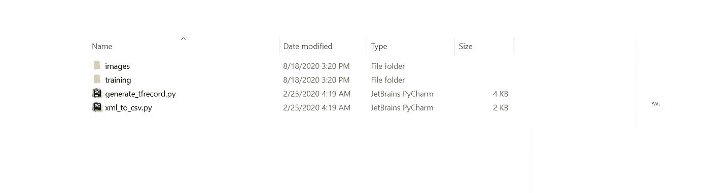

实用程序文件夹

现在返回到 tfod 文件夹，将 faster _ rcc _ model 文件夹或您从 model zoo 下载的任何其他模型复制到 research 文件夹。既然您已经使用了它，请从 my_tfod 文件夹中删除 model 文件夹，以减小 itr 的大小。

**步骤 6:** 激活 tfod 环境，将 protos 文件转换为。py 文件

如果您已经关闭了窗口，请转到 anaconda 提示符并激活 tfod env:

命令 1: `activate tfod`

导航到研究文件夹以纯文本形式复制地址，返回到提示并使用以下命令:

命令 2: `cd`(粘贴研究文件夹的地址)

命令三:`protoc object_detection/protos/*.proto — python_out=.`

这基本上将所有的 protos 文件都变成了可实现的。py 文件。确保通过简单地关闭提示窗口来关闭您的环境。

**第 7 步:**创建自定义数据集。

我们的定制模型需要一些数据来训练，这可以通过带标签的图像来实现，为此我们需要一个名为 labelImg 的工具。它基本上可以让你注释图像，这是我们 tfod 模型的核心。

对于安装要求，您需要的只是一个命令，您将会看到 labelImg 工具在您的屏幕上闪烁，然后继续安装零件。我们将确保我们的测试和训练数据文件夹已准备好，其中包含您想要注释的自定义图像！！..

现在打开 anaconda 提示符，选择任何环境都可以作为基本环境，因为我们真的不想让我们的 tfod 环境塞满不同的安装。

运行以下命令:

命令 1 : `pip install labelImg`

成功运行命令后，您所要做的就是键入命令。

命令二:`labelImg`

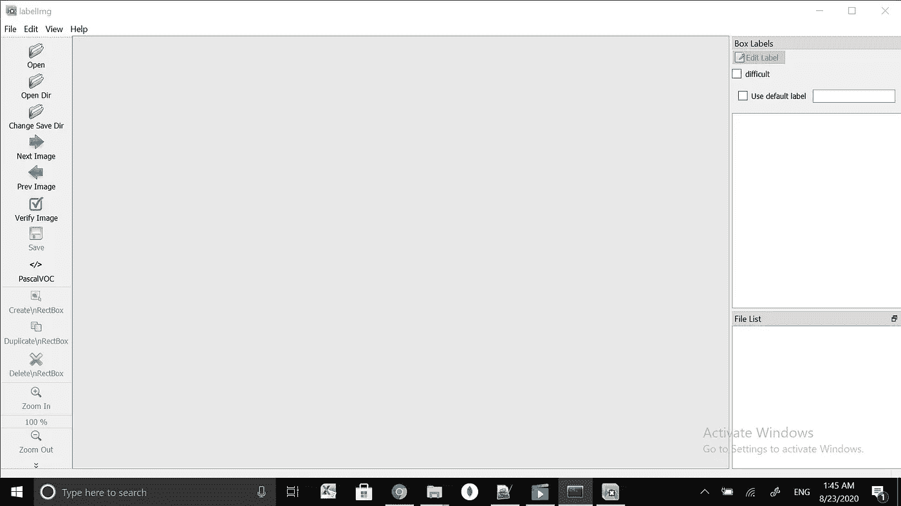

标签

标签工具现在应该出现了。要获得更详细的分析和完整的概述，请尝试浏览一下[摩西·奥拉芬瓦](/@guymodscientist?source=post_page-----6248679f0d1d----------------------)在 medium 上精心策划的故事:

链接:[https://medium . com/deepquestai/object-detection-training-preparing-your-custom-dataset-6248679 f0d 1d](/deepquestai/object-detection-training-preparing-your-custom-dataset-6248679f0d1d)

注**导出相应的。xml 文件保存到您正在注释的测试和训练目录中。此外，请记住，您标记的所有类都完全按照编写的方式，没有任何更改。

**第八步:**再做一些修改，删除一些文件！！！…

现在，一旦您准备好测试和训练文件夹，复制这两个文件夹，并导航到 tfod 中的研究文件夹，在那里您将找到一个图像文件夹，删除其所有内容(即测试训练和两个 csv 文件已经存在)，并粘贴您的自定义测试和训练文件夹。

注意**确保测试和训练文件夹除了“测试”和“训练”之外没有其他名称，并且没有任何更改。

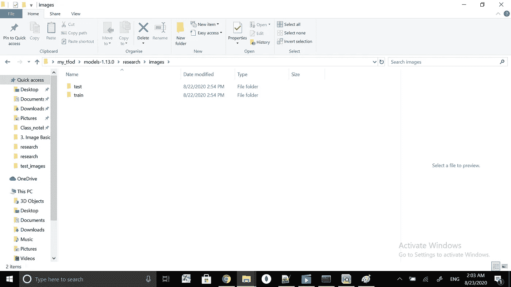

图像文件夹应该是这样的。

**第九步:**转换。xml 文件转换为 csv 文件。

在 Anaconda 提示符下，激活您的 tfod 模型和 cd 到 research 文件夹并运行 xml_to_csv.py 脚本。这基本上是将所有文件转换为 xml 文件的测试和训练。我们之前删除的 csv 文件。

运行以下命令:

命令 1: `python xml_to_csv.py`

**第十步:**下载 generate_tfrecord.py

从以下链接下载 generate_tfrecord.py 文件:

[](https://github.com/Prabhutva711/Medium-) [## Prabhutva711/Medium-

### 以下存储库包含 story 的文件:Google Colab 上的自定义 Tfod 模型！！在 medium 上，GitHub 是超过 50 个…

github.com](https://github.com/Prabhutva711/Medium-) 

下载文件后，在任何文本编辑器上打开它，我们将根据自定义训练和测试数据集中的类进行一些更改。

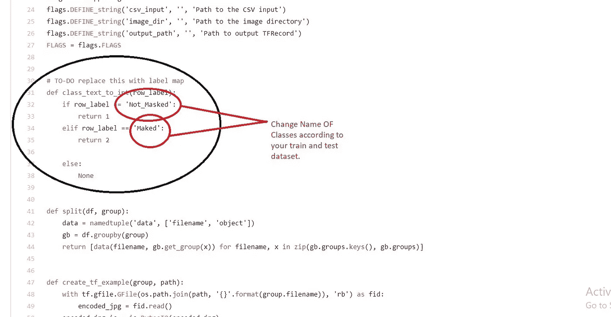

需要更改的类别和 elif 条件。

根据您之前注释的类对类进行更改，并注意与每个 row_label 相关联的返回值(稍后我们将使用它来更改 labelmap)，它应该是整数并遵循以下顺序。

更改后保存文件，并将其粘贴到研究文件夹。

假设我有三个类，分别叫做“狗”、“猫”和“人”

它应该是这样的:

```
def class_text_to_int(row_label):
 if row_label == ‘dog’:
     return 1
 elif row_label == ‘cat’:
     return 2 elif row_label==”human”:
     return 3

 else:
     None
```

**步骤 11:** 生成测试和训练的 tf 记录。

使用以下命令生成 tf_records:

命令 1: `python generate_tfrecord.py — csv_input=images/train_labels.csv — image_dir=images/train — output_path=train.record`

命令 2: `python generate_tfrecord.py — csv_input=images/test_labels.csv — image_dir=images/test — output_path=test.record`

**步骤 12:** 放置配置文件并相应地进行更改

为了训练模型，配置文件需要根据您选择运行它的数据进行更新，模型的大部分更改将大致相同，除了代码中的微小更改之外，唯一的区别将基本相同。

转到 research/object _ detection/samples/config，在那里你会发现许多配置文件，它们将对应于不同的模型，并且将与你从 zoo 克隆的模型同名。在我们的例子中，文件将会更快 _rcnn_inception_v2_coco.config。

现在我们必须做出一些改变->

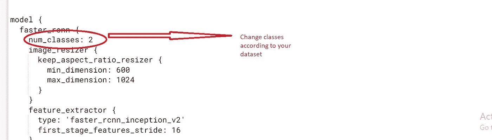

更改班级数量

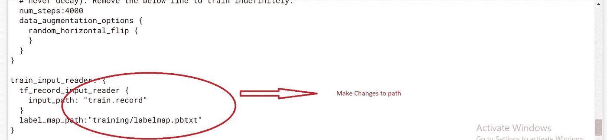

对火车路径进行更改

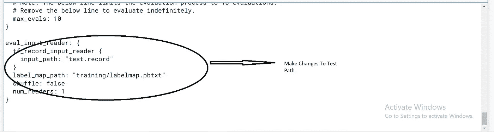

对测试路径进行更改

现在，我们可以对纪元数量进行更改，我们将在 google colab 上训练模型，因为它是一个免费的 gpu，它有局限性，而且与 AWS，Azure 或 GCPs 相比也很慢，所以我们将把纪元数量减少到 4000，以获得不错的训练精度。您可以按比例增加，但需要很多时间，因为您的 colab 将在网页上运行，需要在训练时运行。

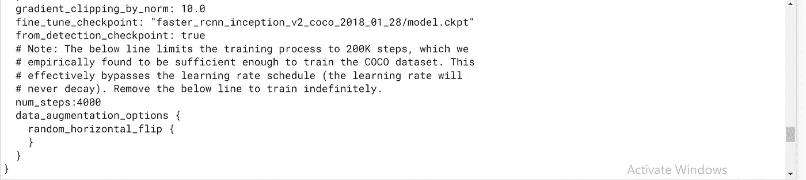

将 num_steps 更改为 4000，默认为 20000。

**步骤 13:** 对 LabelMap.pbtxt 进行修改

LabelMap.pbxt 存在于 training 文件夹中，我们必须做出相应的更改，类的数量以类似于 jason 格式的格式表示。我们必须更新身份。

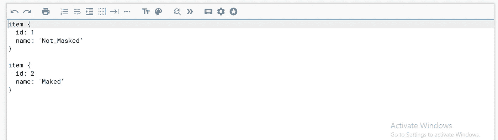

LabelMap.pbtxt

id 将等于数据集中存在的类的数量，并且 id 的值将等于:

例如，如果在 generate_tfrecord.py 文件中类 A 的返回值是 2，那么 id 将是 2。

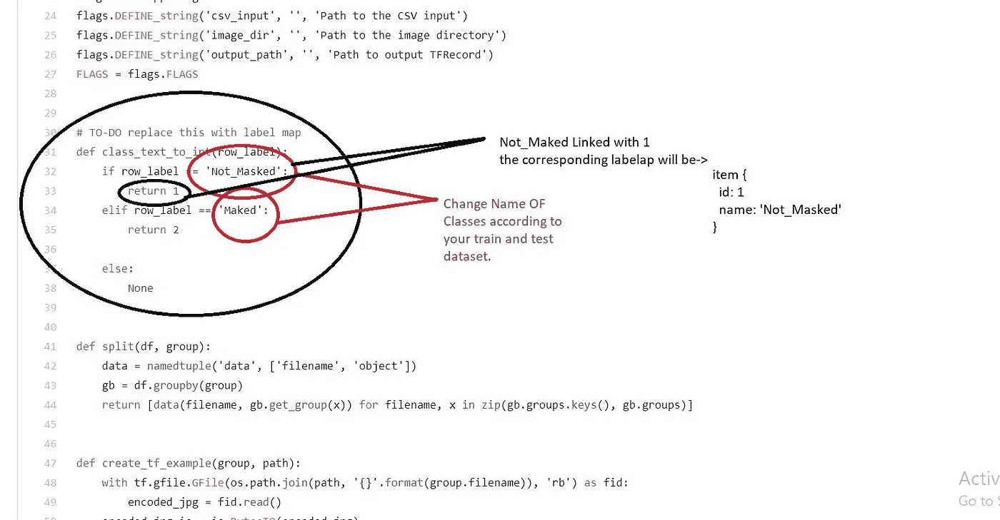

根据 generate_tfrecord.py 进行更改

复制该文件，将其重命名为 YOUR_MODEL.config，并粘贴到您的研究文件夹中的 training 文件夹中。

**第 14 步:**将 train.py 文件传输到研究文件夹。

从 research/object _ detection/legacy/copy train . py 复制到 research 文件夹。

**步骤 15:** 将 Deployment 和 Nets 文件夹从 research/slim 文件夹转移到 research 文件夹。

我们已经完成了放置文件夹和文件的所有设置，现在我们可以开始训练了，但是在基于非 gpu 的本地系统上进行训练几乎是不可能的，所以我们将把整个 my_tfod 文件夹上传到 google drive。

**步骤 16:** 将所有文件转移到 google drive 将整个文件夹 my_tfod 上传到该驱动器。

**第十七步:**设置 google colab 笔记本。

打开你的 google colab 笔记本，因为默认的 tensorflow 是 2。x 所以我们会导入与 tfod 环境兼容的 tensorflow 1.14.0 模型。

通过单击运行时选项并选择更改运行时类型，将运行时更改为 TPU。

现在导入张量流模型:

1->将安装命令`pip install tensorflow==1.14.0`放到单元格中，运行它。

2->重启运行时

3->运行以下命令，检查是否安装了正确的版本

`import tensorflow as tf`

`tf.__version__` ,如果输出显示 1.14.0，则说明您已经设置好了，否则重复同样的操作，如果出现错误，最终会被排序。

**第 18 步:**现在把你的 google drive 挂载到 colab。

如果你不知道如何安装硬盘，可以看看这个很棒的博客

[**Md**凯什·安萨里](https://www.marktechpost.com/author/md-kaish-ansari/)

[](https://www.marktechpost.com/2019/06/07/how-to-connect-google-colab-with-google-drive/) [## 如何用 Google Drive 连接 Google Colab | MarkTechPost

### 在本教程中，您将学习如何将您的 Google Colab 与 Google Drive 连接起来，以在…上构建一些深度学习模型

www.marktechpost.com](https://www.marktechpost.com/2019/06/07/how-to-connect-google-colab-with-google-drive/) 

**第十九步:**将当前目录改为研究。

在新单元上运行以下命令。

```
import osRESEARCH_DIR = “/content/drive/My Drive/my_tfod/models-1.13.0/research”os.chdir(RESEARCH_DIR)os.getcwd() #check the current directory to make sure you are in right directory.
```

**步骤 20:** 训练模型。

运行下面的命令开始训练。

```
!python train.py — logtostderr — train_dir=training/ — pipeline_config_path=training/YOUR_MODEL.config
```

在 colab 上训练模型，以确保运行时不会断开连接。通过左键单击单元格并单击 inspect 转到控制台。

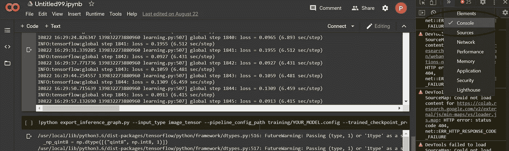

安慰

我得到了这段简单而有效的 javascript 代码，它可以防止运行时在这个链接上断开连接。

[](https://stackoverflow.com/questions/57113226/how-to-prevent-google-colab-from-disconnecting) [## 如何防止 Google Colab 断开连接？

### 我认为 JavaScript 解决方案不再有效了。我在我的笔记本上写着:来自…

stackoverflow.com](https://stackoverflow.com/questions/57113226/how-to-prevent-google-colab-from-disconnecting) 

```
function ConnectButton(){
    console.log("Connect pushed"); 
    document.querySelector("#top-toolbar > colab-connect-button").shadowRoot.querySelector("#connect").click() 
}
setInterval(ConnectButton,60000);
```

在控制台上运行它，更多信息请查看 stackoverflow 链接。

该模型将需要很长时间进行训练，但您可以中断它，并运行与您启动时相同的命令来恢复它。它将通过跟踪检查点文件来自动恢复，这些文件将在训练文件夹中更新。在您训练时，脚本已经有回调来为您完成这项工作。

**步骤 21:** 将 export_inference_graph.py 文件从 research/object_detection 中的 object _ detection 文件夹转移到 research 文件夹。

**步骤 22:** 从训练文件夹中导出推理图。

在导出推理图之前，我们将在研究文件夹中创建一个名为推理图的文件夹，我们的推理图将被导出到该文件夹中。

使用以下命令导出图形更改最后一个检查点文件在我的情况下是 2701 将其更改为保存 model.ckpt 文件的最后一步，您可以更改丢失最少的编号，以确保。检查培训文件夹中是否有 ckpt 文件，它将包含三个扩展名为-的文件。索引，。元和。如果存在数据，它将是转换为推理图的有效文件。


在这种情况下，有效步骤是 2611，因为三个文件都存在。

```
!python export_inference_graph.py — input_type image_tensor — pipeline_config_path training/YOUR_MODEL.config — trained_checkpoint_prefix training/model.ckpt-2701 — output_directory inference_graph
```

**步骤 23:** 下载 inference_graph 文件夹，并将其粘贴到您本地系统中的研究文件夹。

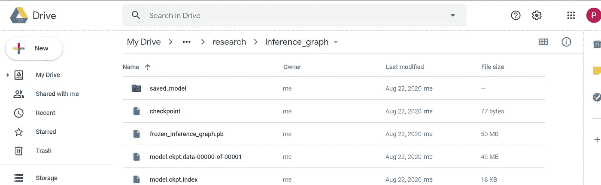

从 model.ckpt 中提取 inference_graph.pb 文件后，inference_graph 文件夹看起来会像这样

下载推理图文件夹并将其移动到本地系统的研究文件夹后，我们就可以进行预测了。预测笔记本已经存在于 object_detection 文件夹中，但是我们必须进行一些更改，所以我已经使用网络摄像头对其进行了自定义，如果您使用 faster _ rcnn，您可能会遇到一些延迟，但是它与 mobile_ssd 配合使用会更好。也试着做一个测试文件夹，放一些图片进去测试。同样，您可以对路径进行一些更改，以防有些不同，但它在大多数情况下都可以工作，并且可以通过应用简单的逻辑进行更改，以防它不工作。

从这里下载 object _ detection _ tutorial . ipynb 文件。

[https://github.com/Prabhutva711/Medium-](https://github.com/Prabhutva711/Medium-)

运行笔记本，你就一切就绪了……！！！