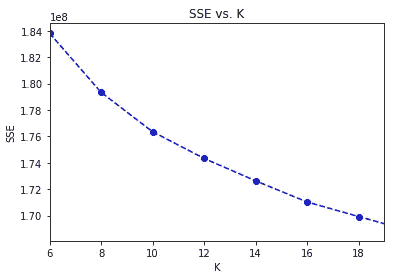

# Arvato 数据集上的客户分析

> 原文：<https://medium.com/analytics-vidhya/customer-analysis-on-arvato-dataset-dfc48d96a96f?source=collection_archive---------8----------------------->

该项目的第一部分是分析德国一家邮购销售公司的客户的人口统计数据，并将其与普通人群的人口统计数据进行比较。主要目标是识别更有可能成为公司客户的人群。将清理普通人群和客户数据，应用 PCA，并使用 KMeans 将数据划分到聚类中。将对聚类进行比较，以了解普通人群中的哪些部分是客户数据的一部分。

在第二部分中，给定邮件发送活动的目标个人数据集，将建立一个机器学习模型来预测是否值得将此人包括在活动中(如果他们有可能成为公司的客户)。最初将使用 Adaboost 和 GradientBoosting，然后调整参数以获得最佳结果。

使用的数据由 Udacity 在 Bertelsmann Arvato Analytics 的合作伙伴提供。代码可从 [github](https://github.com/belagoesr/nanodegree_capstone) 获得。

## 资料组

有四个数据文件与此项目相关联:

*   德国一般人口的人口统计数据；891 211 人(行)x 366 个特征(列)。
*   邮购公司客户的人口统计数据；191 652 人(行)x 369 个特征(列)。
*   作为营销活动目标的个人的人口统计数据；42 982 人(行)x 367 人(列)。

普通人群的人口统计数据

这些数据包括主要类别的特征:个性、金融类型、社会地位、地区和购买习惯。

# 项目结构

## 第 1 部分:客户细分

在这一部分中，使用无监督学习技术来描述公司现有客户的人口统计数据与德国一般人口之间的关系。

***数据清理***

*   *评估缺失数据*
*   *特征编码*

***降维***

*   *主成分分析*

***聚类***

*   *聚类(*[*k 表示*](https://scikit-learn.org/stable/modules/generated/sklearn.cluster.KMeans.html#sklearn.cluster.KMeans) *)*

## 第 2 部分:监督学习模型

在这一部分中，建立了一个机器学习模型来预测客户是否有可能成为客户，从而预测针对他们开展营销活动是否有意义。

*   *数据集/缩减采样方法的类别不平衡*
*   *培训模式*
*   *参数调谐*
*   *结论*

# 第 1 部分:客户细分

## 数据清理

*   **评估缺失数据:**

在计算每一行和每一列中的缺失值之前，必须根据包含特征信息的 excel 电子表格替换缺失的数据编码值。创建了包含每个特征的编码值的数据帧:

包含编码缺失值的数据帧(azdias_attr_nan)

例如，在“altersketagorie _ GROB”功能中，值-1 和 0(未知)被替换为 np.nan

特征信息:名称、描述、值

*   **每列缺失数据**

每列中丢失值超过 30%的 20 个特性被删除。这些特征与职称、年龄、建筑类型和交易现状有关。

*   **每行缺失数据**

数据集分为两部分:subset_below(一行中少于 20 个缺失值)和 subset_above(一行中多于 20 个缺失值)。

为了继续使用 subset_below，绘制了两者上的特征分布，以检查分布是否保持不变。在具有许多缺失值的数据(subset_above)和具有很少或没有缺失值的数据(subset_below)之间，非缺失要素的分布看起来很相似，因此，从分析中删除这些点不会产生大问题。

比较特征 LNR、AKT_DAT_KL、ALTER_HH 和 ANZ _ 豪沙尔特 _ 阿克提夫在子集 _ 下和子集 _ 上的分布

*   **特征编码**

大多数特征已经有了数值。要素 OST_WEST_KZ、CAMEO_INTL_2015、CAMEO _ INTL _ 2015 _ 财富、CAMEO _ INTL _ 2015 _ 人生阶段、CAMEO_DEU_2015 被映射到数字要素，要素 D19_LETZTER_KAUF_BRANCHE、CAMEO_DEUG_2015、EINGEFUEGT_AM 被删除。

创建了一个执行上述步骤的函数，用于一般人群和客户数据集:

函数来清理数据。azdias_attr_nan 包含要编码为 np.nan 的未知值的信息

# 使聚集

在进行维度缩减之前，缺失值被估算，数据被缩放。(PCA 无法处理缺失值)

## **主成分分析**

对数据应用 PCA 以找到最大方差的向量。最初，将 PCA 与所有特征相匹配，这样就足以看到可变性的一般趋势。

碎石图

由前 150 个主成分解释的可变性的量是 85%,因此 PCA 将再次用该值拟合，以用于项目的聚类部分。

通过查看每个主成分上特征的权重，可以解释主成分。权重离零越远，主分量在相应特征的方向上就越多。如果两个特征具有相同符号的大权重(负的或正的)，当一个增加时，另一个预计也会增加。因为具有不同符号的特征可以预期显示负相关:一个变量的增加应该导致另一个变量的减少。

解释了前 3 个主要成分:

*   **第一主成分:**

第一主成分正权重

第一主成分负权重

第一个主成分与以下特征正相关:高社会地位和有车的小家庭。这表明第一个特征是关于更富裕和更小的家庭。

*   **第二主成分**

第二主成分正权重

第二主成分负权重

这表明，这第二个特点是关于宝马和奔驰的跑车，大多由老年人拥有。

*   **第三主成分**

第三主成分正权重

第三主成分负权重

这表明，这第三个特征是关于具有更保守的财务习惯和不太可能花钱的人。

## 面向普通人群和客户的聚类

在本节中， [KMeans](https://scikit-learn.org/stable/modules/generated/sklearn.cluster.KMeans.html#sklearn.cluster.KMeans) 用于将数据划分为聚类(人口/客户细分)。为了找到 k(聚类数)的值，KMeans 使用不同数量的 k 进行拟合，并根据从每个点到其分配的聚类质心的平均聚类内距离进行评估。此步骤会生成以下图:

KMeans 的膝盖图

平均距离随着聚类数量的增加而减小，因此 k=19 个聚类的值将用于拟合 k 均值，k 均值将用于对人口执行聚类。将 KMeans 应用于客户和普通人群后，就可以比较每个集群中的人员比例。过度表示的聚类表示作为公司客户的人群的部分。代表性不足的聚类是不代表大部分客户的人群。例如，聚类 16 落在过度表示的聚类中。

普通人群和客户的聚类结果

我们可以通过查看其特征权重来解释集群 16 和 6:

第 16 组

这个集群代表高收入、有房一族、高社会地位、低流动性、低能耗和环境对他们很重要的家庭。倾向于节省金钱和高利息。

第 6 组

这个集群与高收入住宅区的上流社会的跑车(特别是宝马和奔驰)有关。

可能会看到客户群中没有代表的人群(比较中代表不足的群)。例如，集群 17:

第 17 组

该聚类代表在线存在感较低的人群，他们所在的地区的汽车拥有量低于平均水平。消费者类型:知情，低回报，平均/较低收入

# 第 2 部分:监督学习模型

在本节中，使用了一个数据集，每行代表一个邮寄活动的目标个人，以建立一个预测个人是否会成为公司客户的模型。

**2.1 型号**

使用第 1 部分中相同的清理函数清理数据。创建了一个新特征来表示可能是第 1 部分中解释的聚类 16 的一部分的人:

数据集存在类不平衡问题:只有 1%的客户会成为客户(属于类 1)，99%不会成为客户(属于类 0)。为了解决这个问题，类 0 被缩减采样 20 倍。

阶级不平衡仍然存在。甚至可以进行更多的下采样，但这意味着训练模型所需的数据更少。由于这种等级不平衡，准确性不是推荐的度量标准。因为 99%的个体属于 0 类，所以仅仅预测他们都属于 0 类将给出 99%的准确度。为了评估该模态，一个被称为[的度量标准是受试者操作特征曲线下面积(ROC AUC)](https://scikit-learn.org/stable/modules/generated/sklearn.metrics.roc_auc_score.html#sklearn.metrics.roc_auc_score) 。

在下采样之后，数据被估算、缩放并分成训练集和测试集。用默认参数训练 To 模型: [AdaBoost](https://scikit-learn.org/stable/modules/generated/sklearn.ensemble.AdaBoostClassifier.html) 和 [GradientBoosting](https://scikit-learn.org/stable/modules/generated/sklearn.ensemble.GradientBoostingClassifier.html#sklearn.ensemble.GradientBoostingClassifier) 。结果是:

梯度推进模型

AdaBoost 模型

然后两个模型都被调整，看看哪一个有更好的最终表现。

AdaBoost 参数调谐

梯度升压参数调谐

AdaBoost 被选为最终模型，因为它运行速度更快，并且具有与 GradientBoosting 相似的结果。为了验证最终模型，使用了具有 5 个折叠的[k 折叠](https://scikit-learn.org/stable/modules/generated/sklearn.model_selection.KFold.html)交叉验证器，并获得了以下结果:

使用具有 5 个折叠的 KFold 的 AdaBoost 模型验证

KFold 中每个折叠的曲线下面积值

# 结论

在第 1 部分中，可以将一般人群划分为不同的群体，如代表高收入、有房一族、高社会地位、低流动性、低能耗和环境对他们很重要的家庭的群体 16。对一般人群和客户数据进行聚类后，就可以对它们进行比较，并找到公司客户的具体特征。

在第 2 部分中，可以建立一个模型，根据第 1 部分中分析的相同特征来预测一个人是否会成为公司的客户。调整参数后，AdaBoost 的性能优于 GradientBoosting。可以做的一个改进是使用 [SMOTE](https://arxiv.org/pdf/1106.1813.pdf) 对少数民族进行上采样。

面临的挑战之一是一般人群数据集很大:891221 行和 366 列。加载数据集只需要大约 5 分钟。运行数据清理和 PCA 大约需要一个小时。[因为 KMeans 的每次迭代都必须访问数据集中的每个点](https://jakevdp.github.io/PythonDataScienceHandbook/05.11-k-means.html)，所以聚类部分也需要很长时间来运行。

[Github](https://github.com/belagoesr/nanodegree_capstone) 上的代码。