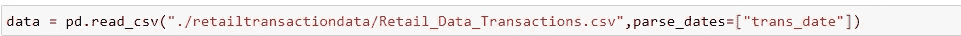
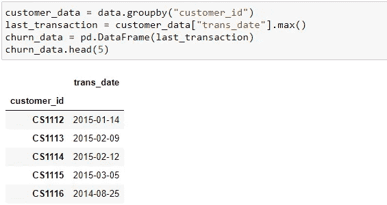
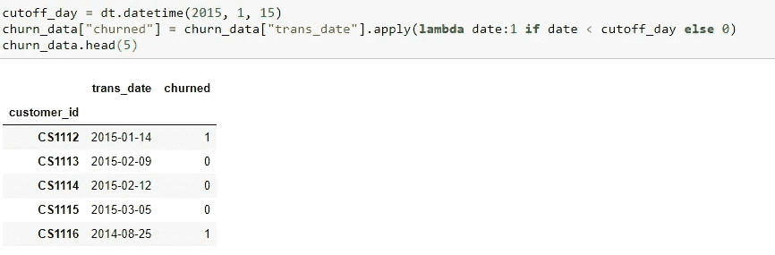
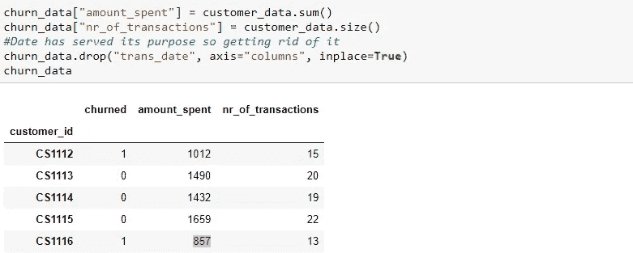
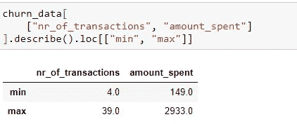
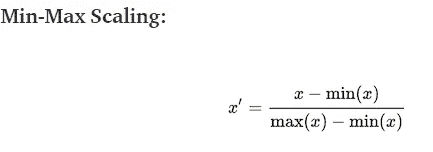
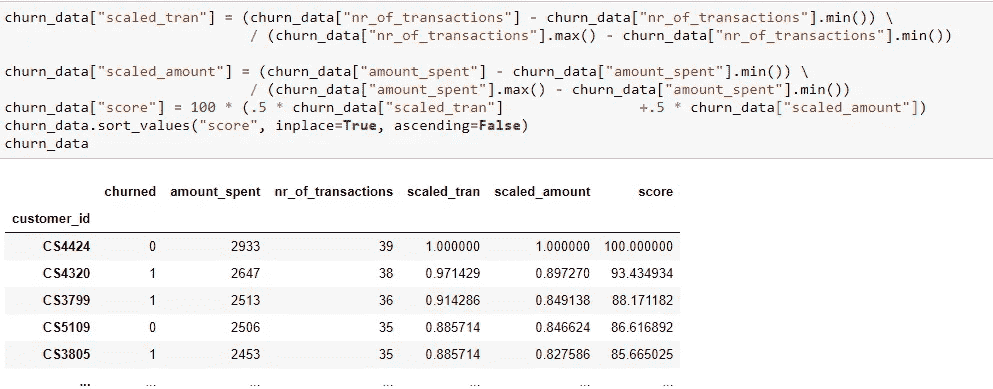
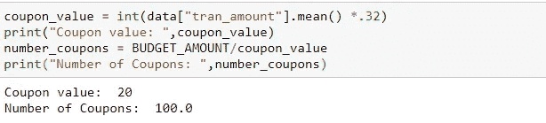
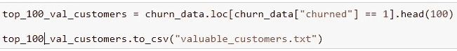

# 客户流失—业务洞察

> 原文：<https://medium.com/analytics-vidhya/customer-churn-business-insights-3851d81f7edb?source=collection_archive---------14----------------------->

照片由 [JJ 英](https://unsplash.com/@jjying?utm_source=medium&utm_medium=referral)在 [Unsplash](https://unsplash.com?utm_source=medium&utm_medium=referral)

假设案例:你是“WeMart”Inc .的一名数据分析师，你的老板要求你确定“有价值的客户”,邮寄一些礼券，鼓励他们光顾商店，从而提高销售额。我们有 2000 美元的预算。

你的下一个问题会是“我们如何确定谁是有价值的客户？标准是什么？”。在这种背景下，理解什么是“客户流失”是很重要的。**客户流失**是指客户不再是客户。

**客户流失**是一个关键指标，因为留住现有客户比获得新客户的成本要低得多——从新客户那里赢得业务意味着在整个销售漏斗中寻找线索，在整个过程中利用你的营销和销售资源。(来自:[https://www.ngdata.com/what-is-customer-churn/](https://www.ngdata.com/what-is-customer-churn/))

更多信息请点击此处[https://en.wikipedia.org/wiki/Customer_attrition](https://en.wikipedia.org/wiki/Customer_attrition)

我们想了解一些客户停止购买的时间，所以我们需要一个截止日期。在截止日期之前购买的客户，我们可以认为是流失的客户(离开我们的客户)，然后，我们试图吸引忠诚的客户。

“parse_dates”允许我们立即为选定的列设置适当的日期类型

我们在这里的工作是找到正在搅动的客户，所以我们按“customer_id”分组。

我们正在尝试找出执行的“最后一笔交易”

我们将把流失客户标记为“1”，非流失客户标记为“0”。

注意简洁代码中“lambda”的使用

我们有大约 3000 名客户，我们将根据交易数量和花费金额进行汇总。

我们是否查看花费的金额并决定我们是否要锁定前 N 名顾客？还是我们着眼于长期来看有潜力消费更多的老客户？我们将使用一种叫做[最小-最大特征缩放](https://en.wikipedia.org/wiki/Feature_scaling)的技术。这项技术的目标是以有意义的方式比较不同的尺度。

交易次数和花费金额的范围

这种缩放带来 0 到 1 之间的值。

应用上述公式，对交易数量和花费金额各给予 50%的权重

我们有 2000 美元的预算。票面价值应该是多少？如果优惠券价值太高，我们可能会吸引更少的客户，如果我们的优惠券价值太低，这将是不够令人鼓舞的。我们可以计算交易金额的平均值，并从中抽取 30%的佣金。

我们有 100 个顾客的 20 美元优惠券。

我们需要从大量数据中获取前 100 名客户，并将结果保存到文本文件中，供其他部门处理。

注意“to_csv”的用法

因此，理解业务和如何提出请求，以及我们如何使用这些技术来解决业务问题是非常必要的。

确保你问了正确的问题，以帮助你在数据分析中做出进一步的决定，并深入了解你正在工作的领域。

我的 Jupyter 笔记本在这里—[https://github . com/ind goddess/customerchunretailtransactions](https://github.com/indgoddess/CustomerChurnRetailTransactions)