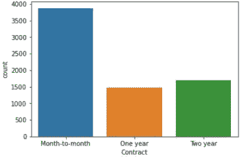

# 电信行业的客户流失

> 原文：<https://medium.com/analytics-vidhya/customer-churn-in-the-telecom-sector-34b6f04ed43e?source=collection_archive---------14----------------------->


每个公司都想尽可能留住自己的客户。顾客是公司成功的象征，尤其是服务行业的公司。一个组织的研发部门和人力资源部采取了各种措施来减少客户的流失。阻止客户流失的关键步骤之一是分析历史数据。人力资源部门的重要任务之一是保存历史数据并保持更新。

对客户信息系统数据的分析被称为客户流失。客户流失涉及的主要假设是，具有这些属性和服务的客户是否可能离开服务，以及他离开服务的可能性有多大。导致客户离开服务的因素有哪些？

这个分析过程由组织中具有数据科学、数据分析、数据分析和机器学习等工作背景的人员来完成。因此，如果你的目标是像这样的工作简介，你一定会想通读这篇文章。因此，让我们动手做一些分析。我们将使用 Python 作为我们的语言来创造奇迹。

# “问题定义”

在竞争激烈的服务行业，客户流失是一个值得关注的问题。另一方面，如果在早期阶段预测可能离开公司的客户，这将是一个潜在的巨大的额外收入来源。

我们必须找到客户是否有可能停止电信服务。导致客户停止服务的原因是什么？创建一个机器学习模型来预测客户是否会离开。


```
# importing project dependencies:
# compute dependency
import numpy as np
# dataframe dependency
import pandas as pd
# visualization dependencies
import matplotlib.pyplot as plt
import seaborn as sns
import plotly.express as px
# stats dependency
from scipy import stats
# feature_engineering dependency
import feature_engine
# from scraping some data
import webbrowser
import warnings
warnings.filterwarnings('ignore')# importing the training dependencies
from sklearn.linear_model import LogisticRegression
from sklearn.svm import SVC
from sklearn.neighbors import KNeighborsClassifier
from sklearn.naive_bayes import GaussianNB
from sklearn.tree import DecisionTreeClassifier
from sklearn.ensemble import RandomForestClassifier
from sklearn.ensemble import GradientBoostingClassifier
from sklearn.ensemble import AdaBoostClassifier# importing the evalation metrics
from sklearn.model_selection import cross_val_score,KFold
from sklearn.metrics import f1_score,precision_score,recall_score
from sklearn.metrics import plot_confusion_matrix,plot_roc_curve
from sklearn.metrics import classification_report
```

导入我们将在此过程中使用的所需库。

```
# importing in the dataset
df = pd.read_csv(‘Customer_Churn.csv’)
```

使用导入数据。csv 文件"

```
<class 'pandas.core.frame.DataFrame'>
RangeIndex: 7043 entries, 0 to 7042
Data columns (total 21 columns):#   Column            Non-Null Count  Dtype---  ------            --------------  -----0   customerID        7043 non-null   object1   gender            7043 non-null   object2   SeniorCitizen     7043 non-null   int643   Partner           7043 non-null   object4   Dependents        7043 non-null   object5   tenure            7043 non-null   int646   PhoneService      7043 non-null   object7   MultipleLines     7043 non-null   object8   InternetService   7043 non-null   object9   OnlineSecurity    7043 non-null   object10  OnlineBackup      7043 non-null   object11  DeviceProtection  7043 non-null   object12  TechSupport       7043 non-null   object13  StreamingTV       7043 non-null   object14  StreamingMovies   7043 non-null   object15  Contract          7043 non-null   object16  PaperlessBilling  7043 non-null   object17  PaymentMethod     7043 non-null   object18  MonthlyCharges    7043 non-null   float6419  TotalCharges      7043 non-null   object20  Churn             7043 non-null   objectdtypes: float64(1), int64(2), object(18)memory usage: 1.1+ MB
```

数据集中总共有 19 个要素。这些特征中的一些给出了关于客户的个人信息，一些特征描述了可用的特征，其余的给出了使用相应服务的客户的账单细节。

客户流失变量给出了如果客户可能停止他的服务或继续他的服务，因此客户流失是这里的目标变量。目标变量的值必须是唯一的值“是”和“否”。因此，这个流失变量是一个二元目标。为了预测二元目标，我们使用分类方法。

大多数机器学习算法不能很好地处理缺失数据，因此我们需要始终在数据集中找到并解决缺失值。此外，我们没有在用于建模的数据中保留两个高度相关的特征。我们在 ML 建模期间做出的假设之一是，任何两个特征都是彼此独立的，如果相关性高，则意味着这些特征是相关的，这将增加模型的白泽。检查完这些条件后，我们得出一些推论:

# “探索性数据分析”

EDA 的一个重要方面是实现数据并在数据中找到意义。EDA 通常可以分为两种类型:

单变量分析和多变量分析。

## 单变量分析


让我们看看客户利用服务的期限(以月为单位)。大多数客户选择按月或不到 1 年的租赁期。

这是一个连续变量。因此，我们将绘制密度分布图，以月为单位绘制任期图。


客户是否使用电信提供的任何电话服务，如果使用，客户是否使用多条线路？

我们可以绘制一个柱状图来获得这些信息。我们可以看到大多数客户使用电话服务。使用多线和单线的客户几乎相同(接近 3000)。



从相邻的图中，我们可以看到，大多数客户采取逐月图。新客户或不信任服务的客户可能会选择按月服务。然而，采用两年计划的客户对电信公司提供的服务更满意。


这些是客户必须支付的服务月费。大多数顾客每月支付大约 20 美元。该特征在尾部的一端以高概率(大约 20)遵循正态分布

## 多变量分析


任期与流失

下图显示了两个 KDE 图，一个是客户离开服务(是)，另一个是客户没有离开/重新订购服务(否)。离开服务的客户任期较短，而没有离开/保留服务的客户更有可能采用更长的任期计划(超过 60 个月)。我们可以看到，拥有正流失值的客户的任期分布具有很高的偏斜度。


付款方式与任期柱状图

*   任期长的客户很可能更喜欢自动支付方式(银行转账和信用卡)。


线路与月费。

上图是多条线路和客户每月支付费用之间的箱线图。我们根据客户获得的互联网服务，对多个 Lineas 功能的属性进行了划分。我们可以推断，选择光纤而不是传统 DSL 的客户必须支付更多的月费。

> 光纤很贵！

# “数据预处理和管道”

> 垃圾进，垃圾出！

如果每次我把这个告诉别人，a 都能得到 5 分钱，那我就可以在外星人上写这篇文章了。你的数据越好，你的预测就越准确，就这么简单。现在有了一套精确的规则来处理数据，但是在处理数据的过程中，有些事情你需要注意


*   删除相关值大于 0.95 的要素。如果你有很多特性，你也可以把这个阈值降低到 0.9。数据集中最好不要有高度相关的要素。为了检查 python 中的相关性，我们使用热图。


要素中没有缺失值。

*   前面说了，找出脏数据。在每种情况下，数据可能丢失，也可能不丢失(np.nan 格式)，特征中也可能有错误数据。人们可以很容易地发现大部分用户数据，因为要么该特性中的其余值没有相同的格式，要么丢失的值可能被替换为类似 999、' missing '、'？', '-'.为了处理这类脏数据，我们把它们转换成 Nan 格式进行处理。然后，根据要求我们处理那些丢失的值。在我们的数据中，我们没有任何缺失值。这在现实世界中是非常罕见的情况，我们可能会认为自己很幸运！
*   **从数据集中移除离群值**。我们可以使用各种异常值去除技术来检测和处理数据集中的异常值。常见的做法是使用 Z 评分法和四分位间距法(IQR)来处理异常值。请注意，在使用 Z 得分和 IQR 算法之前移除所有 NaN 值非常重要。此外，必须仅对数值特征而非分类变量执行异常值移除。
*   下一步将是解决数据的**偏斜**。数据科学家对数据集中数字特征的偏斜度非常担心。有 3 种偏斜分布类型:正偏斜、负偏斜和正态偏斜。数据分析师非常喜欢正态分布。数据科学家们也在努力，所以每当我们的数据集中有一个数字特征，并且该特征是倾斜的，我们倾向于使用一些倾斜变换方法使该倾斜更加正常。偏斜变换的常见做法是使用对数变换、平方根变换和 n 次方变换(Box-Cox)。有效倾斜是指要素的倾斜值在-1 到+1 之间。倾斜大于绝对值 1 (abs(1))的特征无效。


上图显示了倾斜变换前后的分布。我们的数据集中只有 3 个数字特征，其余的都是对象数据类型。我已经应用了平方根变换，因为它给了我们最好的偏斜。

*   同样，大多数传统的机器学习模型与字符串数据不兼容，即具有对象数据类型的特征。因此，我们需要将对象数据类型的特征转换成数字特征。这就是所谓的**分类编码。**编码有两种类型。一个热编码和标签编码。标签编码是针对分类目标变量和序数类型特征编码完成的。然而，一个热编码被应用于具有标称特征类型的特征。

在我们的问题中，目标是二进制分类的，因此我们使用标签编码将其转换为数字。我们还有一些名义上的分类独立变量，因此我们将对它们应用一键编码。

EDA 后的结束语:

*   目标变量具有不平衡的类。
*   该数据集中有 7000 多个样本。
*   该数据集有 20 个要素。
*   在这 20 个特征中，3 个是数字的，其余的是分类的
*   这个数据集中没有丢失数据，尽管脏数据的可能性很高。
*   数据集中没有高度相关的要素。
*   尽管成本高，大多数顾客还是喜欢光纤。
*   大多数顾客喜欢月租。

# “构建机器学习分类模型”

当你建立一个模型时，所有处理数据的艰苦工作将由你来做。

首先我们需要**分离特征和目标**。按照惯例，我们将对“X”和“y”变量中的特性进行评分。始终检查数组和数据帧的形状，这将使您的调试变得容易。

```
X = df_cleaned.drop('Churn_No',1)
y = df_cleaned['Churn_No']
print(X.shape,y.shape)((7032, 30), (7032,))
```

我们没有任何其他训练数据集，因此我们将随机选择一定比例的样本作为训练集，并在该数据上验证模型。sklearn 库为我们提供了许多进行这种拆分的函数。我们将使用**训练 _ 测试 _ 分割**功能。我们将按照 70:30 的列车测试比例分割数据。

```
from sklearn.model_selection import train_test_split
X_train,X_test,y_train,y_test=train_test_split(X,y,test_size=0.3,random_state=42)print(X_train.shape,y_train.shape,X_test.shape,y_test.shape)((4922, 30), (4922,), (2110, 30), (2110,))
```

我们将运行多个模型，并找到给我们最好结果的模型。

```
# choosing the best modelmodels = [LogisticRegression(),SVC(),KNeighborsClassifier(n_neighbors=5),DecisionTreeClassifier(),RandomForestClassifier(n_estimators=200),GradientBoostingClassifier(n_estimators=150),AdaBoostClassifier(RandomForestClassifier())]model_names = 'Logistic_reg SVC KNN Random_forest Decision_Treee Gradient_boost Adaboost'.split()models_df = pd.DataFrame(columns=['Algo','Train_acc','Test_acc','Precision','Recall','F1_score','Avg_CV'])for (model,model_names) in zip(models,model_names):print(model_names)model.fit(X_train,y_train)y_preds = model.predict(X_test)train_acc = model.score(X_train,y_train)test_acc = model.score(X_test,y_test)prec = precision_score(y_test,y_preds,average='micro')rec = recall_score(y_test,y_preds,average='micro')f1 = f1_score(y_test,y_preds,average='micro')avg_cv = np.mean(cross_val_score(model,X_train,y_train))models_df = models_df.append({'Algo':model_names,'Train_acc':train_acc,'Test_acc':test_acc,'Precision':prec,'Recall':rec,'F1_score':f1,'Avg_CV':avg_cv},ignore_index=True)
```

下表给出了各种 ML 算法的评估。


模型评估

这里我们有**逻辑回归**作为胜出者，以 0.005%的幅度击败梯度提升。有时候，如果你得到相同的结果，保持事情简单会更好。


分类报告

考虑到目标中的不平衡类，这些度量是非常好的。


训练数据的 ROC 曲线


测试数据的 ROC 曲线

**接收机工作特性曲线**

**ROC 曲线**显示了每个可能临界值的临床敏感性和特异性之间的关系

这是训练集上的 ROC 曲线。训练集上 85%的分数对于这个数据集来说是非常好的。

下图给出了测试的 ROC 曲线。ROC 评分是 84 %,也很不错了！

# “保存模型”

我们已经走了很长的路，是时候拯救你的模型了。我们评估了多种算法，并决定逻辑回归算法是最适合我们的问题。

我们将使用 Joblib 库保存模型

```
import joblib
joblib.dump(best_model,'customer_churn.pkl')['customer_churn.pkl']
```

完整的项目可从以下网址获得

[](https://github.com/gitwit-mistry/datatrained-projects/blob/master/Eval_Project_Week3/Project-15_Customer%20Churn.ipynb) [## git wit-Mistry/data trained-项目

### permalink dissolve GitHub 是超过 5000 万开发人员的家园，他们一起工作来托管和审查代码，管理…

github.com](https://github.com/gitwit-mistry/datatrained-projects/blob/master/Eval_Project_Week3/Project-15_Customer%20Churn.ipynb)