# 使用简单的 Python 进行客户人口统计和细分分析

> 原文：<https://medium.com/analytics-vidhya/customer-demographics-segmentation-analysis-with-simple-python-cdd2e6d35f2e?source=collection_archive---------3----------------------->

更好地了解客户的简单方法

# 什么是客户细分

顾客细分包括根据顾客共有的某些特征将顾客群分成不同的群体。

细分有助于公司的客户关系管理和整体营销绩效。通过细分你的客户群，它允许公司定制营销工作，以相关的信息针对特定群体。这使得公司能够更好地分配营销资源，创建有效的营销活动策略，并以更高的转化率最大化期望的营销结果。

常见的客户细分模型类型:

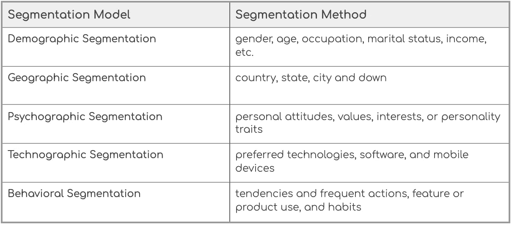

常见类型的客户细分模型

## 客户细分分析(人口统计)

在本文中，我将探索一个汽车公司客户群的数据集，以了解客户，并尝试查看在人口统计方面是否有任何可识别的细分和模式。

# 设置

首先，让我们导入数据集和语句。

导入语句

通过调用`head()`返回数据框的顶部行来预览数据集。

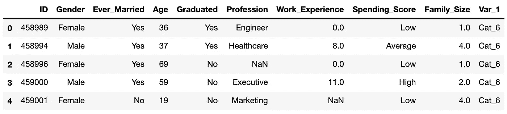

点名

查看数据集，您可以注意到数据框中有一些空值(您也可以使用`isnull()`函数来检查这一点。它将返回布尔值的数据帧，对于 NaN 为真)。

为了清除这些丢失的值并使它们更容易处理，我使用`fillna()`用 0 填充了数据集中的空值。您也可以使用`replace()`和`interpolate()`函数用它们自己的值替换 NaN 值。

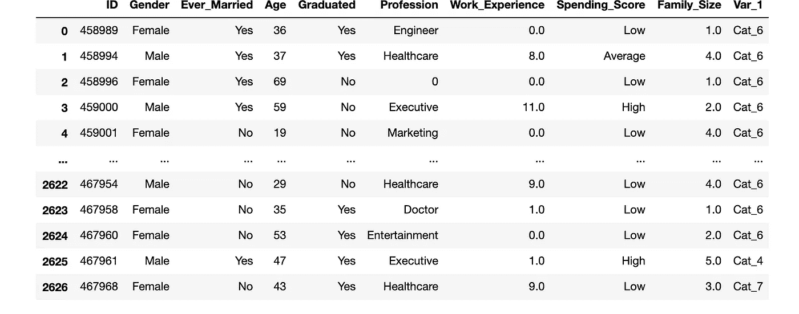

空值被替换为 0 的新数据集

接下来，您可以对数据调用`describe()`来获得数据框中每一列的描述性统计数据的摘要。

描述呼叫

通过调用 describe，您可以看到没有要清理的值。变量看起来都是正态分布的。

# 探索数据

由于该数据集中有许多变量，我想首先对每个变量进行一些深入的数据分析，并进行一些交叉比较，以确定主要的目标客户及其特征。

再来看**性别**:

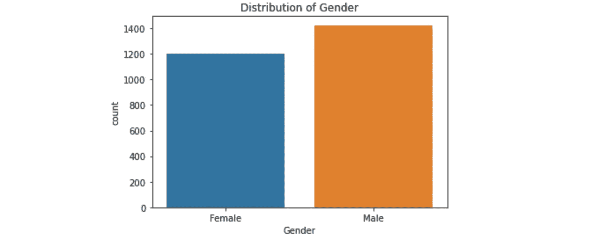

在这个数据集中，男性略多于女性。他们也许会成为你以后客户细分工作中的一个重要因素。

那么**年龄**呢？

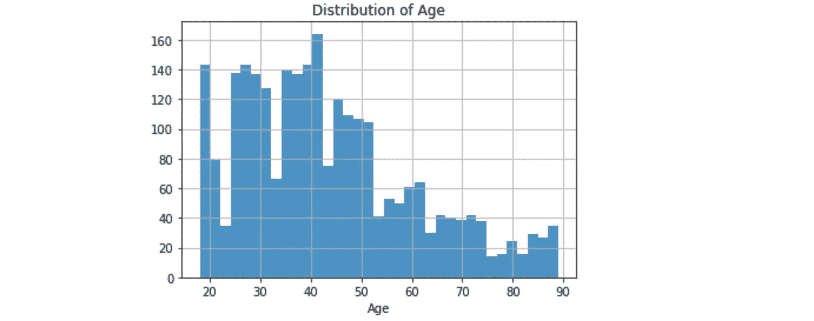

年龄大多在 25 岁到 52 岁之间。回想一下`describe()`通话结果，这是有道理的。平均年龄在 44 岁左右。老年客户较少，因此这种分布是左偏的，因为它的右尾较长。这可能是因为汽车的寿命较长，购买频率较低。在现实中，一辆车预计会有很长一段时间的用处。一旦一个人买了一辆车，他或她在几年内不太可能再买一辆。

接下来，我想知道男性和女性顾客在年龄分布上是否不同。

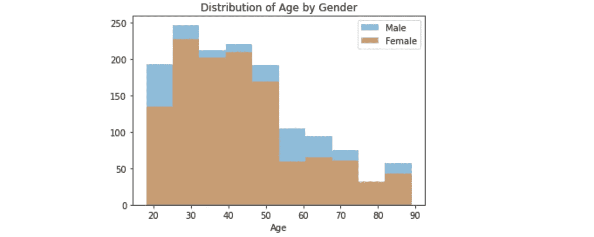

结果表明，男性和女性的分布非常相似，其中大多数年龄在 25 至 52 岁之间，无论是男性还是女性。

**已婚与未婚:**

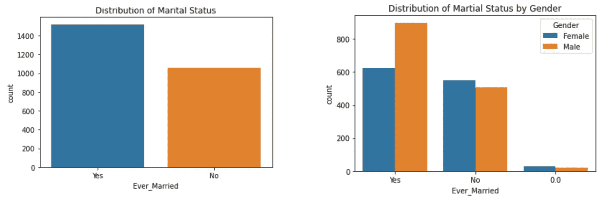

(用 Excel 创建的表格)

从柱状图中我们可以看出，已婚的顾客比未婚的顾客多。对于男性来说尤其如此。从这个结果中，我们可以假设婚姻可能是影响男性购买的一个重要因素。这可能是以后客户细分工作中的一个重要因素。然而，为了更好地了解这一点，我还会从心理、技术和行为方面进行研究——这需要更多的数据。

让我们更深入一点，通过观察已婚和未婚男性的年龄分布来验证这一点:

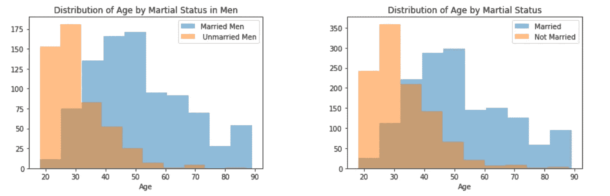

从分布可以看出，已婚和未婚男性都是主要购买者；然而，已婚男性的人数更多。根据这个图表，事实证明婚姻状况可能与购买本身没有正相关关系。因此，先前的假设是无效的。

从图表来看，到目前为止，我倾向于认为性别似乎不是一个影响因素，因为男性和女性的人口统计数据几乎相同。

让我们来看看已婚者和未婚者的**消费得分**的分布情况:

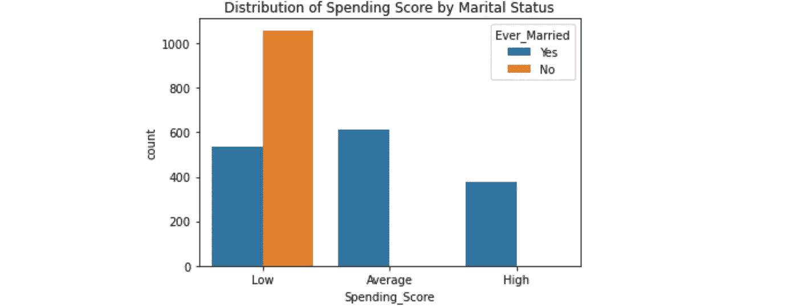

我们可以看到，虽然已婚客户的消费得分分布相当均匀，但很明显，未婚客户的得分很低，相当大一部分是已婚客户的两倍。

由此我怀疑，年龄很有可能也与消费得分有很大的相关性，因为未婚顾客大多更年轻。

让我们来验证一下这个假设。

在这里，我根据之前的分析将客户分为不同的年龄组:

*   18–29
*   30–49
*   50–69
*   70–90

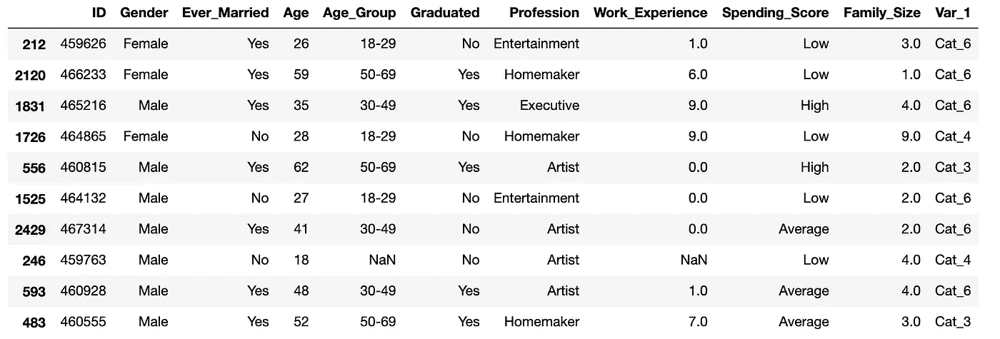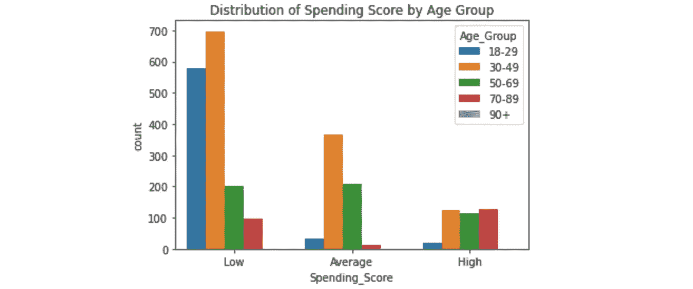

有两种方法来查看此图表，一种是查看年龄组在这三个级别上的分布，另一种是查看每个支出分数级别以及年龄组在这些级别内的分布。

正如预期的那样，大多数年轻客户属于低级别，占很大比例——30-49 岁年龄组占最大人口，其次是 18-29 岁最年轻的年龄组，得分完全在低级别。这是有道理的，因为与老年顾客相比，年轻顾客的消费能力较低。因此，该年龄组(18-29 岁)的客户可能对价格最敏感，更关心价格承受能力，30-49 岁年龄组中约 59%的客户也是如此。

对于 30-49 岁的人群，最大的人群分配在低水平，并随着水平的上升而下降，似乎在客户数量和消费得分之间存在负线性回归。

与其他年龄组相比，50-69 岁年龄组的分布相当均匀。这个群体平均水平人口最高，平均人口稍少，其次低再高。

最后，对于 70-90 岁的群体，虽然它的客户数量最少，但它在高层得分最高，在低层得分稍低，平均人数相当少。

现在让我们试着找出如何对这些群体进行细分，并进一步深入分析。

我想找出可能导致相同年龄组消费得分差异的其他因素。

我也想研究一下消费能力的指标，比如年收入，但是因为我们的数据集中没有这个数据。让我们看看教育水平，工作经验和职业，看看我们是否能抓住这一点。

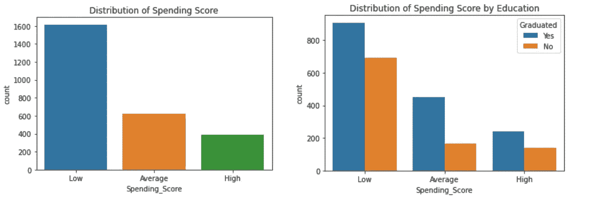

**教育**似乎与支出分数没有明显的关联或影响。

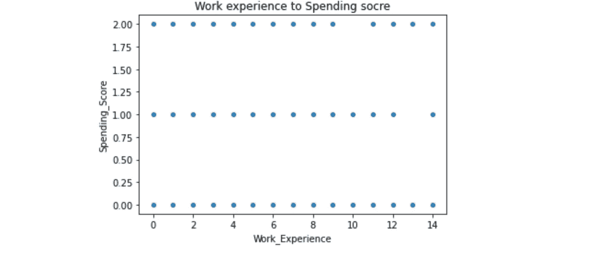

对于支出得分，0 =低，1 =平均，2 =高

**工作经历**似乎也没有太大关联。

再来看**职业**:

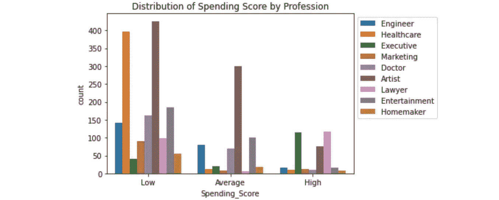

在这张图表中，我们可以更好地了解客户的职业支出得分。例如，那些从事医疗保健和市场营销的人往往在他们的支出水平上得分较低。虽然艺术家、工程师和医生在支出得分水平上与其分布比例相当一致，但我们可以看到高管在高水平上得分特别高。这可能是一个重要的信息，而营销更优质的产品系列。该公司肯定希望针对高管、一些律师和艺术家进行更多的研究。

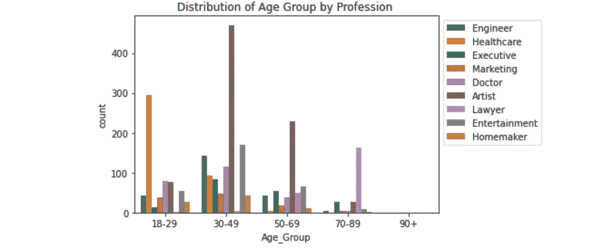

再深入一点，通过这张图表，我们可以更好地理解不同年龄组的职业之间的关系。例如，也许我们可以将年龄在 18 到 49 岁之间的医疗保健行业的客户划分为一个细分市场。他们共有的一些特征可能包括对可负担性的关注、购买动机(例如，需要灵活和及时地通勤到工作场所)等等。这将需要更多的数据和信息。

下面是我用 Excel 创建的 pivot，以便更好地了解不同年龄组的每个职业的支出分数。

年龄组标签:a . 18-29 岁，b . 30-49 岁，c . 50-69 岁，D. 70 岁及以上

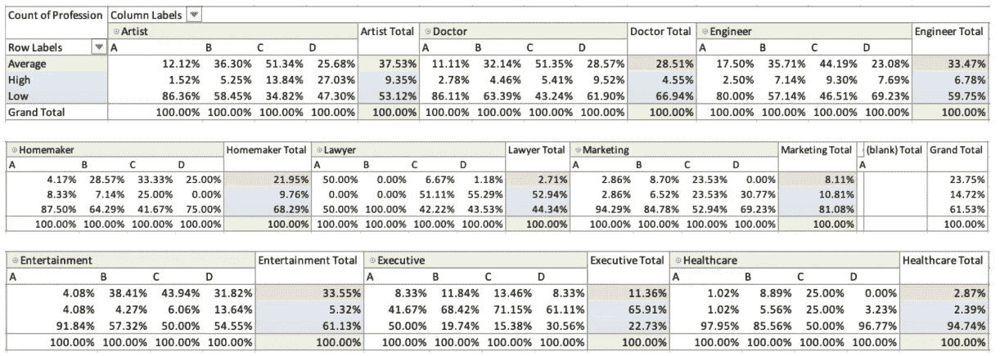

按职业和年龄组划分的支出分数分布(以百分比表示)

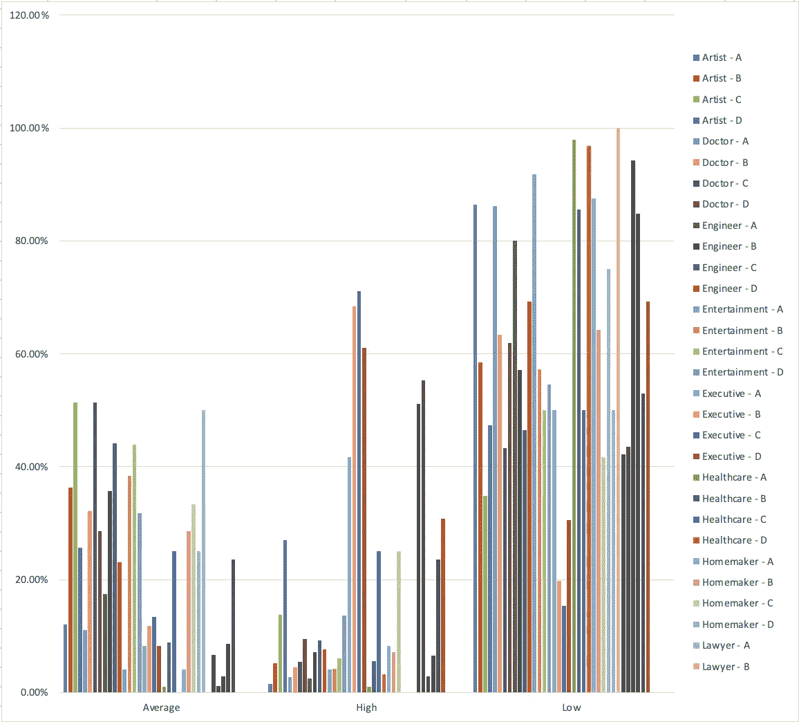

按职业和年龄组划分的支出得分分布(数据透视图)

(此图只是表格的参考，因为很难阅读。)

虽然这个数据集需要考虑更多的因素和数据，如工作经验和家庭规模，但出于本文篇幅的考虑，我现在将跳过这些因素，直接进入相关性热图，找出每个变量的一些可能的相关性。

每个变量的相关热图

从这个关联热图中，我们只能获得有限的信息，而且可能不准确，因为大多数变量是不可量化的。为了解决这个问题，在这种情况下，对于一个二分分类变量和一个连续变量(例如，“曾经结婚”和“年龄”和“毕业”)，如果我们将分类变量设置为 0/1 编码，我们可以计算皮尔逊相关。然而，当我们有两个以上的类别(如职业)时，皮尔逊相关将不再适用。

让我们来看看如何让它变得更好。

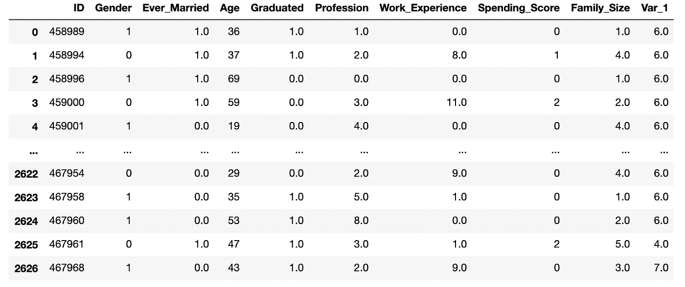

只有数值的数据集

现在，让我们来看看新的关联热图:

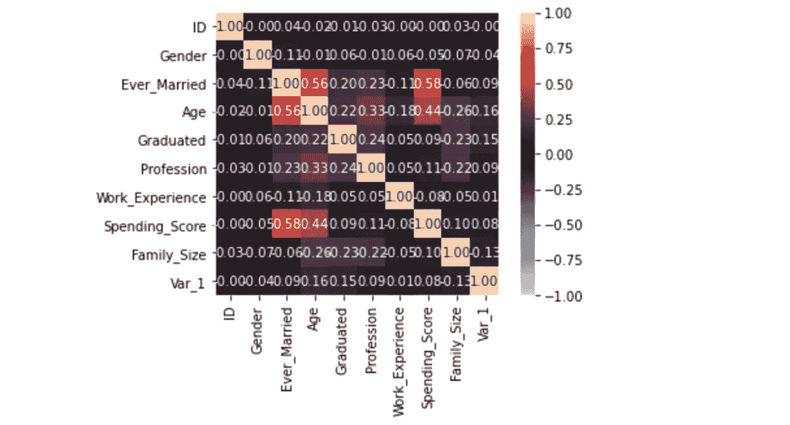

只有数值的新相关热图

好多了！但是，我们需要记住，相关性热图仅用于确定线性回归的正相关性或负相关性。从这张热图中我们可以看出，年龄和婚姻状况有正相关关系，这是有道理的，但如果用基本逻辑的话，就不完全准确了。第二强的相关性是消费分数与年龄和婚姻状况的关系；但是，我们无法对此进行分析，因为计算不适用于支出分数超过 2 个分类变量的情况。

因此，它的信息量仍然很小。

如果你一直在关注，你可能已经明白原因了。对于这个客户群，进行一些聚类会更合适。

让我们尝试一些聚类分析。

kmeans 的设置

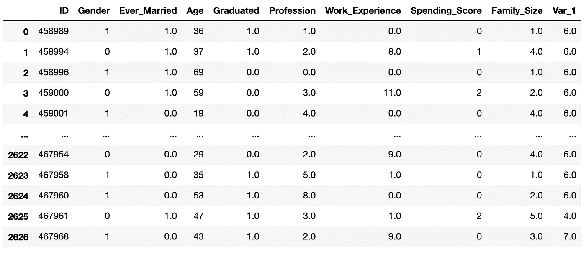

聚类的 k 方法

因为我把年龄分成了 4 组，所以我认为把平均年龄设为 4 会更有意义。

将集群添加到新列

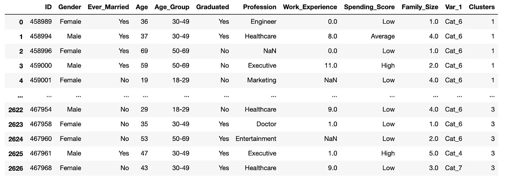

具有聚类组的新数据集

好了…现在完成了…我们为什么不测试一下，看看这些分段的集群是否真的聚集在一起。

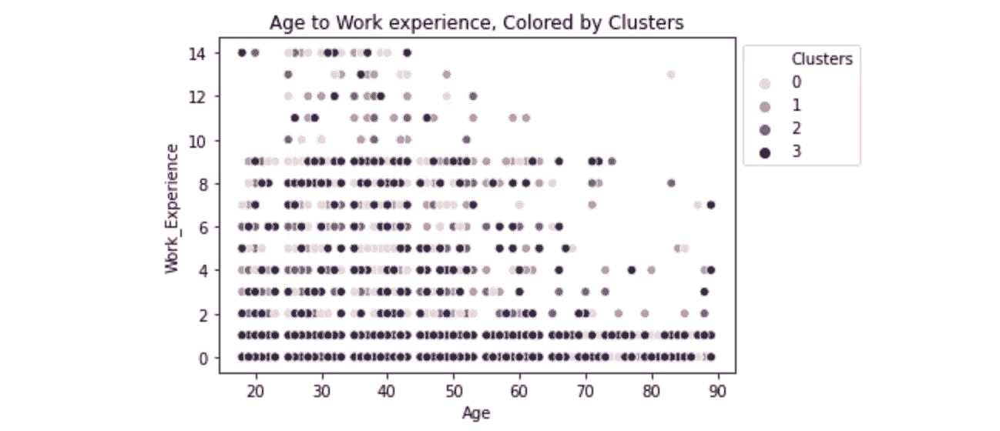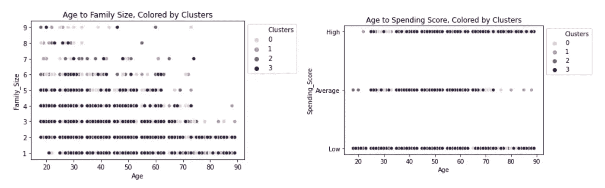

似乎除了段 3 之外，很难看到其他段的任何聚类或模式…

## 摘要

在这一点上，在进一步细分客户群时，我更倾向于将大部分注意力放在年龄、职业和支出分数之间的关系上，因为这似乎是本案例中最相关的变量。

然而，由于缺乏关于其他因素的信息，我们在对客户进行细分时仍应犹豫不决，因为应用一些可能影响其购买决策的因素非常重要，这需要更多关于其心理和行为特征的数据和分析。

目前，我们可以将这些视为完全基于人口统计的客户群:

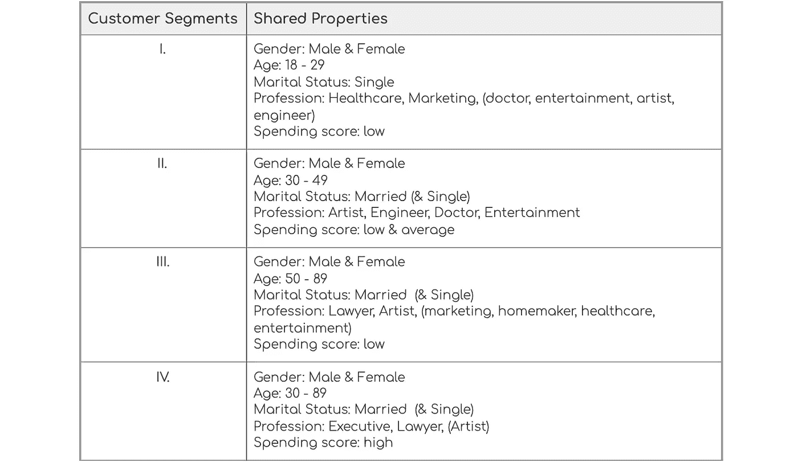

我们必须明白，要建立有效的营销策略并发展忠诚且有利可图的客户关系，营销人员必须了解客户，从各个角度预测他们的动机、需求和要求。

# 解释和行动

回到这种分析的业务和营销用例，可以进一步探索和分析以下假设和主题:

1.  对年收入较高的个人进行更多的营销会带来更高的销售额吗，因为收入较高的职业的支出分数往往更高？
2.  看起来我们的大多数客户都属于年轻群体，广告、定价、品牌和其他策略会如何影响这些年轻客户的消费分数(并推动销售)？
3.  为什么艺人在我们的客户群中占这么大的人口？有哪些诱因？我们能通过向有相似偏好的个人(如时装/平面设计师)营销来利用这一点吗？

要回答这些问题，需要更多的数据。

接下来，一旦我们对所有细分模式的客户有了全面的了解，我们的营销工作就可以更有针对性，并推动更动态的内容和个性化策略，以实现更及时、更相关和更有效的沟通。

## 所以…

作为我第一次用 python 分析…我希望你能从某些方面找到这篇文章…有很多方法可以改进这种分析，因为它只是皮毛。我会感谢任何反馈或建议。因此，请随时发表评论，并…开始吧！

:)