# 使用文本挖掘分析客户评论以预测他们的行为

> 原文：<https://medium.com/analytics-vidhya/customer-review-analytics-using-text-mining-cd1e17d6ee4e?source=collection_archive---------0----------------------->

分析客户评论以预测客户是否会推荐产品


# **简介**

***文本挖掘*** 是检查大量文本集合并将非结构化文本数据转换为结构化数据以供进一步分析(如可视化和建模)的过程。在本文中，我们将利用文本挖掘的力量对一个电子商务服装网站上的顾客评论进行深入分析。
顾客评论是“顾客之声”的一个重要来源，可以提供顾客对产品或服务喜恶的深刻见解。对于电子商务业务，客户评论非常重要，因为在缺乏要购买的产品的实际外观和感觉的情况下，现有评论严重影响新客户的购买决策。

# **关于数据集**

我们将在本文中使用的数据集来自 ka ggle([https://www . ka ggle . com/nica potato/womens-ecommerce-Clothing-reviews/home](https://www.kaggle.com/nicapotato/womens-ecommerce-clothing-reviews/home))，并且来自一个女装电子商务网站，该网站围绕客户撰写的评论。
该数据集包括 23486 行和 10 个特征变量。每行对应一个客户评论，包括变量:

*   **服装 ID** :整数分类变量，表示正在审核的特定服装。
*   **年龄**:审核人年龄的正整数变量。
*   **标题**:评论标题的字符串变量。
*   **审核文本**:审核主体的字符串变量。
*   **评级**:客户给产品打分的正整数变量，从最差 1 分到最好 5 分。
*   **推荐的 IND** :二进制变量，说明客户在哪里推荐产品，1 表示推荐，0 表示不推荐。
*   **正面反馈计数**:正整数，记录认为此评论为正面的其他客户的数量。
*   **分部名称**:产品高级分部的分类名称。
*   **部门名称**:产品部门名称的分类名称。
*   **类名**:产品类名的分类名称。

## 该条的范围

基于这些变量，可以对上述数据集执行多种监督和非监督技术，以提供关于客户偏好的多种见解。然而，我们将这篇博客的范围限制在广泛使用文本挖掘来分析客户评论。

我们将使用以下技术来理解文本挖掘的各个方面:

*   **对文本数据**(审查文本)进行单独的探索性分析，并基于其如何影响客户推荐产品的决定(推荐的 IND)
*   **分类模型**以评论文本为自变量，预测客户是否推荐产品

因为博客的目标更多的是理解文本挖掘，所以重点将是理解推荐产品的客户和不推荐产品的客户之间的差异，而不是根据评论预测客户的行为。换句话说，我们将更加关注模型的可变重要性和系数分数，而不是模型性能度量。

就文本挖掘方法而言，有两大类

*   **语义解析**词序、词用作名词或动词、词的层次结构等都很重要
*   **单词包**将所有单词作为一个单独的标记进行分析，顺序无关紧要。

我们的练习将只限于“单词包”方法，不会研究语义解析。

## 高级方法

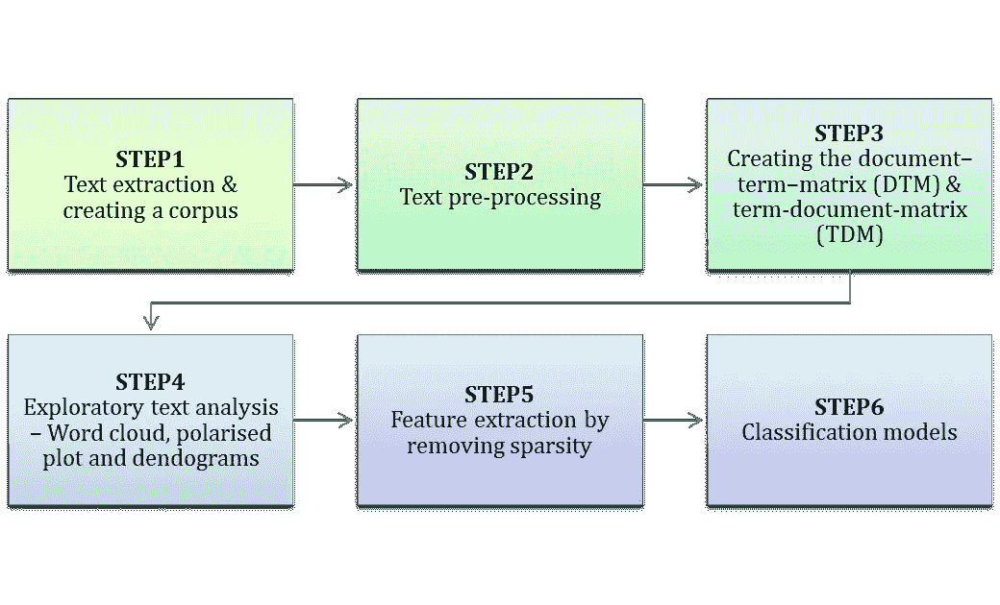

文本挖掘过程的高级方法

# 步骤 1 —文本提取&创建语料库

## 初始设置

文本挖掘所需的包是在 R 环境中加载的:

```
# install.packages("ggthemes")
# install.packages(qdap)
# install.packages(dplyr)
# install.packages(tm)
# install.packages(wordcloud)
# install.packages(plotrix)
# install.packages(dendextend)
# install.packages(ggplot2)
# install.packages(ggthemes)
# install.packages(RWeka)
# install.packages(reshape2)
# install.packages(quanteda)library(qdap)
library(dplyr)
library(tm)
library(wordcloud)
library(plotrix)
library(dendextend)
library(ggplot2)
library(ggthemes)
library(RWeka)
library(reshape2)
library(quanteda)
```

一旦安装了所需的包，就设置了工作目录，并将 csv 文件读入 R:

```
setwd("C:/Users/Sowmya CR/Google Drive/datascience_blog/e-commerce")
review=read.csv("Womens Clothing E-Commerce Reviews.csv", stringsAsFactors = FALSE)
names(review)
```

*自变量“stringsAsFactors”是 r 中“data.frame()”函数的自变量。它是一个逻辑自变量，指示数据帧中的字符串是应被视为因子变量还是仅被视为普通字符串。对于文本挖掘，我们通常将其设置为 FALSE，以便将字符视为字符串，从而使我们能够适当地使用所有的文本挖掘技术。如果我们计划将变量用作分类变量*，则设置为真

## 文本提取

专栏**评论。文本**包含收到的各种产品的客户评论。这是我们分析的重点。我们现在将尝试理解如何将文本表示为数据框。

1.  首先，将 review.text 转换成文本文档的集合或" ***文集*** "。
2.  为了将文本转换成语料库，我们在 r。
3.  为了使用 tm 创建语料库，我们需要将一个“Source”对象作为参数传递给 VCorpus 方法。
4.  源对象类似于抽象输入位置。我们这里使用的源是一个“Vectorsource ”,它只输入字符向量。
5.  Review.text 列现在被转换成一个语料库，我们称之为“corpus_review”

```
## **Make a vector source and a corpus**
corpus_review=Corpus(VectorSource(review$Review.Text))
```

# 步骤 2 —文本预处理

使用“单词袋”方法的任何文本挖掘过程的最终目标是将待分析的文本转换成由文本中使用的单词及其频率组成的数据框架。这些由**文档术语矩阵(DTM)** 和**术语文档矩阵(TDM)** 定义，我们将在随后的章节中研究它们。
为了确保 DTM 和 TDM 被清理并表示相关单词的核心集合，需要在语料库上执行一组预处理活动。这类似于在数据挖掘之前对结构化数据进行的数据清理。以下是一些常见的预处理步骤:

1.  转换为小写——这样，如果有两个单词“连衣裙”和“连衣裙”,它将转换为单个条目“连衣裙”

```
corpus_review=tm_map(corpus_review, tolower)
```

2.删除标点符号:

```
corpus_review=tm_map(corpus_review, removePunctuation)
```

3.删除停用词:“停用词”是在进行文本挖掘时需要理解的一个非常重要的概念。当我们写作时，文章通常由大量的介词、代词、连词等组成。在我们分析这篇课文之前，这些词需要去掉。否则，停用字词将出现在所有常用字词列表中，并且不会给出文本中使用的核心字词的正确图片。这里有一个英语常用停用词的列表，我们可以用这个命令查看:`stopwords(“en”)`

```
**#Remove stopwords**
corpus_review=tm_map(corpus_review, removeWords, stopwords("english"))
```

我们可能还想根据文本挖掘的上下文删除自定义的停用词。这些是数据集特有的词，可能不会给文本增加价值。

```
# **Remove context specific stop words**
corpus_review=tm_map(corpus_review, removeWords,c("also", "get","like", "company", "made", "can", "im", "dress", "just", "i"))
```

## 给文件加词干

> 在语言学中，词干化是将屈折(或派生)的单词简化为词干、词根或词根形式的过程，通常是一种书面单词形式。

SnowballC 包用于文档词干分析。例如，“复杂”、“复杂化”和“复杂化”在词干化后将被简化为“complicat”。这也是为了确保相同的单词不会在 DTM 和 TDM 中作为多个版本重复出现，并且我们在 DTM 和 TDM 中只表示该单词的词根。

```
## **Stem document**
corpus_review=tm_map(corpus_review, stemDocument)##**Viewing the corpus content**
corpus_review[[8]][1]
```

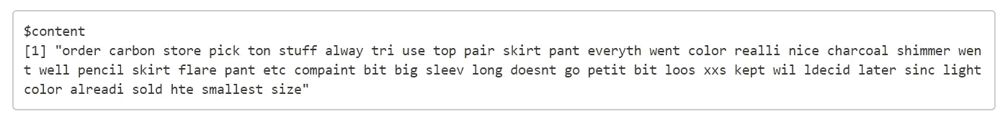

语料库内容

R 中的 corpus 对象是一个嵌套列表。我们可以对列表使用 r 语法来查看语料库的内容。

## 常用词

我们现在有了一个文本语料库，它是干净的，只包含文本挖掘所需的核心词。下一步是探索性分析。探索性数据分析的第一步是确定在整个综述文本中最常用的词。

```
# **Find the 20 most frequent terms: term_count**
term_count <- freq_terms(corpus_review, 20)# **Plot 20 most frequent terms**
plot(term_count)
```

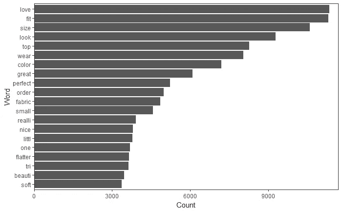

语料库中的常用词

“爱”、“适合”、“大小”等词是最常用的词。

# 步骤 3——从语料库中创建 DTM 和 TDM

预处理和清理的语料库被转换成称为文档术语矩阵的矩阵。

> 文档术语矩阵是描述术语在文档集合中出现的频率的数学矩阵。在文档-术语矩阵中，行对应于集合中的文档，列对应于术语。

术语-文档矩阵是文档-术语矩阵的转置。它通常用于语言分析。开始分析信息的一个简单方法是使用 as.matrix()将 DTM/TDM 转换成一个简单的矩阵。

```
review_dtm <- DocumentTermMatrix(corpus_review)
review_tdm <- TermDocumentMatrix(corpus_review)
```

## 使用 TDM 识别常用术语

TDM 还可以用于识别频繁的术语，并在随后的可视化中与评论文本相关。

```
# **Convert TDM to matrix**
review_m <- as.matrix(review_tdm)
# **Sum rows and frequency data frame**
review_term_freq <- rowSums(review_m)
# **Sort term_frequency in descending order**
review_term_freq <- sort(review_term_freq, decreasing = T)
# **View the top 10 most common words**
review_term_freq[1:10]
```

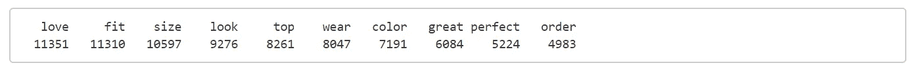

来自 TDM 的前 10 个单词

# 步骤 4——探索性文本分析

```
# **Plot a barchart of the 20 most common words**
barplot(review_term_freq[1:20], col = "steel blue", las = 2)
```

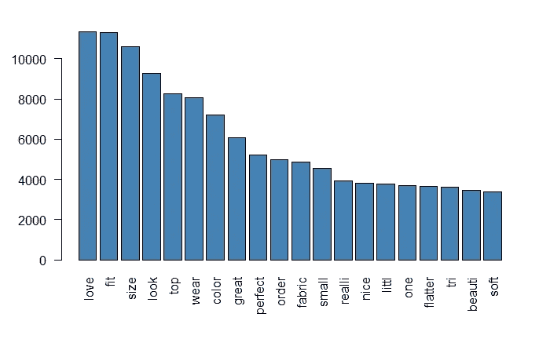

## 单词云

单词云是可视化文本语料库以理解常用单词的一种常见方式。单词云根据频率改变单词的大小。

```
review_word_freq <- data.frame(term = names(review_term_freq),
  num = review_term_freq)**# Create a wordcloud for the values in word_freqs** wordcloud(review_word_freq$term, review_word_freq$num,
  max.words = 50, colors = "red")
```

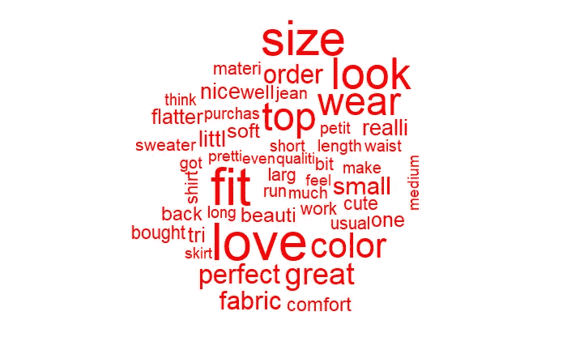

基于词频的词云

单词云还可以接收一组颜色或调色板作为输入，以区分云中出现频率较高和较低的单词。

```
**# Print the word cloud with the specified colors** wordcloud(review_word_freq$term, review_word_freq$num,
  max.words = 50, colors = c("aquamarine","darkgoldenrod","tomato"))
```

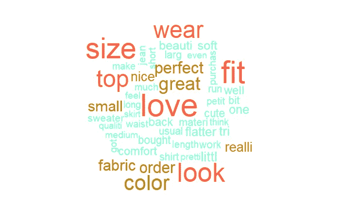

## 语料库对比

这项研究的主要目的之一是分析推荐和不推荐产品的人在关键词上的差异。为此，我们将创建两个语料库——一个用于推荐-是，另一个用于推荐-否。对这两个语料库重复前面完成的所有预处理步骤。然后将频繁使用的词绘制为每个语料库的单独的条形图和词云，以了解推荐产品的客户和不推荐产品的客户使用的词的差异。

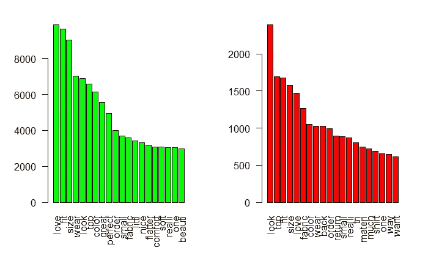

推荐(绿色)与不推荐(红色)产品的顾客常用词

## 用于比较的词云

比较单词集的另一种方式是组合是和否的语料库，并创建比较云，该比较云在同一云中显示两组单词。为此，我们将使用单词云的两个版本——***共性云*** 和 ***对比云*** 。公共云将来自两个云中的单词组合在一个语料库中。它查找两个语料库之间共享的单词，并绘制共享单词的单词云。

```
**## Combine both corpora: all reviews**
all_yes <- paste(review_yes, collapse = "")
all_no <- paste(review_no, collapse = "")
all_combine <- c(all_yes, all_no)**## Creating corpus for combination**
corpus_review_all=Corpus(VectorSource(all_combine)) **## Pre-processing corpus - all**
**#Convert to lower-case**
corpus_review_all=tm_map(corpus_review_all, tolower)#**Remove punctuation**
corpus_review_all=tm_map(corpus_review_all, removePunctuation)#**Remove stopwords**
corpus_review_all=tm_map(corpus_review_all, removeWords, stopwords("english"))
corpus_review_all=tm_map(corpus_review_all, removeWords,c("also", "get","like", "company", "made", "can", "im", "dress","just","i"))**#Stem document**
corpus_review_all=tm_map(corpus_review_all, stemDocument)
review_tdm_all <- TermDocumentMatrix(corpus_review_all)
all_m=as.matrix(review_tdm_all)
colnames(all_m)=c("Yes","No")**#Sum rows and frequency data frame**
review_term_freq_all <- rowSums(all_m)
review_word_freq_all <- data.frame(term=names(review_term_freq_all), num = review_term_freq_all)**#Make commonality cloud** commonality.cloud(all_m, 
                  colors = "steelblue1",
                  max.words = 50)
```

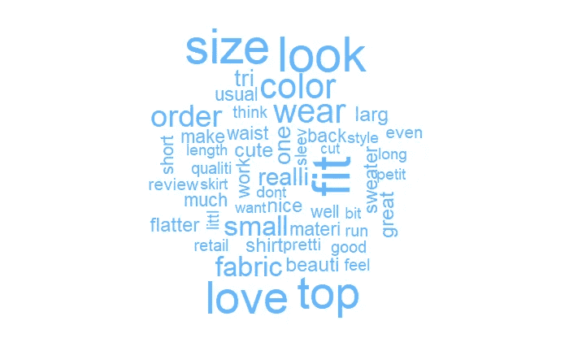

公共云

另一方面，比较云将识别两个语料库之间使用的不同单词。

```
**# Create comparison cloud**
comparison.cloud(all_m,
                 colors = c("green", "red"),
                 max.words = 50)
```

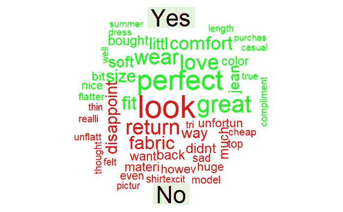

比较云

对比云给出了对产品满意的人和不满意的人所用词汇的明显对比。没有推荐该产品的人使用了负面词汇，如失望、退货、便宜、外观等。

另一个值得注意的有趣的方面是，有“fabric”的单词的“No”列表和有“fit”的单词的“Yes”列表。这可能意味着大多数对产品不满意的人对面料不满意，而推荐产品的顾客对合身度很满意。因此，与合身性相比，整体面料质量可能是一个主要问题，企业可以在这些方面进行分析。

## 极化标签图

极化标签图是通用云的改进版本。它决定了一个术语在两个比较语料库中的使用频率。在许多情况下，常见单词的频率差异可能很有见地。对于该图，加载了 plotrix 包。首先，使用一个子集创建一个包含所有常用单词的矩阵，以确保它只包含在两个类中出现的单词。然后，矩阵有另一列用于每个单词的两个语料库之间的绝对差异，并且绘制了图。

```
**# Identify terms shared by both documents** common_words <- subset(all_m, all_m[, 1] > 0 & all_m[, 2] > 0)**# calculate common words and difference** difference <- abs(common_words[, 1] - common_words[, 2])
common_words <- cbind(common_words, difference)
common_words <- common_words[order(common_words[, 3],
                                   decreasing = T), ]
head(common_words)
```

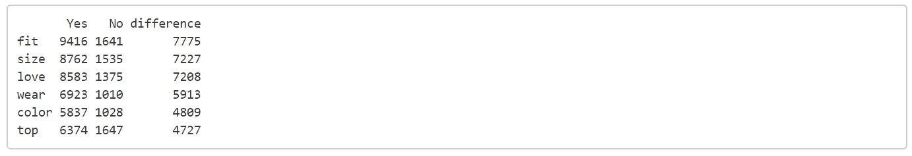

```
top25_df <- data.frame(x = common_words[1:25, 1],
                       y = common_words[1:25, 2],
                       labels = rownames(common_words[1:25, ]))**# Make pyramid plot** pyramid.plot(top25_df$x, top25_df$y,
             labels = top25_df$labels, 
             main = "Words in Common",
             gap = 2000,
             laxlab = NULL,
             raxlab = NULL, 
             unit = NULL,
             top.labels = c("Yes",
                            "Words",
                            "No")
             )
```

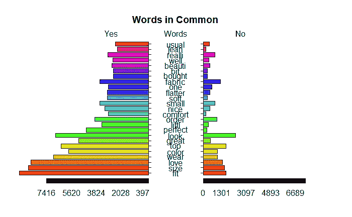

极化标签图

在我们的数据集中，推荐-是和推荐否的比例是不平衡的。大约 82%的人推荐过该产品。所以“不”方的单词量相对较少。在这种不平衡的数据集中，使用两组之间的绝对%差异而不仅仅是绝对差异也是有用的。

## 简单单词聚类

单词聚类用于根据频率距离识别一起使用的单词组。这是一种降维技术。它有助于将单词组合成相关的簇。单词簇用树状图可视化。

```
review_tdm2 <- removeSparseTerms(review_tdm, sparse = 0.9)
hc <- hclust(d = dist(review_tdm2, method = "euclidean"), method = "complete")**# Plot a dendrogram** plot(hc)
```

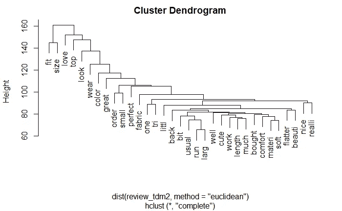

词簇的树状图

树状聚类图显示了某些单词是如何组合在一起的。例如，“柔软”、“材料”和“舒适”被一起使用。因为聚类是基于频率距离的，所以聚类指示哪组单词最频繁地一起使用。

## 词汇联想

单词关联是一种计算 DTM 或 TDM 中两个单词之间相关性的方法。这是识别经常一起使用的单词的另一种方法。对于我们的语料库，单词关联图表示各种单词与单词“fit”之间的相关性。

```
**# Create associations** associations <- findAssocs(review_tdm, "fit", 0.05)**# Create associations_df** associations_df <- list_vect2df(associations)[, 2:3]**# Plot the associations_df values** ggplot(associations_df, aes(y = associations_df[, 1])) + 
  geom_point(aes(x = associations_df[, 2]), 
             data = associations_df, size = 3) + 
  ggtitle("Word Associations to 'fit'") + 
  theme_gdocs()
```

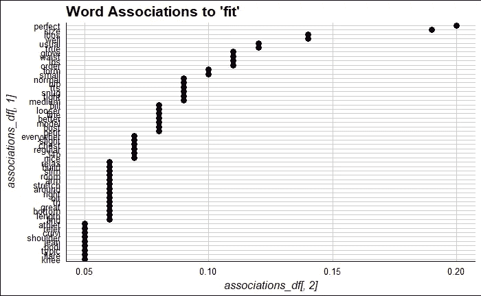

与“适合”一词相关的词

“适合”这个词与“完美”和“尺寸”的关联最大，这是产品的积极方面。与“适合”相关的第三高的词是“loos ”,它表示产品的负面影响。

## N 元语法的使用

到目前为止，我们所做的所有分析都是基于被称为单字的单个单词。然而，它可以非常有见地地看待多个词。这在文本挖掘中被称为 N 元语法，其中 N 代表单词的数量。例如，bi-gram 包含两个单词。
我们现在将看看如何创建二元模型和三元模型，并对其进行一些探索性分析。

```
**##Create bi-grams**
review_bigram <- tokens(review$Review.Text) %>%
    tokens_remove("\\p{P}", valuetype = "regex", padding = TRUE) %>%
    tokens_remove(stopwords("english"), padding  = TRUE) %>%
    tokens_ngrams(n = 2) %>%
    dfm()
topfeatures(review_bigram)
```

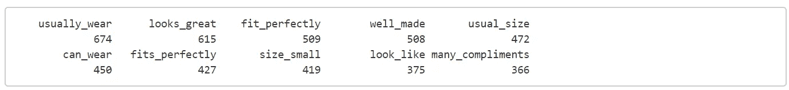

前 10 个双字母组合

```
##Create tri-grams
review_trigram <- tokens(review$Review.Text) %>%
    tokens_remove("\\p{P}", valuetype = "regex", padding = TRUE) %>%
    tokens_remove(stopwords("english"), padding  = TRUE) %>%
    tokens_ngrams(n = 3) %>%
    dfm()
topfeatures(review_trigram)
```

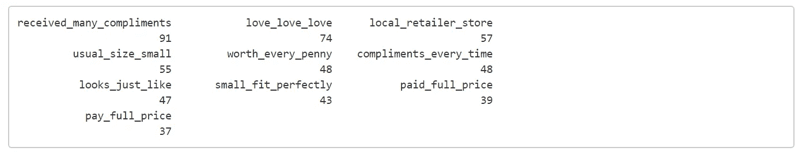

前 10 个三元组

在前面章节中对一元语法所做的所有分析也可以在二元和三元语法上进行，以获得对文本的更多洞察。现在让我们来探讨推荐和不推荐产品的二元模型是如何变化的。

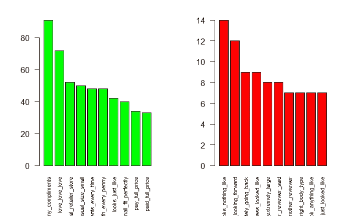

常用三元组柱状图:是与否

# 步骤 5-通过去除稀疏性进行特征提取

## 稀疏概念

稀疏性与术语的文档频率有关。在 DTM，因为术语构成了列，所以每个文档都有几个列，每个列代表一个术语——一元词、二元词、三元词等。矩阵中的列数将等于语料库中唯一单词的计数，这将相对较高。对于不常用的术语，该列在几个文档中可能为零。这就是所谓的稀疏性。在涉及 DTM 的任何分类练习之前，建议处理稀疏性。

## 特征抽出

探索性文本分析基于客户评论给出了一些见解。我们现在将使用相同的评论文本作为预测变量来预测客户是否会推荐该产品。就使用的分类算法而言，数据和文本输入之间没有太大区别。我们将尝试 3 种最流行的分类算法——CART、随机森林和 Lasso 逻辑回归。
在转换适合建模的文本方面，我们可以使用上面提到的相同的包。然而，为了让读者熟悉更多的文本挖掘包，我们将使用稍微不同的方法。

```
**## Load the required libraries** library(irlba)
library(e1071)
library(caret)
library(randomForest)
library(rpart)
library(rpart.plot)
library(ggplot2)
library(SnowballC)
library(RColorBrewer)
library(wordcloud)
library(biclust)
library(igraph)
library(fpc)
library(Rcampdf)
```

## 符号化

> 记号化是将文本分解成不同片段或记号的过程。

这就是我们在上一节中所说的词汇袋。一旦完成了 toeknisation，在所有的预处理之后，就可以构建一个数据帧，其中每行代表一个文档，每列代表一个不同的标记，每个单元格给出一个文档的标记计数。这是我们在上一节学到的 DTM。

预处理步骤在标记上执行，类似于在文本语料库上所做的。

```
**# Tokenize descriptions** reviewtokens=tokens(review$Review.Text,what="word",
remove_numbers=TRUE,remove_punct=TRUE, remove_symbols=TRUE, remove_hyphens=TRUE)**# Lowercase the tokens** reviewtokens=tokens_tolower(reviewtokens)**# remove stop words and unnecessary words** rmwords <- c("dress", "etc", "also", "xxs", "xs", "s")
reviewtokens=tokens_select(reviewtokens, stopwords(),selection = "remove")
reviewtokens=tokens_remove(reviewtokens,rmwords)**# Stemming tokens** reviewtokens=tokens_wordstem(reviewtokens,language = "english")
reviewtokens=tokens_ngrams(reviewtokens,n=1:2)
```

令牌现在被转换为文档频率矩阵，并进行稀疏性处理。

```
**# Creating a bag of words** reviewtokensdfm=dfm(reviewtokens,tolower = FALSE)**# Remove sparsity** reviewSparse <- convert(reviewtokensdfm, "tm")
tm::removeSparseTerms(reviewSparse, 0.7)**# Create the dfm**
dfm_trim(reviewtokensdfm, min_docfreq = 0.3)
x=dfm_trim(reviewtokensdfm, sparsity = 0.98)
```

# 步骤 6 —建立分类模型

我们现在有了经过预处理和处理的 dfm，可以用于分类。为了在分类模型中使用它，执行以下步骤:

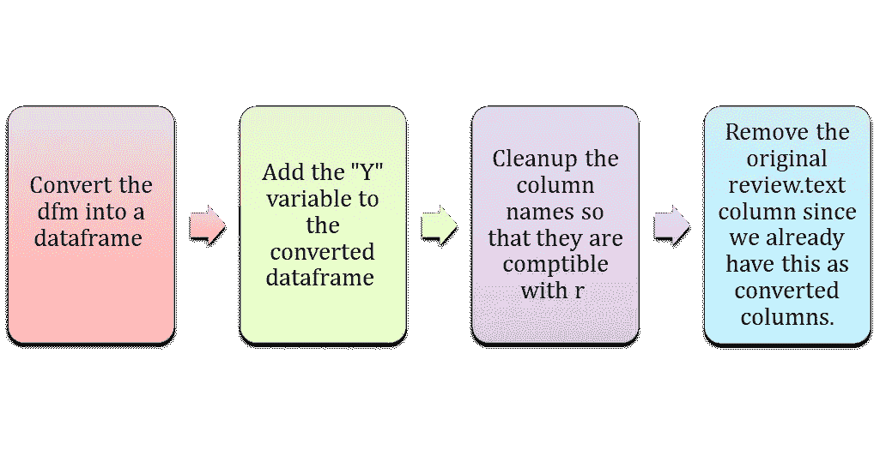

```
**## Setup a dataframe with features** df=convert(x,to="data.frame")**##Add the Y variable Recommend.IND** reviewtokensdf=cbind(review$Recommended.IND,df)
head(reviewtokensdf)**## Cleanup names** names(reviewtokensdf)[names(reviewtokensdf) == "review.Recommended.IND"] <- "recommend"
names(reviewtokensdf)=make.names(names(reviewtokensdf))
head(reviewtokensdf)**## Remove the original review.text column** reviewtokensdf=reviewtokensdf[,-c(2)]
head(reviewtokensdf)
reviewtokensdf$recommend=factor(reviewtokensdf$recommend)
```

## 购物车模型

我们将首先使用 CART 算法进行分类。首先，建立完整的树，并确定误差最小的最佳 cp 值。然后这个 cp 值被用于获得修剪的树。被修剪的树被绘制以理解分类。

```
**## Build the CART model**
tree=rpart(formula = recommend ~ ., data = reviewtokensdf, method="class",control = rpart.control(minsplit = 200,  minbucket = 30, cp = 0.0001))printcp(tree)
plotcp(tree)**##Prune down the tree** bestcp=tree$cptable[which.min(tree$cptable[,"xerror"]),"CP"]
bestcpptree=prune(tree,cp=bestcp)rpart.plot(ptree,cex = 0.6)
prp(ptree, faclen = 0, cex = 0.5, extra = 2)
```

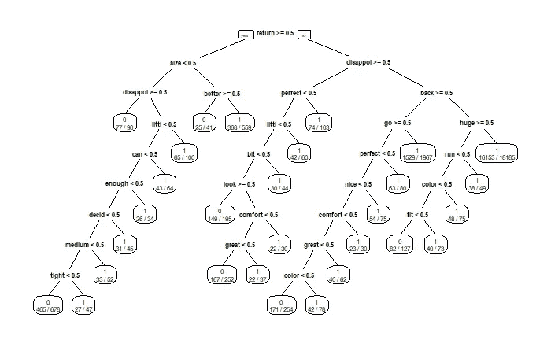

评论文本的购物车

从树形图中可以看出，“退货”、“失望”、“退货”、“巨大”等词被不满意的客户使用，即不推荐产品的客户。可以进一步解释该树，以了解推荐产品的客户和不推荐产品的客户所使用的词汇模式。

## 随机森林

我们将使用的下一个分类算法是随机森林。我们将检查 randomforest 模型的 varimp 图，以了解哪些单词对分类的影响最大。

```
library(randomForest)
reviewRF=randomForest(recommend~., data=reviewtokensdf)
varImpPlot(reviewRF, cex=.7)
```

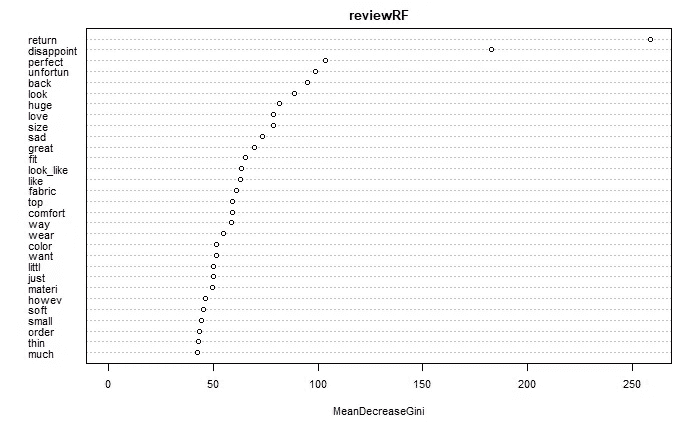

随机森林模型的方差图

与 CART 模型同步，随机森林模型的 varimp 图也表明“返回”、“失望”是最重要的变量。像“不幸的”、“悲伤的”等大多数其他词也表明这些负面的词通常被不快乐的顾客使用。

## Lasso 逻辑回归

我们将使用的下一个分类算法是逻辑回归。正如我们在稀疏性中讨论的，与文本挖掘数据框架相关的主要挑战是非常多的列或特征。这将对逻辑回归等模型产生不利影响。因此，我们将使用使用 lasso 的正则化来减少特征，随后使用逻辑回归来建立模型和分类。逻辑回归模型的优势比将在分类上提供一些有用的见解。

```
**#load required library** library(glmnet)**#convert training data to matrix format** x <- model.matrix(recommend~.,reviewtokensdf)**#convert class to numerical variable** y <- as.numeric(reviewtokensdf$recommend)**#perform grid search to find optimal value of lambda** cv.out <- cv.glmnet(x,y,alpha=1,family="binomial",type.measure = "mse" )**#plot result** plot(cv.out)
```

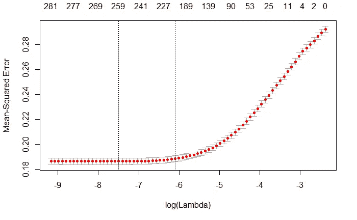

```
**#min value of lambda** lambda_min <- cv.out$lambda.min**#best value of lambda** lambda_1se <- cv.out$lambda.1se
lambda_1se**#regression coefficients** coef=coef(cv.out,s=lambda_1se)
lassocoef=as.matrix(coef(cv.out,s=lambda_1se))
write.csv(lassocoef, "lasso_coef.csv")
```

基于套索回归，我们得到了逻辑回归所需的 lambda_min。对系数矩阵的检查将揭示由套索执行的特征减少。不需要包括在模型中的特征的系数为零。

为了便于解释，coef 已被写入一个 csv 文件。csv 文件将保存到开始时设置的工作目录中。为了更清楚起见，让我们检查一下 csv 文件。

如果 csv 文件在 coef 列上被过滤为零(列 B)，我们发现 285 个特征(x 变量)中的 84 个具有为零的 coef-即，这些已经被套索模型移除。

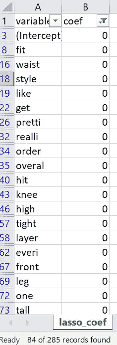

精简的特征集用于建立逻辑回归模型。从逻辑回归模型的系数，我们可以使用公式计算优势比:
**优势比= exp(coef(LR 模型))**

比值比是基于概率的模型如逻辑回归的一个非常独特的优势。我们将使用比值比来了解分类中各种 x 变量的影响。

```
**# Find the best lambda using cross-validation** set.seed(123) 
cv.lasso <- cv.glmnet(x, y, alpha = 1, family = "binomial")**# Fit the final model on the dataframe** review_logreg <- glmnet(x, y, alpha = 1, family = "binomial",
                lambda = cv.lasso$lambda.min)**# Save the regression coef to a csv file** logregcoef=as.matrix(coef(review_logreg))
odds_ratio=as.matrix(exp(coef(review_logreg)))
write.csv(logregcoef, "logreg_coef.csv")
write.csv(odds_ratio, "odds_ratio.csv")
```

与 lasso coef 一样，比值比也被写入 csv 文件以便更好地理解。让我们检查 csv 文件以获得进一步的见解。如果比值比的 csv 文件根据比值比(B 列)按降序排序，我们可以检查比值比最高的变量:

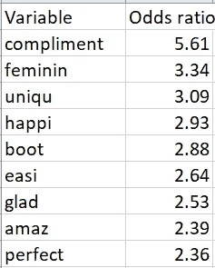

赔率解释如下:在评论中有“赞美”的产品比没有该词的产品评论有 5.61 倍的赔率被推荐。其他单词的比值比也可以类似地解释。

现在让我们检查 logreg_coef.csv 文件，以了解一些具有负系数的变量:

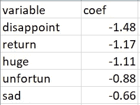

术语“令人失望”具有负系数，表示如果该术语出现在评论中，该产品被推荐的概率非常低。对于具有负系数的其他项，可以做出相同的解释。

在推荐产品的快乐顾客和不快乐顾客使用的术语方面，所有 3 个分类模型都有几乎相似的见解。这些可以提供提高产品/服务质量的重要线索，从而提高产品的推销商。

## 结束语

尽管这是一篇相对较长的文章，但这篇文章只涵盖了文本挖掘概念的冰山一角。这篇文章的主要目的是让读者了解文本挖掘的概念。本文还试图整合基本文本挖掘和文本分类所需的各种库和代码块，以便读者可以按照步骤对他们感兴趣的文本内容执行类似的分析。