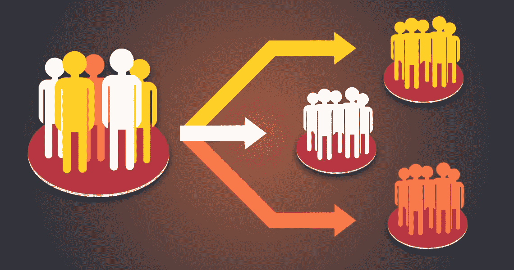
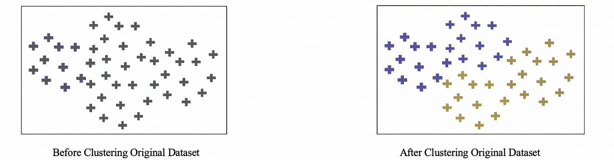
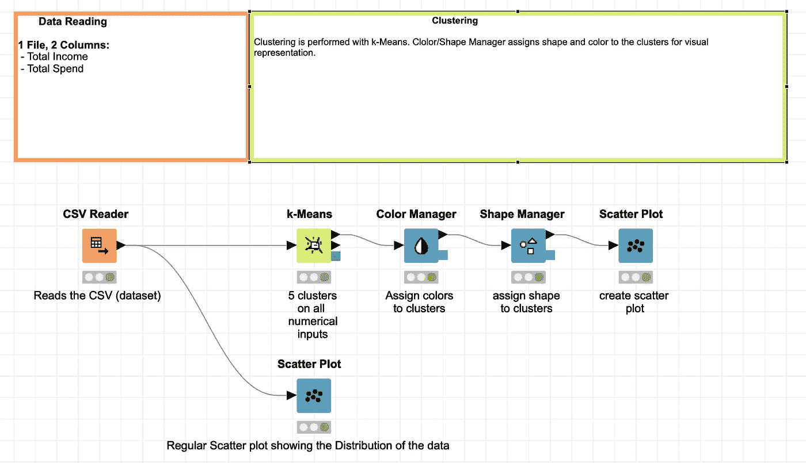
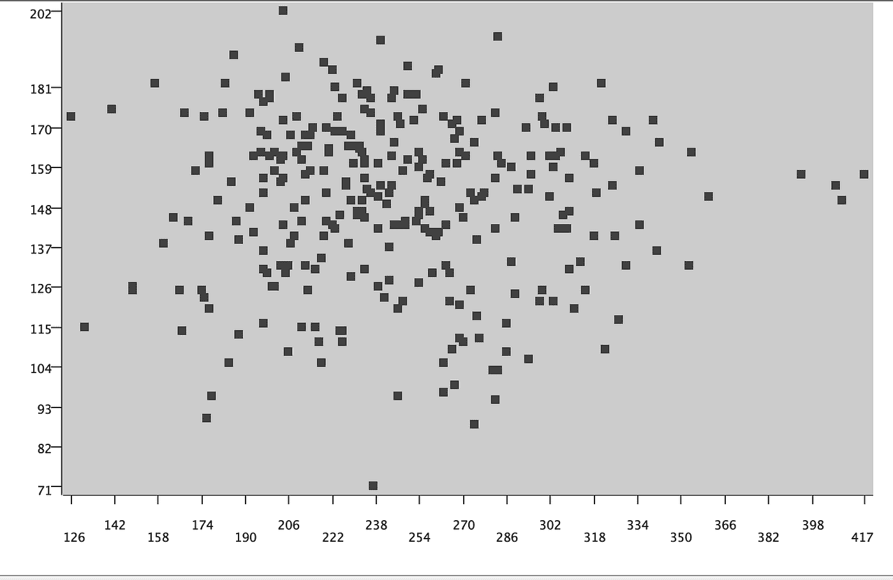
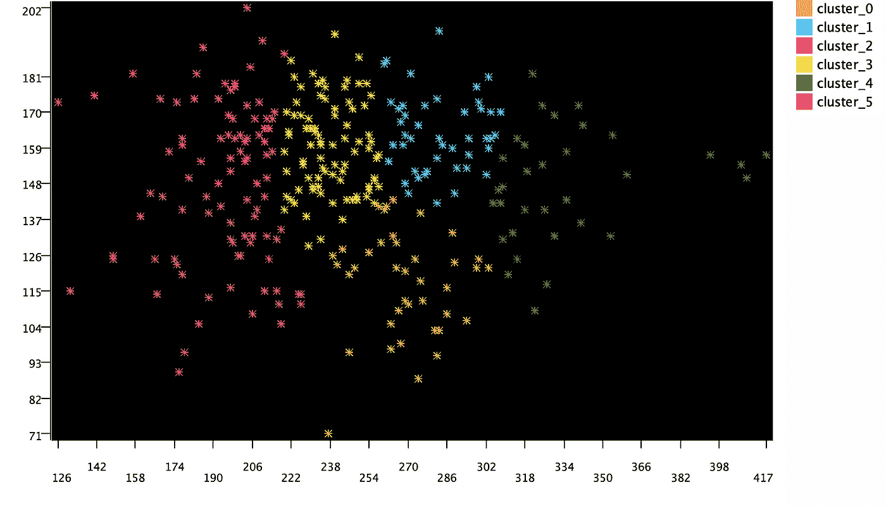
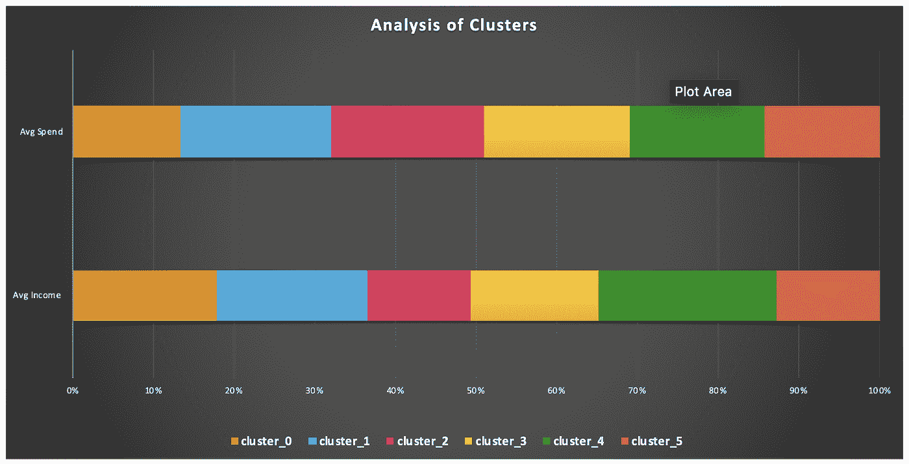
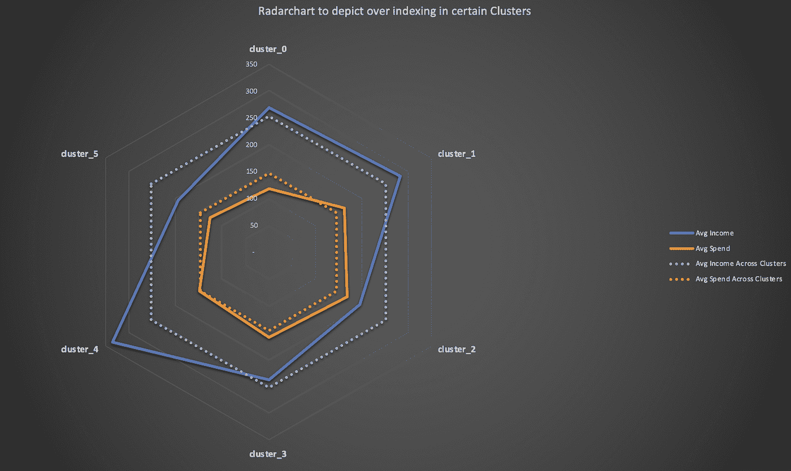

# 客户细分——提高营销投资回报率的强大工具

> 原文：<https://medium.com/analytics-vidhya/customer-segmentation-a-powerful-tool-to-increase-your-marketing-roi-3584e0e45731?source=collection_archive---------26----------------------->

# 什么是客户细分？

正式定义:客户细分是将客户群划分为在与营销相关的特定方面(如年龄、性别、兴趣和消费习惯)相似的个人群体的做法。

它们通常可以分为:

*   人口统计——年龄或性别
*   地理——位置、地区、气候或市场规模
*   行为——使用、最近或倾向

# 为什么客户细分如此重要？

对你的客户进行细分可以让公司有效地投入营销资金，从而获得更高回报的最佳结果。公司可以针对不同的细分市场制定具体的营销策略，并根据这些数据进行优化。这反过来会降低你的营销成本，增加保留率，并使你能够确定你最好的客户。

# 机器学习如何帮助你细分你的客户？

对客户进行细分的最强大而简单的工具之一是使用 K-Means，这是一种无监督的机器学习聚类算法。K-Means 所做的是，它根据您提供的数据创建分段，即**聚类**而无需您的监督。它将扫描与每个客户相关的所有信息，并学习将他们分组的最佳方式。该算法根据提供的聚类数在数据集中创建随机质心，并慢慢尝试将每个数据点拟合到最近的质心。质心将根据分配给它们的最近的数据点自动调整。这个迭代过程继续进行，直到所有的数据点都与任一质心相关联，从而创建不同的聚类。下面一个简单的图像可以有效地解释这个过程。

## 我现在将演示如何使用一个叫做 [KNIME Analytics](https://www.knime.com/) 的伟大工具，使用一个模拟[数据集](https://www.kaggle.com/alankar2019/sample-dataset-for-clustering)，成功地对你的客户进行细分。

该数据包含客户的年收入及其年度支出*。*让我们使用 KNIME 首先可视化数据，然后使用 K-Means 聚类在数据集中创建 5 个聚类。

**使用 K-Means 创建聚类的 KNIME 工作流**

*数据集的常规散点图 X 轴:收入& Y 轴:支出*

*带有指定聚类的数据集散点图 X 轴:收入& Y 轴:支出*

上图显示了不同的聚类，这将使我们在针对这些客户时制定更有效的营销策略。

分析这些集群让我们对它们的行为和模式有了更多的了解。

# **调查结果**

*   尽管属于收入最低的群体，但平均花费指数超过第 2 组
*   集群 5 和集群 0 的开销最低
*   第 1 组代表高支出和极高收入

基于以上发现，您可以针对这些群体定制特定的营销活动，以推动收入增长或增加客户保留率。

# 结论

正如所展示的，K-Means 是一个强大的细分工具，对于为您的组织制定智能营销策略非常有帮助。