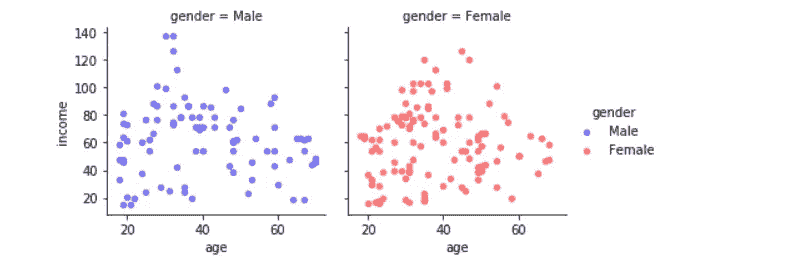
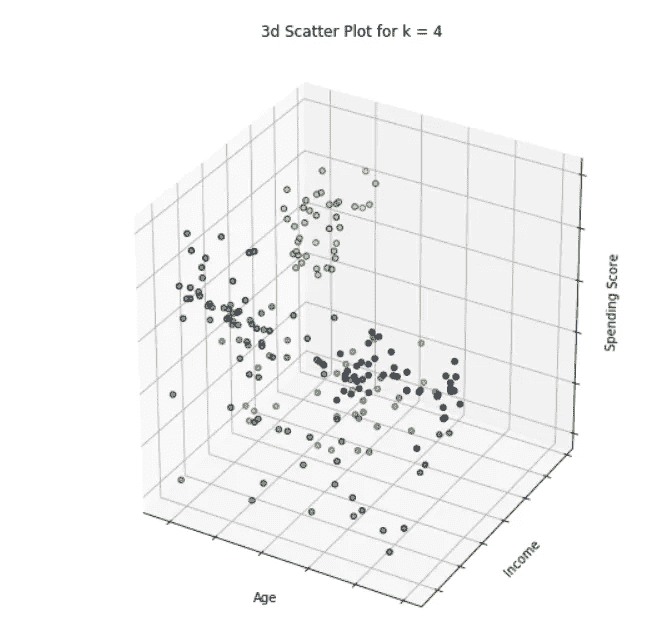
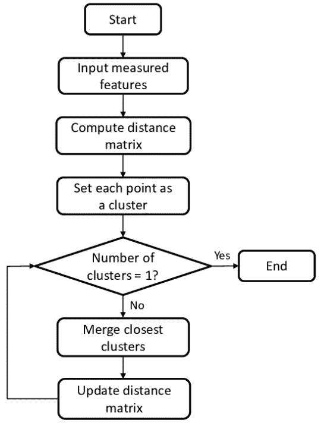
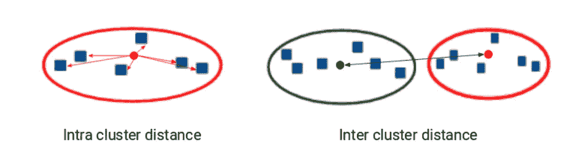

# 基于聚类分析的差异化目标客户细分

> 原文：<https://medium.com/analytics-vidhya/customer-segmentation-for-differentiated-targeting-in-marketing-using-clustering-analysis-3ed0b883c18b?source=collection_archive---------2----------------------->

## 使用 SSE、dunn index 和 silhoutte 分数的 k-means、agglomerative、DBSCAN 聚类算法的比较

图片来源—[https://www.quora.com/What-is-clustering](https://www.quora.com/What-is-clustering)

# 了解客户细分，在营销中实现差异化目标

让我们了解一下业务目标——您有一群客户。自然，客户在人口统计数据(年龄、性别、收入)、**购买模式和行为**(购买频率、购买的货币价值(价格范围)、购买的商品类型)等方面会非常多样化。和许多其他因素。其中一种常用的手法就是[**【RFM】**](https://en.wikipedia.org/wiki/RFM_(customer_value))**。现在，作为营销人员，你需要根据这些数据来决定应该做什么类型的广告/目标定位。这对于不同的客户来说是不同的，因为不同的 [**客户群**](https://en.wikipedia.org/wiki/Cohort_analysis) 会有不同的表现。例如，您可能希望将快速移动的低价产品的广告投放给某些对价格非常敏感的顾客。你会想把更多的时尚、美容产品瞄准 30 岁以下的女性(只是一个例子，无意冒犯所有女性:P)。这种有针对性的营销方式需要存在，因为这将更好地适应每个客户的偏好，从而改善客户体验，并最大限度地提高他们的购买机会。客户细分的目的是创建相似的客户细分或客户群(基础数据),并尽可能确保没有两个客户群是相似的，也没有两个客户群是不同的。**

# 了解数据集

我们将使用著名的**商场数据集**(此处参考数据)——[**https://www . ka ggle . com/vjchoudhary 7/customer-segmentation-tutorial-in-python**](https://www.kaggle.com/vjchoudhary7/customer-segmentation-tutorial-in-python)**。**

假设您有 200 名客户的数据，包括他们的性别、年龄、收入和支出分数。**支出得分**是一个代理指标，在 1-100 的范围内使用。更高的消费分数意味着顾客对购买物品有更高的亲和力，从而为购物中心带来更高的收入。我们的目标是尽我们所能对这些客户进行最佳分组，这样相似的客户会被分组在一起，不会有任何两个组是相似的。

来源——ka ggle

你会怎么做？你基本上拥有客户的 4 个属性，你需要决定你能实现的最佳细分。假设你只有性别属性。然后，你自然会把女性和男性分成两个不同的组。或者让我们假设你只有客户的年龄——你可能会创建年龄等级(类似于<18, 18–25, 25–35,35–50,> 50 等。)根据你的企业向客户销售的产品类型，这在商业上是有意义的。但是，当您需要根据多个属性(本例中为 4 个)对客户进行分组时，会发生什么呢？让我给你解释一下为什么这个问题会变得复杂。我们先来看一下数据，了解一下这个。

年龄与收入——男性/女性

如果一个人看到上面的图表(**年龄对收入图表，按“性别”**)，他可能会将一些直觉建立在离职界限和一些商业背景的基础上，如下所示:

集群 1

“花费分数”和“年龄”的图表怎么样—

集群 2

或者可能是收入和支出得分，如下图所示？

集群 3

或者是 3D 空间中的某些东西，因为它需要数据集中的所有要素？

3d 散点图—年龄、收入、支出

选择正确的分割方法的困境:

1.  营销团队可能会选择集群 3 而不是集群 1 或集群 2，因为它们似乎更容易分开。
2.  这也取决于我们实际上想要有多少段？更多的细分市场意味着不同群体的更多内容创作。
3.  片段太少会导致过度概括

这只是 4 个客户属性。现实世界的问题会有成百上千的客户事件和购买数据。这个问题变得更加棘手。让我们了解如何使用**机器学习算法**来实现这一点。我们将研究 3 种常见方法(如下)并将结果与人类标记的聚类进行比较:

1.  **K 表示聚类**
2.  **层次聚类**
3.  **数据库扫描聚类**

# 1.k 表示聚类

> *机器如何学习最好是通过最小化一个* [***损失函数***](https://en.wikipedia.org/wiki/Loss_function) ***。*** *在 K 的情况下意味着基本上是距离平方和的算法。这里有一个精彩的博客，简单地解释了 k-means—*[*https://www.saedsayad.com/clustering_kmeans.htm*](https://www.saedsayad.com/clustering_kmeans.htm)*。K 均值的损失函数如下:-*

来源—[https://www.saedsayad.com/clustering_kmeans.htm](https://www.saedsayad.com/clustering_kmeans.htm)

> *上述损失函数基本上告诉“* ***”找出聚类质心(对于“k”个聚类)，使得在所有聚类*** *”中，一个聚类中的聚类内距离最小化。这基本上是一个数学优化问题——最小化公式。簇形心基本上是簇中的一种中心点。一旦找到“k”个聚类质心，就可以将每个点分配给其最近的质心，并且具有相同质心的点将构成每个聚类。*
> 
> *解上面这个方程是一个* [***NP 难***](https://en.wikipedia.org/wiki/NP-hardness) *问题——这意味着它基本上是数学领域中一个很难解决的问题。于是，为了解决这个问题，我们将使用* [***近似算法***](https://en.wikipedia.org/wiki/Approximation_algorithm) ***。*** [***Lyod 的算法***](https://en.wikipedia.org/wiki/Lloyd%27s_algorithm) *就是解决这个的一种方法。*

来源—[https://www.saedsayad.com/clustering_kmeans.htm](https://www.saedsayad.com/clustering_kmeans.htm)

> ***初始化敏感度*** *是我们在 k 均值算法中面临的一个问题，这基本上意味着我们获得的最终聚类将取决于我们如何选择算法中的步骤 2。(上)因此，需要我们使用不同的初始化来执行该算法的多次迭代，并检查哪种初始化最适合我们对集群的要求。处理这个问题的另一种方法是使用*[***【k-means++***](https://en.wikipedia.org/wiki/K-means%2B%2B)***。*为了减轻离群值的影响，这里使用了一种 [***概率算法***](https://en.wikipedia.org/wiki/Randomized_algorithm) *。***
> 
> *k-means 的一些局限性包括:(参考—***)**
> 
> ****1。当它们更接近时，不同的簇大小****
> 
> ****②*。不同的群集密度*****
> 
> *****3。*非凸形****
> 
> ****4。对异常值的非鲁棒性****
> 
> ***(上述问题可以通过使用更多的集群，然后对子集群进行分组的策略来解决)***
> 
> ***k-means 的另一个问题是聚类形心的可解释性。聚类的质心不一定是点中的数据，因为它是聚类数据点的平均值。在现实生活中，业务团队通常希望聚类中心是数据点之一，因此在这种情况下，我们可以使用*[***k-medoids***](https://en.wikipedia.org/wiki/K-medoids)**。这里不使用质心，我们使用一种叫做 medoid 的东西(它是一个数据点)。在这种情况下，我们不是将平均值作为质心来计算，而是在数据点上迭代以选择最能降低损失函数(SSE)的 medoid。这种方法通常用于使我们的模型更容易理解。****

****

**比较 k-means (vs) k-medoids，source—[https://subscription . packtpub . com/book/big _ data _ and _ business _ intelligence/9781789956399/1/ch 01 LV 1 sec 08/introduction-to-k-medoids-clustering](https://subscription.packtpub.com/book/big_data_and_business_intelligence/9781789956399/1/ch01lvl1sec08/introduction-to-k-medoids-clustering)**

> ***如上图所示，K-medoids 选择聚类质心作为数据点之一，而在 k-means 中，它不是数据点。最佳“k”值的选择一般使用损失函数的* ***肘法*** *来完成。当我们应用于我们的例子时，我们将详细地看到这一点。***
> 
> ***k-means 的* ***时间复杂度*** *为****O(nkdi)****，分别为#pts、#clusters、#features、#iterations。这可以简化为****O(nd)****在‘k’和‘I’较小的情况下。***
> 
> ***k-means 的* ***空间复杂度*** *为****O(nd+KD)****但可以近似为****O(nd)****为小值。***

**让我们将 python-sklearn 中的 k-means 应用于我们的示例并检查结果。**

****

**kmeans python 代码片段**

**我们首先确保数字特征和标准化。然后，我们尝试从 2 到 14 的“k”值，并使用肘方法选择最佳“k ”(如下图所示)。**

****

**肘法，k = 4**

**基于肘形方法，我们观察到从 k=4 开始的肘形形成，我们可以选择它作为 k 均值中的最佳聚类数。我们也可以使用 k=6，但我们会尽量避免这里的过度拟合。因为我们只有 200 个数据点。现在让我们想象这些集群。**

****

**收入与支出— 4 千均值聚类**

**正如我们在上面看到的，除了绿色和红色集群，它们在这个空间中被很好地分开。让我们从另一个角度想象一下。**

****

**年龄与支出— 4 千均值聚类**

**啊，所以基本上红色集群是为高年龄组，而绿色集群是为低年龄组。让我们看看年龄、收入、支出特征的三维散点图**

****

**4 个具有 k 均值的聚类**

# **2.分层聚类**

> **这种方法有两种类型——凝聚型和分裂型。然而，凝聚法是最广泛使用的方法。这基本上是以分层的方式对相似的点/簇进行分组。**

****

**来源——Pinterest**

> **从上图我们可以看出。它首先将所有点视为单独的聚类，然后在每次后续迭代中，将邻近点分组为聚类，并重复将点/聚类分组为聚类的过程，直到达到一个大的聚类。我们可以在下面的算法中看到这种方法—**

****

**来源——research gate**

> ***凝聚聚类的一个主要考虑是选择* ***邻近度度量*** *。(即，我们如何定义聚类和/或点之间的聚类间距离)。让我们看看一些接近度指标—***
> 
> *****1。MIN —*** *这基本上取 2 个聚类对之间最小的可能距离。这样做的主要优点是* ***也可以处理非凸形簇*** *。然而，它对离群值* *很敏感，因为它使用了簇之间的最小距离。***
> 
> *****2。最大值****——类似于最小值，但取最大值而不是最小值。这种方法对聚类中的离群点* ***和噪声点*** *更加鲁棒。然而，在集群大小不均匀的情况下，这可能会很糟糕。***
> 
> *****3。组平均值—*** *取两个聚类对中所有点组合的平均值。您可以使用距离度量，如欧几里德、曼哈顿等。***
> 
> *****4。质心之间的距离*****
> 
> **理想情况下，你可以重复上面的方法，看看哪种方法最适合你的需求。**
> 
> ***凝聚聚类的空间复杂度为****O(n)****—“n”大时空间复杂度大。时间复杂度为****【O(n)****。这些复杂性非常大。这是使用聚集聚类的主要缺点之一。***
> 
> ***让我们将凝聚聚类应用于我们的示例并进行检查，我们将取 num clusters = 4，就像我们对 kmeans 所做的那样—***

****

**python 代码片段-聚合**

****

**聚集聚类——收入与支出**

****

**聚集聚类，4 个聚类—支出与年龄**

**正如我们所看到的，聚集聚类在这里也做得相当不错。**

****

**凝聚聚类，4 个聚类**

# **3.DBSCAN 聚类**

> **[**DBS can**](https://en.wikipedia.org/wiki/DBSCAN)**代表**基于密度的空间聚类的噪声应用。**这基本上是如何进行聚类的:****
> 
> ****将每个点分为三类——****
> 
> ******核心点(**如果它包含围绕其外圈半径的最小点 **)** ，****
> 
> ******边界点(**不是核心点，但在 epislon 附近有核心点 **)** ，****
> 
> ******噪声点(**所有非核心点和非边界点 **)** 。****
> 
> ****这个任务基于两个超参数——****
> 
> ******ε(**围绕一个点的半径 **) —** 这是使用肘法通过绘制每个点到第 x 个最近邻点的距离来确定的，其中 x =最小点。****
> 
> ******最小点(**核心点周围的最小点，以将其分类为核心点/密集区域 **)** 充当密度的代理指标——这可以使用经验法则选择为 **2*d** ，其中 d =数据的维度****

********

****来源—维基百科—数据库扫描****

> ****然后，它移除噪声点，并迭代每个核心点，以将其分配给一个聚类，该聚类将包括与该核心点密集连接的所有点。对于边界点，该点将属于最近的核心点的聚类。算法步骤如下—****

********

****来源—维基百科数据库扫描****

> ****DBSCAN 的最大优点是其处理噪声的能力及其对异常值的鲁棒性，处理复杂形状的集群等。但是，如果数据在空间中包含可变密度，则失败。它在高维数据及其对超参数的敏感性方面也是失败的。****
> 
> ****DBSCAN 的时间复杂度为 O(nlogn)，空间复杂度为 O(n)在 d<< n. This looks a good complexity as compared to agglomerative clustering.****

****Let us apply DBSCAN to dataset and see, We will select min_points = 8 as a rule of thumb of 2*d where d = 4 (d = num of features).****

********

****python code — DBSCAN****

********

****selecting epislon = 0.7 using elbow method DBSCAN****

****DBSCAN gives 6 clusters — which is slightly overfitting for our case here. Let us see a visualization.****

********

****DBSCAN , clusters = 6****

# ****Comparison of Results and Conclusions****

## ****1 — Comparing K Means clustered Labels with Human Labels****

****As we can see below graphs, Algorithm chooses 4 clusters but kmeans cluster creates some overlap in income vs spend which human doesn’t. But if you look from the feature space of spend vs age — this seperation seems to be justified. This kmeans clustering has advantage that it can look at multi dimensional data and take the best call how to cluster which might be difficult for a human.****

********

****Human Labelled clusters = Income vs spend****

********

****Kmeans cluster, 4 clusters****

********

****kmeans cluster, 4 clusters****

## ****2 — Other Metrics for Selecting best number of clusters — Dunn’s Index, Shiloutte Score****

****You can also use [***Dunn Index***](https://en.wikipedia.org/wiki/Dunn_index)作为度量来确定你的簇的情况下。这是一个比率指标。如果邓恩指数很高，这意味着你的聚类很好，这是因为簇间距离很高，这是我们想要的，而且簇的直径很低，这意味着 SSE 很低。****

****邓恩指数=(最小(聚类间距离))/(最大(聚类内距离))****

********

****来源——分析****

****您可以使用的另一个指标称为 [***Shiloutte 得分***](https://scikit-learn.org/stable/modules/generated/sklearn.metrics.silhouette_score.html) 。更多详情请参考 sklearn 链接。****

********

****来源— `[sklearn.metrics](https://scikit-learn.org/stable/modules/classes.html#module-sklearn.metrics)`。剪影 _ 配乐****

## ****3—其他结论****

1.  ****层次聚类给出了与 Kmeans 非常相似的结果。这里，我们使用了**‘ward’**链接作为邻近性度量。然而，我们也可以尝试“最小”、“最大”、“组平均”等。比较你的结果。凝聚聚类的唯一缺点是，与 k-means 相比，运行时间会更多，而且与使用 elbow 方法的 k-means 相比，使用“num clusters”的选择会非常直观。****
2.  ****在我们的例子中，通过选择最佳聚类= 6，DBSCAN 稍微有些过拟合，但是正如我们在上面看到的，这对于超参数的微小变化非常敏感。您可以试验不同的 epislon、min 点超参数，看看在这种情况下什么效果最好。****
3.  ****聚类没有对错之分。与分类/回归任务不同，在分类/回归任务中，您可以度量模型的性能。这里的挑战在于根据业务需求决定什么是最佳的集群策略。****
4.  ****尝试 Dunn Index、Shiloutte 评分指标，并根据您的业务需求决定您的正确指标。****