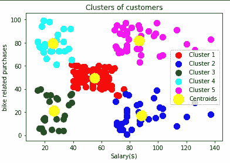

# 使用数据分析和机器学习的客户细分模型:为您的企业吸引合适的客户

> 原文：<https://medium.com/analytics-vidhya/customer-segmentation-model-attract-the-right-customers-for-your-business-968735f2222e?source=collection_archive---------0----------------------->

链轮中心有限公司。

链轮中心私人有限公司是一家中型自行车和自行车配件组织，已经接触了毕马威的灯塔和创新团队。链轮中心有限公司非常希望了解毕马威在其分析、信息和建模团队中的专业知识。首先，他们需要客户和交易数据方面的帮助。该组织有一个与客户相关的大型数据集，但他们的团队不确定如何有效地分析该数据集以帮助优化其营销策略。客户细分模型是一种根据客户共有的某些特征将客户分成不同组的方法。所有客户都有对某些产品或服务的共同需求，但除此之外，还有明显的人口统计学差异(如年龄、性别、年收入)，他们往往还有额外的社会经济、生活方式或其他行为差异，这些差异对组织和整个企业都很有用。

新客户列表数据集显示了该组织在过去三个月中拥有的潜在新客户。它由 1000 行组成，可以从[https://in.insidesherpa.com](https://in.insidesherpa.com)下载。客户向毕马威提供了 3 个数据集:

*   客户人口统计
*   客户地址
*   过去 3 个月的交易数据

> **第一步:数据处理&探索**

数据集

**客户人口统计数据集-**

1.DOB 列有 87 个空白条目或缺失条目，任期字段有 87 个空白条目，495 个客户有空白职位。

2.客户 id 为 34 的人的出生年份是 1843 年，这实际上是不可能的，因为这意味着他/她已经 177 岁了。

3.88 名顾客的性别被定义为 u。

4.656 名客户提到的工作行业不适用。

5.由于性别列是一个分类数据列，如果所有值都是 F/M 或女性/男性的形式，分析起来会更好更容易。

**新客户列表数据集-**

1.17 名顾客的性别被定义为 u。

2.对于 17 个客户，DOB 列为空白。

3.106 名客户尚未指定其职位，165 名客户的工作行业类别为“不适用”。

4.所有客户的已故指标值为 n。这似乎有点奇怪。

**客户地址数据集-**

1.state 列包含一些数据行的州代码和另一些数据行的完整州名。因为它是分类数据，所以最好将所有状态条目都作为状态代码。

**交易数据集**

1.在线订单列有 360 个客户的空白值，产品线、产品大小和产品类别列有 197 个空白值

2.Product_first_sold_date 列应该有日期格式的值，但它有 6 位数字形式的条目，无法区分为日期。

3.标准成本列有一些值，如 312.7350159，667.4000244，而其他值以美元为单位，并且有 197 个空白值..

**缓解措施**

1.在某些记录中，各种列(如购买的品牌或职位)都有空值。对于关键数据集，如交易，不到 1%的交易(总计不到收入的 0.1%)有缺失字段。这些记录已从训练数据集中删除。

2.同一属性的值不一致(例如，维多利亚被表示为“V”、“Vic”和“Victoria”)。为了为模型构造有意义的变量，数据已经被清理以避免相同值的多个表示。此外，在建模时,“U”处的性别记录已被删除。

3.同一属性的数据类型不一致(例如，某些字段为数值，而其他字段为字符串)。给定字段具有不同的数据类型会使后期解释结果变得困难。因此，需要进行适当的数据转换，以确保给定字段的数据类型一致。

4.所有空白、缺失和 n/a 值都已删除，因为它们只占整个数据集的很小一部分。

> **第二步:** **数据分析和模型开发**

## 交易数据集

> 解释:-

a)第一个条形图代表每个品牌类别的交易数量，Solex 最高，其次是 Giant Bicycles 和 WeareA2B，交易数量几乎相同。因此，客户应更多地关注 Solex 品牌产品的销售，并应考虑对其他品牌的质量问题进行一定的改进，以最大限度地扩大市场范围和利润。

b)第二个条形图代表每种产品的运输路线。可以得出结论，对于每个品牌，与通过公路、山地或旅游线路运输的产品相比，通过标准线路运输的产品交易量最大。

## **新客户数据集**

> 解释:-

a)新客户属于澳大利亚的三个州，昆士兰有 208 个潜在客户，新南威尔士有 452 个客户，维多利亚城有 234 个客户。

b)在所有三个州中，客户数量最多的是金融服务、卫生和制造业。因此，客户应该专注于接触更多属于这些行业的客户。

c)30-40 岁和 40-50 岁年龄组的顾客在过去 3 年中购买次数最多。

> M **使用 K 均值聚类的模型开发**

K-means 聚类是最简单和最流行的无监督机器学习算法之一。该算法通常将数据点分组为 k 个簇，这有助于我们发现数据集中的潜在模式。聚类是指由于它们之间的某些相似性而隔离在一起的一组数据点。该算法识别 k 个质心，然后将每个数据点分配到最近的质心，同时保持质心尽可能小。

算法如何工作的步骤-

1.  选择聚类数 k。
2.  随机选择 K 个质心(不一定从数据集中)
3.  将每个数据点分配到最近的质心以形成 K 个聚类。
4.  计算并放置每个簇的新质心。
5.  将每个数据点重新分配给新的聚类。如果更换，回到第 4 步，否则模型准备好了。

为了选择正确的聚类数，我们使用 WCSS(在聚类平方和内)和肘方法。

让我们导入库和数据集

接下来，我们使用肘方法来寻找最佳数量的集群

wcss 的计算方法如下-

其中 xi 指的是聚类中的每个数据点，ci 指的是每个聚类的对应质心，m 是聚类的数量。

随着聚类数目的增加，wcss 的值减小，并且倾斜或肘形给出了要使用的适当的聚类数目。这是 4 英镑。因此，我们使用 4 个集群来适应我们的模型。

在最后一步，我们绘制我们的集群和可视化。

在第一个模型中，主要的客户吸引力应该是属于年龄在 20-40 岁之间且购买次数最多的绿色群体的客户。客户还应该接触更多属于第一种模式的第 1 类和第 4 类的客户，因为他们的平均购买次数可以通过更好的营销策略来增加。

在第二个模型中，属于聚类 5 的客户应该被更多地接触，因为他们都有高工资并且也进行更多的购买。此外，第 2 类客户工资较高，购买量也不高，因此应该更多地接触他们。