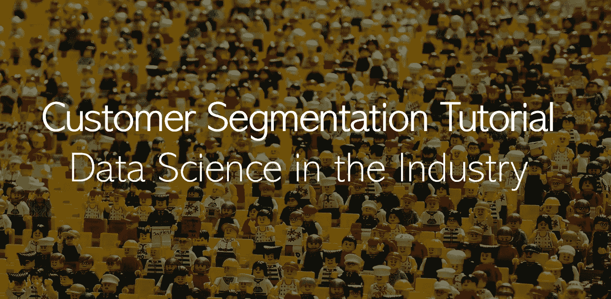

# 客户细分教程:行业中的数据科学

> 原文：<https://medium.com/analytics-vidhya/customer-segmentation-tutorial-data-science-in-the-industry-a6b486f0b0b0?source=collection_archive---------1----------------------->

来自 Pixabay 的背面图像。

## 了解企业如何个性化体验

“普通顾客”是一个过去的概念。迎合普通顾客的需求不再适用于企业，因为顾客需求的差异越来越大。相反，企业需要能够将他们的客户群划分为不同的群体，并为他们量身定做一套适合他们的服务