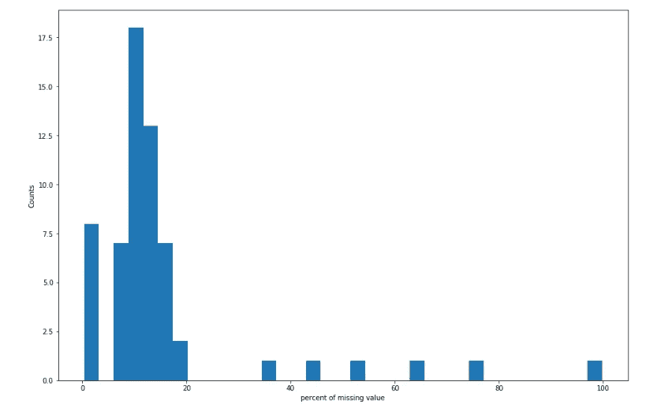
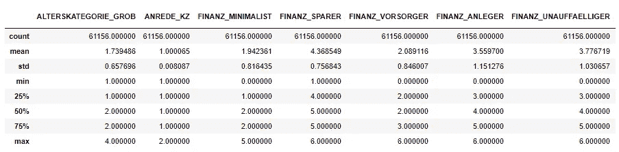

# 客户细分:使用无监督学习模型了解你的目标市场

> 原文：<https://medium.com/analytics-vidhya/customer-segmentation-understanding-your-target-market-using-unsupervised-learning-models-c2e5f33d575b?source=collection_archive---------22----------------------->


# 介绍

客户细分是指将客户群划分为在与营销相关的特定方面相似的群体。从本质上讲，它涉及到将顾客分成特定的群体，也许是根据性别、兴趣、购买习惯或人口统计来缩小范围。

# 业务需求

企业通常希望提高客户满意度，这就需要充分了解客户的需求。客户细分允许具体识别客户、他们的偏好、喜欢、习惯、生活方式选择等，并定制您的产品和服务以满足他们的需求。

例如，企业的主要客户群可能是年龄在 40-60 岁之间的人群，他们存钱比投资多，更喜欢通过传统媒体(广播、电视)做广告，并且比网上购物者更多地光顾商店。然后，企业可以利用这些信息，推出间歇性的促销和折扣优惠，在传统媒体上投放更多的广告，通过商店渠道而不是网上商店分销产品。

它允许对营销信息进行微调，以符合接收者的确切需求，从而增加他们转化的机会。公司向客户发送定制的特别优惠，这反过来会增加收入。

客户细分的其他好处包括在竞争中领先一步，识别现有或潜在客户可能感兴趣的新产品，并向他们推荐这些产品。

# 工作过程

1.  数据理解
2.  数据预览
3.  数据预处理
    —处理缺失数据
    —重新编码特征
4.  特征变换
    —特征缩放
    —降维(主成分分析——PCA)
5.  使聚集
6.  估价
7.  结论

# 1.数据理解

在这个项目中，我应用了无监督学习技术(K-Means 聚类)来识别德国一家邮购销售公司的核心客户群。然后，这些细分可用于针对具有最高预期回报率的受众开展营销活动。

使用的数据由 Bertelsmann Arvato Analytics 提供，代表了一个实际的数据科学项目。参见[链接](https://github.com/AyonzOnTop/Customer-Clustering-Segmentation/blob/master/Identify_Customer_Segments.ipynb)到 Github repo。

**数据详情**

*   `Udacity_AZDIAS_Subset.csv`:德国一般人口的人口统计数据；891211 人(行)x 85 个特征(列)。
*   `Udacity_CUSTOMERS_Subset.csv`:邮购公司客户的人口统计数据；191652 人(行)x 85 特征(列)。
*   `Data_Dictionary.md`:所提供数据集中特征的详细信息文件。
*   `AZDIAS_Feature_Summary.csv`:人口统计数据特征属性汇总；85 个特征(行)x 4 列

# 2.数据预览

在这里，重要的是获得数据的预览，它看起来如何，有哪些列及其值。因为邮购销售公司位于德国，所以人口统计数据用德语表示。


下面是功能总结。功能摘要文件包含每个人口统计数据列的属性摘要。该文件将有助于做出清理决定。


以下是对上述特征的一些解释

## 1.个人级特征

### 1.1.AGER_TYP
年龄类型学
- -1:未知
--0:无法分类
--1:被动型老年人
--2:文化型老年人
--3:经验驱动型老年人

### 1.2.ALTERSKATEGORIE_GROB
根据名分析估算年龄
- -1:未知(缺失)
--0:未知(无法确定)
--1:<30 岁
--2:30-45 岁
--3:46-60 岁
--4:>60 岁
--9:均匀分布

### 1.3.安瑞德 _KZ
性别
- -1:未知(失踪)
--0:未知(无法确定)
--1:男性
--2:女性

### 1.4.CJT_GESAMTTYP
客户-旅程-类型:消费者
的偏好信息和购买渠道
- 0:未知
- 1:广告-消费极简主义者
- 2:广告-消费传统主义者
- 3:广告感兴趣的商店-购物者
- 4:广告感兴趣的网上购物者
- 5:广告-跨渠道爱好者
- 6:跨渠道行为受限的广告爱好者

### 1.5.FINANZ_MINIMALIST，FINANZ_SPARER，FINANZ_VORSORGER，FINANZ_ANLEGER，
### FINANZ_UNAUFFAELLIGER，FINANZ_HAUSBAUER
金融类型，对于每个维度:
-1:未知
- 1:非常高
- 2:高
- 3:平均
- 4:低
- 5:非常低

维度翻译:
-极简主义者:低财务利息
-吝啬鬼:省钱者
-涡旋者:有所准备
-天使:投资者
-无所顾忌者:不显眼
-豪斯鲍尔:房屋所有权

### 1.6.金融类型
个人的金融类型
-1:未知
- 1:低金融利息(极简主义)
- 2:省钱者(吝啬鬼)
- 3:房屋所有权(豪斯鲍尔)
- 4:有所准备(VORSORGER)
- 5:投资者(安勒格)
- 6:不显眼(UNAUFFAELLIGER)

### 1.7.GEBURTSJAHR
出生年份
-编码为 0 的缺失数据

# 3.数据预处理

**处理缺失数据—** 评估每列中的缺失数据

每一列中有多少丢失的数据？就缺失值的比例而言，有几列是异常值。Matplotlib 的`[hist()](https://matplotlib.org/api/_as_gen/matplotlib.pyplot.hist.html)`函数用于可视化缺失值计数的分布，以找到这些列。理想的做法是识别和记录这些列。

```
null_fts = azdias.isnull().sum()[azdias.isnull().sum() != 0]
P_null_fts = pd.Series((null_fts.values/azdias.shape[0])*100)
P_null_fts.plot.hist(bins=35, figsize=(15,10))
plt.xlabel("percent of missing value")
plt.ylabel("Counts")
```



大多数特征具有大约 10 -20%的缺失数据。只有三个特征具有超过 65%的缺失数据。


我们有几个单独的列有超过 20%的缺失数据，它们在数量上似乎很少。数据集丢失的数据相对较少，因此建议将其删除。此外，这些列中的一些可能有理由保留或重新编码数据。

一些具有大量缺失值达 20%以上的特征包括‘ALTER _ HH’，‘GEBURTSJAHR’，‘kba 05 _ BAUMAX’，‘KK _ 昆登蒂普’，‘阿格 _ TYP’，‘蒂特尔 _ KZ’，使得它们可能被丢弃。数据是可用的，总体而言，数据集中缺失数据的百分比相对较低

**重新编码功能**

需要对数据进行编码，特别是分类变量，因为使用的无监督学习技术只对数字编码的数据有效。对于分类数据，我们通常需要将水平编码为虚拟变量。根据类别的数量，执行以下操作之一:

*   对于接受数值的二进制(两级)分类，我们可以保留它们，而不需要做任何事情。
*   有一个二进制变量采用非数字值。对于这一个，我们需要将值重新编码为数字或者创建一个虚拟变量。
*   对于多级类别(三个或更多值)，我们可以选择使用多个虚拟变量对值进行编码(例如通过 [OneHotEncoder](http://scikit-learn.org/stable/modules/generated/sklearn.preprocessing.OneHotEncoder.html) )，或者(为了简单起见)直接从分析中删除它们


分类列主要是二元型(两个分类)、混合型和非二元型(两个以上分类)特征。首先提取具有分类变量的不同特征，考虑到计算时间，丢弃具有两个以上唯一变量的分类变量以帮助更快的处理。混合特征列将被考虑用于后续处理。

注意:最好创建一个预处理函数，将来可以用它来执行相同的清洗步骤。

```
def clean_data(df):
    """
    Perform feature trimming, re-encoding, and engineering for demographics
    data

    INPUT: Demographics DataFrame
    OUTPUT: Trimmed and cleaned demographics DataFrame
    """

    # convert missing value codes into NaNs, ...
    # format some items in missing_or_unknown column
    # make attribute col index of the table
    # remove selected columns and rows, ...
    # select, re-encode, and engineer column values.
    # filter on rows with not more than 30 null values 
    # fill up the remaining missing/null values with the mode of the columns
    # Return the cleaned dataframe.

    return cleaned_dataframe
```

# 4.特征转换

# 特征缩放

在我们对数据应用降维技术之前，我们需要执行特征缩放，以便主成分向量不受特征在尺度上的自然差异的影响。

```
# input the medium for missing values in the columns
from sklearn.preprocessing import Imputer
imputer = Imputer(strategy = 'median')
small_missing_a = imputer.fit_transform(small_missing_a)# Apply feature scaling to the general population demographics data.from sklearn.preprocessing import StandardScaler
normalize = StandardScaler()
small_missing_a[small_missing_a.columns] = normalize.fit_transform(small_missing_a[small_missing_a.columns].as_matrix())
```

sklearn 要求数据不能有缺失值，这样它的估计器才能正常工作。因此，在将缩放器应用于您的数据之前，请确保您已经清除了数据帧中剩余的缺失值。这可以简单到删除所有缺失数据的数据点，或者应用一个[估算器](http://scikit-learn.org/stable/modules/generated/sklearn.preprocessing.Imputer.html)来替换所有缺失值。你也可以尝试一个更复杂的程序，在重新引入缺失值和应用插补之前，临时删除缺失值以计算缩放参数。

对于这个操作，使用了一个[标准定标器](http://scikit-learn.org/stable/modules/generated/sklearn.preprocessing.StandardScaler.html)实例，将每个特征定标为平均值 0 和标准偏差 1。

由于一般总体列中的值具有大小可变的性质，一些值较大，而另一些值较小，因此必须对这些值进行标准化，使这些值的平均值为 0，标准偏差为 1，这使得模型能够相应地处理这些值，而不会出现输出失真的情况，如果有大小不同的值，则会出现这种情况。


正如我们在上面看到的，数据集的值已经标准化，平均值为 0，标准偏差为 1。

# 降维

这里，我们通过主成分分析(PCA)对数据进行降维。本质上，我们希望减少数据集中的要素数量，但仍然保留数据中对预测有用的重要信息。这将大大减少我们的培训和装配时间。

主成分分析

*   sklearn 的 [PCA](http://scikit-learn.org/stable/modules/generated/sklearn.decomposition.PCA.html) 类可用于对数据进行主成分分析，从而找到数据中最大方差的向量
*   我们通过使用 Matplotlib 的`[plot()](https://matplotlib.org/api/_as_gen/matplotlib.pyplot.plot.html)`函数绘制累积值或序列值来检查每个主成分解释的方差比率以及累积方差。
*   然后，我们为项目的聚类部分保留的变换要素的数量选择一个值。

```
# Apply PCA to the data.
from sklearn.decomposition import PCA
pca_comp= PCA()
small_missing_pca1=pca_comp.fit_transform(small_missing_a)
```


在使用特征的实际数量(67)执行主成分分析以减少特征列的维度时，注意到尽管用作主成分的特征的实际数量实际上保留了方差为 1(100%)的所有维度

```
pca = PCA(45)
small_missing_pca2 = pca.fit_transform(small_missing_a)
```


而对于主成分使用减少的数量 45，保留了大量的维度，总计约 0.95(95%)的解释方差。这仍然表明总方差的很大一部分得到了解释，不考虑降低的特征维数，45 的 pca 分量仍然保留了很大一部分特征信息。因此，编号为 45 的主成分将用于下一步分析

# 5.使聚集

我们已经评估和清理了人口统计数据，然后对它们进行了缩放和转换。现在，是时候看看主成分空间中的数据聚类了。在这一子步骤中，我们将 **K-means** 聚类应用于数据集，并使用从每个点到其分配的聚类质心的平均聚类内距离来决定要保留的聚类数。

*   使用 sklearn 的 [KMeans](http://scikit-learn.org/stable/modules/generated/sklearn.cluster.KMeans.html#sklearn.cluster.KMeans) 类对 PCA 转换后的数据执行 k 均值聚类。

```
from sklearn.cluster import KMeans
def Kmean_run(data, clusters ):
    kmean_var = KMeans(clusters)
    output = kmean_var.fit(data)
    score_fig = output.score(data)
    return score_fig
```

*   然后，K-Means 对象。score()用于计算每个点到其指定聚类中心的平均差异。

```
scores =[]
clusters = list(np.arange(1, 25, 4))
for clust in clusters:
    #Kmean_run(small_missing_pca2, clust)

    output = KMeans(clust).fit(small_missing_pca2)
    score_fig = output.score(small_missing_pca2)
    scores.append(np.abs(score_fig))
    print('Cluster check: Tried {} clusters = score {}'.format(clust, np.abs(score_fig)))*Cluster check: Tried 1 clusters = score 50111081.37684254
Cluster check: Tried 5 clusters = score 36725184.19639158
Cluster check: Tried 9 clusters = score 32792010.82721472
Cluster check: Tried 13 clusters = score 30952342.82302417
Cluster check: Tried 17 clusters = score 29427918.402326915
Cluster check: Tried 21 clusters = score 28016256.600984883*
```

*   我们对许多不同的集群计数执行上述步骤。然后，您可以看到平均距离是如何随着聚类数量的增加而减小的。但是，每增加一个集群，带来的净收益就会减少。我们使用这个事实来选择数据分组的最终聚类数。

**注意**:由于数据集的规模很大，算法可能需要很长时间才能解决。适合的聚类越多，算法需要的时间就越长。建议通过至少 10 个集群来测试集群计数，以获得完整的图像，但不要超过大约 30 个。

```
plt.plot(clusters,scores, linestyle = '--', marker = 'o',color = 'b')
plt.xlabel('K')
plt.ylabel('SSE')
plt.title('SSE vs K')
```


这显示了具有距质心的平均距离的不同聚类，在整个聚类中，似乎有一条带有肘部的下降曲线，其显示了平均聚类距离的稳定下降

*   我们为我们的数据分段选择了 15 个聚类，因为它在给出最佳分数的范围内

```
kmean_=K-Means(n_clusters = 15)
output_model = kmean_.fit(small_missing_pca2)
```

# 6.估价

我们根据德国普通人口的人口统计数据对数据进行了聚类，并看到了一家邮购销售公司的客户数据如何映射到这些人口统计数据聚类上。在最后一个子步骤中，我们比较了两个集群分布，以了解公司最强大的客户群在哪里。

考虑每个集群中的人在总人口中所占的比例，以及在客户中所占的比例。如果我们认为公司的客户群是普遍的，那么两者之间的集群分配比例应该相当相似。如果只有特定的人群对公司的产品感兴趣，那么我们应该看到他们之间的不匹配。如果与一般人群相比，客户数据的聚类中有更高比例的人(例如，5%的人被分配到一般人群的聚类，但是 15%的客户数据最接近该聚类的质心)，则这表明该聚类中的人是公司的目标受众。另一方面，聚类中的数据在一般人群中的比例大于客户数据(例如，只有 2%的客户最接近捕获 6%数据的人群质心)表明该人群在目标人口统计之外。

我们为一般人群和客户数据计算每个聚类中数据点的比例。我使用了`[barplot(](https://seaborn.pydata.org/generated/seaborn.barplot.html))`来可视化单个数据集的比例，同时也可视化组之间的聚类表示的比例。

与一般人群相比，哪个或哪些聚类在客户数据集中代表过多？

我们使用 PCA 和 StandardScaler 对象的`.inverse_transform()`方法将质心转换回原始数据空间，并直接解释检索到的值。

```
data4 = normalize.inverse_transform(pca.inverse_transform(small_missing_pca2[np.where(predict_output == 4)])).round()df_general_clust_no = pd.DataFrame(data=data4, index = np.array(range(0, data4.shape[0])), columns = small_missing_a.columns)
df_general_clust_no.head()
```

*   我对代表性不足的集群进行了类似的调查。与一般人群相比，哪个或哪些聚类在客户数据集中代表性不足，这些聚类代表什么样的人？


# 7.结论

从本质上来说，在这个项目中，客户群体数据和一般群体数据都被组合并聚类到各个部分中。识别出如在上面的聚类 9 中所看到的具有高比例客户的聚类，该聚类中的个体的属性是已知的，并且用于改进对他们的服务质量

普通人群和客户人群的聚类显示了在普通人群的聚类中客户人群明显较高的部分，而在某些情况下，情况正好相反。

上图显示，聚类 3 中存在明显较低的客户群，而聚类 9 中存在较高的客户群，即更多的客户属于聚类 3

下面是聚类 3 中的客户。他们是细分的代表性不足的客户，这意味着他们只占公司客户的很小一部分。他们大多不到 30 岁，以男性为主，低金融利息，低储蓄，倡导环境可持续发展，具有很高的网上亲和力。



下面是聚类 9 中的客户。他们是被过度代表的客户群，这意味着他们在客户群中占据了很大一部分。他们大多年龄在 46 岁至 60 岁之间，男性也占绝大多数，他们有很高的经济利益，有很高的储蓄能力，有充分的经济准备和相对较高的购买力。


鉴于集群 9 所代表的人口统计知识，集群 9 为企业提供了扩大其基础的机会。