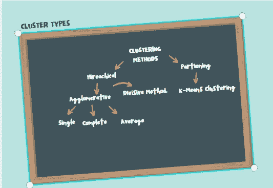

# 使用聚类分析进行客户细分

> 原文：<https://medium.com/analytics-vidhya/customer-segmentation-using-cluster-analysis-ed1f3a7c5920?source=collection_archive---------13----------------------->

# 什么是聚类分析？

它是同一集群中彼此相似但与其他集群中的对象不同/不相似的数据对象的集合。将对象分组为相似对象类的过程称为*聚类*。


图像显示了基于不同州的美国逮捕百分比的聚类

# 聚类分析的类型



聚类方法

**层次聚类分析**是一种无监督聚类算法，它涉及创建从**到**具有主导排序的聚类。例如:我们硬盘上的所有文件夹和文件

*凝聚层次聚类*是最常见的层次聚类类型，用于根据相似性将对象分组。这是一种“自下而上”的方法: ***每个观察从它自己的集群开始，随着一个集群在层次结构中向上移动，集群对被合并。***

*   ***单连锁:*** 两个聚类之间的距离定义为每个聚类中两点之间的*最短*距离。
*   ***完全联动*** :两个聚类之间的距离定义为每个聚类中两点之间的最大距离。
*   ***平均连锁:*** 两个聚类之间的距离定义为一个聚类中每一点到另一个聚类中每一点的平均距离。

*分裂式层次聚类*是一种“自上而下”的聚类方法: ***将所有的观察值分配到一个聚类中，然后将该聚类划分为两个最不相似的聚类*** 。最后，我们递归地处理每个聚类，直到每个观察值都有一个聚类。所以这与凝聚法正好相反


分裂与凝聚

K-means 是一种基于质心的算法，或基于距离的算法，其中我们计算距离以将一个点分配给一个聚类。在 K-Means 中，每个聚类都与一个质心相关联。K-Means 算法的主要目标是最小化点和它们各自的聚类质心之间的距离总和。

# 我们如何真正表现这些集群？

对于层次聚类，我们使用 ***树状结构。*** 它用来表示对象之间的层次关系。y 轴是聚类之间的距离，X 轴是聚类对象/组的顺序。


对于 K 均值聚类，我们用一个图来表示所有数据点，这些数据点被分组并具有唯一的标识。


k 均值

# ***客户细分使用 R***

1.  我们需要加载数据集

```
#read the data
cluster=read.csv(“Mall_customers.csv”)#to see what the data is really about
head(cluster)
```


数据集(客户)

*   客户 Id:每个客户的唯一编号
*   性别:客户性别为男/女
*   年龄:商场顾客的年龄
*   年收入 K-客户的年收入
*   消费评分(1-100):由商场根据顾客行为和消费性质进行评分。

2.检查数据

*   检查缺失数据`**colSums**(**is.na**(cluster))`


列和代码的输出

由此我们可以得出结论，没有丢失数据。

*   分析数据集的摘要

```
summary(cluster)
```


摘要的输出

3.数据可视化

*   性别数据可视化

```
 gen=table(cluster$Gender)
 barplot(gen,main="gender data barplot",xlab="No of people",ylab="their gender",col=rainbow(2))
```


性别数据图

***结论:女性顾客来商场的次数比男性顾客多。***

*   年龄数据可视化

```
boxplot(cluster$Age,col=”#ff0066",main=”Boxplot for age of customers coming to mall”)
```


***结论:客户的平均年龄为 30-35 岁，最小年龄-18 岁，最大年龄-70 岁。***

*   客户年收入

```
hist(cluster$Annual.Income..k..,col="#660033",main="Histogram for annual income",xlab="Annual Income Class",ylab="frequency",labels=TRUE)
```


***结论:最低收入为 15k，最高收入为 137k，我们可以看到平均收入范围为 60k。我们也分析了收入服从正态分布。***

*   顾客消费得分

```
summary(cluster$Spending.Score..1.100.)
Min. 1st Qu. Median Mean 3rd Qu. Max.
## 1.00 34.75 50.00 50.20 73.00 99.00boxplot(cluster$Spending.Score..1.100.,horizontal=**TRUE**,col=”#990000",main=”BoxPlot for Descriptive Analysis of Spending Score”)
```


支出分数的方框图

***结论:最低消费得分为 1，最高为 99，平均为 50.20。我们可以看到描述性分析的支出分数是，最低为 1，最高为 99 和平均。从方框图中，我们可以看出平均消费分数在 40-50 之间。***

## k-均值算法

1.  寻找最佳聚类数(使用肘方法)

```
set.seed(123)
k.maximum <- 15
d <- as.matrix(scale(cluster[,(3:5)]))w<sapply(1:k.maximum,function(k){kmeans(d,k,nstart=100,iter.max=100)$tot.withinss}) 

plot(1:k.maximum, w,
 type="b", pch = 19, frame = FALSE, 
 xlab="Number of clusters",
 ylab="Sum of squares")
```


肘法图

***结论:最佳聚类数为 4。我们也可以上到 6 楼。***

2.让我们将最佳集群设为 4，然后是 5 和 6。


最佳聚类数为 4


最佳聚类数为 5


最佳聚类数为 6

## 观察:

聚类 1 —该聚类表示年收入高且年支出高的 customer_data。

第 2 类—该类表示高年收入和低年支出。

聚类 3 —该聚类表示年收入低且年收入支出低的 customer_data。

聚类 6 和聚类 4 —这些聚类表示具有中等收入工资以及中等年薪支出的 customer_data。

类别 5 —该类别代表低年收入但高年支出。

## 结论:

在这个数据科学项目中，我们经历了客户细分模型。具体来说，我们使用了一种叫做 K-means 聚类的聚类算法。我们对数据进行了分析和可视化，然后开始实现我们的算法。

希望你喜欢这个项目！