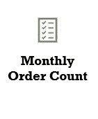

# 使用 Python 中的 RFM 分析进行客户细分

> 原文：<https://medium.com/analytics-vidhya/customer-segmentation-using-rfm-analysis-in-python-a4ec61512d77?source=collection_archive---------19----------------------->


**顶点工程，大会，伦敦，2020 年 2 月**

**数据集:**【http://archive.ics.uci.edu/ml/datasets/online+retail】T4

# 介绍

在零售和电子商务(B2C)中，更广泛地说，在 B2B 中，塑造企业商业战略的关键要素之一是对客户行为的理解。更具体地说，根据不同的业务指标了解他们的客户:他们花了多少钱(收入)，他们花了多长时间(频率)，他们是新客户还是现有客户，他们最喜欢的产品是什么，等等。这种了解反过来将有助于直接营销、销售、客户管理和产品团队更好地支持这个客户，并改进产品供应。

该项目的**目标**是:

> *根据客户的整体购买行为确定客户群*

**利益相关方**

通常情况下，公司中受益于此类分析和见解的利益相关者群体包括:

1.  产品/服务:比其他产品卖得多的产品，将是评估产品提供或改进特定产品功能的机会。
2.  运营/物流:从库存管理的角度来看，了解哪些产品有需求将降低存储成本并改善交付/物流运营。
3.  营销:对客户细分的了解，将允许对特定客户群进行更有效和更有针对性的营销，方法是为更广泛的客户群创建以核心内容为基础的营销活动，但具体变化取决于细分市场。
4.  销售/客户管理:确定哪些客户最有价值，了解他们的趋势，将有助于建立真正的关系，从而留住现有客户，并以理想的客户档案吸引新客户。

**数据集**

在线零售数据集[http://archive.ics.uci.edu/ml/datasets/online+retail](http://archive.ics.uci.edu/ml/datasets/online+retail)

所使用的数据集是一个相当受欢迎的数据集，它包含了一家总部位于英国的注册无店铺在线零售电子商务企业在 2010 年 1 月 12 日至 2011 年 9 月 12 日之间发生的所有交易。该公司主要销售独特的适合各种场合的礼品。这家公司的许多客户都是批发商。


**结果**

该项目的成果将是:

> *创建一个无监督模型，为客户群生成最佳数量的细分市场。*

**成功标准**

为了确保我们了解项目的影响和成功，我们为我们的分析设定了一些可衡量的标准:

> 生成的细分可以被解释并转换成业务活动。

# 探索性数据分析— EDA

# 加载数据

让我们从导入从上面的链接下载并存储在本地脱机目录中的密钥库和数据集开始。

```
# Import key Libraries import pandas as pd import numpy as np import seaborn as sns import matplotlib.pyplot as plt from datetime import datetime 
# Load data from Local Repository retail = pd.read_excel('../offline-datasets/Online Retail.xlsx')
```

# 数据概述

一旦我们将数据集加载到“ ***零售*** ”数据框中，我们就可以开始查看数据了:


在对我们的数据集进行快速检查和扫描后，发现了一些问题:

**发票号**


*   大多数发票显示为数量和价格为正的正常交易，但也有一些以*【C】*或*【A】*为前缀，表示不同的交易类型。
*   *发票号*需要分解为*号*和*码* ( **新特性**)。
*   代码需要在适当的地方重新命名(**数据处理**)。

**客户 ID**


*   大约 135k 记录中的*空*或*空*值。
*   因此，我们需要识别活跃人群并删除空记录(**数据处理**)。

**描述**

*   大约 1.5k 记录中的*空*或*空*值。
*   同样，我们需要识别活动人口并删除空记录(**数据处理**)。

**数量**


*   大约 10k 记录中的负值。
*   这里，我们还需要根据特定的规则(**数据处理**)来识别活动人口和丢弃记录。

**单价**

*   负值表示约 2 条记录。
*   如上所述，根据特定规则识别活动人口并丢弃空记录(**数据处理**)。

**日期**

*   需要从 *InvoiceDate* 中提取*日期*作为一个新特性，还需要将*月*和*年*作为单独的新特性(新特性)。

# 特征工程

在继续进行更多的 EDA 和处理之前，让我们总结一下在上面的初始数据审查中发现的一些新功能，这些功能在现有数据集的基础上非常简单:

1)分解 ***发票号*** 到

*   *发票号* —新功能
*   *发票代码* —新功能

C —取消

A —调整

空—重命名为“N”—正常

2)分解**发票日期**至

*   发票年月-新功能
*   发票年份—新功能
*   发票月—新功能
*   日期—用作索引


其余的数据分析和预处理将包括:

*   基于特征规则定义活动群体
*   创建掩码以过滤掉对活跃人口没有贡献的坏数据(空值、负价格等)
*   将我们的一些数据可视化，以更好地了解人口

# 职业人口

现在，新功能已经就位，并且基于初始数据审查总结，我们需要为我们的建模阶段获得活跃人群:

1.  已经使用数据集中的特征定义了基于树的规则集。
2.  每个功能都有一个或多个定义其活动群体的规则。
3.  规则由不同的掩码表示。


# 用于数据处理的掩码

创建各种掩码以实现每个特征的规则，从而缩小活动群体的范围:

```
# Valid Price
valid_price = retail.UnitPrice >= 0

# Valid Description
valid_desc = retail.Description.notnull()

# Valid CID
valid_CID = retail.CustomerID.notnull()

# Invoice type-N (Normal)
inv_N = retail.InvoiceCode == "N"

# Invoice type-C (Cancellation)
inv_C = retail.InvoiceCode == "C"

# Invoice type-N (Amendment)
inv_A = retail.InvoiceCode == "A"

# Quantity Negative
q_neg = retail.Quantity < 0 

# Quantity Positive
q_pos = retail.Quantity >= 0
```

最后，我们将掩码应用于原始数据集，沿着树向下导航，以到达活动群体的末端节点。

创建一个新的数据帧，单独保存为“ ***retail_pp*** ”。

```
# Path1 - Filter population down to include all 
# valid Customer IDs with Valid Price and Description
p1 = valid_price & valid_desc & valid_CID

# Path2 - Filter population down to include all 
# Normal (type-N) transactions with Positive Quantities
p2 = inv_N & q_pos

# Path3 - Filter population down to include all 
# Cancel (type-C) or Adjust (type-A) transactions 
# with Negative Quanitities
p3 = (inv_A | inv_C) & q_neg

# Path to Leafs: Combine Paths 1, 2 and 3:
# *************** CREATE A COPY ************
retail_pp = retail.loc[p1 & (p2 | p3)].copy()

# Inspect new pre-processed and clean dataset

retail_pp.head()
```

# 订单(发票)数量可视化

下面有一个单独的部分涉及关键绩效指标，我们通过这些指标来获取、分析和可视化大部分数据。在这一部分，我们将展示两个关于每个国家的订单数量和每个发票的订单数量的图像:


正如我们所看到的，大多数订单来自英国，虽然我们可以只保留英国的数据，但我们已经决定将所有活跃数据保留在活跃人口中，而不删除其他国家的数据。


在底部的图表中，有一小部分数据在 50–100 之间，我们希望进一步探索。因此，我们创建了顶部图表，放大了前 100 个最大订单，以便更好地可视化。

**订单汇总**

顶部图表—有少量发票(少于 200 张)包含在一张发票中订购的大量产品。例如

1.  一张发票有 1100 种产品
2.  另一张发票有 800 件产品
3.  四张发票有 700 个产品
4.  总共有多达 200 张发票，每张发票包含 100 多种产品

下图:—大多数发票(24000 以上)每张最多有 100 张，只有一小部分例外(<200) that have more than 100 products each.

# Key Performance Indicators

# Transaction KPIs

This involves analysis around customer transaction data grouped by month. i.e. Revenue, Revenue growth, Order numbers, revenue per order, etc…

**月收入**

按月计算收入的公式如下所示:


*   通过将单价乘以数量来计算每行的订单价值
*   使用数据框索引的相应元素按年份和月份分组
*   按年份和月份分组的订单值总和

**月收入增长** —月收入变化百分比对比。

**月度订单计数** —按分组计数发票。

**平均每单收入** —平均月收入以上。

# 客户 KPI

这包括对活跃客户数量的分析，以及从收入角度区分新老客户:

**活动客户** —每组客户 id 的唯一计数。

**新客户与老客户的收入** —定义新的特征以区分新客户或现有客户的收入。

# KPI 数据框架

为了捕获关键的**月度 KPI**，使用了主***retail _ PP***data frame。新数据帧是通过以下方式生成的多索引数据帧:

1.  根据月份和年份对 retail_pp 进行分组，并根据这些分组创建一个指数
2.  将索引级别重命名为年和月
3.  在新的数据帧上生成和附加每个新的 KPI
4.  根据需要使用线条或图形条绘制 KPI

```
# 1\. Revenue - Generate Monthly KPIs DataFrame by aggregating Revenue
m_kpis = pd.DataFrame(retail_pp.groupby([retail_pp.index.year,retail_pp.index.month])['Revenue'].sum())

# 2\. Generate Monthly Growth rate based on previous months revenue
m_kpis['MonthlyGrowth'] = m_kpis['Revenue'].pct_change()

# 3\. Generate Active Customers
m_kpis['ActiveCustomers'] = pd.DataFrame(retail_pp.groupby([retail_pp.index.year,retail_pp.index.month])['CustomerID'].nunique())

# 4\. Generate Monthly Order Count (Quantity)
m_kpis['MonthlyOrderCount'] = pd.DataFrame(retail_pp.groupby([retail_pp.index.year,retail_pp.index.month])['Quantity'].sum())

# 5\. Gengerate Monthly Order Average
m_kpis['MonthlyOrderAverage'] =  pd.DataFrame(retail_pp.groupby([retail_pp.index.year,retail_pp.index.month])['Revenue'].mean())

# Rename index to capture Year and Month
m_kpis.index.set_names(['Year', 'Month'], inplace = True)

m_kpis
```

为月度 KPI 生成的新的多指标数据框架如下所示:


对于**客户 KPI**数据框架，为了区分现有客户和新客户:

*   创建了一个新的 dataframe，它捕获了按 *CustomerID* 分组的每个客户的首次购买日期
*   基于 *CustomerID* 将新功能(**首次购买日期**)合并到现有的 *retail_pp* 数据框架中
*   基于当月发票日期在*首次购买日期*之前或之后，在 *retail_pp* dataframe 中创建了一个新特性(**用户类型)**
*   创建了按*年*、*月*和*用户类型*分组的客户 KPI 数据框架，并增加了每月的*收入*

```
# Generate new dataframe based on CustomerID and its first purchase date
customer_fist_purchase = retail_pp.groupby('CustomerID').InvoiceDate.min().reset_index()
customer_fist_purchase.columns = ['CustomerID','FirstPurchaseDate']
customer_fist_purchase['FirstPurchaseYearMonth'] = customer_fist_purchase['FirstPurchaseDate'].map(lambda date: 100*date.year + date.month)

# Add first purchase date column to the new Customer Dataframe by merging with the original retail_pp
retail_ppp = pd.merge(retail_pp, customer_fist_purchase, on='CustomerID')
retail_ppp['Date'] = pd.to_datetime(retail_ppp.InvoiceDate.dt.date)
retail_ppp.set_index('Date', inplace=True)
retail_ppp.head()

# Create new column "User Type" and default it to "New" as its values. Assign "Existing" value if 
# User's "FirstPurchaseYearMonth" was before the selected "InvoiceYearMonth"
retail_ppp['UserType'] = 'New'

retail_ppp.loc[retail_ppp['YearMonth']>retail_ppp['FirstPurchaseYearMonth'],'UserType'] = 'Existing'

# Calculate the Revenue per month for each user type
customer_kpis = pd.DataFrame(retail_ppp.groupby([retail_ppp.index.year,retail_ppp.index.month, retail_ppp.UserType])['Revenue'].sum())
customer_kpis.index.set_names(['Year', 'Month', 'UserType'], inplace = True)

customer_kpis
```

我们的新数据框架如下所示:


# 可视化

在多索引数据框架中构建我们的数据，使得以各种形式开始绘图非常有用，如线图或条形图，如下所示。


如下图所示，4 月份收入增长大幅下降，这与同年 6 月或 7 月的典型变化不同。此外，值得注意的是，图表末尾的突然下降是由于缺少 Dec 中的数据，而不是实际的业务指标。

```
# Line Graph to capture the monthly revenue
m_kpis.plot.line(y='Revenue', title='Revenue per month',color = 'r',
         marker='h', 
         markersize=10, linewidth=2,

         markerfacecolor='white');
```


在回顾增长率柱状图时，它确认了 4 月份的负增长是负增长的最大峰值。

```
# Horizontal Bar Graph to capture monthly revenue growth
m_kpis.plot.barh(y='MonthlyGrowth',title='Monthly Growth', rot=0);
```



同样，月度订单数量图显示了一幅一致的商品销售图:在 4 月份，订单数量显著下降，而图表的其余部分显示了业务的有机增长。

```
# Horizontal Bar graph to capture number of quantities ordered per month
m_kpis.plot.line(y='MonthlyOrderCount',title='Quantities ordered per Month',color = 'b',
         marker='h', 
         markersize=10, linewidth=2,
         markerfacecolor='white');
```


最后，选择了月度订单图来探究订单的平均值及其在研究窗口期间的变化。a)订单之间似乎有小的差异 b)平均订单略有增加 c)与相邻月份的平均值相比，4 月份的订单价值显著下降。

```
# Horizontal Bar graph to capture number of quantities ordered per month

m_kpis.plot.barh(y='MonthlyOrderAverage',title='Monthly Order Average value');
```


在客户 KPI 上，有趣的是证实了这是相同的情况，即客户群的有机增长与 4 月份的类似下降。

```
# Line graph to capture the active customers per month
m_kpis.plot.line(y='ActiveCustomers', title='Active customers per month',color = 'g',
         marker='h', 
         markersize=10, linewidth=2,
         markerfacecolor='white');
```


在下图中，我们可以清楚地看到现有客户群的健康增长。关于新客户，在最初的客户获得后自然减少，我们可以看到收入稳定到一个健康稳定的数额(即大约 100000 美元)。

```
# Plot new vs existing customers

customer_kpis.unstack().plot.bar(y='Revenue', title='New vs Existing Customer Monthly Revenue', rot=0);
```


# 使用 RFM 分析建模

为了进行客户细分，使用了 RFM 建模技术。RFM 代表近期—频率—货币价值，其定义如下:

1.  **最近度** —给定当前或过去的特定日期，最近度捕获客户最后一次进行交易的时间。
2.  **频率** —给定一个特定的时间窗口，频率捕获客户在该窗口内的交易数量。
3.  **货币价值**或**收入** —给定一个特定的窗口，收入捕捉客户花费的金额。

基于上述价值，我们可以构建不同的细分市场，将客户分为:

**低值段**

*   R —不太活跃
*   F —不太频繁
*   M —低支出

**中值段**

*   R —中等或不一致的活动
*   F —在特定时间不频繁或频繁
*   M —支出各不相同，但总体处于中等水平

**高值段**

*   R —非常活跃
*   F —非常频繁
*   M —出色的支出概况

**建模方法**

今后，获取客户群的方法将是:

*   单独计算 RFM 分数，并绘制成图，以了解他们的 RFM 值和范围
*   使用 K-Means 聚类无监督学习算法来创建以上这 3 个聚类
*   使用基于轮廓和惯性分数的技术来优化聚类的数量

# 崭新

为了计算新近度，我们首先创建一个新的数据框，通过按 *CustomerID 分组来保存每个客户的所有 RFM 分数。*

然后，我们根据按 *CustomerID* 分组的最大发票日期创建另一个数据框架，并将一个观察点(这里是数据集中的最后一个发票日)固定为沙点中的一条线。

最后，我们通过从**最后购买日期:**中减去该客户的 L **最后发票日**(沙点中的线)来生成最近天数


按照下面的代码，我们合并 *CustomerID* 上的两个数据帧，以在我们的新客户数据帧中创建最近特征。

```
# Generate new dataframe based on unique CustomerID to keep track of RFM scores
customer = pd.DataFrame(retail_pp['CustomerID'].unique())
customer.columns = ['CustomerID']

# Generate new data frame based on latest Invoice date from retail_ppp dataframe per Customer (groupby = CustomerID)
recency = retail_ppp.groupby('CustomerID').InvoiceDate.max().reset_index()
recency.columns = ['CustomerID','LastPurchaseDate']

# Set observation point as the last invoice date in the dataset
LastInvoiceDate = recency['LastPurchaseDate'].max()

# Generate Recency in days by subtracting the Last Purchase date for each customer from the Last Invoice Date
recency['Recency'] = (LastInvoiceDate - recency['LastPurchaseDate']).dt.days

# Consolidate to customer DataFrame
customer = pd.merge(customer, recency[['CustomerID','Recency']], on='CustomerID')

customer.head()
```

# 频率

频率指标反映了每个客户的订单数量，因此对每个客户 ID 分组的发票进行简单计数即可:

```
# Count number of invoices per CustomerID and store in new frequency Dataframe
frequency=retail_ppp.groupby('CustomerID').InvoiceDate.count().reset_index()
frequency.columns = ['CustomerID','Frequency']

# Consolidate Frequency to existing Customer DataFrame

customer = pd.merge(customer, frequency, on='CustomerID')
```

# 货币价值(收入)

对于收入，分组依据是 *CustomerID* ，聚合函数是 *Sum。*

```
# Revenue per transaction has already been calculated as per KPIs section
# Grouping revenue per Customer ID
revenue = retail_ppp.groupby('CustomerID').Revenue.sum().reset_index()

# Consolidate Revenue to existing Customer DataFrame
customer = pd.merge(customer, revenue, on='CustomerID')

customer.head()
```

数据帧现在看起来如下:


如果我们绘制每个 R、F 和 M 值的直方图，我们得到如下结果:


请注意，收入中有一些负值，但这可以通过一些产品的退货或取消来解释，并且只要它符合由所创建的掩码设置的其余标准，就被有意保留在活跃人群中。

如果我们创建一个对的散点图，我们可以可视化 R、F、M 变量之间的关系，并查看是否有任何明显的分段:


高价值段和低价值段之间显然有一些区别，但直观检查此类散点图的困难在于找到理想的边界并识别中间段。

# k 均值聚类

为此，我们将使用 K-Means 聚类的强大功能，这是一种无监督的学习方法，可以帮助我们识别特定数量的聚类，即使没有标签。

接下来的步骤是:

1.  (任意)设置集群的数量:这里我们的目标是 K=3
2.  使用*标准定标器*方法标准化数据的 R、F、M 值
3.  训练模型并检查结果(中心体和分配的集群)
4.  可视化结果
5.  计算评估指标(惯性和轮廓得分)
6.  基于一系列 Ks 的多次运行优化 K，并使用肘图进行评估
7.  审查最终客户群

下面是实现步骤 1–3 的代码:

```
# Number of clusters (Configurable) - Initially we're attempting based on the 3 Segments (Low, Mid, High)
k=3

# Scaling input using StandardScaler
from sklearn.preprocessing import StandardScaler
scaler = StandardScaler()
Xstd = pd.DataFrame(scaler.fit_transform(X), columns=X.columns)

# Run and train main K-means algorithm based on all input features
from sklearn.cluster import KMeans
model = KMeans(n_clusters=k, random_state=0)
model.fit(Xstd)

# Review output cluster labels
cluster_labels = model.labels_
print("Assigned cluster labels: \n", cluster_labels)

# Review Centroids of clusters
centroids = model.cluster_centers_
print("Location of centroids: ")
print(centroids)

# Append clusters to input features table
Xstd['clusters'] = cluster_labels

Xstd.head()
```

现在，我们可以看到结果，并初步了解细分市场:


我们现在可以清楚地看到:

*   **黄色** —高价值段
*   **绿色** —中值段
*   **紫色** —低值段

为了评估 K-Means 聚类算法的性能，我们使用以下指标:

*   **惯性值** —绝对值。经验法则是:数字越小越合适。
*   **轮廓分数** —范围在-1 和 1 之间。通常，高分表示总体与聚类匹配良好


到第 6 步，我们将通过对一系列 Ks 运行 k-means 来优化结果:

```
inertias = []
ss = []

for k in range(2,11):

    kmeans = KMeans(n_clusters=k, init='k-means++', max_iter=300, n_init=10, random_state=42)
    kmeans.fit(Xstd)
    inertias.append(kmeans.inertia_)

    ss.append(metrics.silhouette_score(Xstd, kmeans.labels_, metric='euclidean'))
```

肘形图显示我们差不多有 3 个集群，尽管您也可以选择 4 个或 5 个(作为延伸)。


绘制一系列 Ks 的轮廓分数也证实，虽然超过 5，我们得到更精确的匹配，但这意味着它可能过度拟合，因此不是最佳的:


最后到第 7 步，新的*客户*数据框架和分配的细分和标签如下所示:


如果我们绘制 3 个不同的部分，我们会得到以下条形图:


# 商业行为

一旦我们对上述细分市场有了清晰的认识，就可以/应该跨业务部门(运营、营销、产品等)计划具体的行动，以解决任何潜在的问题；

1.  高价值:这类客户数量很少，企业的首要任务是**提高这些客户的忠诚度**，因为他们是最有价值的资产。
2.  中等价值:这些客户中有很大一部分应该被视为潜在的高价值客户，并采取正确的行动:旨在**提高保留率和频率**，让他们更接近品牌和产品，从而最终成为高价值客户。
3.  低价值:绝大多数都属于这一类别，针对这一群体的第一步是瞄准**增加频率**，并了解产品或服务是否存在任何潜在问题。

# 摘要

为了总结我们到目前为止在这个项目中的经历，我们遵循了以下步骤:

1.  数据检查和理解-浏览数据集以理解要素和缺失值。
2.  特征工程和处理—创造新的特征来帮助我们发现更好的见解。
3.  KPI 和可视化—创建了一组广泛的 KPI，以获得更好的数据业务视图。
4.  RFM 分析和新功能-使用 RFM 分析对数据进行建模。
5.  无监督学习 K-Means 聚类-使用无监督学习来告诉我们各种数据聚类。
6.  优化和评估—对一系列 K 值运行 K 均值聚类，以优化算法。
7.  业务行动和细分映射—将机器学习的结果转化为业务行动

# 后续步骤

下一步，这里所做的工作可以用来预测客户的终身价值(CLTV)。

这可以使用这里创建的 RFM 特征作为监督机器学习模型的输入来完成，输出是客户一生中花费的总金额(收入)。

我希望这篇文章对你有用，完成这个项目的确是一种享受。

# 开源代码库

这个项目的完整 Jupyter 笔记本可以在[这里](https://github.com/etzimopoulos/Customer-Segmentation-GA-Capstone)找到

# 参考

[](https://towardsdatascience.com/data-driven-growth-with-python-part-1-know-your-metrics-812781e66a5b) [## 了解你的衡量标准

### 了解使用 Python 追踪什么以及如何追踪

towardsdatascience.com](https://towardsdatascience.com/data-driven-growth-with-python-part-1-know-your-metrics-812781e66a5b) [](https://towardsdatascience.com/data-driven-growth-with-python-part-2-customer-segmentation-5c019d150444) [## 客户细分

### RFM 聚类分割

towardsdatascience.com](https://towardsdatascience.com/data-driven-growth-with-python-part-2-customer-segmentation-5c019d150444) [](https://www.datacamp.com/community/tutorials/introduction-customer-segmentation-python) [## Python 中的客户细分简介

### 在零售领域，各种连锁超市会产生异常大量的数据。这个数据是…

www.datacamp.com](https://www.datacamp.com/community/tutorials/introduction-customer-segmentation-python) 

# 关于安吉洛

我是一名自由职业的首席管理顾问和应用数据科学家，在代表金融服务和政府中的供应商和全球银行实施数据转换和交付技术变革方面拥有丰富的经验。

来自机器人工程的坚实学术背景，像数学、统计学和编程(幸运的是)这样的技能对我来说是多余的，再加上工程师真正好奇、分析和好奇的思维。

这种技术技能和行业经验的独特结合帮助我与技术和数据领域的各种业务和技术团队合作，帮助他们弥合差距，并将关键项目带入生产线，从而为他们的组织带来巨大的增值。

我未来的兴趣是探索如何利用数据为销售和数字营销团队提供更好的见解，以帮助他们保留现有的客户群，并进一步拓展新的客户群。

请随时给我写信，地址是:

领英—[https://www.linkedin.com/in/etzimopoulos/](https://www.linkedin.com/in/etzimopoulos/)

GitHub—【https://github.com/etzimopoulos 

中等—【https://medium.com/@etzimopoulos 

[#客户细分](https://www.linkedin.com/feed/hashtag/?keywords=customersegmentation&highlightedUpdateUrns=urn%3Ali%3Aactivity%3A6649555586293866496)[#资源分析](https://www.linkedin.com/feed/hashtag/?keywords=rfmanalysis&highlightedUpdateUrns=urn%3Ali%3Aactivity%3A6649555586293866496)[#数据科学](https://www.linkedin.com/feed/hashtag/?keywords=datascience&highlightedUpdateUrns=urn%3Ali%3Aactivity%3A6649555586293866496)[#客户保持](https://www.linkedin.com/feed/hashtag/?keywords=customerretention&highlightedUpdateUrns=urn%3Ali%3Aactivity%3A6649555586293866496)[#数字营销](https://www.linkedin.com/feed/hashtag/?keywords=digitalmarketing&highlightedUpdateUrns=urn%3Ali%3Aactivity%3A6649555586293866496)[#顶点](https://www.linkedin.com/feed/hashtag/?keywords=capstone&highlightedUpdateUrns=urn%3Ali%3Aactivity%3A6649555586293866496)[#机器学习](https://www.linkedin.com/feed/hashtag/?keywords=machinelearning&highlightedUpdateUrns=urn%3Ali%3Aactivity%3A6649555586293866496)[#管理咨询](https://www.linkedin.com/feed/hashtag/?keywords=managementconsulting&highlightedUpdateUrns=urn%3Ali%3Aactivity%3A6649555586293866496)[#商业咨询](https://www.linkedin.com/feed/hashtag/?keywords=businessconsulting&highlightedUpdateUrns=urn%3Ali%3Aactivity%3A6649555586293866496)

*最初发表于*[*https://www.linkedin.com*](https://www.linkedin.com/pulse/customer-segmentation-using-rfm-analysis-python-evangelos-tzimopoulos/)*。*