# 利用 RFM 分析和 k 均值聚类进行客户细分

> 原文：<https://medium.com/analytics-vidhya/customer-segmentation-with-rfm-analysis-kmeans-clustering-32c387d04dfe?source=collection_archive---------3----------------------->

spotonwifi.com

大家好！我想分享一下客户细分。我将尝试比较 RFM 分析和 Kmeans 聚类来为每个客户建立一个细分。在我们开始分析之前，让我们看看为什么我们需要建立一个客户细分。

客户细分对决策非常重要，需要采取什么行动来增加收入，与客户建立良好的关系等等。我们可以通过客户细分来优化销售。依我拙见，客户细分为什么重要？

*   **制定好的战略**

客户细分将为我们针对每个客户的细分采取行动提供参考，如产品差异化，为每个客户制定重点活动以及我们的另一项战略。

*   **优化资源**

客户细分使得公司将重点放在优先规模上。这种细分使我们能够接触到购买量大的*【明星】*客户，直到购买量小的*客户。这些公司可以将他们的精力、成本和注意力集中在特定的细分市场上。*

*   ***关键因素***

*这些公司必须能够以不同于竞争对手的视角和方式进行细分。*

*该在线零售数据集包含 2009 年 1 月 12 日至 2011 年 9 月 12 日期间，一家总部位于英国的注册无店铺在线零售商发生的所有交易。该公司主要销售独特的各种场合的礼品。这家公司的许多客户都是批发商。有太多不完整的数据，像错误的值，他们称之为“*手动”*的交易，以及更多的数据缺失。我已经清理了这个数据集，并删除了所有取消的事务。*

# ***探索性数据分析***

*在我们开始分析之前，让我们尝试探索一下这个数据集。我发现这个数据集中有很多异常值，尤其是每次交易的总购买量。*

****注明:*** *在本次探索性数据分析中，我做了计算每笔交易的 RFM 得分。RFM 分析将在下一节解释。**

*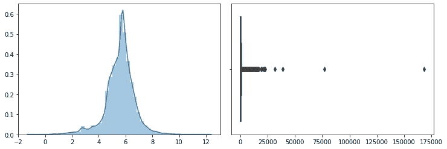*

*按每笔交易的总购买量计算(按发票数量分组)*

*从每个发票号的交易中，我们得出了 1 个项目的交易，数量非常大。顾客 id 为 16446 的顾客在这次零售中花费最高，然后他们购买了 3 次。*

*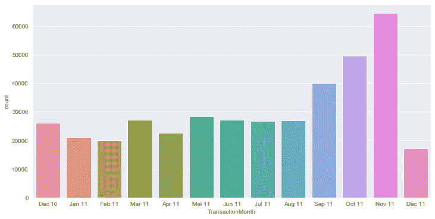*

*用于解释每月总交易(分组发票号)的计数图*

*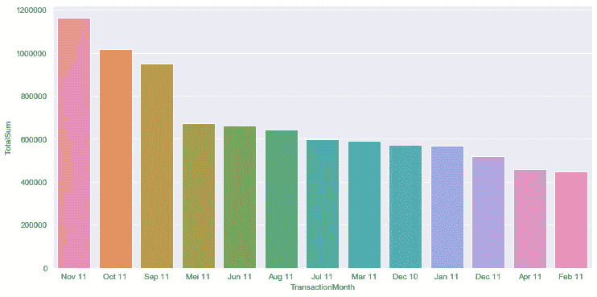*

*Countplot 解释每月总采购客户(分组发票号)*

*从上面的两个图表中，我们得出最高交易频率**(按频率)**是 11 月，看看年底的模式，我们的零售销售额从 9 月到 11 月一直在增长。在年末，甚至每个月(9 月-11 月)每笔交易的总发票或总采购*增加*显著**(大约 25%)** 。*

*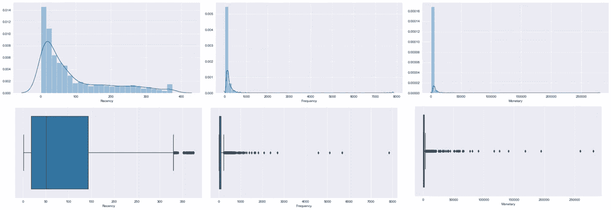*

*检查分布和异常值的新近性、频率和货币*

*在这个交易中，每个客户都有很多异常值(*最近，频率&货币*)。我对每个异常值都进行了探究，因为这些数据对于零售交易是有意义的，所以会用在这个建模中。除此之外，我们尝试使用健壮的缩放器来缩放这个数据集，因为有很多离群点。在我们开始建模之前，我们尝试使用 RFM 分析对我们的零售进行细分。让我们看看它是如何工作的。*

# *什么是 RFM 分析？*

> *[RFM](https://clevertap.com/rfm/) 代表新近性、频率和货币价值，每一个都对应一些关键的客户特征。这些 RFM 指标是客户行为的重要指标，因为频率和货币价值会影响客户的终身价值，而新近性会影响忠诚度。*

**

*clevertap.com*

*   *最近:他们最后一次购买是什么时候？*
*   *频率:他们购买的频率和持续时间？*
*   *货币价值/销售额:他们购买了多少*

*计算完 RFM 值后，我们将这些值分组到每一组。我假设使用 RFM 值将这些客户从 1 到 4 进行排名。在我们用这个等级评分之前，我们必须对最近值进行排序，然后给出分数。**在这种情况下，25%的数据将被评为等级 1，超过 25%的数据将被评为等级 2，依此类推**。我将尝试用熊猫来给我们的数据集排名。*

*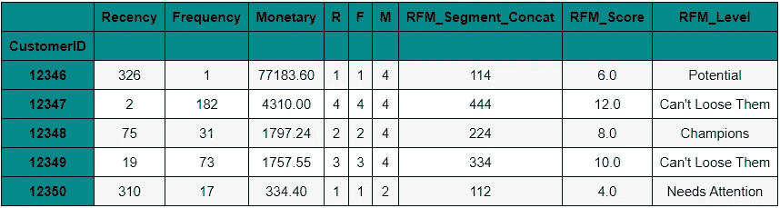*

*我们用 RFM 分析建立客户细分的数据框架的结果*

*我有一些资源来做客户细分。在这种情况下，分割将被分割成七组。每组的特征，由上述结果数据框中的 *RFM 得分*进行评分。计算 RFM 得分非常简单，我们只需对 RFM 的每个指标排名求和。最高分是 12 分，最低分是 3 分。根据这个分数，我们可以通过 RFM 分析得出每个特征客户的细分。*

*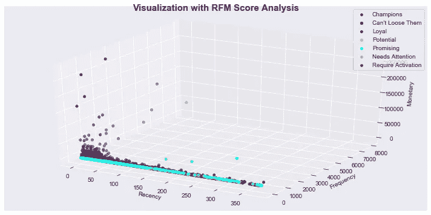*

*分布每个功能 RFM 分析与三维可视化。*

*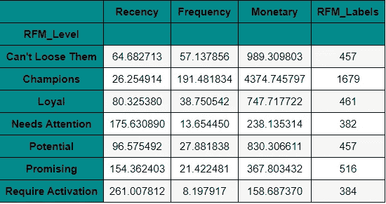*

*七个客户细分结果简历表*

*如上所述，我们有七个细分市场，每个级别都有许多典型客户。在这种情况下，我将尝试解释我们从最高级别到最低级别的客户细分级别。*

*   ***冠军***

*最近购买的类型客户对我们有好处，因为这种类型的客户经常访问我们的在线零售，总购买量最高。所以，我们可以用很多策略来维持，也许是每笔交易的奖励点，然后再给优先级。这是你最好的客户，我们必须保持下去！*

*   ***不能松开他们***

*他们是过去经常拜访和购买的客户，但最近不再拜访。用相关的促销让他们回来，用日常活动让他们回来，为他们的交易获得积分或奖励。*

*   ***忠诚***

*与“*潜在*客户相比，这类客户最近拜访的频率更高，但如果我们与“*潜在*客户相比，他们的购买情况不够好。因此，我们可以对我们的产品进行更多的推广，并制作捆绑产品。*

*   ***潜力***

*与“*忠诚的*客户相比，这类客户最近不常光顾，但如果我们与“*忠诚的”*客户相比，他们的购买行为很好。因此，我们可以接触到潜在客户，为我们的产品、会员和推荐产品提供更多的促销。*

*   ***前途无量***

*与“*需要关注*”的客户相比，类型客户更经常访问我们的在线零售。它被称为 ***有前途的*** ，因为我们希望他们成为我们的忠实或潜在客户。因此，我们可以向他们推荐之前已经购买过产品，并提供会员计划的优惠信息。*

*   ***需要注意的事项***

*与其他水平相比，他们的访问和购买低于平均水平。这类客户需要我们团队的直接接触。也许，我们可以从发送产品目录、日常产品或最近从另一个客户处购买的产品开始，这些产品在我们的零售中有很高的需求，以及更多的产品来接触这些客户。*

*   ***需要激活***

*他们被称为*、*稀有客户，因为他们在 RFM 分析中的每项指标上都得分最低。这种类型的客户可能是新客户，不会再回到我们的网上零售，这将很难达到这种细分。上一次访问大约是在 1 年前，也许我们可以通过介绍了解我们的核心业务，最近尝试联系他们的电子邮件，了解本月的促销活动以及所有高需求的推荐产品。*

# *基于 Kmeans 聚类的客户细分*

*在这种情况下，我们将比较 RFM 分析和 Kmeans 聚类。用 Kmeans 建模的最佳聚类是多少？**第一步，**此数据集最好带有缩放和居中数据，因为我们的数据中有如此多的异常值，所以应在此数据集中使用健壮的缩放器。**在那之后**，我们必须为该数据找到最佳 *n_cluster* ，以建立应该给出多少分段，并显示每个 *n_cluster* 的最佳轮廓分数。最后是我们用 Kmeans 进行分割的可视化。*

*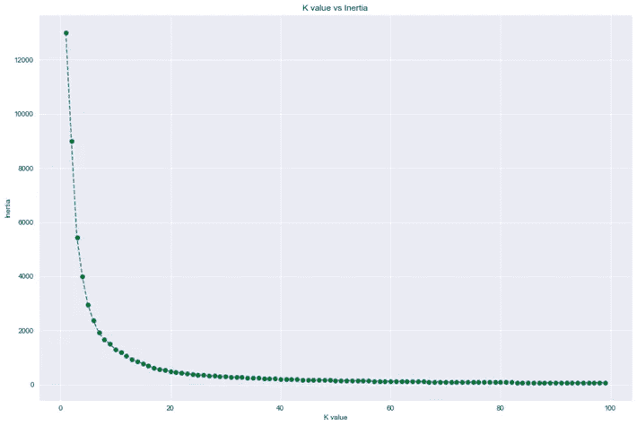*

*显示在我们的模型中应该设置多少“K”的肘方法。*

*基本上是肘法，当形成肘时，在图形看起来之后显示最佳的*【K】*，并且在该值之后惯性得分是恒定的。除此之外，我们还可以用轮廓得分得出最佳的' *K* '，最高的轮廓得分说明每组的分割是好的。(*注:本案例最高侧影得分为 4，平均得分为 0.60* )*

*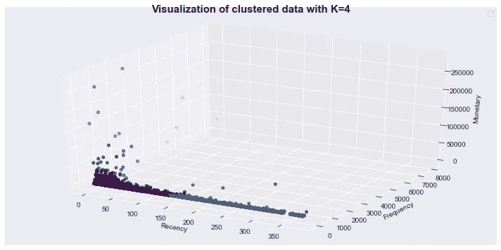*

*使用三维可视化分布每个要素以进行 k 均值聚类(n_cluster 为 4)。*

*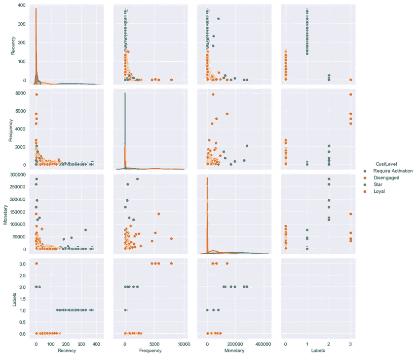*

*显示每个特征(最近、频率和货币)的分布和关联的成对图*

*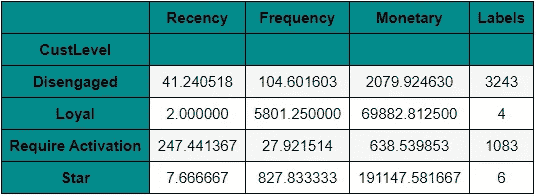*

*四个客户细分结果简历表*

*根据结果，我们对在线零售客户进行了四次细分。几乎 75 %的细分市场被称为**。*我把他们与**潜在价值高的**放在一个级别，因为我们的客户几乎都分布在这个级别。我们将能够接触到他们的客户，为成为一个"**"忠诚的客户，而且他们将成为一个 ***"明星"*** 客户。****

****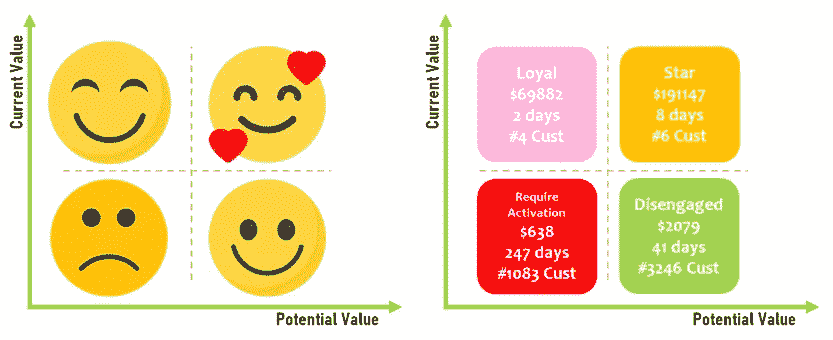****

****我从某个来源获得的指标，并尝试根据我们的情况进行修改和调整。****

*   ******明星******

****他们就像一个高级客户，不是最近最常光顾的，但他们的交易总购买量最高。我们必须用许多行动来留住这个客户。奖励是这个细分市场必须的，免费会员每个月都有很高的收益，我们可以采取更多的行动来保持它！****

*   ******忠诚******

****这类顾客经常光顾我们的网上零售店，但我们只有**四个顾客**。除此之外，我们希望能留住这个客户，把 ***【脱离】*** 客户带到这个水平。不要忘记这个细分市场中的客户。****

*   ******脱离******

****我会尝试将该客户分组为*空闲客户，但他们极具潜力。我们可以接触许多促销活动，分享他们的日常需求，采取更多行动，如直接接触他们的社交媒体、电子邮件等。将这一细分提高到“*下一个级别*是获得更高收入的必要条件，因为我们知道我们的客户在这一细分中占主导地位( **75%的客户处于这一级别**)。*****

*   ******需要激活******

****这是最近发生率最高的细分市场，这意味着该客户的平均最后一次访问是在近 1 年前。与上述解释相同，该客户必须增加到“*下一级”*，因为以前很难达到这一细分。但是，我们可以尝试介绍什么是我们的核心业务，最近尝试联系他们的电子邮件，了解本月的促销活动以及所有高需求的推荐产品。****

******结论******

****两种分析方法对客户细分进行了比较。谁是最棒的？最好的选择是采取一切方法进行客户细分。我们可以根据我们公司的客观目标进行分析。每个交易和客户的特征不会相同。因此，我们必须在我们的业务领域拥有丰富的知识，这样我们才能轻松地理解和设定我们的目标。****

****以上都是我的看法，希望大家能对这个数据集有所感悟。我所做的每一项分析仍然有许多错误和缺点。这个分析一点也不完美，而且我也不擅长营销。建立一个好的营销活动，优化营销过程会给你带来更好的效果。也许这个分析会成为你的参考之一。****

****关于这些数据的更多细节，代码，和更多的可视化你可以通过点击这个链接[https://github.com/Anugrahn](https://medium.com/analytics-vidhya/github.com/Anugrahn/Data-Science-Practice)到达我的 github。随便问，让我们开始讨论家伙！****

****谢谢，我希望你们喜欢它。下一个故事再见。祝您愉快！:)****

****来源:****

*   ****数据来源于[http://archive.ics.uci.edu/ml/datasets/online+retail](http://archive.ics.uci.edu/ml/datasets/online+retail)****
*   ****感谢特里斯坦·甘瑞先生的精彩分享，你们可以到达 towardsdatascience.com/****
*   ****感谢 https://clevertap.com/blog/rfm-analysis/的精彩分享****