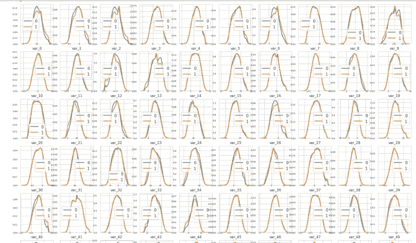
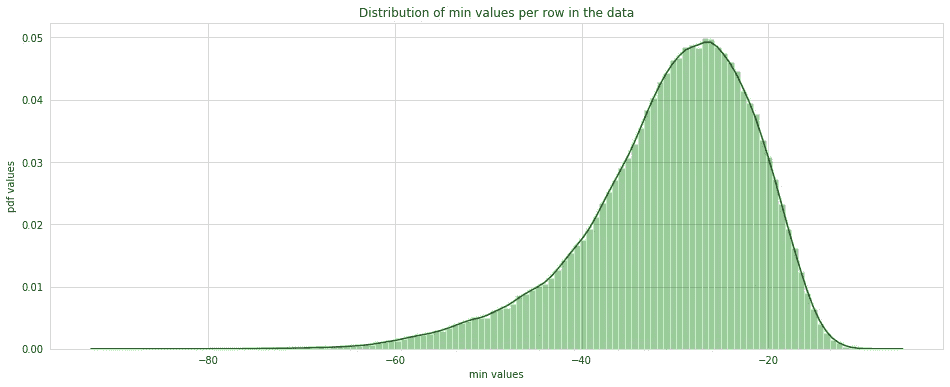
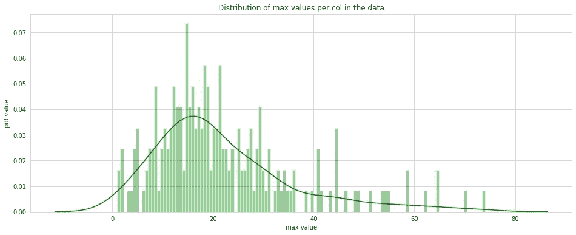
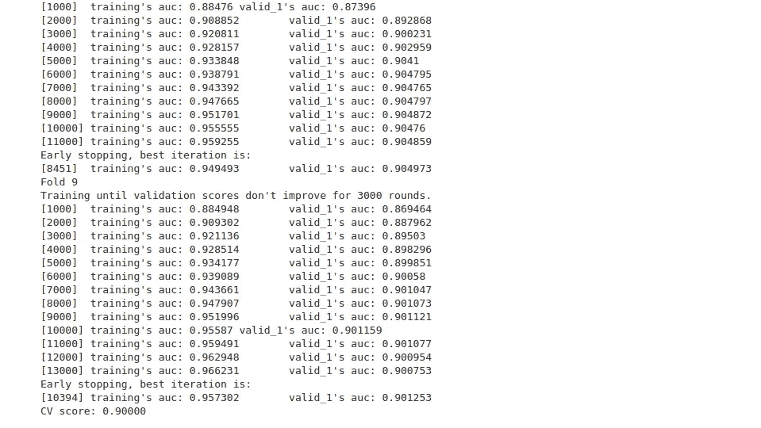
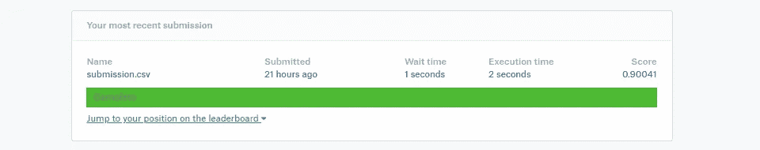

# 客户交易预测

> 原文：<https://medium.com/analytics-vidhya/customer-transaction-prediction-31c28beba1ea?source=collection_archive---------3----------------------->

如题，这个博客是关于一个名为桑坦德客户交易的 kaggle 竞赛。对于任何一家以金融为基础的公司来说，最重要的事情是了解客户将来是否会使用他们的服务。桑坦德银行(Santander)也给出了同样的情况，该银行要求我们解决一个挑战，以预测客户未来是否会进行交易。我将告诉你如何解决这个挑战，以及我做了哪些功能工程来获得 90%的 AUC 结果并排名前 4%。


# **问题陈述**

这个 kaggle 挑战的问题陈述是预测客户是否会进行未来的交易，而不管交易的金额。这里的限制是我们应该给出基于概率的预测。

# **机器学习问题陈述**

到目前为止，我们已经看到了问题和问题的限制，但所有这些都与业务角度有关。为了使用机器学习来解决这个挑战，我们必须将其转化为机器学习问题陈述，伙计们，这个东西不仅仅限于这个特定的问题陈述，还包括所有其他挑战。在解决任何现实世界的问题之前，我们首先要将其转化为机器学习问题。对于这个问题，我们的 ML 问题陈述将是这样的:“**这是一个经典的二元分类机器学习问题，其中我们必须预测客户是否会进行未来交易，评估指标是 AUC。**

# **数据集**

数据集是匿名的，因此我们无法知道哪个要素是什么。该数据集中总共有 200 个要素，以及 ID_code 和目标列。目标列包含 0 和 1 值，其中 0 表示客户不会进行交易，1 表示客户会进行交易。
您可以从以下链接下载数据集:

[https://www . ka ggle . com/c/Santander-customer-transaction-prediction/](https://www.kaggle.com/c/santander-customer-transaction-prediction/overview/evaluation)

# **导入库**

到目前为止，你已经完全了解了问题陈述及其约束条件，所以现在让我们从编码部分开始。首先，我们从导入所有必需的库开始。

```
import pandas as pd
import seaborn as sns
import matplotlib.pyplot as plt
import numpy as np
from sklearn.model_selection import train_test_split
from sklearn.metrics import roc_curve, auc,roc_auc_score
from sklearn.model_selection import StratifiedKFold
from sklearn.model_selection import RandomizedSearchCV
import lightgbm as lgb
import timeit
import time
```

# **探索性数据分析**

我们已经完成了库的加载，让我们从探索性数据分析(EDA)开始。伙计们，EDA 是解决任何机器学习问题的最重要的一步，它可以帮助你更深入地了解数据集，并帮助你派生出新的功能，以便更好地学习你的模型。我们首先通过加载数据来启动 EDA。

```
data = pd.read_csv(‘train.csv’)#train data
data_test = pd.read_csv(‘test.csv’)#test datadata.head()
```


加载训练和测试数据后，我重新安排了一些列，将目标列放在最后，并将数据保存到新的 CSV 文件名 data_train.csv 中。

**检查数据集的平衡**

```
data_train[‘target’].value_counts()
```


```
ax = sns.countplot(‘target’,data=data_train)
print(“percentage of data belongs to 0 :”, data_train[‘target’].value_counts()[0]*100/200000,”%”)
print(“percentage of data belongs to 1 :”, data_train[‘target’].value_counts()[1]*100/200000,”%”)
ax.plot()
```


我们可以看到，大约 90%的数据属于 0 类，只有 10%属于 1 类，因此我们可以得出结论，该数据是一个不平衡的数据

**检查空值**

```
data_train.isnull().sum()
```


对我们来说，一件好事是，如我们所见，任何特征都没有空值，因此不需要对缺失值进行插补。
现在让我们检查所有特征在目标值 0 和 1 上的分布情况，为此我编写了下面的函数，因为我们有 200 个特征，所以我们将分布分为两部分，第一部分我取了 100 个特征，第二部分取了其余的 100 个特征。

```
def feature_distribution(data_1,data_2,target_0,target_1,features_list):
# Here we are setting the style of the plot and grid in it
sns.set_style(‘whitegrid’)
plt.figure() # Here we are initializing the plt figure object
# Here we are creating the subplot and initialzing it size and row col size
fig, ax = plt.subplots(10,10,figsize=(18,22))
for plot_count, feature in enumerate(features_list):
#plotting the plots here for every plot feature
plt.subplot(10,10,plot_count+1)
#plotting the pdf plot for every feature towards the target value
sns.distplot(data_1[feature], hist=False,label=target_0)
sns.distplot(data_2[feature], hist=False,label=target_1)
plt.xlabel(feature, fontsize=9)# Here we are setting the x axis label
locs, labels = plt.xticks()
# Here we are setting the ticks for x and y axis
plt.tick_params(axis=’x’, which=’major’, labelsize=6, pad=-6)
plt.tick_params(axis=’y’, which=’major’, labelsize=6)
plt.show();
## Dstribution for the first 100 features
target_0_data = data.loc[data_train[‘target’] == 0]
target_1_data = data.loc[data_train[‘target’] == 1]
features = data.columns.values[1:101]
feature_distribution(target_0_data, target_1_data, ‘0’, ‘1’, features)
```



目标类前 100 个特征的样本分布

类似地，我们对其余的 100 个特征进行了分析，得出了以下结论:
1) *通过观察每个特征相对于目标值的分布，我发现大多数特征对于目标值具有不同的分布
。
2)我们也可以说有一些特征不是完全而是有一点非常接近正态分布。*
3) *因此我可以说对数据做了某种处理。*

**让我们检查数据的平均值和标准差的分布** 就像我们对特征所做的那样让我们检查数据的平均值和标准差的分布。

```
plt.figure(figsize=(16,6))
sns.set_style(‘whitegrid’)
features = data_train.columns.values[1:202]
plt.title(“Distribution of mean values per row in the data”)
plt.xlabel(‘mean value’)
plt.ylabel(‘pdf value’)
sns.distplot(data_train[features].mean(axis=1),color=”green”, kde=True,bins=120)
plt.show()
```


数据中每行平均值的分布

在查看数据的行值的均值图之后，进行以下观察:
1) *上图显示了每个特征的均值沿行的分布，并且似乎遵循高斯类型。
2)该图看起来有点像高斯分布，平均值为 6.7342。
3)从上图中，我们可以说大约有 80%的特征的平均值在 6.5 和 7.0 之间*

类似地，我们绘制了数据中每列平均值的分布，得到了下图。


数据中每列平均值的分布

在查看数据
1) *的 col 值的均值图后，做出以下观察。上图是每个特征的列方式的均值分布。
2)列向均值分布不是高斯分布。*
3) *大多数列的平均值在-10 到 20 之间。*

类似地，我沿着数据的行和列绘制了标准偏差的分布，并分别得到了下面的图和观察值。


数据中每行标准值的分布

观察结果如下:
1) *我们可以看到，沿着行的每个特征的标准偏差分布也类似于不完全遵循
而是根据曲线形状的高斯分布。
2)大约 60%的特征的标准偏差在 9.3-10 之间。*


数据中每列的标准值分布

观察结果
1) *如图表所示，我们可以说沿着列的标准偏差和特征的分布来自一些其他分布。
2)有大量特征的偏差在 0 & 6 的范围内。
3)最小标准差 0，最大 21 左右什么的。*

**平均值数据集的分布，按目标值分组。** 这里我又做了一次上面的 EDA，但是做了一些改动，我用目标值对平均值进行了分组。


按目标值分组的数据集中每行平均值的分布

观察:
1) *上图显示了每个特征朝向目标的平均分布。每个类别的每个特征的分布看起来有点相似。因此，这些特征将很好地识别目标类别。*


按目标值分组的数据集中每列平均值的分布

观察:
1) *看上面的图，两者的分布非常相似。所有的特征都可以帮助我们识别目标类。
3)大多数特征意味着位于-10 到 20 的范围内。*

**行和列数据中最小值和最大值的双向分布**



数据中每行最小值的分布

观察如下:
1) *上图显示了各特征的 min 值分布。这个图看起来偏向右边。
3)最小值在-40 到-20 范围内的大多数特征。*


数据中每列最小值的分布

观察:
1) *上图是每个特性的列式最小值分布。
2)我们观察到了较低的值，即-80，因为长队列位于较低的一侧。*


数据中每行最大值的分布

观测值:
1) *以上分布是每个特征最大值的行方向分布。我们可以在右边观察到最大值 70，因为长尾在图的右边。因为长尾在右边，所以图形向左倾斜。*



数据中最大值的分布

观察:
1) *以上分布是每个特征最大值的 col wise 分布。
2)我们可以观察到最大值 80，因为图的长尾在右边。*

**现在让我们检查特征之间的相关性** 到目前为止，我所有的 EDA 都是基于图形分布，所以现在既然数据包含数字特征，就应该检查特征之间的相关性。所以让我们开始吧。

```
features = data_train.columns.values[1:200] # Here we are getting all th features
# And here we are calculating the correlation of every featre ad sorting it in ascending order
cor_data = data_train[features].corr().abs().unstack().sort_values(kind=”quicksort”).reset_index() 
cor_data = cor_data[cor_data[‘level_0’] != cor_data[‘level_1’]]
```


最高相关数据

# **训练一个没有任何特征工程的模型**

我已经结束了我的 EDA，但是你们可以做更多的工作来发现更多关于数据的有趣信息。知道你的模型的基线是什么的一个方法应该是你可以在原始数据上训练任何模型，而不需要做任何特征工程。在博客的这一部分，我也在做同样的事情。

```
start = timeit.default_timer()
# %%time
lgb_model = lgb.LGBMClassifier(boosting_type= ‘gbdt’, objective=’binary’,feature_fraction=0.05,
 class_weight=’balanced’,num_leaves=8,n_estimators=2000,max_depth=5,
 learning_rate=0.05,metric=’auc’,bagging_fraction=0.4, n_jobs=-1)
lgb_model.fit(X_train, y_train)predict_y_train = batch_predict(lgb_model, X_train)
predict_y_cv = batch_predict(lgb_model, X_cv)train_fpr, train_tpr, tr_thresholds = roc_curve(y_train, predict_y_train)
test_fpr, test_tpr, te_thresholds = roc_curve(y_cv, predict_y_cv)
plt.plot(train_fpr, train_tpr, label=”train AUC =”+str(auc(train_fpr, train_tpr)))
plt.plot(test_fpr, test_tpr, label=”test AUC =”+str(auc(test_fpr, test_tpr)))
plt.legend()
# plt.xlabel(“K: hyperparameter”)
plt.ylabel(“AUC”)
plt.title(“ERROR PLOTS”)
plt.grid()
plt.show()
stop = timeit.default_timer()
print(‘Time in mins: ‘,(stop — start)/60)
```


田的 AUC 图及其检验

观察结果
测试 AUC 达到 89.52%，无需任何特征工程，我的目标是使用一些有趣的特征工程来进一步提高 AUC。

# **特色工程**

从 EDA 中我们可以看到，均值、标准差、最小值、最大值、总和、偏斜度、峰度、中值可以作为一个很好的特征

```
%time
# [https://www.youtube.com/watch?v=LEWpRlaEJO8](https://www.youtube.com/watch?v=LEWpRlaEJO8)
idx = features = data.columns.values[2:202]
for dataFrame in [data_test, data_train]:
 dataFrame[‘sum’] = dataFrame[idx].sum(axis=1) 
 dataFrame[‘min’] = dataFrame[idx].min(axis=1)
 dataFrame[‘max’] = dataFrame[idx].max(axis=1)
 dataFrame[‘mean’] = dataFrame[idx].mean(axis=1)
 dataFrame[‘std’] = dataFrame[idx].std(axis=1)
 dataFrame[‘skew’] = dataFrame[idx].skew(axis=1)
 dataFrame[‘kurt’] = dataFrame[idx].kurtosis(axis=1)
 dataFrame[‘med’] = dataFrame[idx].median(axis=1)
```


特征工程特征

一个更有趣的特性可能是每个特性的值的舍入。

```
%%time
# [https://www.geeksforgeeks.org/numpy-round_-python/](https://www.geeksforgeeks.org/numpy-round_-python/)
features_value = [col for col in data_train.columns if col not in [‘ID_code’,’target’]]
# In this we ar rounding of the value of each columns and creating a new freature of the same 
for feature in features_value:
 data_train[‘round_2’+ feature] = np.round(data_train[feature],2)
 data_test[‘round_2’+ feature] = np.round(data_test[feature],2)
 data_train[‘round_1’+ feature] = np.round(data_train[feature],1) 
 data_test[‘round_1’+ feature] = np.round(data_test[feature],1)
```


一些圆形特征

在完成功能工程后，我们设法将功能增加到 626 个。

# **最终模型培训**

一旦创建了新功能，就到了训练模型的时候了，看看 AUC 的值是多少，我是否设法将其增加了 89.52%以上。

```
parameter = {
 ‘bagging_freq’: 5,
 ‘bagging_fraction’: 0.4,
 ‘boost_from_average’:’false’,
 ‘boost’: ‘gbdt’,
 ‘feature_fraction’: 0.05,
 ‘learning_rate’: 0.01,
 ‘max_depth’: -1, 
 ‘metric’:’auc’,
 ‘min_data_in_leaf’: 80,
 ‘min_sum_hessian_in_leaf’: 10.0,
 ‘num_leaves’: 13,
 ‘num_threads’: 8,
 ‘tree_learner’: ‘serial’,
 ‘objective’: ‘binary’, 
 ‘verbosity’: 1
}
# [https://www.kaggle.com/adrianlievano/light-gbm-with-stratified-kfold](https://www.kaggle.com/adrianlievano/light-gbm-with-stratified-kfold)
# Getting all the features name except the ID_code , target 
features = [col for col in data_train_final_.columns if col not in [‘ID_code’, ‘target’]]
# Inititalizing the K-Fold object
K_folds = StratifiedKFold(n_splits=10, shuffle=False, random_state=44000) 
# this creates the empty numpy array of length of x in which we store the prediction of every validation data
val_pred = np.zeros(len(x))
# In this we keep the predicted output of the test data 
predictions_test = np.zeros(len(data_test_final_))
#In this loop we are doing the training and prediction for each folds and we are getting the train and valid data 
# using the trn_idx and val_idx 
for n_fold, (trn_idx, val_idx) in enumerate(K_folds.split(x.values, y.values)):
 print(“Fold {}”.format(n_fold))
 # Getting the train and validation data from the x data
 train_data = lgb.Dataset(x.iloc[trn_idx][features], label=y.iloc[trn_idx]) 
 valid_data = lgb.Dataset(x.iloc[val_idx][features], label=y.iloc[val_idx])
 # Here we are training lightgbm model on train and valid dataset
 num_round = 1000000
 classifier = lgb.train(parameter, train_data, num_round, 
 valid_sets = [train_data, valid_data],
 verbose_eval=1000, early_stopping_rounds = 3000)
 # Here we are doing the prediction on the valid data 
 val_pred[val_idx] = classifier.predict(x.iloc[val_idx][features], num_iteration=classifier.best_iteration)
 # And here we are doing the prediction on the test data
 predictions_test += classifier.predict(data_test_final_[features], 
 num_iteration=classifier.best_iteration) / K_folds.n_splits
print(“CV score: {:<8.5f}”.format(roc_auc_score(y, val_pred)))
```



如你所见，AUC 分数达到了 90%,因此是时候在 kaggle 上提交并检查分数了。

**创建提交 CSV**

```
sub_df = pd.DataFrame({“ID_code”:data_test[“ID_code”].values})
sub_df[“target”] = predictions
sub_df.to_csv(“submission.csv”, index=False)
```

# **结果的**

创建提交文件后，在 kaggle 上测试它的时间，看看结果。所以祈祷吧。



kaggle 提交的结果

正如你所看到的，我设法在 kaggle 测试数据上获得了 0.90041 的 AUC。正如我们所知，在机器学习领域，没有完美的解决方案，每个模型都有改进的空间，我的解决方案还可以进一步改进。

# **改进范围**

您可以通过加入一些其他功能工程来进一步改进该解决方案，其中之一是频率编码，并通过删除合成测试数据，这要感谢 YaG320 在其内核中分享的这项令人敬畏的技术[https://www . ka ggle . com/YAG 320/list-of-fake-samples-and-public-private-lb-split](https://www.kaggle.com/yag320/list-of-fake-samples-and-public-private-lb-split)。您还可以执行数据扩充，并将 AUC 提高高达 92%。

# **参考文献**

[https://www . ka ggle . com/c/Santander-customer-transaction-prediction/overview/evaluation](https://www.kaggle.com/c/santander-customer-transaction-prediction/overview/evaluation)
[https://www.youtube.com/watch?v=LEWpRlaEJO8](https://www.youtube.com/watch?v=LEWpRlaEJO8)
[https://www . ka ggle . com/YAG 320/list-of-fake-samples-and-public-private-lb-split](https://www.kaggle.com/yag320/list-of-fake-samples-and-public-private-lb-split)

**你可以在 LinkedIn 上联系我**
[https://www.linkedin.com/in/vashistnarayan-singh/](https://www.linkedin.com/in/vashistnarayan-singh/)