# 在 Power BI 中使用 Python 定制可视化

> 原文：<https://medium.com/analytics-vidhya/customized-visualization-using-python-in-power-bi-fa4c5c986b1b?source=collection_archive---------6----------------------->

在 Power BI 中运行 python 脚本的简单步骤


艾萨克·史密斯在 [Unsplash](https://unsplash.com?utm_source=medium&utm_medium=referral) 上拍摄的照片

Python 与 Power BI 的集成在更加定制化的可视化方面打开了一个巨大的机会，在提取和清理数据方面也打开了许多*的可能性。*

这使用户能够利用令人惊叹的可视化库，如 [Seaborn](https://seaborn.pydata.org/) 、 [matplotlib](https://matplotlib.org/) 和许多其他库。

我们开始吧

> 我们需要最新版本的 Power BI，这将在预览功能中集成 Python。

## 运行 Python 脚本到**创建数据帧**

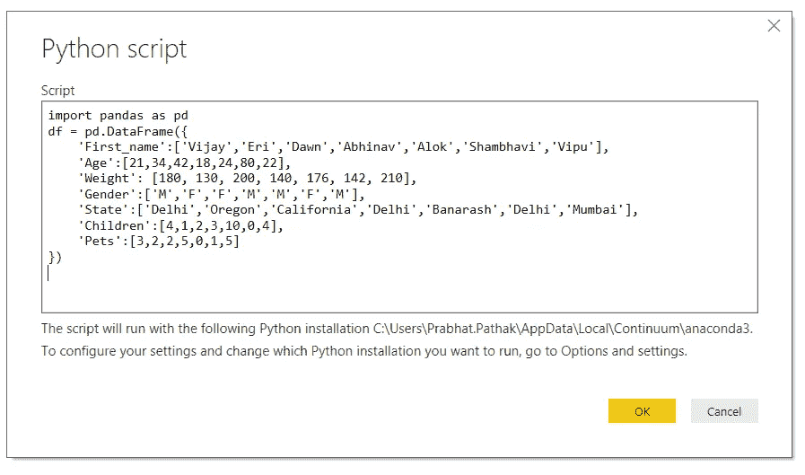

Python 脚本

```
import pandas as pddf = pd.DataFrame({'First_name':['Vijay','Eri','Dawn','Abhinav','Alok','Shambhavi','Vipu'],'Age':[21,34,42,18,24,80,22],'Weight': [180, 130, 200, 140, 176, 142, 210],'Gender':['M','F','F','M','M','F','M'],'State':['Delhi','Oregon','California','Delhi','Banarash','Delhi','Mumbai'],'Children':[4,1,2,3,10,0,4],'Pets':[3,2,2,5,0,1,5]})
```

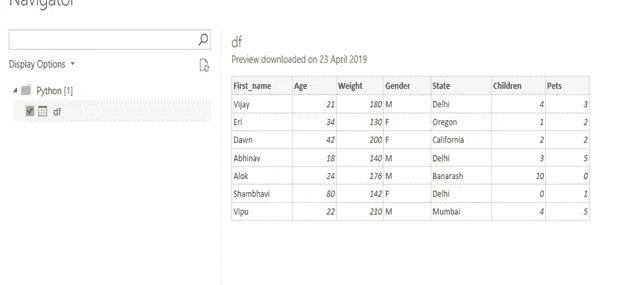

数据帧

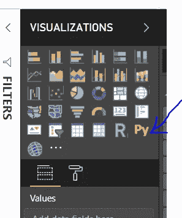

单击此图标时，脚本编辑器会打开一个空的可视区域。

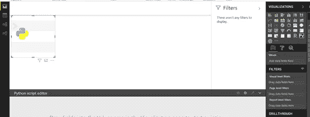

可以从我们正在工作的数据集中添加必填字段，这在内部创建了一个 Pandas 数据框架。然后，我们可以使用 Matplotlib 和 Seaborn 之类的库编写定制脚本来创建定制的视觉效果。

# 使用 Matplotlib 创建散点图

在创建可视化之前，我们将导入以下库

```
import matplotlib.pyplot as plt
```

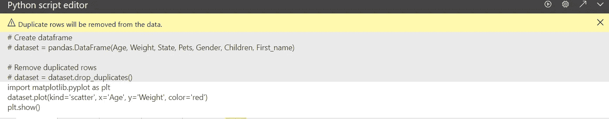

运行该脚本后，输出如下:

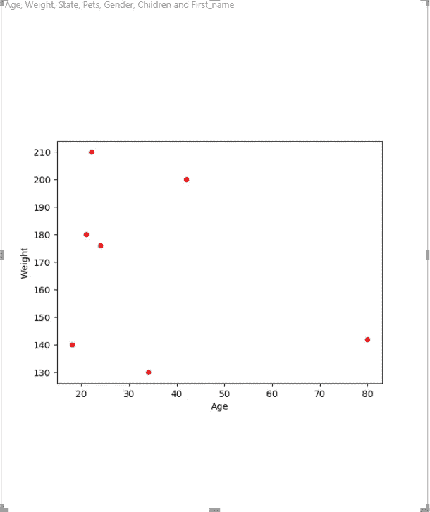

**创建多列线图**

让我们为每个人创建一个线图，显示他们的孩子和宠物的数量。

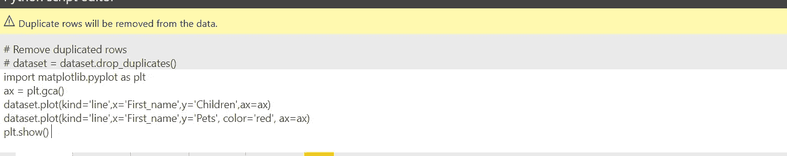

```
import matplotlib.pyplot as pltax = plt.gca()dataset.plot(kind='line',x='First_name',y='Children',ax=ax)dataset.plot(kind='line',x='First_name',y='Pets', color='red', ax=ax)plt.show()
```

运行这段代码后，输出如下

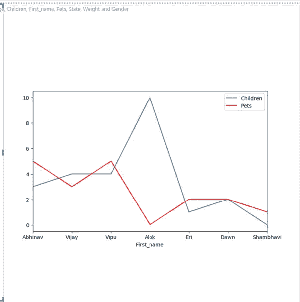

类似地，我们可以使用 matplot 创建许多可视化。


照片由[麦特·哈迪](https://unsplash.com/@matthardy?utm_source=medium&utm_medium=referral)在 [Unsplash](https://unsplash.com?utm_source=medium&utm_medium=referral) 上拍摄

# **Seaborn 图书馆**

首先在 power BI 中下载并导入 Tips 数据。

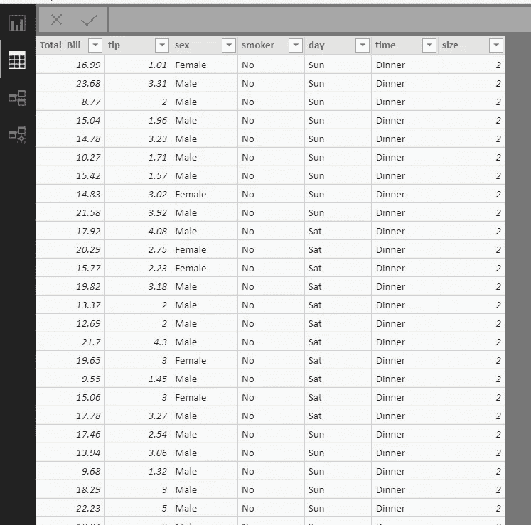

# 小提琴情节与 Seaborn 图书馆

这将导入视觉库，允许你创建一些很酷的视觉效果。让我们添加代码来获得我们想要的视觉效果。我们将创建的第一个视觉效果是小提琴的情节。我们将使用在中添加的值来创建数据集。

## **粘贴这段代码**

```
import seaborn as snssns.violinplot(x='day',y='Total_Bill',data=dataset)plt.show()
```

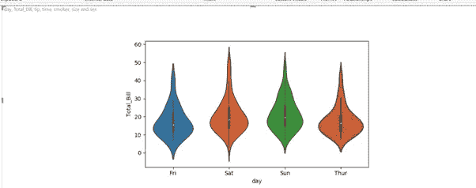

小提琴情节

# 创建 Seaborn 散点图

该图用于查看两个变量之间的关系。

**粘贴此代码**

```
import matplotlib.pyplot as plt
import seaborn as snssns.scatterplot(x='Total_Bill', y='tip',hue='size', size='size',sizes=(20, 900),data=dataset)
plt.show()
```

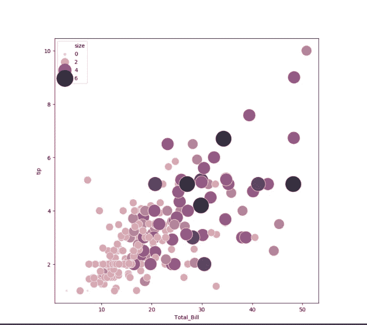

# 创建 Seaborn Pair 图

我们要创造的最后一个情节是最容易的。它被称为配对图，本质上是所有数据集相关性的集合，类似于单独的图形。它可以让你快速简单地查看你的相关性，以便进行更深入的探索。

```
import matplotlib.pyplot as plt
import seaborn as sns
sns.pairplot(dataset,hue='sex')
plt.show()
```

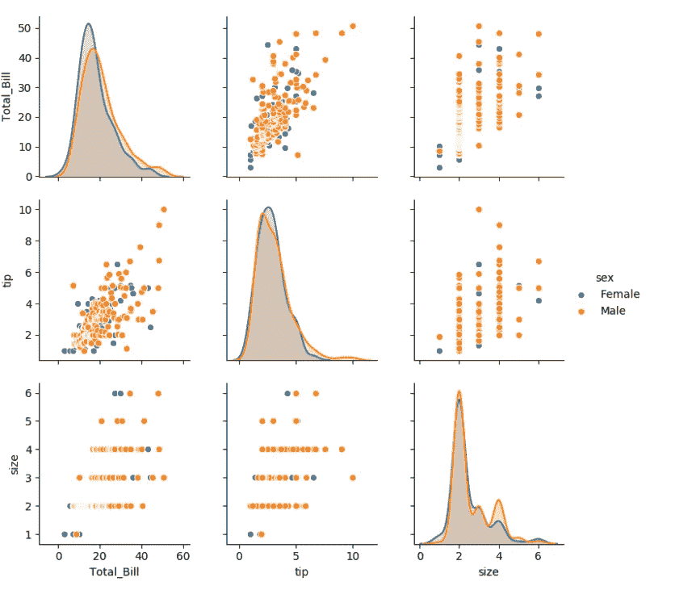

**结论**

既然您已经知道如何在 Power BI 中使用 Python 集成，那么定制您的视觉效果的可能性是无穷无尽的，可以构建令人惊叹的仪表板！

我希望这篇文章能帮助你并节省大量的时间。

**快乐编码。**


由[菲利克斯·米特迈尔](https://unsplash.com/@felix_mittermeier?utm_source=medium&utm_medium=referral)在 [Unsplash](https://unsplash.com?utm_source=medium&utm_medium=referral) 拍摄的照片