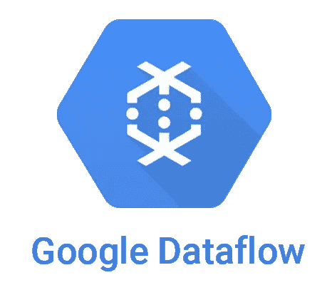
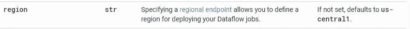
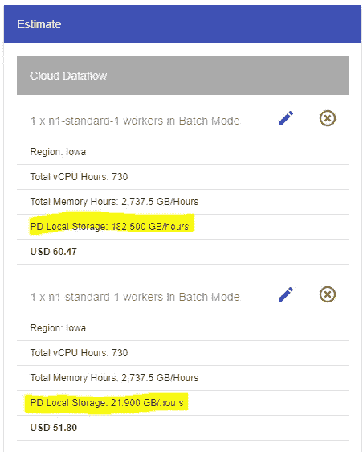
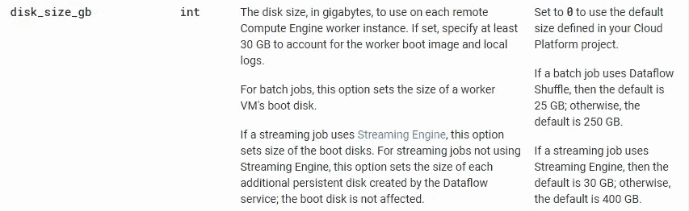
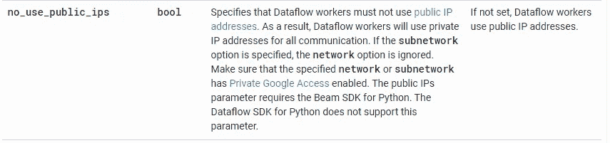

# 降低运行谷歌云数据流的成本

> 原文：<https://medium.com/analytics-vidhya/cut-down-cost-of-running-google-cloud-dataflow-294a541dfbdc?source=collection_archive---------6----------------------->

## ***通过这些简单的技巧降低运行批处理/流式云数据流作业的成本***

Google cloud dataflow 是大数据堆栈中的杰出产品之一，也是目前非常强大的处理引擎之一，它基于开源的 ***Apache beam*** 框架，支持大规模的批处理和流数据处理。

这是一项完全托管的大规模大数据处理服务，无需管理任何运行管道的基础设施，但是，我们确实有 ***配置*** 供我们使用，以改变特定批处理/流作业所需的基础设施，这可以帮助我们 ***显著降低成本。***

让我们来看看其中的一些。

# 将 GCP 服务保持在同一区域内

这是我们在创建其他 GCP 服务时经常犯的错误。尽量将它们放在同一个区域，以避免出入成本。

例如，源文件可以在一个桶中，该桶位于数据流作业正在运行的不同区域。这将增加网络转账的额外费用，通过确保所有服务都在同一地区，您将能够避免任何网络转账费用，因为在几乎所有 GCP 地区，同一地区内的转账都是免费的。

默认情况下，如果未在管道配置中指定，数据流作业将在 ***美国中心 1*** 区域提交和执行。

要在部署数据流管道时设置区域，可以添加下面提到的参数。例如:***—region = us-east 1***

区域的参数详细信息

# 磁盘容量

批处理数据流管道的默认磁盘大小为*250 Gb，流式数据流管道的默认磁盘大小为 **400 Gb** ，在大多数情况下，数据文件不会存储在群集上，而是驻留在 G ***CS 存储桶上(如果是批处理，或者是 Pub/Sub(如果是流式事件)*** 使该存储附加到群集上 ***浪费了资源*** *，并产生了相关成本**

*将它减少到建议的最小大小*30Gb。通过进行这种配置更改，您将能够在批处理管道上节省大约***【8–10 美元/月*** 个工人，在流式管道上节省大约**【15–20 美元/月**个工人。**

****

**批量数据流管道估计(250Gb 与 30Gb PD)**

**要在部署数据流管道时设置磁盘大小，可以添加下面提到的参数。例如 ***— disk_size_gb=30*****

****

**磁盘大小的参数详细信息**

# **禁用公共 IP**

**默认情况下，数据流服务为您的管道分配 ***公共和私有 IP 地址，*** 当您创建计算引擎虚拟机时，也会发生同样的事情。**

**保留一个公共 IP 地址会增加网络成本，并增加你每月的账单。**

**在数据流管道的情况下，如果不需要您从 Google cloud 外部访问这些管道，您可以在部署管道时禁用此公共 IP，从而节省一些网络成本。**

**要在部署数据流管道时禁用公共 IPs，可以添加下面提到的参数标志。例如***—no _ use _ public _ IPS = true*****

****

**公共 IP 的参数详细信息**

**暂时就这样吧！请遵循这些技巧，减少你的数据流成本。**

## **如果这篇文章是有帮助的，请在下面留下评论并分享它，以帮助其他人找到它。**