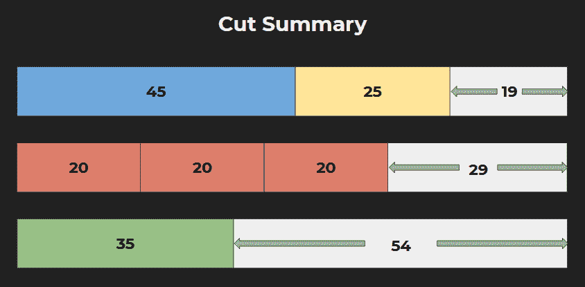

# 削减库存问题——1D

> 原文：<https://medium.com/analytics-vidhya/cutting-stock-problem-1d-df976f7263cd?source=collection_archive---------3----------------------->

## 如何以最少的损耗从库存中切割棒、纸卷

如果你见过宽纸卷或织物卷被切割成较小宽度的卷，或大金属棒的切割。

你可能想知道:

> *1。有多少种方法可以把一个大的原料切成所需长度的小块？*

答案是:太多种方式了！

也许更好的问题是:

> *2。如何从库存物品上切下所需的小片，以使浪费最小化？*

你可以问的另一个问题是:

> *3。如何从库存物品中切割出所需的小块物品，以便使用尽可能少的库存物品？*

所有这些问题都被称为“下料问题”(CSP)，并在应用数学的一个子领域“运筹学”中进行研究。金属、玻璃、纸张和纺织行业的人们每天都在处理这个问题。

# 1D vs 2D 削减库存问题

这是 CSP 的几种变体。如果我们想要的下一个工件需要一次切割才能得到，这就叫做 1D 或一维切割下料问题。例子包括切割纸卷、织物卷和金属棒。

1D 切割库存问题示例

如果切割包括将矩形薄板切割成所需尺寸的小矩形薄板，这就叫做 2D 或二维切割下料问题，例如切割玻璃薄板和金属薄板。

2D 切割库存问题示例

这篇文章深入讨论了 1D 问题，在下一篇文章中，我们将讨论 2D 问题。为了举例，让我们假设我们的库存中有尺寸为 89 cm 的标准杆。

我们仓库里的标准库存

一份客户订单到达，上面写着，他们需要:

客户订单详细信息

# 无计划切割

假设我们立即开始削减订单。我们没有考虑重新排列棒材，而是按照客户订单中提到的方式切割。

从第一根棒料开始，我们切割了 45 厘米和 25 厘米，剩下 19 厘米，这不能满足我们的任何客户需求。

我们移动到下一根杆进行切割。我们砍了 20 厘米，又砍了 20 厘米，又砍了 20 厘米，我们只剩下 29 厘米了。我们最后需要的棒是 35 厘米，不能从 29 厘米处切割，所以我们必须切割另一个原料棒

我们开始切第三根杆。我们切掉了 35 厘米，剩下 54 厘米

剪切摘要

因此，由于没有裁剪计划，我们最终使用了 3 根棒料来满足客户需求，剩下的长度分别为 19 厘米、29 厘米和 54 厘米。我们可能会在未来的订单中使用剩余的 29 和 54 厘米的焊条，但剩余的 19 厘米焊条很可能会被浪费掉，因为似乎没有客户需要小于 20 厘米的焊条。

这种没有削减计划的方法当然不理想。如果下一个订单需要一个 60 厘米的杆怎么办？我们无法满足 29 和 54 厘米的杆。

那么，有没有一种方法可以满足这种客户需求，使我们使用尽可能少的库存棒？我们的浪费也是最少的？

# CSP 工具—规划切割

让我们在工具的帮助下计划削减。我们设计了这个简单的开源工具来解决下料问题，它可以免费使用，并且可以在

这个 CSP 工具可以规划 1D 和 2D 的下料问题。(2D 的部分还没有完成。)

让我们把重点放在 1D 工具上，它可以帮助我们找到一个最优的方案来切割你的原料棒或原料织物卷，这样可以使用最少的原料，浪费也最少。

[CSP 工具](https://alternate.parts/csp)正在运行。削减计划在右边的图表中

这里你可以看到两张桌子。在顶部表格中，指定要切割的客户棒材的详细信息。在底部的表格中，输入库存杆的详细信息。

请注意，您现在不能指定原料棒的数量。实际上，这个工具会告诉你要完全满足这一需求需要多少库存杆。(我们可能很快会添加此功能，以便您可以限制要使用的库存杆数量，并在限制范围内满足最大可能的客户需求。)

让我们在顶部表格 45–1、25–1、20–3、35–1 中输入客户名单的尺寸

在底部表格中输入原料棒的尺寸:89

注意，你不需要写像厘米或英寸这样的单位。您只需指定大小。点击“剪切”。你可以看到计划:

切割计划详细信息

在右图中，我们看到了如何切割棒的计划。每行指定一个库存杆，每个框代表一个小客户杆。宽度或尺寸相同的杆具有相同的颜色。黑色表示废料或棒料的剩余部分。

在右下角的表格中，我们可以看到每个库存杆的使用情况。第一批利用率为 95.5%，第二批利用率为 89.9%。这是削减的细节。您也可以将这些切割细节下载为 CSV 文件，并导入到 Microsoft Excel 中。或者简单地复制并粘贴到 Google sheets。

# 它是如何工作的

让我们看看 CSP 工具是如何在幕后工作的。它使用 Google 的 OR-Tools 库，这是一个很棒的库，可以解决像下料问题这样的问题。

OR-Tools 使用起来非常简单。您指定变量。变量将包含你的问题的结果。在我们的例子中，它们将包含使用的原料棒的数量和切割的计划

然后指定约束。约束是您的算法必须在其中找到解决方案的限制。在我们的例子中，约束条件是

然后指定目标。目标是这个算法的主要目标是什么。就像我们的 CSP 目标是最大限度地减少库存物品的数量。

这个算法的代码可以在 [GitHub](https://github.com/emadehsan/csp) 上找到

# 不懂编程？别担心！

如果你不懂这部分编程，没关系。使用 [CSP 工具](https://alternate.parts/csp)不需要懂编程。

您可以在随附的视频中观看 CSP 的解释、CSP 工具的演示和一些实际的玻璃切割:

## 认为要牢记在心

*   仅处理整数:仅处理整数的 IP(整数编程)问题。如果有些值有小数部分，可以将所有输入乘以某个数字，使它们成为整数(或接近估计值)。
*   您不能指定单位:无论您输入的是英寸还是米，您都必须自己记录下来，如果有转换的话。

# 进一步阅读

# 谷歌的或工具

[谷歌的 OR Tools](https://developers.google.com/optimization) 库被用来制作这个工具。他们有很棒的教程和例子，即使没有任何运筹学背景也很容易理解。它适用于 Python、C++、Java 和 C#。

# 实用 Python AI 项目

我们也从 Serge Kruk 教授的书里学到了很多:[实用 Python AI 项目](https://amzn.to/3iPceJD)非常容易理解，完全推荐。事实上，我们的 CSP 工具中使用的大部分代码都来自这本书。

2D 下料问题更有趣，也更难解决。下次 2D CSP 再见。:)

*原载于 2020 年 7 月 18 日*[*https://alternate . parts*](https://alternate.parts/cutting-stock-problem)*。*