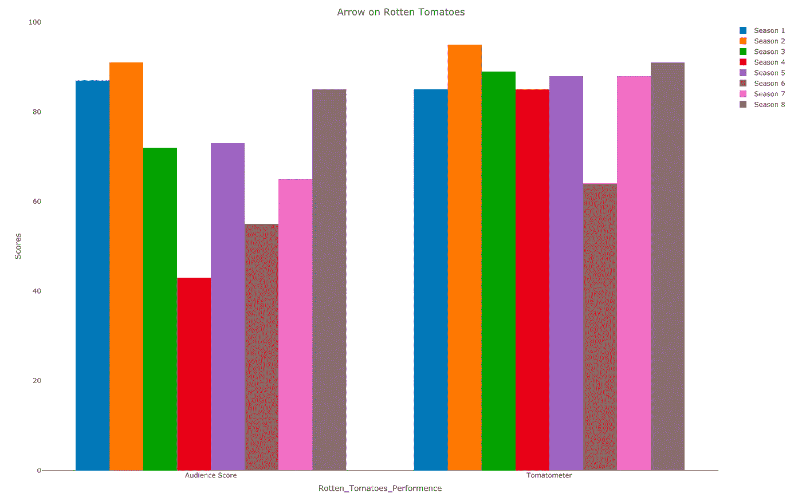
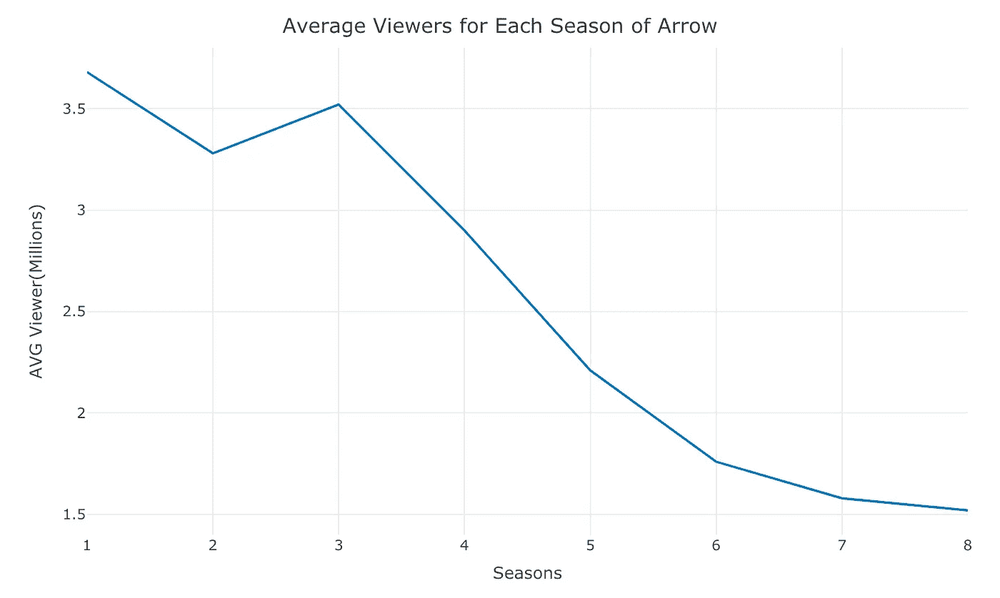
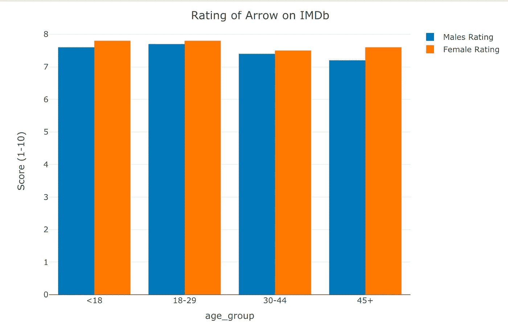
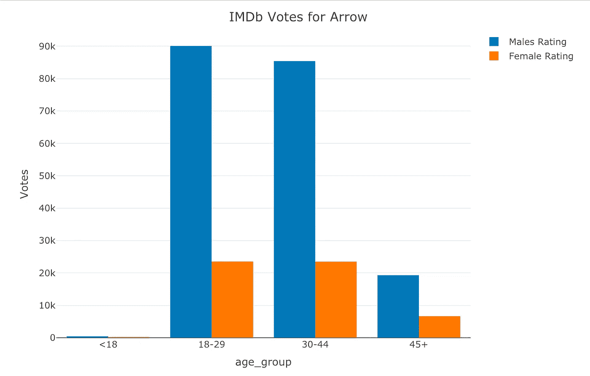
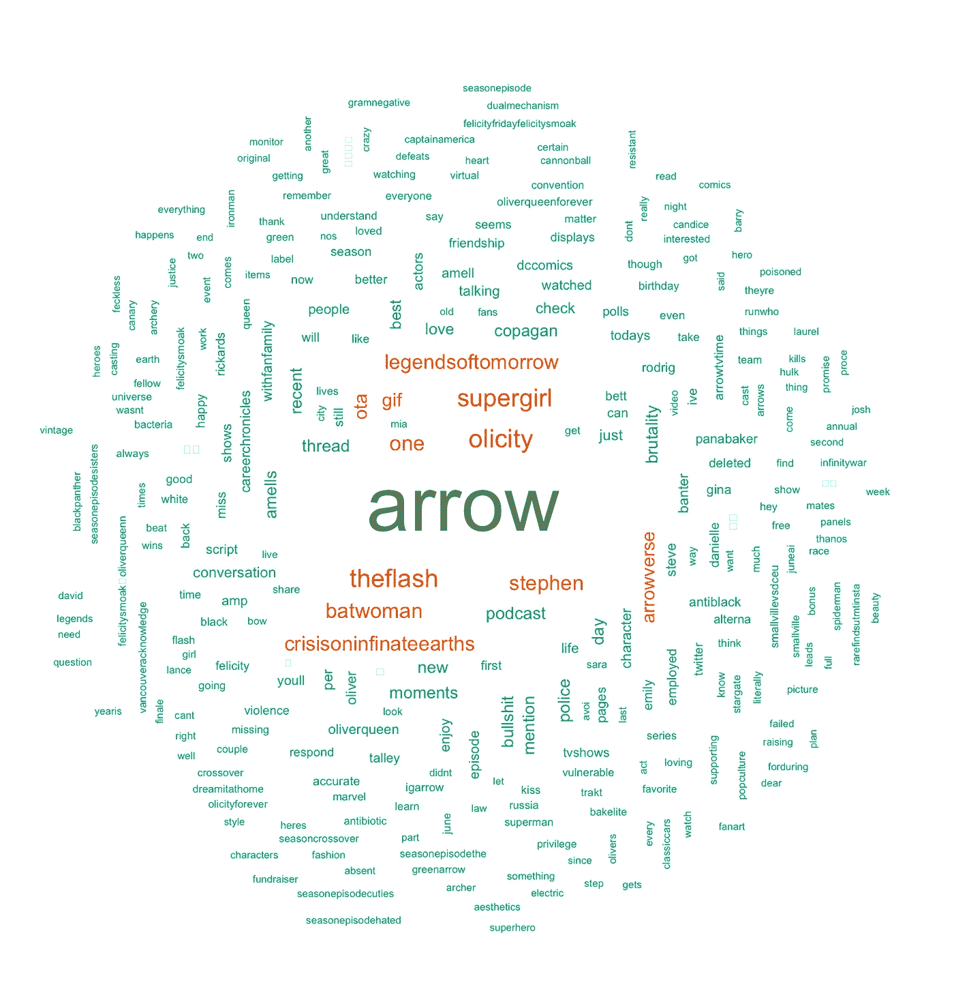
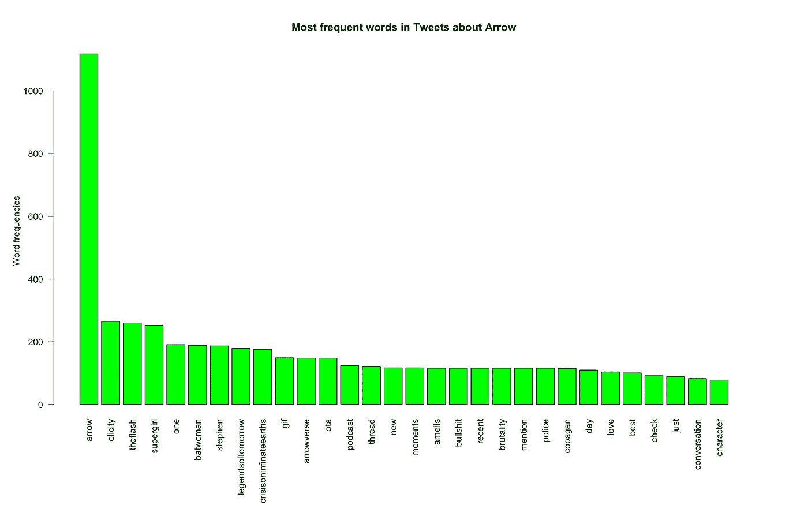
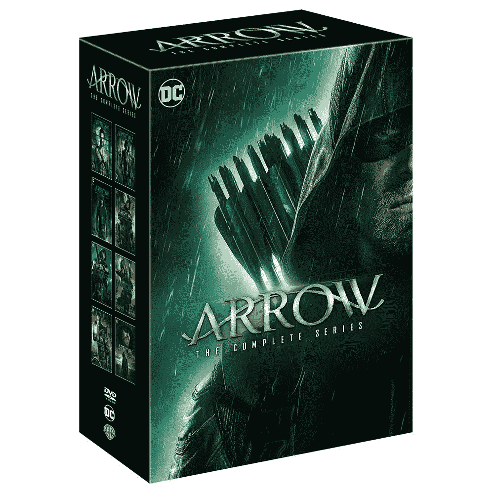
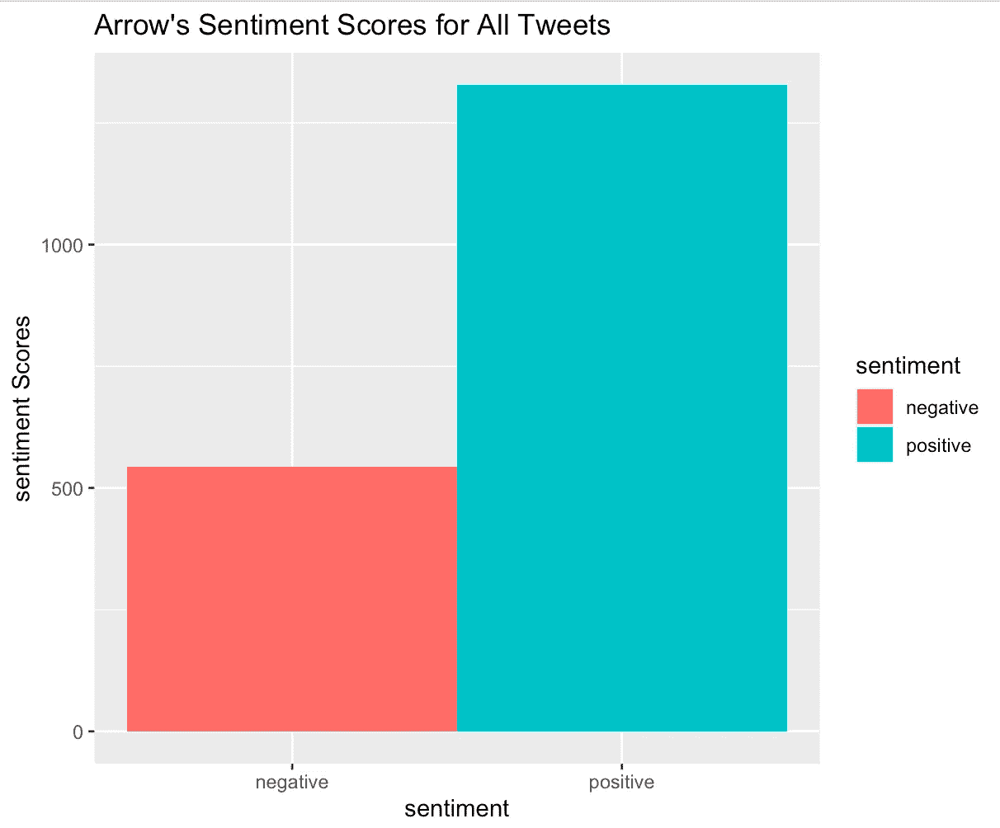
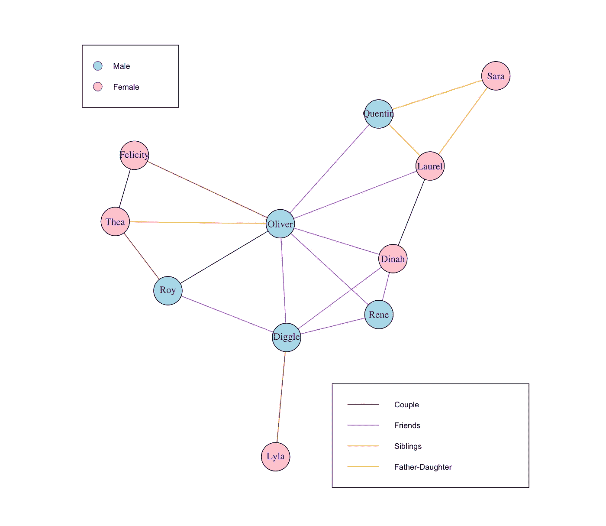

# CW 的箭头|数据科学方法

> 原文：<https://medium.com/analytics-vidhya/cws-arrow-data-sceince-approach-752389c3eba5?source=collection_archive---------21----------------------->


绿箭斯蒂芬·阿梅尔(图片来源:CW)

自 2012 年开播以来，CW 电视台的《绿箭侠》已经成为世界上最受欢迎和最具革命性的电视剧之一。Arrow 启动了 CW 的 DC Universe，被称为 Arrowverse，它与 Flash，Supergirl，Legends of Tomorrow，蝙蝠女侠和 Vixen 共享故事连续性。

该剧以 DC 漫画中最受欢迎的角色之一为基础，凭借其对原始资料的忠实，接地气的动作序列，混合的时间线，将新黑色与超级英雄小说相结合，并从克里斯托弗·诺兰的《黑暗骑士》三部曲中汲取灵感，彻底改变了现代电视超级英雄系列。《绿箭侠》使其主演斯蒂芬·阿梅尔成为收入最高、最受欢迎的电视演员之一。


2016 年英雄与反派大会上的阿梅尔；阿梅尔的表演受到了普遍的赞扬，评论家们强调他在银幕上表现各种情绪和塑造复杂角色的能力

现在，是时候在节目中使用数据科学方法来了解它有多好以及人们对它的看法了。

*免责声明:这里使用的 R 脚本对于某些读者来说是可以进阶的。你必须了解 r 的基础知识。你可能对 Twitter API 有所了解，以便理解它并使用它。*

*没有编程知识的读者请注意:请随意忽略 R 脚本和其他编程方面。带有描述和报告的情节适合所有人。*

# 资源

*   学习或更新你的 R 知识，[数据营](https://www.datacamp.com)非常有帮助。你只需要创建一个免费账户。
*   免费在线教材[介绍数据分析和 R](https://rafalab.github.io/dsbook/) 预测算法也确实很有帮助。

# r 提示

*   如有可能，使用[微软 R Open](https://mran.microsoft.com/open) 。它带有多线程数学库(MKL)和*检查点*包。
*   但是如果你遇到麻烦，不要犹豫，换成常规休息。微软 R Open 可以有一些离奇的问题[我的个人经历](/@ceshine/cxx11-is-not-defined-problem-in-mro-3-4-e51f1d27da15)。不要浪费太多时间去修理它们。换成常规 R 往往能解决问题。
*   通过起重机安装常规 R([Ubuntu 的说明](https://cran.r-project.org/bin/linux/ubuntu/README.html))。[安装*检查点*确保再现性](https://mran.microsoft.com/documents/rro/reproducibility)(不是微软 R Open 独占。)
*   使用 [RStudio](https://www.rstudio.com/) 并善用其*控制台*窗口。有些人对 R 有强烈的反感，因为它与其他主要编程语言相比有一些独特之处。许多困惑可以通过在*控制台*中的简单查询来解决。不确定向量索引是从零开始还是从一开始？告诉你是一个。查询`1:10`告诉您结果包括 10(不像 Python)。

# 烂番茄的疮疤

烂番茄是最受欢迎的影视评论聚合网站之一。《绿箭侠》最近结束了第八季，这也是最后一季。每个季节，烂番茄都有一个自动气象仪(平均。评论家分数)和观众分数 Arrow。这些都是公开的，很容易检索。

```
library(plotly)Rotten_Tomatoes_Performence <- c("Tomatometer", "Audience Score")
Season_1 <- c(85, 87)
Season_2 <- c(95, 91)
Season_3 <- c(89, 72)
Season_4 <- c(85, 43)
Season_5 <- c(88, 73)
Season_6 <- c(64, 55)
Season_7 <- c(88, 65)
Season_8 <- c(91, 85)
data <- data.frame(Rotten_Tomatoes_Performence, Season_1, Season_2, Season_3, Season_4, Season_5, Season_6, Season_7, Season_8)fig <- plot_ly(data, x = ~Rotten_Tomatoes_Performence, y = ~Season_1, type = 'bar', name = 'Season 1')
fig <- fig %>% add_trace(y = ~Season_2, name = 'Season 2')
fig <- fig %>% add_trace(y = ~Season_3, name = 'Season 3')
fig <- fig %>% add_trace(y = ~Season_4, name = 'Season 4')
fig <- fig %>% add_trace(y = ~Season_5, name = 'Season 5')
fig <- fig %>% add_trace(y = ~Season_6, name = 'Season 6')
fig <- fig %>% add_trace(y = ~Season_7, name = 'Season 7')
fig <- fig %>% add_trace(y = ~Season_8, name = 'Season 8')
fig <- fig %>% layout(yaxis = list(title = 'Scores'), barmode = 'group')
fig <- fig %>% layout(title = "Arrow on Rotten Tomatoes")
fig
```



该系列在评论家中非常受欢迎，但我们可以看到第六季的评分很低，但随着第七季的继续，评分有所提高。另一方面，我们可以看到观众对第四季的评价很低，但从那以后，观众的评分也有所提高。


马努·贝内特饰演斯莱德·威尔森/丧钟，第二季的主要对手，获得了好评。贝内特的《丧钟》被许多人认为是电视上最好的反派角色之一。图片来源:CW

# 电视观众

让我们创建一个情节，并比较每一季的平均收视率。这些数据是从 2012 年至 2020 年每个季度的多个来源检索的。

```
library(plotly)
Season <- c(1, 2, 3, 4, 5, 6, 7, 8)
AVG_Viewers_in_millions <- c(3.68, 3.28, 3.52, 2.90, 2.21, 1.76, 1.58, 1.52)data <- data.frame(Season, AVG_Viewers_in_millions)fig <- plot_ly(data, x = Season , y = AVG_Viewers_in_millions, type = 'scatter', mode = 'lines')
fig <- fig %>% layout(title = "Average Viewers for Each Season of Arrow", xaxis = list(title = 'Seasons'), yaxis = list (title = 'AVG Viewer(Millions)'))
fig
```



随着连续剧的播出，平均收视率急剧下降。然而，一个重要的因素是，在每一季结束后，它会在网飞上出现。有可能观众更愿意等待这一季在网飞播出，而不是在 CW 直播。

# 按人口统计的评级

IMDb 是一个在线数据库，包含电影、电视剧、家庭视频、视频游戏和在线流媒体内容的信息。它还包括演员、制作人员、个人传记、情节概要、琐事、评级以及粉丝和评论。

特定节目或电影的 IMDb 投票者的人口统计(年龄组和性别)总是公开的。

```
library(plotly)# Ratings of Arrow by Sex
age_group <- c("<18", "18-29", "30-44", "45+")
male_rating <- c(7.6, 7.7, 7.4, 7.2)
female_rating <- c(7.8, 7.8, 7.5, 7.6)
data <- data.frame(age_group, male_rating, female_rating)fig <- plot_ly(data, x = ~age_group, y = ~male_rating, type = 'bar', name = 'Males Rating')
fig <- fig %>% add_trace(y = ~female_rating, name = 'Female Rating')
fig <- fig %>% layout(yaxis = list(title = 'Score (1-10)'), barmode = 'group')
fig <- fig %>% layout(title = "Rating of Arrow on IMDb")
fig#Votings of Arrrow by Sex
age_group <- c("<18", "18-29", "30-44", "45+")
male_votes <- c(345, 90036, 85361, 19341)
female_votes <- c(93, 23507, 23471, 6655)
data <- data.frame(age_group, male_votes, female_votes)
fig <- plot_ly(data, x = ~age_group, y = ~male_votes, type = 'bar', name = 'Males Rating')
fig <- fig %>% add_trace(y = ~female_votes, name = 'Female Rating')
fig <- fig %>% layout(yaxis = list(title = 'Votes'), barmode = 'group')
fig <- fig %>% layout(title = "IMDb Votes for Arrow")
fig
```



2013 年国际动漫展上 *Arrow* 的主角。从左到右:凯蒂·卡西迪、斯蒂芬·阿梅尔和艾米莉·贝特·理查兹。

# 人们在推特上说什么？

现在，我们自己得到数据。我们将分析关于 CW 的箭头的推文。我们将使用#Arrow 分析最近的 10，000 条公开推文。

# 词云和频率

## 获取推文的数据和分布

首先按照本文的说明获取自己的 API key 和访问令牌，安装`twitteR`包:

[](/@GalarnykMichael/accessing-data-from-twitter-api-using-r-part1-b387a1c7d3e) [## 使用 R 从 Twitter API 访问数据

### 更新:可以在这里找到本教程的更新版本。

medium.com](/@GalarnykMichael/accessing-data-from-twitter-api-using-r-part1-b387a1c7d3e) 

你需要这四个变量:

```
consumer_key <- "FILL HERE"
consumer_secret <- "FILL HERE"
access_token <- "FILL HERE"
access_secret <- "FILL HERE"
```

这篇文章的主要访问点是 searchTwitter。它将使用“#Arrow”搜索 10，000 条最近的英语公共推文

```
setup_twitter_oauth(consumer_key, consumer_secret, access_token, access_secret)cw.tweets<- searchTwitter("#arrow",n=10000,lang="en")tweet=cw.tweets[[1]]
tweet$getScreenName()
tweet$getText()
cw.text=laply(cw.tweets,function(t)t$getText())
length(cw.text)#performing data cleaning and store in csv.file
cw.text = gsub("(RT|via)((?:\\b\\W*@\\w+)+)", "", cw.text)
cw.text = gsub("@\\w+", "", cw.text)
cw.text = gsub("[[:punct:]]", "", cw.text)
cw.text = gsub("[[:digit:]]", "", cw.text)
cw.text = gsub("http\\w+", "", cw.text)
cw.text = gsub("[ \t]{2,}", "", cw.text)
cw.text = gsub("^\\s+|\\s+$", "", cw.text)
cw.text <- str_replace_all(cw.text," "," ")
cw.text <- str_replace_all(cw.text,"#[a-z,A-Z]*","")
cw.text <- str_replace_all(cw.text,"@[a-z,A-Z]*","")  
cw.text <- tolower(cw.text)write(cw.text, "arrow.csv",ncolumn=1)
```

我们现在有了一个 CSV 文件，其中包含了 Arrow 的所有清理过的推文。现在，我们用它做一个单词云。

```
# Load
library("tm")
library("SnowballC")
library("wordcloud")
library("RColorBrewer")
text <- readLines(file.choose()) # This let us choose the file of tweets. Remember, we created a file of all tweets and named the file arrow.csv# Load the data as a corpus
docs <- Corpus(VectorSource(text))
inspect(docs)
toSpace <- content_transformer(function (x , pattern ) gsub(pattern, " ", x))
docs <- tm_map(docs, toSpace, "/")
docs <- tm_map(docs, toSpace, "@")
docs <- tm_map(docs, toSpace, "\\|")# Convert the text to lower case
docs <- tm_map(docs, content_transformer(tolower))
# Remove numbers
docs <- tm_map(docs, removeNumbers)
# Remove english common stopwords
docs <- tm_map(docs, removeWords, stopwords("english"))
# Remove your own stop word
# specify your stopwords as a character vector
docs <- tm_map(docs, removeWords, c("blabla1", "blabla2")) 
# Remove punctuations
docs <- tm_map(docs, removePunctuation)
# Eliminate extra white spaces
docs <- tm_map(docs, stripWhitespace)
# Text stemming
# docs <- tm_map(docs, stemDocument)
dtm <- TermDocumentMatrix(docs)
m <- as.matrix(dtm)
v <- sort(rowSums(m),decreasing=TRUE)
d <- data.frame(word = names(v),freq=v)
set.seed(1234)
wordcloud(words = d$word, freq = d$freq, min.freq = 1,
          max.words=300, random.order=FALSE, rot.per=0.35, 
          colors=brewer.pal(8, "Dark2"))
```



大卫·拉姆西饰演约翰·迪格尔/斯巴达；接收斯蒂芬·阿梅尔和凯蒂·卡西迪的明星账单。作为一名有武术背景的资深演员，拉姆齐的表演受到了评论家的高度赞扬

我们可以观察到斯蒂芬·阿梅尔的名字经常出现在推文中，奥利弗的浪漫伴侣“Olicity”也是如此。我们也可以看到最近的交叉箭头，CW 无限地球维基，出现。

现在，我们可以更进一步。我们可以通过词频来了解哪些词出现的次数最多。

```
par(mar = c(9, 5, 5, 5)) # Set the margin on all sidesbarplot(d[1:30,]$freq, las = 2, names.arg = d[1:30,]$word,
        col ="green", main ="Most frequent words in Tweets about Arrow",
        ylab = "Word frequencies")
```



[箭头:完整系列(DVD)](https://www.shopdcentertainment.com/products/arrow-the-complete-series-dvd)

# 情感分析

现在，我们可以走得更远。我们有一万条推文。我们有词云，我们有词频。如果进行情感分析，我们可以得出更好的结论。

```
#perform sentimental analysis 
sentiment <- get_nrc_sentiment(cw.text)cw.text <- cbind(cw.text, sentiment)#use the graphic to present the findings#set up y = count
Totals<- data.frame(colSums(cw.text[,c(11:10)]))
names(Totals) <- "score"#set up x = sentiment
Totals <- cbind("sentiment" = rownames(Totals), Totals)
rownames(Totals) <- NULLggplot(Totals, aes(x = sentiment, y = score)) +
  geom_bar(aes(fill = sentiment), stat = "identity", position = "dodge", width = 1) +
  xlab("Sentiment") + ylab("Sentiment Scores") + ggtitle("Arrow's Sentiment Scores for All Tweets")
```



现在，我们可以宣称大多数观众喜欢阿罗。

# 字符网络分析

我们的方法能更进一步吗？我们能想象出其他东西吗？答案是肯定的。我们肯定可以通过可视化剧中主要角色之间的关系来做一些真正有趣的事情。

网络分析是一套用于可视化网络和描述整体网络结构具体特征的方法。这里我们就来分析一下《箭头》中的人物网络。

我们将定义剧中每个主要角色之间的关系。例如，奥利弗和费利西蒂结婚了。迪格尔是奥利弗和费利西蒂的朋友。奥利弗和罗伊都是作为义务警员打击犯罪的弓箭手，但罗伊也在和奥利弗的妹妹西娅约会。所以，有网络。随着我们添加更多的角色和更多的关系，我们得到了越来越复杂的网络。

```
library(igraph)
library(readr)characters <- data.frame(character = c("Oliver", "Laurel", "Diggle", "Felicity", "Thea", "Roy", "Quentin", "Sara", "Rene", "Dinah", "Lyla"),
                         sex = c("male", "female", "male", "female", "female", "male", "male", "female", "male", "female", "female"))relations <- data.frame(character_1 = c("Oliver", "Laurel", "Diggle", "Felicity", "Thea", "Roy", "Quentin", "Oliver", "Laurel", "Sara", "Rene", "Lyla", "Dinah", "Laurel", "Roy", "Rene", "Felicity", "Diggle", "Dinah"), 
                        character_2 = c("Laurel", "Quentin", "Oliver", "Oliver", "Roy", "Diggle", "Oliver", "Thea", "Sara", "Quentin", "Dinah", "Diggle", "Oliver", "Dinah", "Oliver", "Oliver", "Thea", "Rene", "Diggle"), 
      relationship = c("Friends", "Father-Daughter", "Friends", "Couple", "Couple", "Friends", "Friends", "Siblings", "Siblings", "Father-Daughter", "Friends", "Couple", "Friends", "Canaries", "Archers", "Friends", "Sisters-In-Law", "Friends", "Friends"))characterNetwork <- graph_from_data_frame(d=relations, vertices=characters, directed=F)plot(characterNetwork)E(characterNetwork)$color <- ifelse(E(characterNetwork)$relationship == "Couple", "red", 
                             ifelse(E(characterNetwork)$relationship == "Friends", "purple",
                             ifelse(E(characterNetwork)$relationship == "Siblings", "orange", 
                             ifelse(E(characterNetwork)$relationship == "Father-Daughter", "yellow", "black"))))V(characterNetwork)$color <- ifelse(V(characterNetwork)$sex == "male", "lightblue", "pink")
plot(characterNetwork)legend("topleft", c("Male","Female"), pch=21,
       col="#777777", pt.bg=c("lightblue","pink"), pt.cex=2, cex=.8)
legend("bottomright", c("Couple","Friends", "Siblings", "Father-Daughter"), 
       col=c("red","purple","orange","yellow"), lty=1, cex=.8)
```



虽然这项研究着眼于单个 twitter 标签(#Arrow)并对其进行分析，但我们可以进行更深入的分析。我们可以使用其他 twitter 标签，如#CWArrow、# CWOliverQueen、#CWGreenArrow 等等，使用相同的 R 代码，稍加修改。我们可以把所有这些放在一起得出更好的结论。

我们可以在我们的网络分析中添加更多的特征和关系，形成一个更复杂的网络。我们可以添加反派、交叉角色、客串角色等等。

我们也可以通过文本挖掘来分析评论家对烂番茄的评论。我们可以通过多种方式将数据科学应用于一场演出、电影或体育赛事。

# 结束了

《绿箭侠》在过去的八年里一直是一部精彩的电视剧。非常令人难过的是，该系列最近结束了，但它以促成**CW 无限地球维基**交叉的高调结束。粉丝们对续集系列《绿箭和金丝雀》极度兴奋，关注新的绿箭和金丝雀(劳雷尔·兰斯和黛娜·德雷克)。与此同时，斯蒂芬·阿梅尔将继续他的演艺生涯，出演一部名为《高跟鞋》的摔跤连续剧。

[](https://screenrant.com/cw-arrow-spinoff-green-arrow-canaries-could-happen/) [## 绿箭&加那利群岛仍然可能发生在 CW 电视台

### 绿箭&加那利群岛，女性为中心的箭衍生，仍然有机会发生在 CW 根据…

screenrant.com](https://screenrant.com/cw-arrow-spinoff-green-arrow-canaries-could-happen/) [](https://tvline.com/2019/08/19/stephen-amell-heels-starz-wrestling-series-cast/) [## 箭的斯蒂芬·阿梅尔标题 8 集摔跤剧高跟鞋在 Starz

### 斯蒂芬·阿梅尔的目标是他的第一份兼职——这正是他的强项。演员有…

tvline.com](https://tvline.com/2019/08/19/stephen-amell-heels-starz-wrestling-series-cast/)