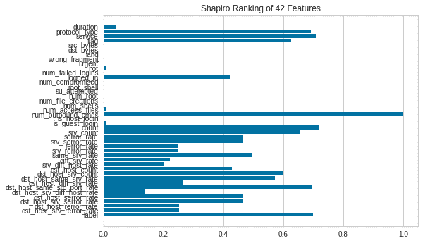
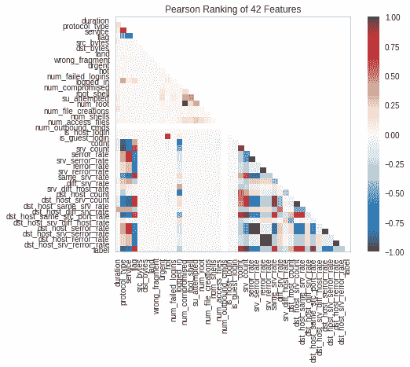
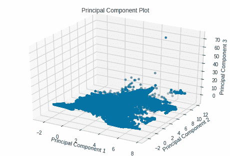
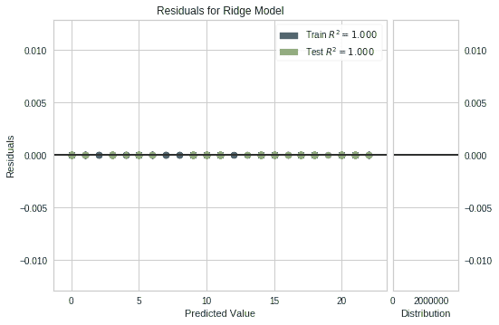
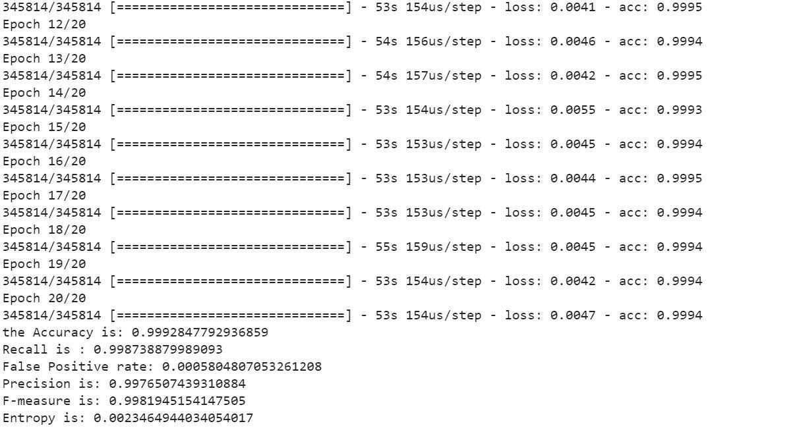

# 网络安全——基于机器学习的安全网络范例

> 原文：<https://medium.com/analytics-vidhya/cyber-security-a-machine-learning-based-paradigm-for-secure-networks-545caaee19ae?source=collection_archive---------15----------------------->


技术和网络正以极快的速度发展。网络革命 2.0 意味着更多互联的边缘设备，对潜在的环路探索者来说意味着更多的检查点。任何意义上的入侵不仅会对经济，而且会对发展和增长造成巨大损害。

> “网络就像精心准备的美味午餐盒，越是暴露在大众面前，你就越容易妥协，什么也得不到”

保护网络由一些标准技术组成，以防止未经授权的数据访问-

1)识别——每个系统都应该有安全的访问，因为密码、用户 id 或某种验证对于安全的系统是必要的。恶意用户可以使用从数据泄露中获得的凭据进行访问，这可以忽略这一识别过程，因此身份验证和授权变得至关重要。

2)用户认证和授权——这一步对于让正确的用户访问系统非常关键。

3)密码术——在密码术中，用户会话使用密钥交换来访问资源。

入侵检测系统是安全网络的一个重要特征。使用机器学习意味着使用基于签名的方法已经成为过去。

网络流量分析非常重要，因此网络流量分析(NTA)用于扫描和分析每一层，以检测潜在的攻击和异常。

机器学习算法，无论是统计的、结构的还是使用过滤器的，都可以给出简化和预测未来威胁所需的结果。

1)扫描开放端口

在 windows 中，可以使用“nmap”命令扫描开放端口(例如 A 类 IP)。

```
Default port scanning

Task	                Command
Scanning single IP:	    nmap 10.144.1.1
Scanning range of IP's:	nmap 10.144.1.1-10
Host scanning:	        nmap [www.abc.com](http://www.abc.com)
Scanning Subnet:	    nmap 10.144.0.1/21
Scanning targets
from text file:         nmap -iL abc.txt
```

该命令将扫描默认端口。对于特定的端口扫描，应使用以下命令:

```
Scanning a  defined port by selecting port:Task                                CommandSingle port scan                   nmap -p 22 10.144.1.1
Scanning range of ports            nmap -p 1-120 10.144.1.1
Scanning 100 common ports(fast)    nmap -F 10.144.1.1
Scan all ports 65535               nmap -p- 10.144.1.1
```

也可以在 nmap 中指定扫描类型，执行某些扫描需要一些特殊权限。对大多数防火墙的 Ping 响应无法成功。

```
Nmap based scan on port typesTask                                  CommandScanning using TCP connect            nmap -sT 10.144.1.1
Scanning using TCP SYN scan(defalt)   nmap -sS 10.144.1.1
Scan UDP ports                        nmap -sU -p 67,68,88 10.144.1.1
Scan selected ports-ignore discovery  nmap -Pn -F 10.144.1.1
```

特定运行操作系统的端口扫描。

```
Service and OS DetectionTask                             Command OS and service detection          nmap -A 10.144.1.1
Standard service detection        nmap -sV 10.144.1.1
Aggressive service detection      nmap -sV --version-intensity 5 10.144.1.1
Lighter banner grabbing detection nmap -sV --version-intensity 0 10.144.1.1
```

保存 nmap 的输出

```
Nmap output Formats.Task                               CommandSave default output to file        nmap -oN abcOutputFile.txt  10.144.1.1
Saving results as XML              nmap -oX abcOutputFile.txt  10.144.1.1
Save results in a format(grep)     nmap -oG abcOutputFile.txt  10.144.1.1
Save in all formats                nmap -oA abcOutputFile.txt  10.144.1.1
```

SSL 中的心脏出血漏洞可以通过扫描端口来检测，以测试邮件和其他协议上的 SSL。

```
Testing HeartbleedTask            CommandHeartbleed 
Testing:        nmap -sV -p 443 --script=ssl-heartbleed 10.144.1.0/24
IP address 
info:           nmap --script=asn-query,whois,ip-geolocation-maxmind 10.144.0.1/24
```

在 Nmap 中一个接一个地输入命令可能是一个乏味的过程，这可以通过使用 python 来简化。

```
import nmapnmapScan = nmap.PortScanner()# scan localhost for ports in range 21-443
nmapScan.scan('10.144.0.0', '21-443')# print list of ports with corresponding status
for host in nmapScan.all_hosts():
     print('Host : %s (%s)' % (host, nmapScan[host].hostname()))
     print('Status : %s' % nmapScan[host].state())
     for proto in nmapScan[host].all_protocols():
         print('----------')
         print('Protocol : %s' % proto)

         lport = nmapScan[host][proto].keys()
         lport.sort()
         for port in lport:
             print ('port : %s\tstatus : %s' % (port, nmapScan[host][proto][port]['status'])
```

使用 opt parse 扫描多个端口

```
import nmap
import optparse# defining nmap scan function with arguments
# targetHost will hold the host value and targetPort will hold the port value
def nmapScan(targetHost, targetPort):
    nmapscan = nmap.PortScanner()
    nmapscan.scan(targetHost, targetPort)
    state = nmapscan[target_host]['tcp'][int(targetPort)]['state']
    print " [*] " + targetHost + " tcp/"+targetPort + " "+statedef main():
    # printing Help to inform How to use this script
    parser = optparse.OptionParser('Script Usage:'+'-H <target host> -p <target port>')

    parser.add_option('-H', dest='target_Host', type='string', 
    help='specify target host') parser.add_option('-p', dest='targetPort', type='string', 
    help='specify target port[s] separated by comma') (options,args) = parser.parse_args()
    targetHost = options.targetHost
    targetPorts = str(options.targetPort)

    print targetPorts

    if (targetHost == None) | (targetPorts[0] == None):
        print parser.usage
        exit(0)

    ports = targetPorts.strip("'").split(',')

    for tgtPort in ports:
        print targetHost+ " " +targetPort
        nmapScan(targetHost, targetPort)if __name__ == '__main__':
        main()#Command toprint select any ports 
 python scanner.py  -H 10.144.0.1  -p '21,23,80'
```

基于套接字编程的标题抓取(从主机接收的关于运行服务的文本消息)

```
import socketsock = socket.socket(socket.AF_INET,socket.SOCK_STREAM) #TCPt_host = str(raw_input("Enter the host name: "))
t_port = int(raw_input("Enter Port: "))sock.connect((t_host,t_port))
sock.send('GET HTTP/1.1 \r\n')
ret = sock.recv(1024)
print '[+]' + str(ret)
```

使用 Wireshark 或“dpkt”模块进行网络流量分析

Wireshark 是一个更容易进行数据包和流量检查的工具，在 python 中，我们可以通过使用“dpkt”模块(库中预定义了许多 tcp/udp 协议的定义)来进行检查

```
import dpkt
import socketdef printPcap(pcap):
	for (ts,buf) in pcap:
		try:
			eth = dpkt.ethernet.Ethernet(buf)
			ip = eth.data
			# read the source IP in src
			src = socket.inet_ntoa(ip.src)
			# read the destination IP in dst
			dst = socket.inet_ntoa(ip.dst) # Print the source and destination IP
			print 'Source: ' +src+ ' Destination: '  +dst except:
			passdef main():
	# Open pcap file for reading
	f = open('/home/codeplay/Desktop/first.pcap')
	#pass the file argument to the pcap.Reader function
	pcap = dpkt.pcap.Reader(f)
	printPcap(pcap)if __name__ == '__main__':
    main()
```

IDS 可以检测 NIDS(网络入侵检测系统)和 HIDS(主机入侵检测系统)中的入侵。

机器学习在入侵检测系统中的应用

可用于 IDS 的机器学习算法的类型有无监督/监督/半监督。

在 KDD 杯 1999 数据集上实现机器学习的例子，可以检测攻击和有价值的连接。

```
import pandas as pd
from time import time
from sklearn.neighbors import KNeighborsClassifier
from sklearn.preprocessing import MinMaxScaler
import yellowbrick as yb
import matplotlib.pyplot as plt
from sklearn.model_selection import train_test_split
from sklearn.preprocessing import MinMaxScaler
```

定义列

```
col_names = ["duration","protocol_type","service","flag","src_bytes",
    "dst_bytes","land","wrong_fragment","urgent","hot","num_failed_logins",
    "logged_in","num_compromised","root_shell","su_attempted","num_root",
    "num_file_creations","num_shells","num_access_files","num_outbound_cmds",
    "is_host_login","is_guest_login","count","srv_count","serror_rate",
    "srv_serror_rate","rerror_rate","srv_rerror_rate","same_srv_rate",
    "diff_srv_rate","srv_diff_host_rate","dst_host_count","dst_host_srv_count",
    "dst_host_same_srv_rate","dst_host_diff_srv_rate","dst_host_same_src_port_rate",
    "dst_host_srv_diff_host_rate","dst_host_serror_rate","dst_host_srv_serror_rate",
    "dst_host_rerror_rate","dst_host_srv_rerror_rate","label"]
data = pd.read_csv("kddcup.data.gz", header = None, names = col_names)data
```

绘图相关矩阵

```
from sklearn.preprocessing import LabelBinarizer
import numpy as np
plt.matshow(data.corr())
len(data.columns)
X = data[col_names].as_matrix()
y = data.label.as_matrix()
y
```



```
visualizer = Rank2D(features=col_names, algorithm='pearson') visualizer.fit(X, y)                
visualizer.transform(X)visualizer.poof()
```



```
visualizer = PCADecomposition(scale=True, center=False, col=y, proj_dim=3)
visualizer.fit_transform(X,y)visualizer.poof()
```



```
X_train, X_test, y_train, y_test = train_test_split(X, y, test_size=0.2)from sklearn.linear_model import Ridge, Lasso 
from sklearn.model_selection import train_test_splitfrom yellowbrick.regressor import PredictionError, ResidualsPlotridge = Ridge()
visualizer = ResidualsPlot(ridge) visualizer.fit(X_train, y_train)  # Fit the training data to the visualizer
visualizer.score(X_test, y_test)  # Evaluate the model on the test datag = visualizer.poof()
```



基于人工神经网络的分类器结果



参考资料:

1)亚历山大·波利亚科夫《网络安全机器学习 101》链接:[https://towardsdatascience . com/Machine-Learning-for-cyber security-101-7822 b 802790 b](https://towardsdatascience.com/machine-learning-for-cybersecurity-101-7822b802790b)

2)Pedro Casas，“通过机器学习分析网络测量:群体的力量”

链接:[https://TMA . ifip . org/2018/WP-content/uploads/sites/3/2018/06/TMA 2018 _ paper 19 . pdf](https://tma.ifip.org/2018/wp-content/uploads/sites/3/2018/06/tma2018_paper19.pdf)

3) KDD 数据集:[https://www . ka ggle . com/galaxyh/KDD-cup-1999-data/downloads/KDD-cup-1999-data . zip/1](https://www.kaggle.com/galaxyh/kdd-cup-1999-data/downloads/kdd-cup-1999-data.zip/1)

4) Nmap 参考:[https://hacker target . com/Nmap-cheat sheet-a-quick-Reference-guide/](https://hackertarget.com/nmap-cheatsheet-a-quick-reference-guide/)

google colab 上的完整代码:[https://colab . research . Google . com/drive/1 fewd 7 wd 0 b-zhn 9 yil 5 gug 29 svmnwf 9 GH](https://colab.research.google.com/drive/1feWd7wd0b-ZhN9yIl5GUG29SVmnwF9Gh)