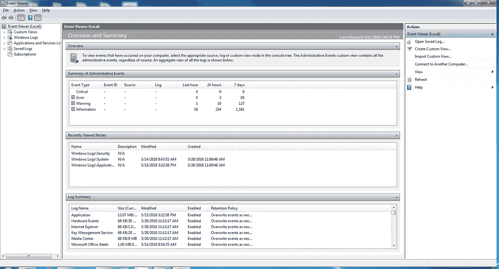
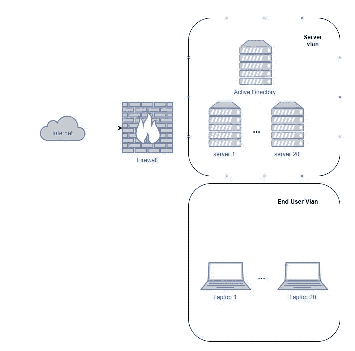
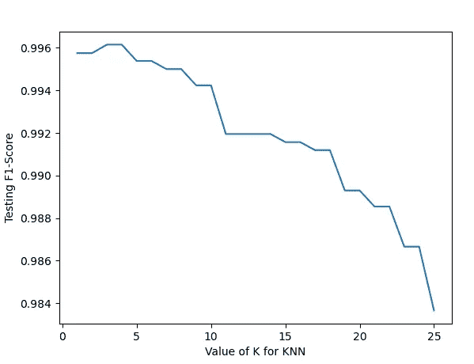
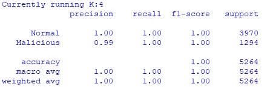

# Windows 用户异常检测

> 原文：<https://medium.com/analytics-vidhya/cyber-security-in-machine-learning-windows-user-anomaly-detection-e0d3457dea32?source=collection_archive---------3----------------------->


[nvtrlab](https://pixabay.com/images/id-385993/) @pixalbay

## 网络安全中的机器学习

## 通过机器学习检测异常用户登录的用例

> SOC 分析师通常是网络威胁的第一响应者。soc 分析师的日常工作是从成千上万的合法事件中搜寻恶意事件。然而，我们中的大多数人，比如我自己，在用尽了所有传统的方法(比如 MITRE mapping)之后，经常会纠结于我们应该从“什么”开始。在本文中，我将介绍一个用例，说明我们如何通过机器学习来实现用户登录活动的异常检测，这可能会为其他分析师提供一个基准/参考。

**什么是 Windows 事件日志？**

Windows 事件日志是 Windows 存储的系统、安全和应用程序通知的详细记录，供管理员用来诊断系统问题和预测未来问题。Windows 事件日志中有几个不同的类别。从安全的角度来看，我们将始终研究存储在% SystemRoot % \ System32 \ wine vt \ Logs \ security . evtx 下的安全事件。

Microsoft 在其 Windows 服务器和客户端操作系统中包含了事件查看器，用于查看 Windows 事件日志。用户通过单击开始按钮并在搜索字段中输入事件查看器来访问事件查看器。然后，用户可以选择并检查所需的日志。



图片来自 techtarget.com

**什么是 EventCode 4624:帐户成功登录？**

事件代码 4624 是网络安全分析师或事件响应者最常关注的事件之一。它捕获一个人登录到设备的时间和其他信息，并提供有价值的信息来确定任何受损事件的时间表。事件示例如下所示，可从 [Windows 事件查看器](https://www.ultimatewindowssecurity.com/)中查看:

```
An account was successfully logged on.

Subject:
    Security ID: SYSTEM
    Account Name: DESKTOP-LLHJ389$
    Account Domain: WORKGROUP
    Logon ID: 0x3E7

Logon Information:
    Logon Type: 7
    Restricted Admin Mode: -
    Virtual Account: No
    Elevated Token: No

Impersonation Level: Impersonation

New Logon:
    Security ID: AzureAD\RandyFranklinSmith
    Account Name: rsmith@montereytechgroup.com
    Account Domain: AzureAD
    Logon ID: 0xFD5113F
    Linked Logon ID: 0xFD5112A
    Network Account Name: -
    Network Account Domain: -
    Logon GUID: {00000000-0000-0000-0000-000000000000}

Process Information:
    Process ID: 0x30c
    Process Name: C:\Windows\System32\lsass.exe

Network Information:
    Workstation Name: DESKTOP-LLHJ389
    Source Network Address: -
    Source Port: -

Detailed Authentication Information:
    Logon Process: Negotiate
    Authentication Package: Negotiate
    Transited Services: -
    Package Name (NTLM only): -
    Key Length: 0
```

对于我们将要开发的用例，我们将依赖于此事件代码生成的活动，特别是我们将查看以下字段:

*   **帐户名**:用于访问特定主机的帐户名
*   **工作站名称**:端点主机名
*   **源网络地址**:发起登录的 IP 地址

**我们想解决的问题是什么？**

用户异常是指寻找罕见登录模式的练习。例如，如果谷歌/脸书发现你的尝试来自一个未知的 IP 地址，他们会提示你进行额外的认证。根据我的日常经验，您会知道每台设备都有稳定的登录模式，因为大多数 IT 操作都是重复的，所以它们的登录模式非常简单。但是，如果您的设备遭到破坏，会发生什么情况？我假设—在事件中，您的设备受到黑客的完全控制，他们需要执行的第一步是收集有关您的 IT 环境的信息，因此我们很可能会看到正常用户不会触发的不同设备的异常登录 —这是我们希望通过机器学习来验证的。

**我们的实验室设置**

现在我们有了基本的。我们需要数据来开始我们的开发。因此，我在虚拟机中创建了一个实验室:



基本的实验室设置

这是一个相当基本的设置，其中有一个活动目录。所有的服务器和笔记本电脑可以互相通信。活动目录也是使用模拟工具用不同的用户名和密码生成的。还创建了一个脚本来生成来自不同服务器/笔记本电脑的每日登录。我还参考了一些真实的生活数据，以防万一，以模拟现实生活中的情况。

接下来，为了执行一些已知的不良行为，我执行了两次攻击:

*   横向移动使用[的**传票**的](https://attack.mitre.org/techniques/T1097/)
*   用户和设备枚举使用**[**blood hound**](https://attack.mitre.org/techniques/T1484/)**

**这两个都是一些常见的侦察和横向移动技术。这构成了我们“正常”和“恶意”数据的基础。**

****模型选择— *K-最近邻*****

**生成原始日志样本后，我通过 Eric Zimmerman 提供的我最喜欢的工具之一将 evtx 事件转换成 csv 格式— [EvtxECmd](https://ericzimmerman.github.io/)**

**我们需要选择正确的算法来开始我们的工作。在我写这篇文章之前，我尝试使用一些不同的算法和特性生成方法。最后，我选了 K 个最近的邻居。**

**K-最近邻是 a**

*   ****监督机器学习算法**因为我们需要知道目标变量。**
*   **不要对数据分布模式做任何假设**
*   **使用**特征相似度**预测聚类和新点将落入的位置。**

**KNN 最大的优点是，它们可以帮助您选择正确的邻域来决定新数据点的归属。在我们的活动中，每个 IT 环境都是不同的，因此根据功能相似性做出决定对我们来说似乎是理想的。**

**关于 KNN 如何运作的细节，你可以点击这里查看。**

****特征生成****

**特征生成也是我们需要解决的另一个问题。把我们所有的日志做成有意义的事件，让机器学习去学习。我们需要将我们的日志转换成机器学习功能和数据集。我已经尝试了一些不同的功能，包括登录时间，登录的变化。**

**最后，我生成了下面的特性:**

*   ****islan** —检查源 IP 地址是否是局域网 IP 地址(如果是局域网 IP 地址，会标记为 1。对于其他 IP 地址，它将被标记为 0。)**
*   ****isnewip** —检查源 ip 地址是否是访问服务器或工作站的新 IP 地址(例如，在过去 7 天内，我们是否看到来自该 IP 地址的任何类似登录尝试？)**
*   ****isvpn** —检查源 IP 地址是否为 VPN IP 地址(如果是 VPN IP 地址，会标记为 1。对于其他 IP 地址，它将被标记为 0。)**
*   ****百分比** —来自该 IP 地址的登录事件总数/该服务器的登录事件总数(过去 1 天)**
*   ****src _ IP _ c**—15 分钟滑动窗口内成功登录的计数。**
*   ****标签** — 1 代表恶意流量，0 代表正常流量。**

****使用的 Python 脚本****

**设置好一切后，最后一件事是将所有这些信息放入要运行的 sklearn python 脚本中:**

```
from sklearn.neighbors import KNeighborsClassifier
from sklearn import metrics
from sklearn.model_selection import train_test_split
import pandas as pd
import matplotlib.pyplot as plt# loading data - for my case, I divided my dataset into good data and malicious data 
df1 = pd.read_csv("<path>\\user_good.csv")
df2 = pd.read_csv("<path> \\user_bad.csv")
df = pd.concat([df1,df2])# feature used 
feature_cols = ['isnewuser','isnewip','isvpn','islan','percent','src_ip_c']
X = df[feature_cols]
y = df['tag']# train and split data for testing 
X_train, X_test, y_train, y_test = train_test_split(X,y, test_size=0.4)
k_range= range(1,26)
scores = []# Finding the best K 
for k in k_range: 
    knn = KNeighborsClassifier(n_neighbors=k)
    knn.fit(X_train, y_train)
    y_pred = knn.predict(X_test)
    scores.append(metrics.f1_score(y_test, y_pred))

    targetname = ['Normal','Malicious']
    result = metrics.classification_report(y_test,y_pred,target_names=targetname)
    matrix = metrics.confusion_matrix(y_test, y_pred, labels = [0,1]) 
    print ('Currently running K:' + str(k))
    print (result)
    print (matrix)# Plotting as graph plt.plot(k_range, scores)
plt.xlabel('Value of K for KNN')
plt.ylabel('Testing Accuracy')
plt.show()
```

**上面我们使用的脚本也是为了找到邻居的最佳数量。**

****结果****

**结果，我用不同数量的 K 对模型的 F1 分数绘制了一个图表。**

****

**测试 F1 分数**

**结果实际上表明，当 K = 4 时，模型表现最佳。**

****

**结果表明，当 K = 4 时，模型表现最好。**

****把这个放进 SOC 警报****

**有了上面的准确性和 f1 分数，我将模型作为每日报告运行。平均来说，我意识到我在寻找恶意登录上至少少花了 5 到 10 分钟。该模型也非常有助于实现取证分析。当我从映像设备中提取 eventlog out 时，我可以快速运行模型来识别任何异常的设备登录，以确认初始入口点:)。**