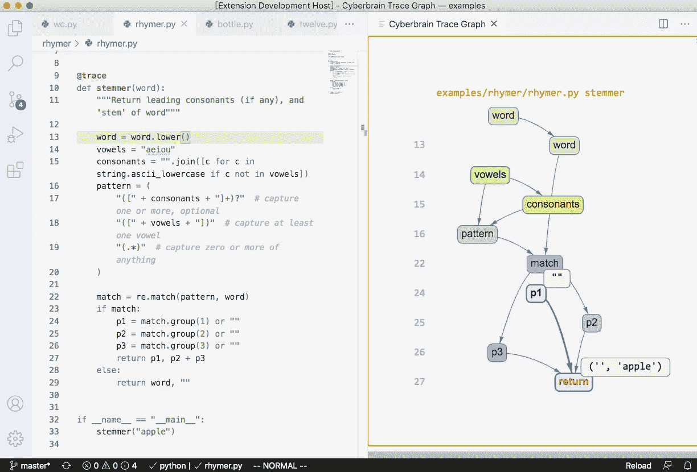

# Cyberbrain: Python 调试，重新定义。

> 原文：<https://medium.com/analytics-vidhya/cyberbrain-python-debugging-redefined-1db4c47a4d32?source=collection_archive---------3----------------------->

## 调试 Python 代码

如果说调试是去除软件 bug 的过程，那么编程一定是把 bug 放进去的过程——**Edsger Dijkstra**

赛博大脑调试。图片来源:[赛博大脑](https://user-images.githubusercontent.com/2592205/95418789-1820b480-08ed-11eb-9b3e-61c8cdbf187a.png)

C yberbrain 是一个 Python 调试解决方案，旨在**解放程序员**。它可视化**程序执行**和**每个变量如何变化**。Cyberbrain 旨在将程序员从调试中解放出来。它可以让您: