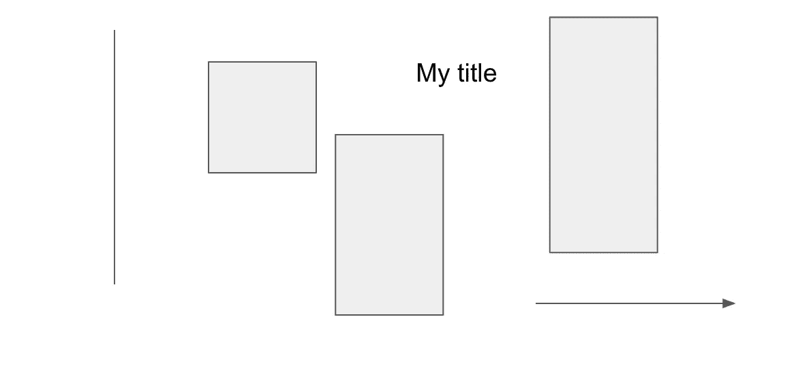
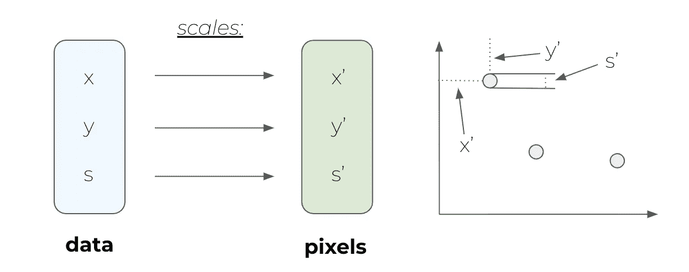
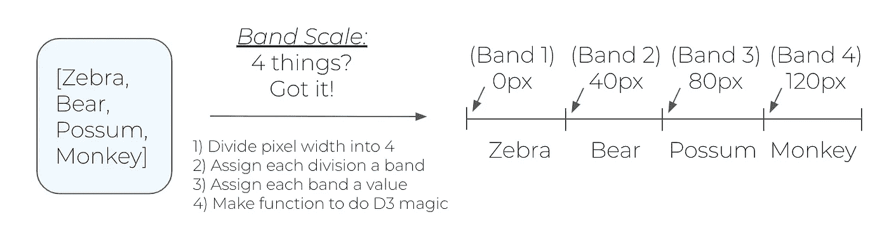

# D3 + DS:第 4 部分

> 原文：<https://medium.com/analytics-vidhya/d3-ds-part-4-add657154679?source=collection_archive---------11----------------------->

## 条形图和散点图

> 我在这篇文章中提到的可视化可以在[这里](http://ltjds.github.io/post/d3pds_1/)找到。

# 介绍

同样，这个中级系列的目的是记录我有效使用 D3 的过程中的关键点。对于每个帖子，我都会在我的[博客](http://ltjds.github.io)上有一个相应的帖子，展示一个可视化，在这里我将讨论制作可视化所涉及的一些主要概念。这些帖子不是为了教你如何使用 D3 ，但是

> 这个系列将帮助您更好地理解有时会被忽略的深奥的 D3 概念。

我们将从非常简单的*开始(例如，一个柱状图和散点图)，最终我希望使用谷歌云应用引擎上的 API 来构建更复杂的 D3 web 应用。*


所有的 JavaScripts。

# 约定

在用 JavaScript 编写了一些代码后，看了看其他人的代码(甚至除了斯考特·玛瑞的)，我发现我应该考虑改变我的变量约定。从现在开始，我采用了一些我认为很有效的方法:

在 HTML 和 CSS 中:

*   任何不是特殊关键字的东西:带连字符的文本(例如，`my-new-id`)

在 Python 中:

*   变量和函数:小写，带下划线(如`var_1`)
*   类别:帕斯卡格，或大写的骆驼格(例如，`TextDecomposition`)

在 JS 中:

*   变量:带下划线的小写字母(如`var_1`)
*   功能和分类:骆驼案(如`sizeScale`)

这里(即在上面的 JavaScript 中)与标准只有微小的不同，但我认为这至少比将一种语言(即 Python)的惯例完全强加于另一种语言要好。也许这会让我的代码更容易被别人接受。

# 条形图



一个条形图，从 D3s 的角度来看。它不在乎。

在 D3 上构建柱状图的最大收获之一来自于我们在编写柱状图时对柱状图的思考方式。通常，当我们使用 MS Excel、Matplotlib，甚至 Plot.ly 来构建一个条形图(如果矩形是垂直的，实际上称为“柱形图”)时，我们将所发生的事情概念化为类似这样的事情:*我需要给平台(例如 plot.ly)一个* ***n*** *标签-值对的列表，平台将从*

然而，D3 的情况并非如此。请记住，在一天结束时，在 D3 中，我们正在“绘制”一个 SVG，而 SVG 没有轴的概念，也没有某种条形图框架/设计。所以，我们需要告诉它在哪里放置条形图的所有组件。你可以查看与博客上的图相对应的 JavaScript 代码[,看看不同的组件是如何绑定的，以及它们是如何绘制的。](https://github.com/ltjds/blog/tree/master/static/js/d3pds)

## 几个问题

*   SVG 中的`y`值对应于从上到下的位置**。使用 D3 标度，您可以反转脚本对给定的`y`坐标的解释。**
*   就我个人而言，我喜欢使用从上到下的坐标平面来设计我的条形图*的代码，简单地说，任何条形的矩形都位于`height — v`(即左上角)，其中`height`是绘图区域的高度，`v`是与条形相关联的值。查看下面的代码…*

```
rect.enter()
    .append("rect")
    .attr("x", d => xScale(d[label_var]))
    .attr("y", d => height - yScale(d[barheight_var])) // <- HERE
    .attr("width", xScale.bandwidth())
    .attr("height", d => yScale(d[barheight_var]))
    .attr("fill", function(d) {
        // The next line is sloppy, until we learn color scales
        return "rgb(0, 0, " + 
                   (200 - Math.round(d[barcolor_var])) + ")";
    });
```

*   对于文本,( x，y)位置对应于文本的[基线](http://facweb.cs.depaul.edu/sgrais/Type%20font_anatomy.htm)处最左边的点。您可以使用`.style("text-anchor", "middle")`将`x`设置为中间。

# 散点图

一旦你能克服整个反向 y 轴的事情，理解一个简单的散点图的架构并不是那么糟糕。对我来说，最大的收获是避免点接触轴线。为此，我们为 D3 可视化创建了一个类似 HTML 的框架[,其余的维度将依赖于这个框架。](https://bl.ocks.org/mbostock/3019563)

> 关于上面的“框架”链接，我在代码中做了一些修改，这样它就可以在版本 5 中正常工作了。试着挑出不同之处！

另外注意， ***永远不要把圆的大小映射到半径*** 。我们应该始终将大小映射到*区域*。我们通过它覆盖的墨水量或面积来感知事物的“大”，如果我们使用半径(记住等式 A = πr ),那么面积就会扭曲。也就是说，对应于值 2、4、6 和 8 的圆将被解释为大小为 4、16、36 和 48 的圆，这描绘了与现实*大不相同的*画面。

# 天平

如果你还记得我关于绑定的讨论，你可能会意识到数据通常不会自己映射到像素，所以我们使用比例来做这件事。记住，D3 可视化是 D3 数据绑定的可视化元素的集合。还要记住，可视化组件本身实际上是具有相应像素属性的 SVG 对象。每个可视元素背后的数据(例如，散点图中点的 x、y 和大小属性)需要被缩放，以便它们以像素形式被正确地表示。



我描述 D3 音阶的初步尝试；还记得 y '的自顶向下的 SVG 框架吗

D3 的美妙之处在于，在扩展数据时，您只需提供

1.  标度(例如，线性、对数、颜色等。)
2.  一个域(进入的*数据*的最小值和最大值)
3.  一个范围(出现的*像素*的最小和最大值)

> 注意:对于这里的#3，*像素*也可以指*颜色*，就像我们使用色标一样。

之后 D3 做剩下的！构建将输入转换为输出所需的等式是在幕后完成的。因此，假设您想要一个*线性*标度(即`.scaleLinear`，其中值之间的“距离”被同等地解释为数据中的内容)，您有`d = [10, 20, 30, 40]`的传入数据，但是您想要视觉元素的范围在 5 到 20 像素之间。D3 做了数学计算，确定你想要的是一个`function`，它接受你的输入`d`，输出`1/2 * d`(这只是一个*线性*方程， *y = 1/2x* )，其中输入是某个值单位，输出是像素。

把音阶想象成一种转换功能，你就可以开始了。有各种各样的比例，但归根结底，它们是将数据映射到像素或颜色的函数。

在上面的代码示例中，我忽略了`xScale`，但是应该说我使用了一个*序数* `scaleBand`，它接受一个*有序的*域(在这种情况下是文本标签)并将它们映射到它们的波段的对应点。



乐队音阶！耶！

既然你知道线性刻度和带状刻度是如何工作的，你可以很容易地为自己概念化如何思考*时间*刻度、*颜色*刻度、*对数*刻度等等。归根结底，这只是数据到像素(或颜色)的简单映射。

> (还有*名义*标度，其顺序无关紧要，但域也是项目列表而不是界限)。

# 轴线

所以，请记住，在 D3 中，我们正在绘制 SVG 对象(线条、矩形、圆形等。).还记得 D3 没有一次呈现多个东西，但是它提供了浏览器这样做所需的脚本。这样，当我们在 D3 中设计轴时，我们实际上是在为一个脚本做准备，这个脚本将在浏览器打开页面时*生成*轴。在生成这些轴时，我们使用 D3 为 SVG 中的每个轴定义一个`<g>`(组)，并让 D3 告诉浏览器如何在给定数据绑定的情况下动态填充那个`<g>`标签。

D3 里只有*四个*异轴发电机:`d3.axisTop`、`d3.axisBottom`、`d3.axisLeft`、`d3.axisRight`。但是，这些实际上只定义了轴的外观(例如，对于`d3.axisBottom`，标签在轴的下面，默认情况下是水平的)。现在，事情是这样的，看起来很简单，不言自明，但我还是要说:

> D3 轴需要* **数字*** 才能工作

数字。不是日期、标签或百分比，而是ℝ的数字(实数)。如果是这样的话，我们是如何得到柱状图的 x 轴，或者散点图中的日期的呢？如上所述，我们使用[标尺](https://github.com/d3/d3-scale)来实现这一点。

最后要注意的是，记住最好在最后调用这些(轴和标题)*以便它们出现在顶部，因为 SVG 是按照代码指示的顺序绘制的。*

# 一般问题

*   如果您使用 Pandas，**在将数据发送到 D3 之前，请始终插入或删除您的 NA 值**！否则事情看起来就不对了。
*   在 JavaScript (ES6 及更高版本)中，如果你要连接字符串和非字符串，记得在所有非字符串的两边加上括号，或者使用`${}`语法。那就是:

```
// Version 1
variableText = "blah blah" + (var1 + var2) + "other blah blah"// Version 2
variableText = `blah blah ${var}` 
```

我发现自己在使用版本 1 时遗漏了括号，并且在试图弄清楚发生了什么时感到沮丧…

*   **保持更新函数的唯一性**如果你要在同一个页面上进行多次更新(或多次绘图)，确保函数的命名不同。即使您正在导入多个。js 脚本，浏览器的解释器将读取所有的*，并覆盖任何同名的内容。不考虑。js 文件，保持更新函数的唯一性！*
*   *如果你还不是前端开发人员，那就要擅长测量像素尺寸。一堆微调可能会是很好的训练。*

# *最后一点*

*哦伙计。迈克·博斯托克又成功了。*

*看看 https://observablehq.com 的！基本上就是一个 JavaScript 和 HTML 的 Jupyter 笔记本！老实说，这个复活节彩蛋对我来说是最有用的东西之一，在我构建可视化的时候，它可以测试代码。*

# *下一步是什么？*

*互动宝贝！在下一篇文章中，我将会讲述一些使用 D3 交互性的要点。这只是一个很大的互动情节，但我也会确保融入一些有趣的数据科学概念。谁知道呢，也许我们甚至会在谷歌云上建立一个 API！*

**【众人呜啊呜啊……】**