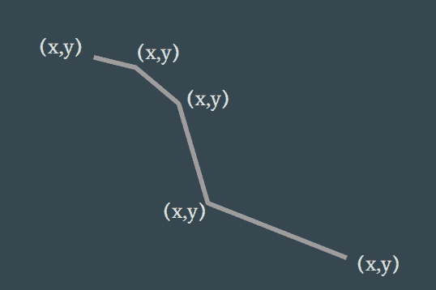

# D3.js 基础到精通第 1 部分基础

> 原文：<https://medium.com/analytics-vidhya/d3js-basic-to-mastery-bf5459836970?source=collection_archive---------8----------------------->


如果你点击了这篇文章，我想你已经知道 d3js 是什么了，你可以在官方网站[https://d3js.org/](https://d3js.org/)浏览。

> **D3.js** 是一个基于数据操作文档的 JavaScript 库。 **D3js** 帮助您使用 HTML、SVG 和 CSS 将数据变得生动。

可以把 D3js 看作是针对数据的 JQuery，这使得根据数据操作 DOM 变得非常容易。D3js 还具有活力化特性，我们将在这一系列文章中详细介绍。这篇文章是为了了解 D3js 的基础知识。

# 先决条件:

*   超文本标记语言
*   半铸钢ˌ钢性铸铁(Cast Semi-Steel)
*   Java Script 语言

# 建立

1.  `<script src="https://d3js.org/d3.v5.min.js"></script>` CDN 方式
2.  NPM 道`npm install d3`

为了简单起见，我们将坚持 CND 方式，以便让初学者容易理解。只需在 html 文件的头中包含 script 标记，就可以开始了。

# 选择

1.  `d3.select(“*selection query*”)`
2.  `d3.selectAll(“*selection query*”)`

按 F12 打开控制台，最后会有选择的日志。

*点击 HTML、CSS 或 JS 标签查看代码*

d3js 中的大多数函数返回上下文，这意味着您可以一个接一个地链接您的函数。您将在接下来的示例中看到这样的链接。

# DOM 操作

式样

*   `d3.select("*selection query*").style("color","red")`

属性

*   `d3.select("*selection query*").attr("width","20%")`

切换类别

*   `d3.select("*selection query*").classed("active",true)`

内部文本

*   `d3.select("*selection query*").text("Some Text")`

插入 HTML

*   `d3.select("*selection query*").html("<div class="block"></div><div>0 - 10</div>")`

更改属性

*   `d3.selectAll('.checkbox').property('checked', false)`

追加元素

*   `d3.select("*selection query*").append("*tag*")`

# 挽救（saving 的简写）

可缩放矢量图形(SVG)是网络上 2D 视觉效果的构建块。它是一种基于 XML 的标记语言，用于描述基于二维的矢量图形。由 w3 开发，现在正成为主流并得到广泛支持。
D3js 本质上是为 SVG 构建的。SVG 之所以如此酷，是因为它们就像处理常规 DOM 元素一样。学习 D3js，学习 SVG 很重要。

让我们创建一个带有标签`<svg></svg>`
的 svg。默认情况下，如果没有声明，svg 的宽度为 300 像素，高度为 150 像素。您可以将宽度和高度声明为属性或 css 样式元素。
例如:`<svg width="500px" height="500px"></svg>`

现在把 svg 想象成一个 500x500 像素的网格，我们将使用这些网格坐标来放置元素。
让我们尝试在 SVG 上制作基本的形状

# 线条

一条线需要 2 个起点和终点，起点为 x1，y1，终点为 x2，y2。
为了在屏幕上显示，svg 中的任何元素都需要有一个笔画颜色
例如:`<line x1="100" y1="100" x2="400" y2="400" stroke="black"/>`

*点击 HTML、CSS 或 JS 标签查看代码*

## 用 d3 创建一条线

```
d3.line()
```

*点击 HTML、CSS 或 JS 标签查看代码*

我们使用`d3.line()`初始化一个行生成器，然后通过向它传递数据来调用它。Line generator 将遍历数据数组以获得 x 和 y 值，然后生成路径数据。我们可以将它传递给`path`的`d`属性。我们将在以后的文章中了解更多关于线生成器的内容。

点击 codepen 示例右上角的 edit on codepen，取消注释第二个数据变量，注释掉第一个数据变量，检查线条的形状，这是单个`line`标签无法实现的。

在构建数据可视化时，有时您希望静态放置不需要生成器函数的形状。所以最好知道基本的形状。

svg 中有 6 个形状标签。

*   线`<line x1="0" y1="0" x2="200" y2="200" />`
*   矩形`<rect x="50" y="20" width="150" height="150" >`


*   圆形`<circle cx="50" cy="50" r="50"/>`


*   椭圆`<ellipse cx="200" cy="80" rx="100" ry="50" />`


*   多边形`<polygon points="220,10 300,210 170,250 123,234" />`


*   折线`<polyline points="20,20 40,25 60,40 80,120 120,140 200,180" />`



和

*   路径可以采取任何形状，我们将进一步讨论

和

*   group`<g>`它类似于 svg 的 div，用于对多个元素进行分组和操作。
*   文本`<text x="0" y="15" >I love SVG!</text>`用于放置文本

SVG 有许多元素。如果你想了解更多关于 SVG 形状的知识，请直接阅读 [MDN SVG 元素](https://developer.mozilla.org/en-US/docs/Web/SVG/Element)

D3js 还提供了基本的形状生成器
，你可以在这里[查看](https://bl.ocks.org/d3indepth/raw/bae221df69af953fb06351e1391e89a0/)


## 小路

如果你只是想学习 d3js，没有必要学习`path`数据，你可以跳过这一部分，因为这有时会变得太混乱而无法理解概念，它只是帮助你理解当你制作`path`时背景发生了什么。让我们举一个最简单的例子，做一条线

我们传递给`path`的数据是`M100,100 L400,400`。
路径数据总是以`M`开始，表示移动，从你想要开始绘制的点开始，每个坐标取两个点 x 和 y。我们给出了从 svg 的`100,100`坐标开始的`M100,100` 。还有小写的`m`从最后一个点移动，而不是从 svg 开始。之后，我们用`L400,400`表示线及其坐标，线从`M`或`m`的起点画出。小写`l`从其父代而不是 svg 中取点。

同样，我们也有

*   移动`M` `m`
*   `L`行`l`
*   水平`H` `h`水平画线
*   垂直`V` `v`垂直画线
*   闭合路径`Z`用一条线连接起点和终点

以下是水平、垂直和封闭路径的一些示例

为了制作曲线，我做了一些可视化工具，让它更容易理解。摆弄滑块，看看哪个值影响曲线的哪个部分。

*   三次贝塞尔
    、`C`、`c`

`S`，`s`

*   二次贝塞尔
    `Q`，`q`，
    ，`T`，`t`

*   椭圆弧
    、`A`、`a`

[](https://codepen.io/krngd2/pen/PoogNPo) [## SVG 路径弧

### 编辑描述

codepen.io](https://codepen.io/krngd2/pen/PoogNPo) 

# 天平

如果你已经看过 d3 线生成器的例子，我们已经使用数据来匹配我们的 svg 点，就像我们使用数据`100,100`从 svg 的点`100,100`开始，但是我们永远不会得到可以匹配我们的 svg 的数据。一些数据可能是浮点的，一些可能是长整型的，一些是日期格式的，等等。d3js 里的`Scales`来解决这个问题了。d3j 有一些巧妙的特性来处理数据。让我们看一个最简单的例子

## `d3.scaleLinear()`

在上面的例子中，我们将分数转换成了百分比，简单地说就是我们取了一个数值范围，并将其放入 0 到 100 的范围内。我们用这个来适应我们的数据范围，适应`svg`的宽度或高度范围。

现在看看这个例子

我们采用了不适合我们的 svg 的不同数据集，然后对其进行缩放以适应它。

这是我们的数据

```
let data = [
       {x:-60,y:1120},
       {x: 50,y:400},
       {x:160,y:220},
       {x:190,y:280},
       {x:330,y:360},
       {x:420,y:80 },
       {x:560,y:560},
       {x:620,y:120},
       {x:930,y:700},
       {x:1120,y:-60}
     ]
```

在前一篇文章的例子中，我们已经将数据直接传递给了行生成器，但是在这个例子中，我们的数据非常不同，所以我们必须定义行生成器的访问器。让线条生成器知道 x 和 y 点在对象数组中的位置。像这样

```
let lineGenerator = d3.line()
                      .x(d => d.x)
                      .y(d => d.y)
```

Line generator 将遍历数据数组，获取 accesor 函数`.x(d => d.x).y(d => d.y)`返回的 x 和 y 值，然后生成路径数据。为了使数据适合 svg，需要相应地缩放数据。在它被传递到 x 和 y 值之前，我们必须对它进行缩放。
首先，我们通过将最小和最大值传递给域并将 0 传递给 svg 的宽度或高度来初始化标度，当值被传递时，它返回 svg 的适当点。
我们的 svg 的最低点是-60，最大值是 1120，可以传递给域，svg 宽度是 500px，可以传递给范围。

```
const scale = d3.scaleLinear()
                      .domain([-60, 1120])
                      .range([0, 500])
```

和转换数据

```
const lineGenerator = d3.line()
                      .x(d => scale(d.x))
                      .y(d => scale(d.y))
```

检查`lineGenerator`有无刻度的结果

[https://codepen.io/krngd2/pen/oNNVEyv](https://codepen.io/krngd2/pen/oNNVEyv)

我们可以在`d3.extent(data, accessor)`的帮助下得到给定数据的最小值和最大值，它将返回一个长度为 2 的数组。

使用`d3.min(data,accessor)`和`d3.max(data,accessor)`获得最小值或最大值。你可以在 d3js [这里了解更多关于数组的方法 d3-array](https://github.com/d3/d3-array)

d3js 中有 12 种缩放类型，分为 3 种类型

1.  连续输入和连续输出

*   `[d3.scaleLinear()](https://github.com/d3/d3-scale#linear-scales)`

2.连续输入和离散输出

*   `d3.scaleQuantize()`
*   `d3.scaleQuantile()`
*   `d3.scaleThreshold()`

3.离散输入和离散输出

*   `d3.scaleOrdinal()`
*   `d3.scaleBand()`
*   `d3.scalePoint()`

你可以在这里了解它们[D3-scale](https://github.com/d3/d3-scale)

# 数据绑定

数据可视化意味着处理数据。我们希望以高效的方式访问我们想要的数据。Joins 帮助我们以有效的方式将数据绑定到 DOM 元素。

要将数据加入 DOM，你只需要在选中的 d3 元素上调用`.data()`,并将数据作为参数传递。在下面的例子中，我们有 5 个圆形元素。选择所有元素，并通过向其传递数据来调用`.data()`。

`.data()`函数将遍历数据，并将数据逐个绑定到每个节点。按 F12，重新加载页面并检查控制台日志。您将找到我们选择的节点列表，并展开第一个元素向下滚动到底部，您可以看到 `__data__`具有绑定到该元素的相应数据，您可以在任何时候访问该特定元素`select`。


无论您是否观察到，我们的数据长度只有 4，但是我们已经将该数据绑定到 5 个选定的元素。检查相同日志中的第五个元素，它将没有`__data__`属性。

借助于添加数据的`.enter()`函数和删除数据的`.exit()`函数，D3 为我们提供了调整 DOM 元素的简单方法。两个函数都返回额外的数据，但是`.enter()`后跟`.append()`将添加额外的元素，而`.enter()`后跟`.remove()`将删除额外的元素。

## 移除示例

## 附加示例

每个函数都将获得绑定数据作为回调参数，我们可以用它来验证技巧。比如有条件地改变它的属性和 CSS 属性的值。

回调函数返回的参数为(数据，索引，所有节点)
现在尝试在这一行为奇数索引的圆使用不同的颜色

```
.attr('fill',(data) => data.r < 35 ? 'red' : 'orange')
```

到此为止，我们已经了解了 D3js 的基本原理。

用这些知识尝试一些新的东西，并在回复中评论 CodePen 链接。等着看你的创意。