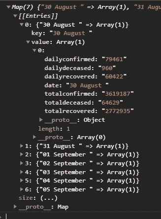

# D3js 基础到精通第 2 部分精通

> 原文：<https://medium.com/analytics-vidhya/d3js-basic-to-mastery-part-2-mastery-680db40f2ec5?source=collection_archive---------13----------------------->


世界各地新冠肺炎活跃的案例，泡沫比较[https://covidwithd3js.kiran.dev/worldbubble/](https://covidwithd3js.kiran.dev/worldbubble/)

在 [***上一篇文章***](/@krngd2/d3js-basic-to-mastery-bf5459836970) 中，我们学习了 D3js 的基础知识，比如选择、DOM 操作、SVG、缩放和数据绑定。如果你正在开始使用 D3js，我强烈推荐你先阅读[的那篇文章](/@krngd2/d3js-basic-to-mastery-bf5459836970)，然后再回到这里。

[](/@krngd2/d3js-basic-to-mastery-bf5459836970) [## D3js 基础到精通第 1 部分基础

### 如果你点击了这篇文章，我想你已经知道 d3js 是什么了，你可以在…

medium.com](/@krngd2/d3js-basic-to-mastery-bf5459836970) 

让我们深入了解本文中的**和**、**数据操作**和**布局**的世界。

# 事件处理

可以通过在选择元素上调用`.on(event, function)`并传递侦听器的类型来附加事件。

让我们从最基本的交互功能开始。

在上面的例子中，点击 js 标签。看看附在圆圈上的所有事件处理程序是什么。按 F12 重新加载页面并打开控制台，然后单击“运行笔”。这个控制台记录所有传递给回调函数的参数。
`circles.on(‘mouseover’, (event, data)=> {})`第一事件详细信息，第二债券数据。这个`event`用于获取当前事件的详细信息，这些信息可用于各种操作，如拖放和缩放。或者，你可以像这样直接访问 js 中的`event``circles.on(‘click’, () => console.log(“Event”, event))`
`circles.on(‘dblclick’, ondblClick)`:在双击事件时，在这个例子中我们传递了一个函数，将元素“变红”。
`circles.on(‘wheel’, (d, i, n) => console.log(“weeeee”, i))`:关于滚动事件，这对于用户友好的缩放事件和最后一个例子`ondrag`事件非常方便，这两个事件有点不同，我们必须在元素上调用`d3.drag()`函数。其中有类似`start`、`drag`、`end`的 on 事件。

```
circles.call(d3.drag()
.on(“start”, console.log) 
.on(“drag”, onDrag) 
.on(“end”, console.log))
```

在`onDrag`函数中，我们选择元素，并用其`event`的`x` 属性更改其`cx`属性。

```
function onDrag(d,i,n) {
 d3.select(this).attr(“cx”, event.x) 
}
```

记住只有传统的`function`在`this`中传递上下文，而箭头函数引用它的相对父上下文。如果它是一个箭头函数，它应该是这样的。

```
const onDrag = (d,i,n) => {
 d3.select(n[i]).attr(“cx”, event.x) 
}
```

下面是最常用的鼠标事件列表。

*   `click`:鼠标点击元素。
*   `dblclick`:鼠标双击元素。
*   `contextmenu`:鼠标右键点击元素。
*   `mouseenter`:鼠标进入元素。
*   `mouseleave`:鼠标离开元素。
*   `mousemove`:鼠标在元素上移动。
*   `mouseout`:鼠标离开元素或它的任何子元素。
*   `mouseover`:鼠标进入该元素或其任何子元素。

对于[触摸界面，阅读此处](https://developer.mozilla.org/en-US/docs/Web/Events#Touch_events)

点击查看更多信息。

还有更多 D3js 提供的互动功能

*   `[d3.drag](https://github.com/d3/d3/blob/master/API.md#dragging-d3-drag)`:用鼠标拖动事件。
*   `[d3.zoom](https://github.com/d3/d3/blob/master/API.md#zooming-d3-zoom)`:鼠标滚轮缩放事件。
*   `[d3.brush](https://github.com/d3/d3/blob/master/API.md#brushes-d3-brush)`:可用于选择区域或缩放。
*   `[d3.force](https://github.com/d3/d3/blob/master/API.md#forces-d3-force)`:模拟重力动画

跟随我了解这些交互式可视化的发展。

## 工具提示示例:

[https://codepen.io/krngd2/pen/YzqYNRe](https://codepen.io/krngd2/pen/YzqYNRe)

# 数据操作

D3js 带有各种数据操作函数，在处理任何类型的数据时都非常方便。

以印度新冠肺炎案例的数据为例。

```
**[{** “dailyconfirmed”: “78168”,
”dailydeceased”: “892”,
”dailyrecovered”: “62145”,
”date”: “01 September “,
”totalconfirmed”: “3766121”,
”totaldeceased”: “66337”,
”totalrecovered”: “2899515”
**},
.......
......
.....
{** “dailyconfirmed”: “90600”,
”dailydeceased”: “916”,
”dailyrecovered”: “73161”,
”date”: “05 September “,
”totalconfirmed”: “4110852”,
”totaldeceased”: “70095”,
”totalrecovered”: “3177666”
**}]**
```

这是一个对象数组，如果我们想得到最大的`dailyconfirmed`例，你有`d3.max(data, accessor)`例

```
d3.max(data,(p)=> p["dailyconfirmed"] ) // returns "90600"
```

同样，我们也有

## 最大

`d3.max(*iterable*[, *accessor*])`:返回最大值
`d3.maxIndex(*iterable*[, *accessor*])`:返回最大值指标
`d3.greatest(*iterable*[, *comparator*])`:返回最大指标对象

## 福建话

`d3.min(*iterable*[, *accessor*])`:返回最小值
`d3.minIndex(*iterable*[, *accessor*])`:返回最小值的索引
`d3.least(*iterable*[, *comparator*])`:返回最小索引的对象

## 其他人

`d3.sum(*iterable*[, *accessor*])`:返回 Sum
`d3.extent(*iterable)*` *:返回[min，max]组合成一个数组* `d3.mean(*iterable*[, *accessor*])` : *返回平均值*
`d3.median(*iterable*[, *accessor*])` : *返回中间值*

## 转换

有趣的部分开始了。当您想要将数据修改为所需的格式时，转换方法非常方便。让我们了解一下最常用的转换方法。以上述数据为例。

```
d3.group(data, d => d["date"]) 
```

输出



这将返回一个 [*映射*](https://developer.mozilla.org/en-US/docs/Web/JavaScript/Reference/Global_Objects/Map) 带有日期和值的键的其余值。当您希望通过传递日期来访问值时，这很方便，并且对这种数据使用 Map instead Object 也可以提高性能。可以传递更多的回调函数来获取更多的嵌套数据。使用`*Array.from(mapData)*` *转换为数组。*

注意键应该是唯一的，否则它们会被覆盖。如果您希望抛出错误，请使用功能类似的`*d3.index(iterable, keyAccessory)*` 。如果你想自定义输出值数组使用`d3.rollup(*iterable*, *reduce*, *…keys*) // Learn about [.reduce() here](https://developer.mozilla.org/en-US/docs/Web/JavaScript/Reference/Global_Objects/Array/Reduce)`你可以在这里查看更多关于[](https://observablehq.com/@d3/d3-group#:~:text=rollup%20can%20be%20used%20to,according%20to%20the%20reduced%20value.&text=You%20can%20similarly%20get%20the,group%20together%20with%20d3.)****。****

*`d3.range([*start*, ]*stop*[, *step*]) // generates array of values
d3.merge([[1], [2, 3]]) //returns [1, 2, 3]
d3.pairs([1, 2, 3, 4]); // returns [[1, 2], [2, 3], [3, 4]]
d3.shuffle(*array*[, *start*[, *stop*]]) // shuffles the array`*

```
*d3.ticks(*start*, *stop*, *count*)
// returns array of equal interval rounded values
// example
d3.ticks(1, 10, 5)
// returns [2, 4, 6, 8, 10]*
```

*这里我只列出了根据我的经验最常用的方法。你可以在这里阅读所有这些[统计](https://github.com/d3/d3-array/blob/master/README.md#statistics)、[搜索](https://github.com/d3/d3-array/blob/master/README.md#search)、[转换](https://github.com/d3/d3-array/blob/master/README.md#transformations)*

# *布局*

**

*视觉化有很多种类型。D3 为我们提供了一些便利的内置可视化工具，如包装圆圈、树形图、网络图等。*

*为了开发它们，你需要理解一个重要的数据操作方法来产生层次数据。*

***分层数据***

*就像 Scales 获取数据并输出位置点一样，Hierarchical functions 获取分层数据并添加位置 x、y 和其他点，从而产生一定的布局。我们需要先准备一些层次数据。为此我们有`d3.stratify()`。假设我们有这样的数据*

```
*const data = [
  {"name": "Eve",   "parent": ""},
  {"name": "Cain",  "parent": "Eve"},
  {"name": "Seth",  "parent": "Eve"},
  {"name": "Enos",  "parent": "Seth"},
  {"name": "Noam",  "parent": "Seth"},
  {"name": "Abel",  "parent": "Eve"},
  {"name": "Awan",  "parent": "Eve"},
  {"name": "Enoch", "parent": "Awan"},
  {"name": "Azura", "parent": "Eve"}
]*
```

*为了转换成分层数据，我们需要将这些数据传递给`d3.stratify()`*

```
*const hierarchicalDataGenrator = d3.stratify()
                                   .id(d => d.name)
                                   .parentId(d => d.parent)
hierarchicalDataGenrator(data)*
```

**

***输出***

*上面是输出，我们得到分层的数据对象，我们可以得到`hierarchicalDataGenrator.ancestors()`、`hierarchicalDataGenrator.descendants()`、`hierarchicalDataGenrator.leaves()`。通常你不需要直接使用它们。让我们现在建立一些可视化。*

## *包装的圆圈*

**

*世界各地新冠肺炎活跃的案例，泡沫比较[https://covidwithd3js.kiran.dev/worldbubble/](https://covidwithd3js.kiran.dev/worldbubble/)*

*让我们取一个简单的和上面一样的数据，但是增加一个额外的点值。值是其父项下圆的百分比。让我们保留一切。像这样的`{“name”: “Eve”, “parent”: “”, value: 1}`。*

1.  ***使数据分层***

```
*const hDataGenerator = d3.stratify()
                          .id(d=>d.name)
                          .parentId(d => d.parent)
const hData = hDataGenerator(data)*
```

***2。对数值求和***

```
*hData.sum(d => d.value)
console.log(hData)*
```

**

*你可以看到额外的`value`键。这是它的所有子值的总和。*

***3。准备包装布局***

```
*const packLayout = d3.pack()
                     .size([400, 400]);
packLayout(hData)*
```

***4。用它来创建布局***

```
*const nodes = d3.select('svg')
                .append('g')
                .selectAll('circle')
                .data(hData.descendants())
                .enter()
                .append("g")nodes.append('circle')
      .attr('cx', (d) => d.x)
      .attr('cy', (d) => d.y)
      .attr('r', (d) => d.r)
      .style("stroke", "black")
      .style("fill", "none")nodes.append('text')
     .attr('y', (d) => d.y - d.r + 16)
     .attr('x', (d) => d.x)
     .text(d => d.data.name)*
```

***输出***

**

## *树形图*

*几乎所有东西都和上面一样，但是我们用`d3.tree()`代替`d3.pack()`*

***准备布局***

```
*const treeLayout = d3.tree().size([400, 400]);
treeLayout(hData)*
```

***创造***

```
*const svg =  d3.select('svg')//circles
svg.append('g')
    .selectAll('circle.node')
    .data(hData.descendants())
    .enter()
    .append('circle')
    .classed('node', true)
    .attr('cx', (d) => d.x)
    .attr('cy', (d) => d.y)
    .attr('r', 4);// Links
svg.append("g")
   .selectAll('line.link')
   .data(hData.links())
   .enter()
   .append('line')
   .attr('x1', (d) => d.source.x)
   .attr('y1', (d) => d.source.y)
   .attr('x2', (d) => d.target.x)
   .attr('y2', (d) => d.target.y)
   .style('stroke', 'black')*
```

***输出***

**

*点击了解更多关于层级[的信息](https://github.com/d3/d3-hierarchy/tree/v2.0.0)*

*我希望到现在为止你已经对如何玩 D3js 有了很好的了解。我知道我们在这些系列中没有建立任何令人兴奋的图表。在我的下一篇文章中，我们将建立赛车条形图。所以跟着我看更多令人兴奋的东西。*