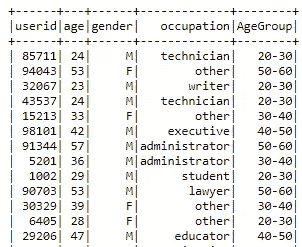

# 探索 Spark UDFs

> 原文：<https://medium.com/analytics-vidhya/dabbling-into-spark-udfs-de52416de6bb?source=collection_archive---------2----------------------->

## 探索 Spark 用户自定义函数并举例说明

嘿伙计们，

我们中的许多人在 spark 数据帧和 rdd 中执行 lambda 函数时都会面临严重的问题。尽管 lambda 函数非常简单，同时也非常有用，但是使用 lambda 函数完成一些任务有时还是有点麻烦。

所以，如果你们在应用 lambda 函数时有点卡住了，让我向你们介绍一下 Spark 中 UDF(用户定义函数)的概念，它的作用类似于…..


正确，spark UDFs 基本上是传递一个 python 函数用于 spark 数据帧或 rdd(我认为有点正统)，很有趣，不是吗！

让我通过一个例子来帮助你探索这个概念。我有一个数据集，其中包含职业数据，如图所示。


所以，我想得到 10 岁范围内的特定年龄组的职业数，即 10-20 岁，20-30 岁，…所以为了得到年龄组，我们将使用火花 UDF 函数。

让我从读取数据集开始…

```
userDF = spark.read.option(“header”, “true”) \
 .option(“delimiter”, “;”) \
 .option(“inferSchema”, “true”) \
 .csv(“user.csv”) \
 .select(‘userid’,’age’,’gender’,’occupation’)
```

所以，现在我们有了数据集，让我们使用 if-else 条件链快速创建一个 python 函数来划分年龄。

```
def age_group(age):
 if age < 10:
 return ‘0–10’
 elif age < 20:
 return ‘10–20’
 elif age < 30:
 return ‘20–30’
 elif age < 40:
 return ‘30–40’
 elif age < 50:
 return ‘40–50’
 elif age < 60:
 return ‘50–60’
 elif age < 70:
 return ‘60–70’
 elif age < 80:
 return ‘70–80’
 else:
 return ‘80+’
```

现在我们的 python 函数已经准备好了，我们将创建一个 spark UDF 函数，并在其中传递 python 函数。

```
from pyspark.sql.functions import udf
agegroup_udf = udf(lambda z: age_group(z))
userDFAgeGroup = userDF.withColumn(‘AgeGroup’,agegroup_udf(F.col(‘age’)))
```

因此，基本上我们将得到 *agegroup_udf* 函数，现在可以在 Dataframe 中传递该函数以对其列执行操作。所以，我在年龄栏上应用了 UDF 函数来得到年龄组(太明显了！).

让我们检查一下我们新出生的数据帧的健康状况



哈利路亚，我们通过申请 UDF 获得了年龄组专栏，这不是很简单吗？现在，让我们根据新添加的列聚合数据，并获得最终结果。

```
userDF_count = userDFAgeGroup.groupBy(F.col(‘AgeGroup’),F.col(‘occupation’)) \
 .agg(F.count((F.col(‘occupation’))).alias(‘count’))
```

让我给你看看我得到的最终结果。


唷，我们终于到达了我们的里程碑，并得到了每个年龄组和职业的计数。UDF 的用途和好处是无穷无尽的，因为这个例子只是打开了 UDF 世界的一个小窗口。

希望你喜欢我的文章，如果你想查看全部代码，请点击下面的 github 链接:

https://github.com/AbidMerchant/Pyspark_udf_partition

那都是乡亲们！Ta Ta