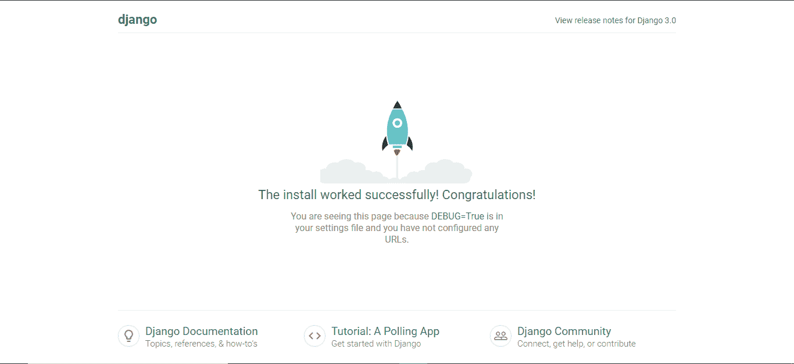

# Django 和 Nginx，Gunicorn

> 原文：<https://medium.com/analytics-vidhya/dajngo-with-nginx-gunicorn-aaf8431dc9e0?source=collection_archive---------0----------------------->

## 生产就绪解决方案。

[***Django***](http://www.djangoproject.com/) 是一个高效、通用、动态演进的 web 应用开发框架。如今，Django 在设计 web 应用程序方面变得越来越强大。

在生产中运行 Django 的本地服务器并不是推荐的方式，因为它只是一个测试服务器，而不是一个生产就绪的服务器。因此，在产品中运行 Django 就是使用 **Gunicorn** 运行，并使用 **Nginx** 作为反向代理，从而为我们的应用程序提供更多安全性。


请求流

在这篇博文中，我将向您解释如何在**生产**环境中运行 Django 应用程序。所以让我们开始吧。

# 先决条件:

1.  Amazon Ubntu(16.04) EC2 实例启动并使用相关的密钥对运行(对它的 ssh 访问)。
2.  必须为此实例打开端口 22、80、8000。

# SSH &更新 ubuntu 实例:

您需要 ssh 到您的 EC2 实例，所以确保您为您的实例打开了端口 22，然后进行更新/升级。

```
ssh -i path-to-your-key.pem ubuntu@your-aws-instance-public-ipsudo apt-get update && sudo apt-get upgrade -y
```

# 在 AWS EC2 (ubuntu 16.04)上安装 Python3.6.x:

我们会从官方网站下载 tar.xz 文件，然后手动安装。在此之前，我们需要安装一些必需的依赖项。

*   构建和安装依赖项

```
sudo apt install build-essential checkinstallsudo apt install libreadline-gplv2-dev libncursesw5-dev libssl-dev libsqlite3-dev tk-dev libgdbm-dev libc6-dev libbz2-dev libffi-dev
```

*   下载并手动安装所需的 Python 版本

```
cd /opt && sudo wget [https://www.python.org/ftp/python/3.6.6/Python-3.6.6.tar.xz](https://www.python.org/ftp/python/3.6.6/Python-3.6.6.tar.xz)sudo tar -xvf Python-3.6.6.tar.xzcd Python-3.6.6/sudo ./configuresudo make && sudo make installcd /home/ubuntu/
```

*   检查 Python 版本

```
python3 -V
```

# 创建示例 Django 应用程序:

*   为示例应用程序创建目录

```
mkdir hello_django && cd hello_django
```

*   创建和激活虚拟环境

```
python3.6 -m venv .source bin/activate
```


虚拟环境已激活

您的环境现在已经激活，您可以开始在其中安装 Django 了。

```
pip install Django==3.0
```

您的 Django 环境应该可以使用了。继续创建一个空的 Django 项目。

```
django-admin.py startproject hello
```


创建空 Django 项目

*   测试样本应用

您可以通过运行开发服务器来测试它。您可以忽略警告。

```
cd hello/python manage.py runserver 0.0.0.0:8000
```


转到您的浏览器并点击***<ec2-instance-DNS:8000>***您将得到一个**错误**提示“DisallowedHost at /”要解决此错误，请按 **crtl + c** 关闭开发服务器。

进入**允许 _ 主机**中的 **hello/settings.py** 在列表中添加“ ***** ”，如下图所示。


再次运行您的服务器，您应该会看到 Django power 页面。



Django 动力页面

# **恭喜！**

您已经成功运行 Django 应用程序。现在是时候为生产做准备了。

# 格尼科恩

在生产中，我们不会使用 Django 的单线程开发服务器，而是一个名为[***guni corn***](https://gunicorn.org/)的专用应用服务器。

*   在应用程序的虚拟环境中安装 gunicorn

```
pip install gunicorn
```

*   使用 Gunicorn 服务器测试示例应用程序

现在您已经有了 gunicorn，您可以通过运行以下命令来测试它是否可以服务于您的 Django 应用程序:

```
gunicorn hello.wsgi:application --bind 0.0.0.0:8000
```


和古尼康一起经营姜戈

## 你现在应该可以从<8000>访问 Gunicorn 服务器了

**Gunicorn** 已安装，并准备好为您的应用程序提供服务。让我们设置一些配置选项，使它更有用。

我喜欢设置一些参数，所以让我们把它们都放到一个小的 BASH 脚本中，我把它保存为 **bin/gunicorn_start**


在 **bin/gunicorn_start** 文件中添加以下行。

```
#!/bin/bash# Name of the application
NAME="hello_app"# Django project directory
DJANGODIR=/home/ubuntu/hello_django/hello# we will communicte using this unix socket
SOCKFILE=/home/ubuntu/hello_django/run/gunicorn.sock# the user to run as
USER=ubuntu# the group to run as
GROUP=ubuntu# how many worker processes should Gunicorn spawn
NUM_WORKERS=3# which settings file should Django use
DJANGO_SETTINGS_MODULE=hello.settings# WSGI module name
DJANGO_WSGI_MODULE=hello.wsgiecho "Starting $NAME as `whoami`"# Activate the virtual environment
cd $DJANGODIRsource ../bin/activateexport DJANGO_SETTINGS_MODULE=$DJANGO_SETTINGS_MODULEexport PYTHONPATH=$DJANGODIR:$PYTHONPATH# Create the run directory if it doesn't exist
RUNDIR=$(dirname $SOCKFILE)test -d $RUNDIR || mkdir -p $RUNDIR# Start your Django Unicorn# Programs meant to be run under supervisor should not daemonize themselves (do not use --daemon)exec ../bin/gunicorn ${DJANGO_WSGI_MODULE}:application \
--name $NAME \
--workers $NUM_WORKERS \
--user=$USER --group=$GROUP \
--bind=unix:$SOCKFILE \
--log-level=debug \
--log-file=-
```

*   在 gunicorn_start 脚本上设置可执行位

```
sudo chmod u+x bin/gunicorn_start
```

*   测试 **gunicorn_start** 脚本

```
bin/gunicorn_start
```

您应该会看到类似如下的输出:


我没有添加完整的截图，只是添加了一个重要的部分。

当您运行您的 **gunicorn_start** 脚本时，它将在**运行/目录**中创建一个套接字。

您将无法在浏览器中看到任何内容，因为我们**没有使用 http 端口**，我们使用的是**套接字**，这是一种将 Django 作为生产服务器运行的更安全的方式。按下 **ctrl + c** 打破 gunicorn 服务器。

注意在 **gunicorn_start** 中设置的参数。如果你不关注这篇文章，你需要设置路径和文件名来匹配你的设置。

——NAME(NAME)参数指定您的应用程序将如何在程序中标识自己，如 ***top 或 ps*** 。

为了使 **— name** 参数生效，您需要安装一个名为***set Prog title***的 Python 模块。

```
pip install setproctitle
```

现在，当您列出进程时，您应该可以看到哪个 gunicorn 属于哪个应用程序。**别忘了再次启动你的 gunicorn 服务器**。

```
ps aux
```


Gunicorn 过程

你的 **gunicorn_start** 脚本现在应该已经准备好并且可以工作了。

*   创建文件以存储日志消息:

```
Make sure you are at /home/ubuntu/hello_django/ pathmkdir logs
```

我们将使用这个目录来存储我们的应用程序日志和 Nginx 日志，以便进行调试。

# 恭喜你！

我们刚刚完成了本教程最令人兴奋的部分，所以你应该感到自豪。

接下来我们将设置 NGINX，然后我们就完成了！我知道这需要一点时间，但是请相信我——一旦完成，你将会和我一样，在出版这篇教程后感到高兴。

# Nginx

是时候将 Nginx 设置为应用程序及其静态文件的服务器了。

*   安装并启动 Nginx

```
sudo apt-get install nginxsudo service nginx start
```

每个 Nginx 虚拟服务器应该由/etc/nginx/sites-available 目录中的一个文件来描述。您可以通过创建指向/etc/nginx/sites-enabled 目录中的站点的符号链接来选择要启用的站点。

默认情况下，只有一个名为 **default** 的配置文件具有 NGINX 的基本设置。您可以修改它或创建一个新的。在我们的例子中，我将删除它:

```
sudo rm -rf /etc/nginx/sites-available/defaultsudo rm -rf /etc/nginx/sites-enabled/default
```

*   创建新的 nginx 服务器配置文件

**须藤纳米/etc/nginx/sites-available/hello**

```
upstream hello_app_server {# fail_timeout=0 means we always retry an upstream even if it failed# to return a good HTTP response (in case the Unicorn master nukes a# single worker for timing out).server unix:/home/ubuntu/hello_django/run/gunicorn.sock fail_timeout=0;}server {listen   80;server_name example.com;client_max_body_size 4G;access_log /home/ubuntu/hello_django/logs/nginx-access.log;error_log /home/ubuntu/hello_django/logs/nginx-error.log;location /static/ {alias   /home/ubuntu/hello_django/static/;}location /media/ {alias   /home/ubuntu/hello_django/media/;}location / {# an HTTP header important enough to have its own Wikipedia entry:#   http://en.wikipedia.org/wiki/X-Forwarded-Forproxy_set_header X-Forwarded-For $proxy_add_x_forwarded_for;# enable this if and only if you use HTTPS, this helps Rack# set the proper protocol for doing redirects:# proxy_set_header X-Forwarded-Proto https;# pass the Host: header from the client right along so redirects# can be set properly within the Rack applicationproxy_set_header Host $http_host;# we don't want nginx trying to do something clever with# redirects, we set the Host: header above already.proxy_redirect off;# set "proxy_buffering off" *only* for Rainbows! when doing# Comet/long-poll stuff.  It's also safe to set if you're# using only serving fast clients with Unicorn + nginx.# Otherwise you _want_ nginx to buffer responses to slow# clients, really.# proxy_buffering off;# Try to serve static files from nginx, no point in making an# *application* server like Unicorn/Rainbows! serve static files.if (!-f $request_filename) {proxy_pass http://hello_app_server;break;}}# Error pageserror_page 500 502 503 504 /500.html;location = /500.html {root /home/ubuntu/hello_django/static/;}}
```

*   在启用站点的文件夹中创建符号链接

```
sudo ln -s /etc/nginx/sites-available/hello /etc/nginx/sites-enabled/hello
```

*   重启 Nginx

```
sudo service nginx restart
```

现在你的 nginx 已经准备好服务请求，它将把请求转发给你的应用程序，但是对于这个**，要确保你有一个运行**的 gunicorn 服务器。

转到您的浏览器，键入***<ec2-instance-DNS>***这将向 nginx 发送一个请求，然后它会将该请求转发到您运行 gunicorn 的服务器。

# 恭喜你！

您已经使用 **Nginx** 和 **Gunicorn** 成功运行了您的 **Django** 应用程序。

在 [***第二部分***](/@harshvijaythakkar/setting-up-django-with-nginx-gunicorn-and-docker-352f7656f869) 中，我解释了如何在 **Docker** 容器中使用 Nginx 和 Gunicorn 运行 Django 应用程序。

谢谢大家！