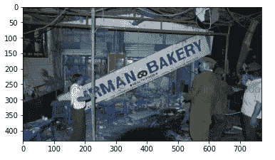
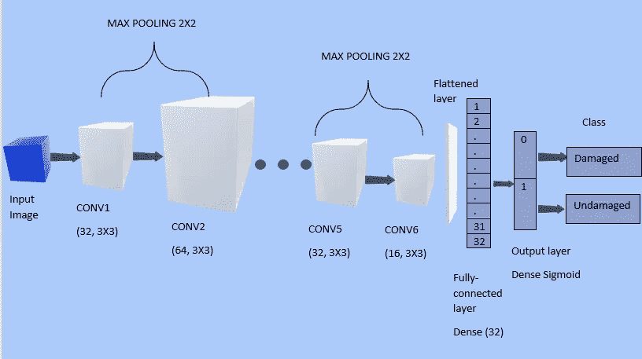
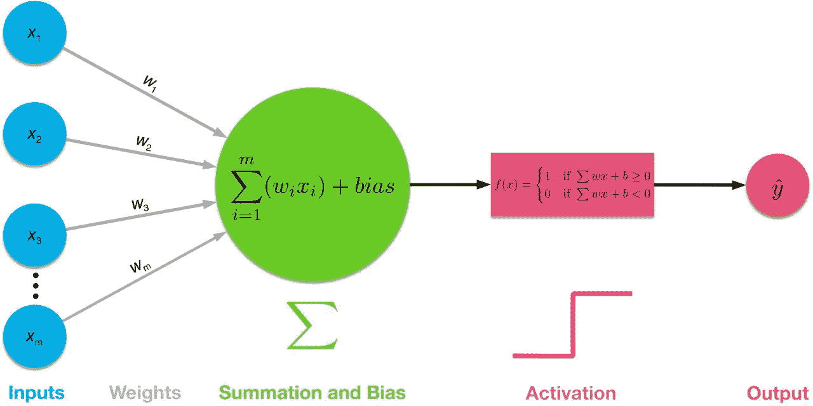
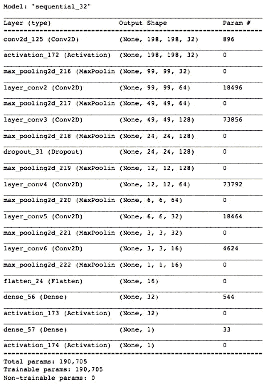
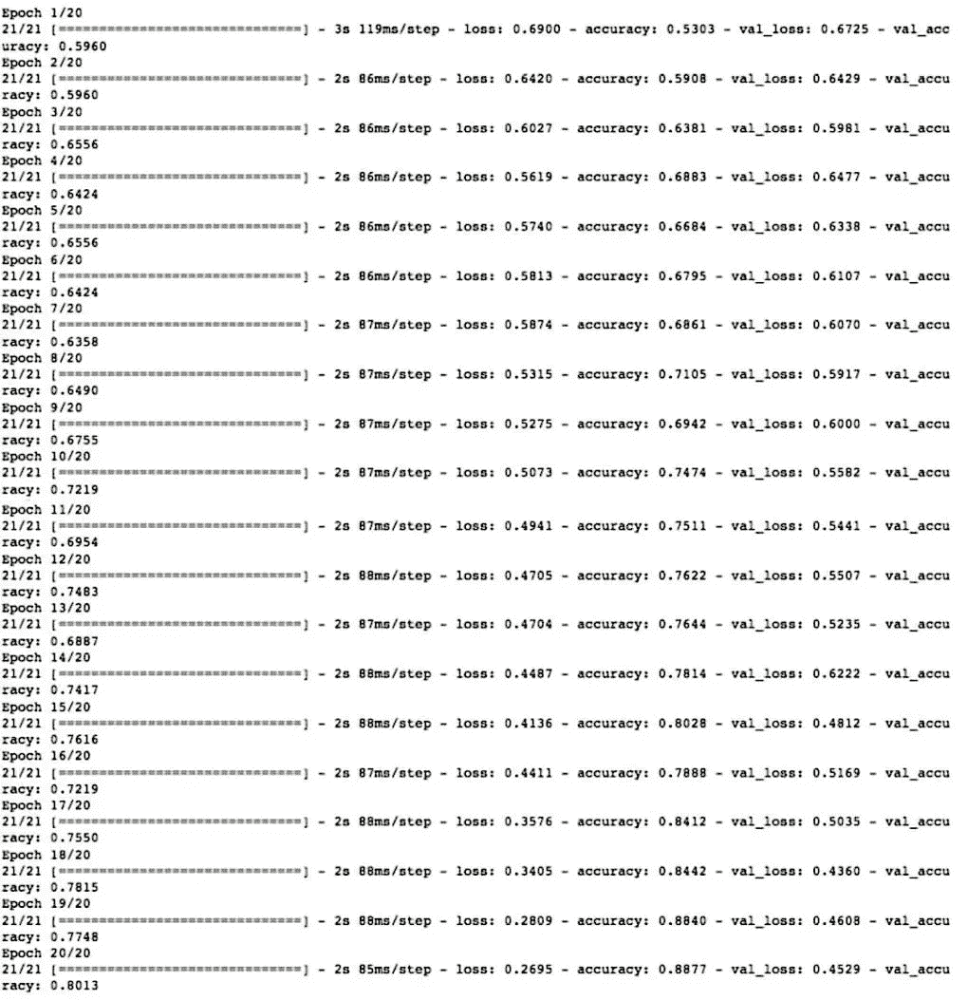
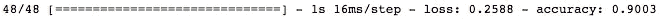
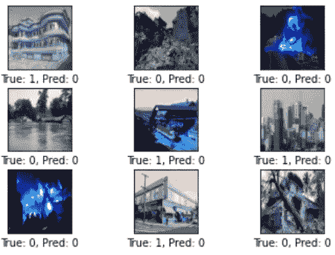
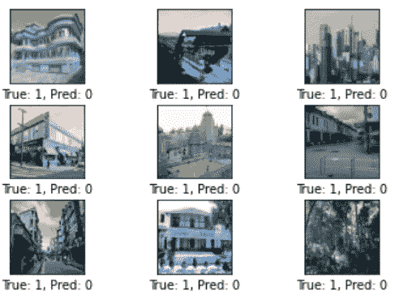

# 基于 CNN 的损伤检测

> 原文：<https://medium.com/analytics-vidhya/damage-detection-using-cnn-b72c931d23c8?source=collection_archive---------11----------------------->

阿育王大学


# 摘要

计算机视觉的最新进展已经产生了高度精确的图像分类算法，例如卷积神经网络(CNN)架构。在本研究中，我们在 Keras 深度学习框架中测试并实现了一个基于 CNN 的算法，Keras 深度学习框架是 Tensorflow 之上的一个高级 API。Keras 最近变得非常出名，因为它能够轻松地构建复杂的模型并快速迭代。

我们使用深度学习方法，使用 CNN 来演示如何建立一个神经网络，将区域分类为*“受损”*和*“未受损”*，这更通常被称为二进制图像分类问题。这两个类别包括基于自然灾害发生的图像，即:洪水、地震和火灾。遥感光学图像是一个巨大的信息源，可用于时间紧迫的任务，如损害检测和评估，以便立即提供救济援助。我们提出的模型为损伤检测提供了良好的准确性；我们还观察到显著的执行速度。我们没有使用玩具数据集来构建我们的模型，而是编译了我们自己的多类图像分类数据集来区分受损区域和未受损区域。

# CNN 理论

卷积神经网络(CNN)是多层全连接神经网络。它们由一个输入层、多个隐藏层和一个输出层组成。我们通过增加隐藏层的数量使网络更深。CNN 接收输入图像，执行数学运算(使用非线性激活函数，如 ReLU、sigmoid ),并预测输出的类别或标签概率。它们将输入图像的原始像素亮度作为展平向量。例如，[30x30]彩色图像将作为三维矩阵传递到 CNN 的输入层。

卷积神经网络(CNN)具有如下三种类型的层:

## 1.卷积层(CONV)

这是 CNN 通过移动小过滤器从输入图像中学习特征的层。CONV 层包含过滤器(例如[3x3]或[5x5])，这些过滤器与输入矩阵进行卷积，并在给定的空间位置学习要素。对于过滤器的每个位置，计算过滤器和过滤器下的图像像素之间的点积，这在输出图像中产生单个像素。因此，在整个图像中移动滤波器会产生新的图像，卷积层中的每个滤波器对应一个图像。

CONV 层有 3 个关键参数:
**—用于卷积运算的滤波器数量。
**—过滤矩阵覆盖输入矩阵的像素数。
**填充** —如果需要，用于在输入体积的边界周围添加零。****

## ****2.汇集层(池)****

****该层用作网络中的中间层，在该层中，它沿空间维度对传入的体积进行下采样或压缩，以减少网络中的过拟合，但保留最重要的信息。例如，如果输入体积为[64x64x12]，则其缩减取样体积将为[32x32x12]。****

## ******3。全连接层(FC)******

****在全连接层中，每个节点都与前一层中的所有其他节点相连。这一 FC 层通常作为 CNN 的最后一层，其激活函数为 ***SIGMOID*** 用于多类分类问题。FC 层负责预测输入图像的最终类别或标签。因此，它的输出维数为[1x1xN],其中 N 表示考虑用于分类的类或标签的数量。****

****层中的给定节点取其输入的加权和，并将其通过非线性激活函数。这是节点的输出，然后成为下一层中另一个节点的输入。信号从左向右流动，通过对所有节点执行该过程来计算最终输出。训练这个深度神经网络意味着学习与所有边相关联的权重。注意 TensorFlow 中的计算实际上是对一批图像而不是单张图像进行的，这样计算效率更高。****

# ****方法学****

****该模型从头开始构建，以更好地匹配与手动整理的详尽数据集相关的参数，该数据集由三种自然灾害的图像组成:洪水、地震和火灾。为了确保模型的稳健性，我们在每一类自然灾害中加入了全球不同时期发生的大量事件的图片。图像也被下采样至 200x200，因此图像分辨率在整个数据集中是一致的。****

```
****#Importing Libraries** import numpy as np
import matplotlib.pyplot as plt
import os
import cv2
import tensorflow as tf
import numpy as np
import matplotlib.pyplot as plt
from tensorflow.keras.models import Sequential 
from tensorflow.keras.layers import Dense, Dropout, Activation, Flatten, Conv2D, MaxPooling2D
from tensorflow.keras.callbacks import TensorBoard
import time**
```

## ****加载数据集****

****该数据集包括 1，505 个图像，其中 750 个标签用于受损类别，755 个标签用于未受损类别。这些数据被用来训练我们的模型。您可以在这里访问数据集[。](https://github.com/AakritiJain98/Damage_detection_using_CNN)****

```
**DATADIR= "...file path..."
CATEGORIES=["Damaged","Undamaged"]**#Iterate through the two categories** for category in CATEGORIES:
    path= os.path.join(DATADIR,category)
    for img in os.listdir(path):
        img_array= cv2.imread(os.path.join(path,img)) 
        plt.imshow(img_array)
        plt.show()
        break
    break**
```

********

****PS:运行这段代码时，任何随机图像都可能出现在我们的数据集中****

```
**IMG_SIZE= 200**#Resizing all images to one size** training_data=[]
def create_training_data():
    for category in CATEGORIES:
        path= os.path.join(DATADIR,category) 
        class_num = CATEGORIES.index(category)
        for img in os.listdir(path):
            try:
                img_array= cv2.imread(os.path.join(path,img))
                new_array=cv2.resize(img_array,(IMG_SIZE,IMG_SIZE))
                training_data.append([new_array,class_num])
            except Exception as e:
                passcreate_training_data()**#Checking the new image size** new_array.shape**
```

## ****训练模型****

****批次标准化用于训练非常深的神经网络，该神经网络将每个批次的输入标准化到一个层。这稳定了学习过程，并显著减少了训练时期的数量，从而加速了深度学习神经网络的训练。****

```
****#Creating features and labels for the images in our dataset** X_calamity=[]#features
y_calamity=[]#labelsfor features, label in training_data:
    X_calamity.append(features)
    y_calamity.append(label)**#Converting image input to array** X_calamity= np.array(X_calamity).reshape(-3,IMG_SIZE,IMG_SIZE,3)**#Normalising the image input array** X_calamity=X_calamity/255.0**
```

# ****制定模型****

********

****我们添加了六个卷积层，每个卷积层都包含一个 ReLU 激活函数，每个卷积层后面都有一个大小为 2x2 的最大池层。****

****使用滤波器权重在第一卷积层中处理输入图像。这导致 32 个新图像，卷积层中的每个滤波器一个图像(内核大小= 3 意味着卷积滤波器是 3x3 像素，我们已经采用了 32 个这样的滤波器)。****

****然后在第二卷积层中处理这 32 个较小的图像。在第二个卷积层，我们有 64 个新的过滤器(每个卷积过滤器是 3x3 像素)。****

****保持每个滤镜的内核大小不变(3x3 像素)，我们在后续的 conv3 层中进一步将滤镜数量增加到 128 个。此后，我们逐渐将滤波器数量减少到 conv4 中的 64 个、conv5 中的 32 个以及 conv6 中的 16 个。****

****这些然后被展平为单个向量，该向量被用作具有 32 个神经元(或元素)的全连接层的输入。这馈入另一个具有 2 个神经元的全连接层，每个神经元用于{0，1}中的每个类别，这确定图像属于受损(类别=0)还是未受损(类别=1)类别。****

****Sigmoid 激活函数应用于输出层。使用二进制交叉熵测量损失。****

********

****来源:https://images.app.goo.gl/X5dk5G58bdcjykyw7****

```
**model = Sequential()**#Second Convolutional layer**
model.add(Conv2D(kernel_size=3, strides=1, filters=64, padding='same', activation='relu', name='layer_conv2'))
model.add(MaxPooling2D(pool_size=(2,2)))**#Third Convolutional layer** model.add(Conv2D(kernel_size=3, strides=1, filters=128, padding='same', activation='relu', name='layer_conv3'))
model.add(MaxPooling2D(pool_size=(2,2)))**#Drop-out layer** model.add(Dropout(0.25))
model.add(MaxPooling2D(pool_size=2, strides=2))**#Fourth Convolutional layer** model.add(Conv2D(kernel_size=3, strides=1, filters=64, padding='same', activation='relu', name='layer_conv4'))
model.add(MaxPooling2D(pool_size=(2,2)))**#Fifth Convolutional layer** model.add(Conv2D(kernel_size=3, strides=1, filters=32, padding='same', activation='relu', name='layer_conv5'))
model.add(MaxPooling2D(pool_size=(2,2)))**#Sixth Convolutional layer** model.add(Conv2D(kernel_size=3, strides=1, filters=16, padding='same', activation='relu', name='layer_conv6'))
model.add(MaxPooling2D(pool_size=(2,2)))model.add(Flatten())
model.add(Dense(32)) #Fully Connected Layer
model.add(Activation("relu"))**#Output layer** model.add(Dense(1))
model.add(Activation('sigmoid'))model.compile(loss="binary_crossentropy",
             optimizer="adam", metrics=['accuracy'])**#Displaying model summary statistics** model.summary()**
```

********

****卷积滤波器最初是随机选择的，因此分类也是随机进行的。输入图像的预测类别和真实类别之间的误差被测量为所谓的交叉熵。然后，优化器使用微分链规则通过卷积网络自动传播该误差，并更新滤波器权重，以改善分类误差。这被重复多次，直到分类误差足够低。****

## ****结果****

****所有参数都设置为通过最小化执行时间来提供最佳精度。65 个样本用于训练，其中任意 10%的图像用于验证。我们能够在仅仅 20 个时期内获得几乎 90%的准确度，其中运行单个时期所花费的时间最多为 3 秒。****

```
**model.fit(X_calamity, y_calamity, batch_size=65, epochs=20, validation_split=0.1)**
```

********

```
****#Evaluating the model** result = model.evaluate(x=X_calamity, y=y_calamity)**
```

********

# ****可视化结果****

```
****#Helper Function to plot images** def plot_images(images, cls_true, cls_pred=None):
    assert len(images) == len(cls_true) == 9

 **# Create figure with 3x3 sub-plots**    fig, axes = plt.subplots(3, 3)
    fig.subplots_adjust(hspace=0.3, wspace=0.3)for i, ax in enumerate(axes.flat):
 **# Plot image**        ax.imshow(images[i].reshape(image_shape), cmap='binary')**#Show true and predicted classes
**        if cls_pred is None:
            xlabel = "True: {0}".format(cls_true[i])
        else:
            xlabel = "True: {0}, Pred: {1}".format(cls_true[i], cls_pred[i])**#Show the classes as the label on the x-axis
**        ax.set_xlabel(xlabel)

        # Remove ticks from the plot
        ax.set_xticks([])
        ax.set_yticks([]) plt.show()**
```

## ****打印图像和标签****

****我们从输入矩阵中选择前 9 个图像，并显示它们的真实和预测类别标签。****

```
****#Defining parameters** images = X_calamity[0:9]
cls_true =y_calamity[0:9]
y_pred = model.predict(x=images)
cls_pred = np.argmax(y_pred, axis=1)**#Plotting images** plot_images(images=images, cls_true=cls_true, cls_pred=cls_pred)**
```

********

```
****#Helper Function to plot incorrect images**
def plot_example_errors(cls_pred): **#cls_pred is an array of the predicted class-number for all images in the test-set****# Boolean array whether the predicted class is incorrect.
**    incorrect = (cls_pred != y_calamity)**# Get the images from the test-set that have been incorrectly classified
**    images = X_calamity[incorrect]

 **#Get the predicted classes for those images**    cls_pred = cls_pred[incorrect]**#Get the true classes for those images
**    cls_true = y_calamity[incorrect]

 **#Plot the first 9 images**    plot_images(images=images[0:9], cls_true=cls_true[0:9], cls_pred=cls_pred[0:9])**
```

****我们现在绘制前 9 张错误分类的图像:****

```
****#Defining parameters**
y_pred = model.predict(x=X_calamity)
cls_pred = np.argmax(y_pred, axis=1)**#Plotting images**
plot_example_errors(cls_pred)**
```

********

# ****结束语****

****我们设计了一个高性能的深度学习分类模型，并将其应用于我们编制的一个灾难数据集上进行损伤检测。它提供了总体 90%的准确率，并显著减少了执行时间。****

****我们已经发现，在运行给定 Adam 优化器的参数的多个排列和组合之后，结果是最佳的。结果可能会随着参数值的变化而变化。****

****通过使用卫星图像可以使该模型更适用于损伤检测，并且可以在 GPU K80 高性能计算(HPC)平台上观察到显著的执行速度。****

# ****参考****

****Bhangale，u .，Durbha，s .，Potnis，a .，& Shinde，R. (2019，7 月)。基于深度学习的 VHR 遥感图像震害快速检测。在 IGARSS 2019–2019 IEEE 国际地球科学与遥感研讨会(第 2654–2657 页)。IEEE。****

****Gogul，I. & Kumar，Sathiesh。(2017).基于卷积神经网络和迁移学习的花卉品种识别系统。1–6.****

****h .实验室(2016 年 6 月)。从 Github 检索:[https://github.com/Hvass-Labs/TensorFlow-Tutorials](https://github.com/Hvass-Labs/TensorFlow-Tutorials)****

****Ng，A. (2017，11 月)。 *Deeplearning.ai* 。从 Youtube 检索:【https://www.youtube.com/playlist? list = plk da E6 sczn 6 GL 29 AOE 31 wdvwsg-KnDzF****

****v . Sharma(2018 年 10 月 15 日)。Vinod Sharma 的博客。检索自[https://vinodsblog . com/2018/10/15/everything-you-neural-networks/](https://vinodsblog.com/2018/10/15/everything-you-need-to-know-about-convolutional-neural-networks/)****