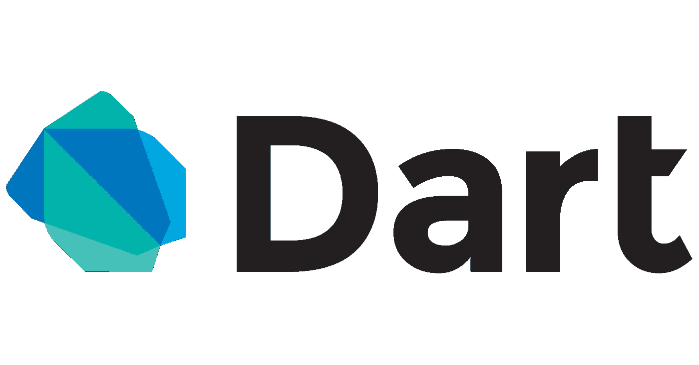

# Dart 编程第 1 部分:环境和首个 Dart 代码

> 原文：<https://medium.com/analytics-vidhya/dart-programming-part-1-25750e118c92?source=collection_archive---------15----------------------->

## 注释、面向对象编程、变量(最终变量和常量)和决策制定



Dart 是一种开源的通用编程语言。它最初是由谷歌开发的，后来被 ECMA 批准为标准。Dart 是一种新的编程语言，既适用于服务器，也适用于浏览器。由谷歌推出的 **Dart SDK** 附带了它的编译器——T2 的 Dart VM 。SDK 还包括一个实用程序 **-dart2js** ，一个 transpiler，它生成相当于 dart 脚本的 JavaScript。本教程提供了对 Dart 编程语言的基本理解。


谷歌发布了一个特殊版本的 Chromium——Dart VM**。使用 Dartium 意味着在准备好在其他浏览器上测试之前，不必将代码编译成 JavaScript。**

# Dart 编程—环境

您可以使用在线编辑器在线测试您的脚本

 [## 镖靶

您可以使用在线 editordartpad.dartlang.org 在线测试您的脚本](https://dartpad.dartlang.org) 

# 你的第一个 Dart 代码

让我们从传统的“Hello World”示例开始

```
main() { 
   print("Hello World!"); 
}
```

上述代码的输出将是

```
Hello World!
```

# Dart 中的注释

*   **单行注释(//)**——“//”和行尾之间的任何文本都被视为注释
*   **多行注释(/* */)**—这些注释可能跨越多行。

```
// this is single line comment  

/* This is a   
   Multi-line comment  
*/
```

# Dart 中的面向对象编程

Dart 是一种面向对象的语言。面向对象是一种遵循真实世界建模的软件开发范式。面向对象认为程序是通过称为方法的机制相互通信的对象的集合。


*   **对象**——对象是任何实体的实时表示。按照 Grady 胸针的说法，每件物品都必须具备三个特征
*   **状态**——由对象的属性描述。
*   **行为**—描述对象的行为方式。
*   **身份**——将一件物品与一组类似物品区分开来的独特价值。
*   从面向对象的角度来看，类是创建对象的蓝图。类封装了对象的数据。
*   方法促进了对象之间的交流。

# 变量

变量名称为标识符。以下是标识符的命名规则

*   标识符不能是关键字。
*   标识符可以包含字母和数字。
*   标识符不能包含空格和特殊字符，下划线(_)和美元($)符号除外。
*   变量名不能以数字开头。

变量必须在使用前声明。Dart 使用 var 关键字来实现同样的目的。声明变量的语法如下所示

```
var name = 'Jayesh';
String name = 'Jayesh'; 
int num = 10;
```

# 最终和常量

**final** 和 **const** 关键字用于声明常量。Dart 防止修改使用 final 或 const 关键字声明的变量的值。这些关键字可以与变量的数据类型结合使用，或者代替**变量**关键字。

**const** 关键字用于表示编译时常量。使用 **const** 关键字声明的变量是隐式最终变量。

```
final variable_name
OR
final data_type  variable_name const variable_name
OR
const data_type variable_name
```

# 决策

条件/决策结构在执行指令之前评估条件。

**如果，如果..否则，否则..中频梯子和开关..案例**:

一个 **if** 语句由一个布尔表达式后跟一个或多个语句组成。

一个 **if** 后面可以跟一个可选的 **else** 块。如果**模块测试的布尔表达式的结果为假，则 **else** 模块将执行。**

**else…if 阶梯**对于测试多种条件非常有用。下面是相同的语法。

switch 语句对表达式求值，将表达式的值与 case 子句匹配，并执行与该 case 相关联的语句。

```
The following example shows how you can use the if statement in Dart.void main() { 
   var  num=5; 
   if (num>0) { 
      print("number is positive"); 
   }    
}Output:
number is positive--------------------------------------------------------------------The following example prints whether the value in a variable is even or odd. The if block checks the divisibility of the value by 2 to determine the same.void main() { 
   var num = 12; 
   if (num % 2==0) { 
      print("Even"); 
   } else { 
      print("Odd"); 
   } 
}Output:
Even--------------------------------------------------------------------The following program code checks whether a given value is positive, negative, or zero.void main() { 
   var num = 2; 
   if(num > 0) { 
      print("${num} is positive"); 
   } 
   else if(num < 0) { 
      print("${num} is negative"); 
   } else { 
      print("${num} is neither positive nor negative"); 
   } 
}Output:
2 is positive--------------------------------------------------------------------The example verifies the value of the variable grade against the set of constants (A, B, C, D, and E) and executes the corresponding blocks. If the value in the variable doesn’t match any of the constants mentioned above, the default block will be executed.void main() { 
   var grade = "A"; 
   switch(grade) { 
      case "A": {  print("Excellent"); } 
      break; 

      case "B": {  print("Good"); } 
      break; 

      case "C": {  print("Fair"); } 
      break; 

      case "D": {  print("Poor"); } 
      break; 

      default: { print("Invalid choice"); } 
      break; 
   } 
}Output:
Excellent
```

# 你如何能有所贡献？

*   在 [Twitter](https://twitter.com/jayeshpatel1995) 或 [Linkedin](https://in.linkedin.com/in/jayeshpansheriya) 或 [Instagram](https://www.instagram.com/jay_pansheriya) 上与我联系。
*   跟着我上 [Github](https://github.com/jayeshpansheriya) 。

# 本系列中的帖子

*   [飞镖编程:Part-1:环境&第一个飞镖代码&注释&面向对象编程&变量&最终和常量&决策](https://link.medium.com/oxIF3JCgO2)
*   [Dart 编程:第二部分:操作员](https://link.medium.com/nosKDep4P2)
*   [Dart 编程:第三部分:数据类型](https://link.medium.com/PJMZ55jFR2)
*   [飞镖编程:第四部分:函数&集合](https://link.medium.com/u74hfhbPR2)

# 表示你的支持

如果你喜欢阅读这篇文章，请点击下面的按钮。你鼓掌越多，就越能激励我写得更好！