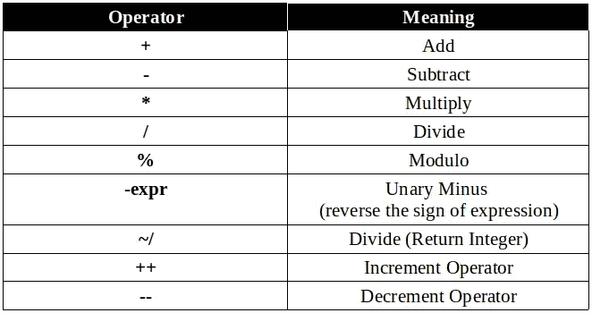
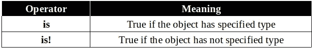
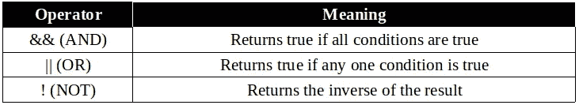

# Dart 编程第 2 部分:运算符

> 原文：<https://medium.com/analytics-vidhya/dart-programming-part-2-ac6ee5641d60?source=collection_archive---------18----------------------->


由 [Unsplash](https://unsplash.com?utm_source=medium&utm_medium=referral) 上的[émile Perron](https://unsplash.com/@emilep?utm_source=medium&utm_medium=referral)拍摄的照片

每个表达式都由两部分组成:

1.  ***操作数—*** 它们代表数据。
2.  ***运算符—*** 运算符是一个符号，告诉编译器执行特定的数学、关系或逻辑运算，并产生最终结果。

*   例如，A + B，其中
*   这里 ***A*** 和 ***B*** 是操作数， ***+*** 是运算符。

我们将讨论 Dart 中可用的运算符。

*   算术运算符
*   等式和关系运算符
*   类型测试运算符
*   按位运算符
*   赋值运算符
*   逻辑运算符

# 算术运算符

*   dart 中有九种算术运算符。



```
void main() { 
   var num1 = 101; 
   var num2 = 2; 
   var res = 0; 

   res = num1+num2; 
   print("Addition: ${res}"); 

   res = num1-num2;
   print("Subtraction: ${res}"); 

   res = num1*num2; 
   print("Multiplication: ${res}"); 

   res = num1/num2; 
   print("Division: ${res}"); 

   res = num1~/num2; 
   print("Division returning Integer: ${res}"); 

   res = num1%num2; 
   print("Remainder: ${res}"); 

   num1++; 
   print("Increment: ${num1}"); 

   num2--; 
   print("Decrement: ${num2}"); 
}Output:
Addition:103 
Subtraction: 99                               
Multiplication: 202               
Division: 50.5
Division returning Integer: 50                  
Remainder: 1      
Increment: 102    
Decrement: 1
```

# 等式和关系运算符

关系运算符测试或定义两个实体之间的关系类型。关系运算符返回布尔值，即真/假。


```
void main() { 
   var num1 = 5; 
   var num2 = 9; 
   var res = num1>num2; 
   print('num1 greater than num2 ::  ' +res.toString()); 

   res = num1<num2; 
   print('num1 lesser than  num2 ::  ' +res.toString()); 

   res = num1 >= num2; 
   print('num1 greater than or equal to num2 ::  ' +res.toString()); 

   res = num1 <= num2; 
   print('num1 lesser than or equal to num2  ::  ' +res.toString()); 

   res = num1 != num2; 
   print('num1 not equal to num2 ::  ' +res.toString()); 

   res = num1 == num2; 
   print('num1 equal to num2 ::  ' +res.toString()); 
}Output:
num1 greater than num2 ::  false 
num1 lesser than num2 ::  true 
num1 greater than or equal to num2 ::  false 
num1 lesser than or equal to num2  ::  true 
num1 not equal to num2 ::  true 
num1 equal to num2 ::  false
```

# 类型测试运算符

这些操作符对于在运行时检查类型很方便。



```
void main() { 
   int n = 2; 
   print(n is int); 
}Output:
true
--------------------------------------------------------------------void main() { 
   double  n = 2.20; 
   var num = n is! int; 
   print(num); 
}Output:
true
```

# 逻辑运算符

逻辑运算符用于组合两个或多个条件。逻辑运算符返回一个布尔值。



```
void main() {  
   var a = 10; 
   var b = 12; 
   var res = (a<b)&&(b>10); 
   print(res);  
}Output:
true
--------------------------------------------------------------------
void main() { 
   var a = 10; 
   var b = 12; 
   var res = (a>b)||(b<10); 

   print(res);  
   var res1 =!(a==b); 
   print(res1); 
}Output:
false 
true
```

# 条件表达式

Dart 有两个特殊的运算符，可以帮助您计算可能需要整个 if-else 语句的小表达式

## 条件？表达式 1:表达式 2

如果条件为真，则表达式计算 **expr1** (并返回其值)；否则，它评估并返回 **expr2** 的值。

```
void main() { 
   var a = 10; 
   var res = a > 12 ? "value greater than 10":"value lesser than or equal to 10"; 
   print(res); 
}Output:
value lesser than or equal to 10
```

# 你如何能有所贡献？

*   在 [Twitter](https://twitter.com/jayeshpatel1995) 或 [Linkedin](https://in.linkedin.com/in/jayeshpansheriya) 或 [Instagram](https://www.instagram.com/jay_pansheriya) 上与我联系。
*   跟着我上 [Github](https://github.com/jayeshpansheriya) 。

# 本系列中的帖子

*   [飞镖编程:Part-1:环境&第一个飞镖代码&注释&面向对象编程&变量& Final 和 Const &决策制定](https://link.medium.com/oxIF3JCgO2)
*   [Dart 编程:第二部分:操作员](https://link.medium.com/nosKDep4P2)
*   [Dart 编程:第三部分:数据类型](https://link.medium.com/PJMZ55jFR2)
*   [飞镖编程:第四部分:函数&集合](https://link.medium.com/u74hfhbPR2)

# 表示你的支持

如果你喜欢阅读这篇文章，请点击下面的按钮。你鼓掌越多，就越能激励我写得更好！