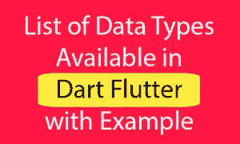

# Dart 编程第 3 部分:数据类型

> 原文：<https://medium.com/analytics-vidhya/dart-programming-part-3-data-types-5981a647709e?source=collection_archive---------8----------------------->


萨法尔·萨法罗夫在 [Unsplash](https://unsplash.com?utm_source=medium&utm_medium=referral) 上拍摄的照片

编程语言最基本的特征之一是它支持的数据类型集。这些是可以在编程语言中表示和操作的值的类型。



Dart 语言支持以下类型

*   数字
*   用线串
*   布尔运算
*   列表
*   地图

> **数字:**

**int :** Integer 是一种没有小数的数值类型。这里的非分数表示没有点的值。整数不支持点值。它只能保存纯数值。请参见下面的示例。

int tempNum = 123456

print(tempNum)；

//输出应该是:123456

**double :** Double 基本上是更大类型的浮点值。它可以保存分数十进制值。在 dart 中，double 支持 64 位双处方值。double 也表示浮点文字。

双 i = 52.11

印刷(一)；

//输出应该是:52.11

> **字符串:**

字符串数据类型表示多字符文本序列，也称为多字符组。在 Dart 字符串中是 UTF-16 代码单元的序列。字符串可以用单引号和双引号创建，但创建时间应该相同。

String name1 = ' Flutter

String name2 = " Examples

print(name 1+' '+name 2)；

//输出应为:颤振示例

> **布尔:**

布尔数据类型用于保存真值和假值。布尔数据类型在声明时使用“ **bool** ”关键字。

bool val1 = true

bool val2 = false

打印(val 1)；

打印(val 2)；

//输出应该是:true & false

> **列表:**

编程中一个非常常用的集合是**数组**。Dart 以**列表**对象的形式表示数组。一个**列表**就是一组有序的对象。dart:core 库提供了 List 类来创建和操作列表。

列表中的每个元素都由一个唯一的编号标识，该编号称为索引。索引从**零**开始，一直延伸到 **n-1** ，其中 **n** 是列表中元素的总数。该索引也被称为**下标**。

*   固定长度列表

```
var list_name = new List(initial_size)--------------------------------------------------------------------
void main() { 
   var lst = new List(3); 
   lst[0] = 12; 
   lst[1] = 13; 
   lst[2] = 11; 
   print(lst); 
}Output:
[12, 13, 11]
```

*   可增长列表

```
var list_name = [val1,val2,val3]   
--- creates a list containing the specified values  
OR  
var list_name = new List() 
--- creates a list of size zero--------------------------------------------------------------------void main() { 
   var num_list = [1,2,3]; 
   print(num_list); 
}Output:
[1, 2, 3]
```

## 列表属性

下表列出了 **dart:core 库**中 **List** 类的一些常用属性。

first:返回第一个元素案例。

isEmpty:如果集合没有元素，则返回 true。

isNotEmpty:如果集合至少有一个元素，则返回 true。

length:返回列表的大小。

last:返回列表中的最后一个元素。

reversed:返回包含逆序列表值的 iterable 对象。

Single:检查列表是否只有一个元素并返回它。

> **地图:**

与列表数据类型相同，映射数据类型也是一种多值组类型。在地图中，数据以**键:值对**格式存储。键值没有界限，可以是任何类型。映射日期也可以有 null 类型的值。地图就像具有多个值对象。

```
void main() { 
   var details = {'Usrname':'tom','Password':'pass@123'}; 
   print(details); 
}Output :
{Usrname: tom, Password: pass@123}--------------------------------------------------------------------void main() { 
   var details = {'Usrname':'tom','Password':'pass@123'}; 
   details['Uid'] = 'U1oo1'; 
   print(details); 
}Output :
{Usrname: tom, Password: pass@123, Uid: U1oo1}
```

## 地图-属性

Keys:返回表示键的 iterable 对象

Values:返回代表值的 iterable 对象

长度:返回地图的大小

isEmpty:如果映射是空映射，则返回 true

isNotEmpty:如果地图是空地图，则返回 true

## 地图-功能

addAll():将 other 的所有键值对添加到该映射中。

clear():从映射中删除所有对。

remove():从映射中删除键及其关联值(如果存在)。

forEach():将 f 应用于映射的每个键值对。

# 你如何能有所贡献？

*   在 [Twitter](https://twitter.com/jayeshpatel1995) 或 [Linkedin](https://in.linkedin.com/in/jayeshpansheriya) 或 [Instagram](https://www.instagram.com/jay_pansheriya) 上与我联系。
*   在 Github 上关注我。

# 本系列中的帖子

*   [飞镖编程:Part-1:环境&第一个飞镖代码&注释&面向对象编程&变量& Final 和 Const &决策制定](https://link.medium.com/oxIF3JCgO2)
*   [Dart 编程:第二部分:操作员](https://link.medium.com/nosKDep4P2)
*   [Dart 编程:第三部分:数据类型](https://link.medium.com/PJMZ55jFR2)
*   [飞镖编程:第四部分:函数&集合](https://link.medium.com/u74hfhbPR2)

# 表示你的支持

如果你喜欢阅读这篇文章，请点击下面的按钮。你鼓掌越多，就越能激励我写得更好！