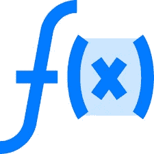

# Dart 编程:第 4 部分:函数和集合

> 原文：<https://medium.com/analytics-vidhya/dart-programming-part-4-functions-collection-cc621a704a9a?source=collection_archive---------15----------------------->



函数是可读的、可维护的和可重用的代码的组成部分。函数是执行特定任务的一组语句。函数将程序组织成逻辑代码块。一旦定义好，就可以调用函数来访问代码。这使得代码可重用。此外，函数使得阅读和维护程序代码变得容易。

```
void main() { 
   print(factorial(6));
}  
factorial(number) { 
   if (number <= 0) {         
      // termination case 
      return 1; 
   } else { 
      return (number * factorial(number - 1));    
      // function invokes itself 
   } 
}Output :
720
```

> **λ函数**

Lambda 函数是一种简洁的函数表示机制。这些函数也称为箭头函数。

```
oid main() { 
   printMsg(); 
   print(test()); 
}  
printMsg()=>
print("hello"); 

int test()=>123;Output :
hello 123
```

# 接口

一个**接口**定义了任何实体都必须遵守的语法。接口定义了一组在对象上可用的方法。Dart 没有用于声明接口的语法。类声明本身就是 Dart 中的接口。

**类**应该使用 implements 关键字来使用接口。实现类必须提供实现接口的所有函数的具体实现。换句话说，一个类必须重新定义它希望实现的接口中的每一个函数。

```
void main() { 
   ConsolePrinter cp= new ConsolePrinter(); 
   cp.print_data(); 
}  
class Printer { 
   void print_data() { 
      print("__________Printing Data__________"); 
   } 
}  
class ConsolePrinter implements Printer { 
   void print_data() {  
      print("__________Printing to Console__________"); 
   } 
}Output :
__________Printing to Console__________
```

# 收藏品

> **列表**

列表只是一组有序的对象。 **dart:core** 库提供了 List 类，可以创建和操作列表。

*   **固定长度列表**——列表的长度不能在运行时改变。
*   **可增长列表**——列表的长度可以在运行时改变。

> **设置**

Set 表示对象的集合，其中每个对象只能出现一次。dart:core 库提供了实现相同功能的 Set 类。

> **地图**

Map 对象是一个简单的键/值对。映射中的键和值可以是任何类型。地图是一个动态集合。换句话说，地图可以在运行时增长和收缩。dart:core 库中的 Map 类也提供了同样的支持。

> **队列**

队列是可以在两端操作的集合。当您希望构建一个先进先出的集合时，队列非常有用。简单地说，队列从一端插入数据，从另一端删除。按照插入的顺序移除/读取这些值。

# 例外

try 块嵌入了可能导致异常的代码。当需要指定异常类型时，使用 on 块。当处理程序需要异常对象时，使用 **catch** 块。

**try** 程序块后必须紧跟一个 **on / catch** 程序块或一个 **finally** 程序块(或两者之一)。当 try 块中出现异常时，控制转移到 **catch** 。

```
main() { 
   try { 
      test_age(-2); 
   } 
   catch(e) { 
      print('Age cannot be negative'); 
   } 
}  
void test_age(int age) { 
   if(age<0) { 
      throw new FormatException(); 
   } 
}Output :
Age cannot be negative
```

# 你如何能有所贡献？

*   在 [Twitter](https://twitter.com/jayeshpatel1995) 或 [Linkedin](https://in.linkedin.com/in/jayeshpansheriya) 或 [Instagram](https://www.instagram.com/jay_pansheriya) 上与我联系。
*   在 [Github](https://github.com/jayeshpansheriya) 上关注我。

# 本系列中的帖子

*   [Dart 编程:Part-1:环境&第一个 Dart 代码&注释&面向对象编程&变量&最终和常量&决策](https://link.medium.com/oxIF3JCgO2)
*   [飞镖编程:第二部分:操作员](https://link.medium.com/nosKDep4P2)
*   [Dart 编程:第三部分:数据类型](https://link.medium.com/PJMZ55jFR2)
*   [飞镖编程:第四部分:函数&集合](https://link.medium.com/u74hfhbPR2)

# 表示你的支持

如果你喜欢阅读这篇文章，请点击下面的按钮。你鼓掌越多，就越能激励我写得更好！