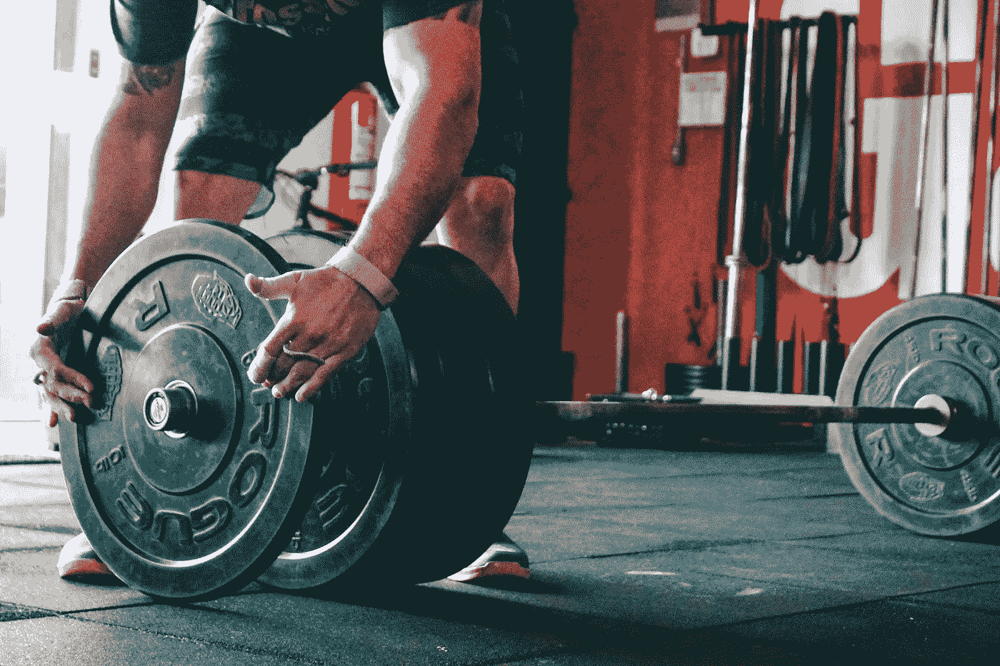
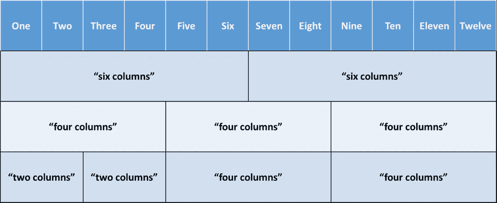
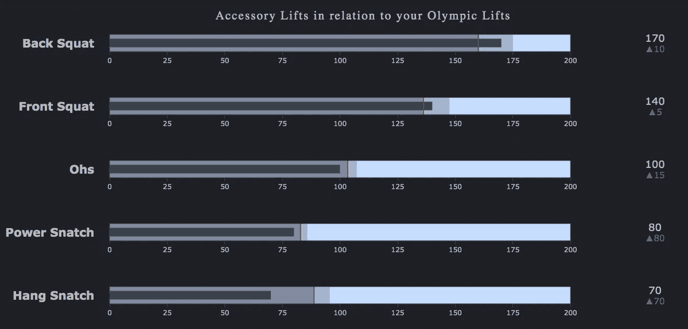
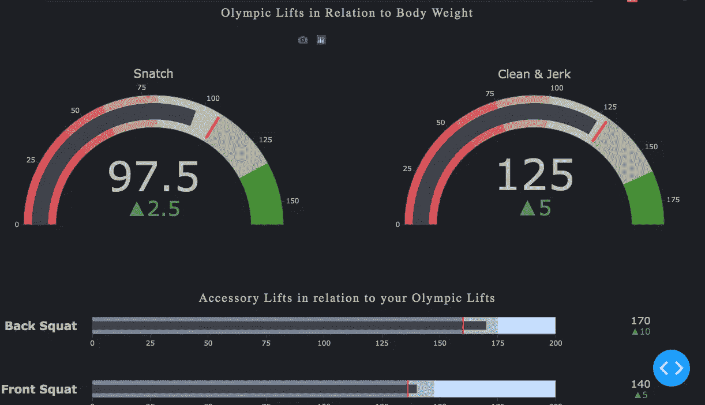

# 我的培训结果仪表板

> 原文：<https://medium.com/analytics-vidhya/dashboard-of-my-training-results-aa8c0e3de9b6?source=collection_archive---------24----------------------->

我生活中必须做的一件事就是锻炼。我知道它给我能量，让我感觉很好。几年前，我开始关注奥运举重，即“抓举”和“挺举”。我练习托举已经有一段时间了，但我不知道自己是好是坏，还是一般。我对自己的进步也没有清晰的看法。我试着把我的结果保存在电子表格、培训应用程序、笔记中，你能想到的都有。没有一个成功了。因此，我决定建立一个仪表板来可视化我的进展。

由[维克多·弗雷塔斯](https://unsplash.com/@victorfreitas?utm_source=unsplash&utm_medium=referral&utm_content=creditCopyText)在 [Unsplash](https://unsplash.com/s/photos/crossfit?utm_source=unsplash&utm_medium=referral&utm_content=creditCopyText) 上拍摄的照片

为了构建这个仪表板，我使用了 Dash 和 Plotly。所使用的数据主要基于我自己的个人记录(PR ),并结合了各种其他数据来源以获得良好的参考点。代码和所有数据集都可以在[这里](https://github.com/tlondahl/workout_dashboard)找到。

马特·弗雷泽在做一些随意的抢劫

# 两大巨头

对于那些不熟悉奥运会举重的人来说，它围绕着两个主要的举起动作，即“抓举”(一次从地面到头顶)和“挺举”(从地面到“前架”，然后从那个位置到头顶)。这两个练习你能举多少才是重要的。你可以对这两个数字(即你的公关)视而不见。因此，对我来说很重要的是，这两部电梯是焦点所在，也是你进入仪表板时看到的第一件东西。此外，为了更好地了解你有多优秀，我使用了 www.strengthlevel.com/strength-standards 的标准作为从初学者到精英的指标。

我把一切都描绘成一个标尺，从红色(初学者)到绿色(精英)以标准为背景，我的目标是一条红线，我当前的 PR 是标尺内的实际值(以千克为单位)和我上一次 PR 的差值。

抓举和挺举规格

此外，为了让这两个计量器彼此相邻，我根据“十二列系统”来构造 html 元素。这实质上意味着每行由 12 列组成。如果您没有指定一个元素要占用的列数，那么该元素将自己分布在所有 12 列中。但是，如果您指定它可以使用多少列，那么它将只使用指定的列数。如果我想让两个元素(我的“抓举”和“挺举”量规)在同一行，并且大小相同，我必须给每个元素分配六列(12/2=6)。如果我想要三个大小相等的元素，那么我会给每个元素分配四列(12/3=4)等。

如何在每行上分配元素的图示

将元素分配给列的代码

# 苏联人知道他们在做什么，对吗？

尽管奥运会举重只有两个托举，但你需要练习很多辅助托举，以便调整托举各部分的技术和力量。如果你在任何辅助练习中表现不佳，这通常可以作为一个指标，表明你在抓举或挺举中失败的地方，以及你需要改进的地方，以便提高你的 PR。然而，就像生活中的其他事情一样，如果没有参考资料，你很难知道自己在哪里。因此，我找到了一张源自苏联的表格，如果有一件事是真的，那就是俄罗斯人/苏联人知道如何举起重物。无论如何，我将这些数据与我自己的数据结合起来，用苏联标准作为背景，将结果绘制成子弹图。深灰色=在你应该在的地方之下，浅灰色=在你应该在的地方，更浅的灰色/蓝色意味着你可以提升超过你需要的(相对于你的公关)。然后，当然我自己的结果了酒吧。

附件升降机的“子弹规”

# 未来的发展

尽管我有一个功能齐全的仪表板，但我对如何改进仪表板有一些想法。

*   能够在仪表板中更新新的 PR
*   过滤要显示的练习
*   我想扩展它以显示其他类型的训练结果，如 Crossfit 基准训练。

仪表板概述