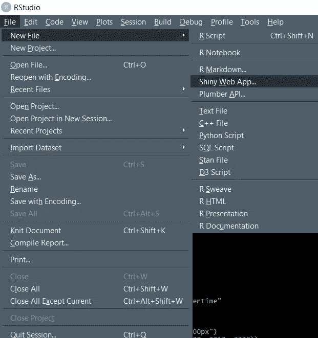
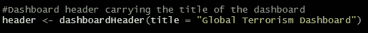
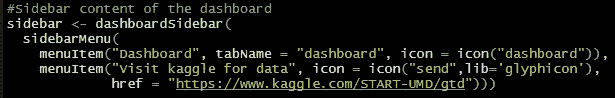
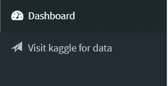
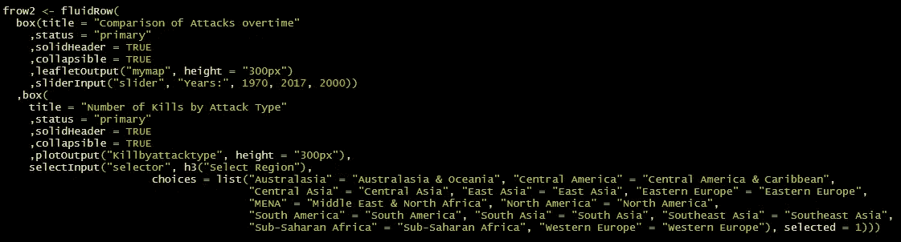
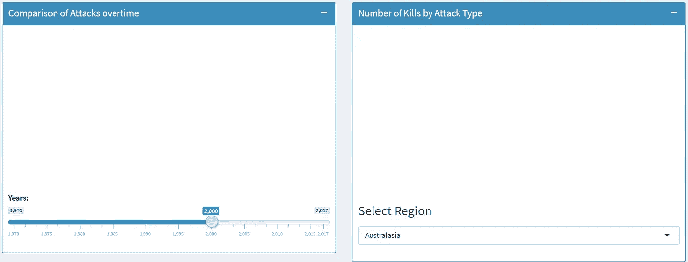
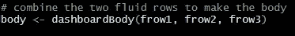
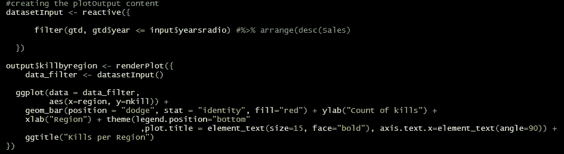
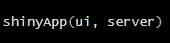
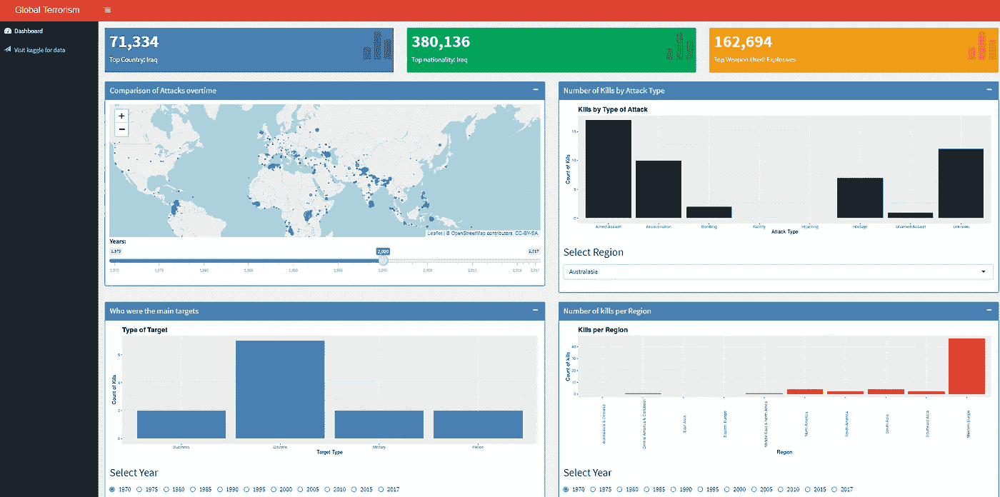

# 仪表板使用 R 闪亮的应用程序

> 原文：<https://medium.com/analytics-vidhya/dashboard-using-r-shiny-application-a2c846b0bc99?source=collection_archive---------16----------------------->

我决定使用 Kaggle 数据集来研究从 1970 年到 2017 年与恐怖主义相关的模式的变化。我知道这些数据令人难过，但使用起来很有趣。

**关于数据集:**

全球恐怖主义数据集是一个开源数据库，提供 1970 年至 2017 年的恐怖袭击数据。

地理:全球

时间段:1970 年至 2017 年，*除 1993 年*

分析单位:攻击

变量:超过 100 个关于地点、战术、犯罪者、目标和结果的变量

来源:未分类的媒体文章(注:请谨慎解读随时间的变化。全球模式是由特定区域的不同趋势驱动的，数据收集受到不同时间和地点的媒体报道波动的影响。)

**R 闪亮应用概述:**

在我们深入了解仪表板是如何创建的之前，我们应该了解一下这个闪亮的应用程序。Shiny 是一个开源的 R 包，它为使用 R 构建 web 应用程序提供了一个优雅而强大的 web 框架。

当您在 R studio 环境中时，您必须创建一个新文件并选择 R shiny web 应用程序:

创建一个新的闪亮应用程序文件

首先，我们应该安装一些尚未安装的软件包:

1.  发光的
2.  闪亮仪表板
3.  传单

**闪亮的仪表盘:**

了解构建仪表板的结构和原理非常重要。

这被称为仪表板的 ***用户界面*** (UI)部分

1.  页眉
2.  补充报道
3.  身体

*表头:*

顾名思义，标题描述或提供仪表板的标题。你必须使用 dashboardHeader 函数来创建标题。下面的代码定义了应该在仪表板的标题中写什么。

标题代码

*侧边栏:*

仪表板的边栏出现在仪表板的左侧。它就像一个菜单栏，您可以在其中放置信息供用户选择。在我的仪表板中，我创建了两个菜单项。如您所见，一个是名为“Dashboard”的选项卡，另一个是到 kaggle 数据集的链接。当你点击它将打开数据的链接源。

侧栏代码

下面是侧边栏菜单的可视化效果:

*正文:*

这是仪表板中最重要的部分，因为它包含了您想要可视化的所有图表、图形和地图。它由决定在哪一行显示数据的行组成。这些行被称为 ***fluidRow。*** 在流体行内放置*框*，并使用 [*选择输入*](https://dreamrs.github.io/shinyWidgets/index.html) 功能确定您想要放入该框的选项种类。在我的仪表板上，我总共有三行。第二行的代码和视觉效果如下所示。

流体行 2 的代码

流体行 2 中的盒子

使用 dashboardBody 函数将所有行组合成仪表板的主体:

组合正文中的所有行

***创建服务器功能:***

服务器函数告诉闪亮的应用程序构建对象。服务器函数创建包含更新应用程序对象所需的所有代码的输出。每个输入到输出必须包含一个*渲染函数。*渲染函数告诉我们需要什么样的输出。一些渲染函数如下:

1.  `renderDataTable →`数据表
2.  `renderImage →`图像(保存为源文件的链接)
3.  `renderPlot →`阴谋
4.  `renderPrint →`任何打印输出
5.  `renderTable →` 数据帧、矩阵、其他类似表格的结构
6.  `renderText →` 字符串
7.  `renderUI →` 一个闪亮的标签对象或 HTML

renderPlot 的代码示例

一旦您完成了在服务器函数中编写代码，最后一步就是运行 shinyApp。

启动应用程序的代码

我的仪表板的最终输出如下:

一旦创建了这个仪表板，我就在线部署它。你可以在你的系统和智能手机上打开它。

你可以在我的 [Github](https://github.com/Hahmedsid/Dashboard-Using-R-Shiny-Application) 上找到这个仪表盘的代码和数据文件。

使用的来源:

 [## 创建选择列表输入控件

### 允许选择多个项目吗？要在选择框中显示的项目数；较大的数字会导致…

shiny.rstudio.com](https://shiny.rstudio.com/reference/shiny/latest/selectInput.html)  [## Shiny 的自定义输入部件

### 用于闪亮应用程序的自定义输入控件和用户界面组件的集合。给你的应用一个…

dreamrs.github.io](https://dreamrs.github.io/shinyWidgets/index.html)  [## 发光的

### Shiny 是一个开源的 R 包，它为构建 web 应用程序提供了一个优雅而强大的 web 框架…

rstudio.com](https://rstudio.com/products/shiny/#:~:text=applications%20in%20R-,Easy%20web%20applications%20in%20R,%2C%20CSS%2C%20or%20JavaScript%20knowledge.)  [## 闪亮仪表板入门

### 仪表板有三个部分:标题、侧栏和主体。这是仪表板页面可能的最小 UI…

rstudio.github.io](https://rstudio.github.io/shinydashboard/get_started.html)  [## 用 R Shiny & ShinyDashboard 构建一个简单的销售收入仪表板

### R 得到的一个漂亮的礼物(Python 错过的)是包装——闪亮。闪亮是一个 R 包，使…

www.r-bloggers.com](https://www.r-bloggers.com/building-a-simple-sales-revenue-dashboard-with-r-shiny-shinydashboard/)  [## 全球恐怖主义数据库

### 1970 年至 2017 年，全球超过 180，000 起恐怖袭击

www.kaggle.com](https://www.kaggle.com/START-UMD/gtd)