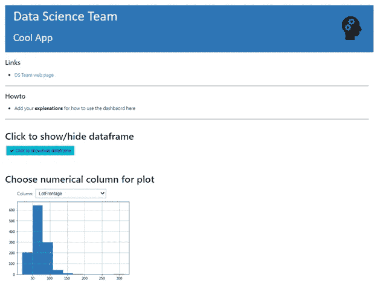
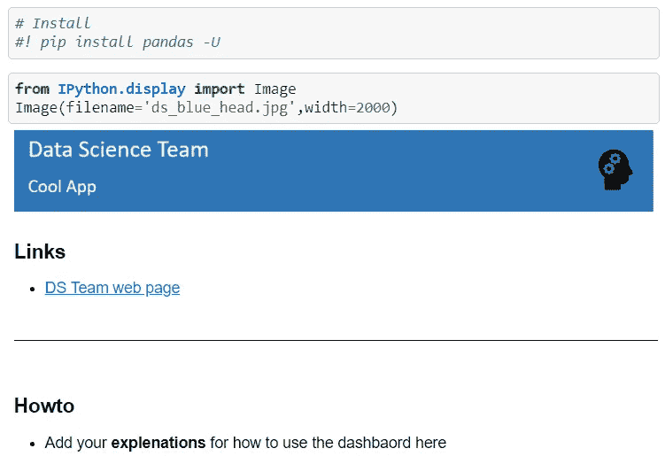
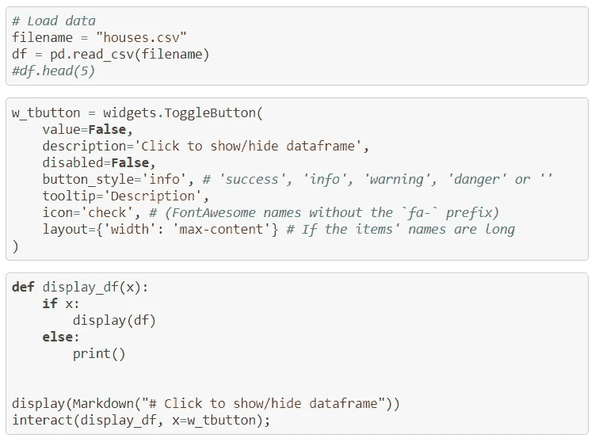
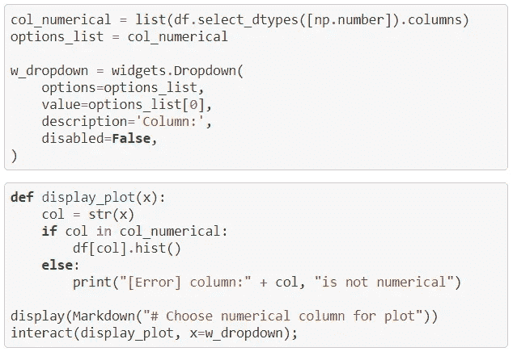

# 仪表板，数据科学家最好的朋友

> 原文：<https://medium.com/analytics-vidhya/dashboards-a-data-scientist-best-friend-7fc023220b38?source=collection_archive---------5----------------------->

数据科学咨询是一项艰苦的工作。最初的几周和几个月是销售和营销工作的混合。很多时候，一个激动的客户在发现成本时就消失了，或者是因为其他与我们无关的原因。那么，是什么让数据科学项目顺利启动并取得成功呢？

[斯科特·格雷厄姆](https://unsplash.com/@sctgrhm?utm_source=medium&utm_medium=referral)在 [Unsplash](https://unsplash.com?utm_source=medium&utm_medium=referral) 上拍照

当然，有很多事情，但一个关键的部分是沟通和利益相关者的参与。

> 关键是让利益相关者快速参与到已证明的价值中。

数据科学家在他们的项目上非常努力，当他们发现一个见解时，他们会感到兴奋，他们希望吸引客户或经理，让他们也感到兴奋。他们通常用 PowerPoint 演示文稿或类似的东西来做。嗯，幻灯片可能很无聊。我们都看到了太多这样的事情。那么，我们能做什么呢？

互动和故事可以提高参与度，所以我们需要一个自然的互动工具来讲述一个好故事，一些可以点击的有用的东西。一种方法就是使用仪表板

仪表板是让客户参与数据科学项目的一种极其有效的方式。它们可以作为一种在线和可访问的方式:演示、工具、MVP，甚至是一个实际的产品，如果连接到一些数据库，或者任何其他动态的方式来刷新数据。但是，在数据科学生命周期中，它的另一个伟大之处是，它们还可以在尚未发生任何重大事件的所有时间内显示进展。有时，仅仅向客户展示一个有趣的交互式数据视图就非常了不起。

有一些很好看的仪表盘工具是要花钱的，比如 Tableau。但是限制我们的不仅仅是它们的成本。这些工具要么本质上是限制性的，需要大量的工作和/或缺乏许多功能。在使用 python 时，数据科学家可以自由地独立使用他们已经知道和需要的任何东西。

python 世界(ds 主要编程语言)中一些最自由、最成功的仪表盘有[**【Dash】**](https://plotly.com/dash/)**[**Panel**](https://panel.holoviz.org/)**[**Streamlit**](https://www.streamlit.io/)**[**瞧吧**](https://github.com/voila-dashboards/voila) 。要更全面地比较这些库，请看这里的**。********

******Dash 和 Streamlit 使用 python 脚本工作，而 Voila 和 Panel 可以使用小部件直接在 Jupyter 笔记本上工作。对于数据科学家来说，最后一项功能非常有吸引力，可以展示他们的工作并吸引客户，而无需在开发上花费太多时间。瞧，这可能是当今数据科学家创建仪表板的最简单、最快的方式，因为它几乎原样呈现了 Jupyter 笔记本。******

******接下来，我将分享我们团队的一些经验，以及一个超级简单的实现，它提供了 web 应用程序的外观和感觉。******

******在跳到 Voila 之前，我只想说我们的 DS 团队使用 Dash 和 Kubernetes 来构建非常好看的仪表板，这在后端也可能很复杂。问题是开源 Dash 太复杂了，数据科学家无法快速部署带来价值的仪表板。它也只使用 Plotly 可视化，如果需要更改已经开发的可视化，这会进一步减慢部署。尽管如此，Dash 仍然是构建产品、工具和演示的绝佳方式。******

******所以，我们已经解释了需要一个简单快捷的工具，我们也发现它在瞧。我们现在要干嘛？******

******我们可以在每个应用程序的专用 Kubernetes pod 上部署 voila 服务器。这里有一个关于 [**GitHub**](https://github.com/gefena/voila_ds_dashbaord) 的示例代码。让我们快速看一下一个简单的应用程序。******

## ****[运行服务器](https://github.com/gefena/voila_ds_dashbaord/blob/master/code/app.py)****

****上面的代码用作 pod 上的启动脚本。在 Kubernetes 环境中部署 pod 之后，它运行上面的脚本来安装 docker 映像中可能缺少的或者需要更新的库。后来，它使用一个选定的端口和 Jupyter 笔记本来启动服务器。端口的暴露和/或映射是使用 Kubernetes 或 Docker 工具完成的。请注意，我们总是可以为特定的数据科学家准备一个控制面板，让他们使用这种方法来替换或更新。所以，在第一次部署后，我们甚至不需要部署更多的 pod，除非我们需要前一个应用程序留在原处。****

****对于不受安全限制的，也可以使用 [**mybinder**](https://voila.readthedocs.io/en/stable/deploy.html) 和其他[**服务**](https://pythonforundergradengineers.com/deploy-jupyter-notebook-voila-heroku.html) **部署 Voila。******

## ****[一个简单的 app](https://github.com/gefena/voila_ds_dashbaord/blob/master/code/voila_app.ipynb)****

********

****上面是一个看起来像 web 应用程序的仪表盘。我们来查看一下创建这个 的 [**简单代码。**](https://github.com/gefena/voila_ds_dashbaord/blob/master/code/voila_app.ipynb)****

********

****请注意，任何降价文本都将显示在应用程序中，因此我们没有对章节标题使用降价。相反，我们使用注释(#)。但是 markdown 可以很好地突出应用程序中的文本。****

********

****在上面，我们通常加载数据。声明一个窗口小部件和一个交互功能，在用户与它交互后使用它的结果——更多关于 [**窗口小部件**](https://ipywidgets.readthedocs.io/en/stable/examples/Widget%20Basics.html) 。****

********

****我们生成下拉列表，并以与我们之前看到的非常相似的方式绘制。****

## ****摘要****

****我们希望快速吸引客户，让他们了解分析数据的价值。基于网络的可点击仪表板是吸引他们并快速提供价值的好方法。瞧，这是一个用最少的努力和最大的价值部署仪表板的伟大解决方案。我们查看了一个简单的用例及代码，实现了 web 应用程序的体验。****