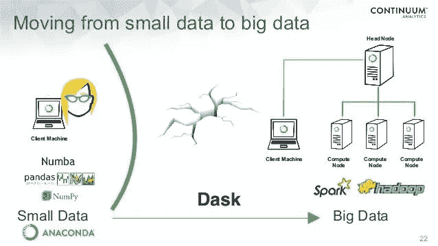

# Python 和机器学习 Dask

> 原文：<https://medium.com/analytics-vidhya/dask-for-python-and-machine-learning-dbe1356b5d7a?source=collection_archive---------7----------------------->

[来源](https://dask.org/)

# 路标

*   [Dask 上的茶话会](#bfd0)
*   [为什么达斯克是一个引人注目的人？](#ddb9)
*   [Dask 工作量](#5e82)
    [Dask 总体是什么？](#6bc6)
    [工作量机制](#feb9)
*   [Dask 集合](#8026)
    高级 API: Dataframe、数组、包、Sklearn
    低级 API: Delayed、Futures
*   [达斯克的阴暗面](#a327)
*   Spark v/s Dask

最近我遇到了一个非常有趣的 Python 库，叫做 DASK。它是一个开源的 python 库，具有独特的并行性和可伸缩性。它既可以在本地系统上扩展，也可以在一个机器集群上扩展。它在 Python 相关开发或构建 ML/AI 模型方面创造了自己的空间。

那么，就从它开始吧。🍵

# 达斯克的茶话会

*   Dask 是一个**开源** python 库，在 python 中具有并行性和可伸缩性的特性。
*   默认情况下包含在 Anaconda 发行版中。
*   Dask 重用现有的 Python 库，如 pandas 或 numpy，并通过增加可伸缩性来增强它们。另外， **sklearn 相关的 ML** 算法也实现了。
*   Dask 在数据争论方面表现更好**处理千兆字节的海量数据**比熊猫和**直播数据**就像 Spark 一样

[来源](http://httpstwitter.comJohnMillerTXstatus1002186463629504512photo1)

*   Dask 遵循**惰性计算**机制，只有在明确请求时才会执行计算。

***例如，***

假设，油漆房间的四面墙，一个油漆工在 4 天内完成，而两个油漆工一次最多需要 2 天。这突出了速度和时间的性能，这也是 Dask 所采用的。

# 为什么 Dask 是一个节目主持人？

*   **利用 PyData 栈中的并行性**
    py data 栈中的库如 pandas 和 numpy 都是针对单 CPU 内核构建的，这导致了以下问题:
    1 .读取大于 RAM 大小的 python 对象(如 dataframe)会导致**内存不足错误**并使系统崩溃。
    2。运行可能需要**很长时间。
    Dask 绕过全局解释器锁(GIL),**通过内部分块 python 对象并并行处理它们来利用多 CPU 内核**。**

[PyDatatack](https://subscription.packtpub.com/book/big_data_and_business_intelligence/9781784393670/1/ch01lvl1sec7/the-scientific-python-stack)

*   **可扩展性和分布式计算**
    DASK 可以在单个 CPU 上处理大型数据集，利用单个机器或机器集群上的多个内核进行并行计算。
*   **内存限制**在熊猫中当大量数据要被读取和处理时。

> [以优化的方式演示如何在 Python 中读取大型 CSV 文件](https://github.com/shachi01/dask_in_python_ml/blob/master/efficient_read_csv.ipynb)
> 
> [要获得更多见解，浏览一下这个博客。](/analytics-vidhya/optimized-ways-to-read-large-csvs-in-python-ab2b36a7914e?source=friends_link&sk=01a85157b1a4b2d203a2bc45ab674a4b)

*   Dask 允许像 Spark 一样的实时数据流，这在熊猫身上是不可能的。
*   **易于调试和诊断**
    美观的 **dask 仪表盘**可持续监控机器的运行进度和性能。
*   **一次读取多个 csv**
    Pandas 使用 read_csv()将单个 CSV 读入内存，但无法将多个 CSV 读入一个。但是 dask 可以像 Spark 一样使用通配符。

# Dask 工作负载

## **Dask 整体是什么？**

图 1

Dask 基本上是用高级和低级 API 构建的，由调度程序监控进程。这一节将更多地讨论调度器，下一节将讨论这些 API。

## **工作量机制**

*   Dask 使用了**惰性评估**的概念，这意味着只有当 **compute()被调用时才生成结果。**该执行通过由任务调度器协调的以下 DAG 来执行。

漫威:任务调度器

*   图 1 所示的任务调度器协调“分而治之”的计算，利用 CPU 内核之间的并行性。
*   如图 2 所示，任务图是在内存中创建的，任务按顺序在调用 compute()时执行。
*   它创建并**管理一个有向无环图(DAG)** 来建模任务的逻辑表示，也称为任务图。它通过将任务分配给节点工作器进行并行计算，生成单个结果来进行管理。

[图二](https://docs.dask.org/en/latest/)

**另一个漫威:达格**

*   用节点和边表示关系的无环有向图。
*   由任务调度程序构造，表示计算结果的步骤。
*   定向为向上到其终端节点的单向移动
*   visualize()用于将其可视化，如下所示。

[来源](https://examples.dask.org/delayed.html)

# 达斯克收藏

图 3

图 3 中命名的集合分布在单个 CPU 的多核上，然后并行计算。

## 高级 API

1.  **Dask 数组:**(并行 Numpy，即 numpy +线程)

*   一个大的 dask 阵列被分成小的 numpy 阵列，分布在多个 CPU 内核上，以**并行**方式运行。
*   加载，即使它们比 RAM 大
*   **dask 阵列上的任何操作都会在小块上触发相同的操作，每个小块都利用一个内核。这个**加速了计算。****

****

**[来源](https://docs.dask.org/en/latest/array.html)**

****2。Dask 数据帧:**(平行熊猫，即熊猫+线程)**

****

*   **与 dask array 相同，一个大数据帧**按照索引**分块成小熊猫数据帧，如图 4 所示，分布在多个 CPU 内核上，并行运行。**
*   **加载数据帧**，即使它大于 RAM** 。对于实际操作，查看[在 Python 中读取大型 CSV 的优化方法](/analytics-vidhya/optimized-ways-to-read-large-csvs-in-python-ab2b36a7914e?source=friends_link&sk=01a85157b1a4b2d203a2bc45ab674a4b)。**
*   **同时在块上执行时也加快了计算速度。**

****3。Dask 包:**(平行列表，即列表+穿线)**

*   **Python 对象的并行集合，即更大集合的分区。**
*   **在处理**半或非结构化数据**
    *时使用，例如，*预处理 JSON、日志文件或文本数据。此外，用户定义的 python 对象。**

****

**[来源](https://docs.dask.org/en/latest/bag.html)**

*   ***受益者:*
    在读取嵌套 JSON 的情况下，包是有帮助的，可以在以后**转换成 dask 数据帧**。**
*   ***局限性:*
    1 .不能改变包的元素，因为它是不可变的。
    2。groupby 函数非常慢。**

****4。Dask-ML:** (并行 Scikit-learn，即 sklearn+线程)**

*   **这个 Dask 库和 sklearn 一样用于构建 ML 模型。**
*   **使用内部 dask 集合并行化 ML 算法**
*   **Dask 通过 Joblib 使用现有的 sklearn 估算器和具有 n_jobs 参数的算法进行并行化。它使用 joblib backend 在计算量很大的集群上并行化。**
*   **也可以利用外部库，比如 xgboost 或 tf。**

> **就我个人而言，我会说 Dask 仍在为 ML 改进。即使构建一个简单的线性模型，许多正在进行的问题仍然是活跃的。**

## **低级 API**

1.  ****Dask 延迟:**(懒惰的平行物体)**

*   **延迟的 dask 对象本质上是**懒惰的**，这意味着只有在显式调用 compute()函数时才会被计算。**
*   **通过将延迟对象包装在函数周围，这些对象相当于 DAG 节点。**
*   **任务之间的相互依赖产生了执行和构建 DAG 的一系列步骤。**
*   **对延迟对象调用 compute()会调用调度程序来处理并行资源，并逐步计算 DAG，从而生成结果。**

****2。达斯克期货:**(热切的平行对象)**

*   **期货 dask 接口计算**立即**不太可能延迟对象。**
*   ****实时**执行**
*   **与 dask 数组、数据帧等不同，**需要 Dask 客户端**才能使用未来接口。**

> **在这个 [github 资源库](https://github.com/shachi01/dask_in_python_ml)中找到我的实践经验。**

# **达斯克的阴暗面**

**使用 Dask 时，需要考虑一些限制。**

1.  **熊猫不像 Dask，擅长优化复杂的 SQL 查询。**
2.  **对于那些对并行计算具有挑战性的操作，如排序和洗牌，效果并不好。或者在未排序的数据帧中建立新的索引。**

# **火花 v/s Dask**

**除了一些不同之处，并行性和可伸缩性的特性与 Spark 有些相似。**

****

**沙池**

# **参考**

*   **Dask 官方最新文档**

 **[## Dask-Dask 2 . 21 . 0+15 . g26e 722 f 0 . dirty 文档

### Dask 由两部分组成:针对计算优化的动态任务调度。这类似于气流，路易吉…

docs.dask.org](https://docs.dask.org/en/latest/)** 

*   **很棒的书，可以亲自动手**

** [## 使用 Python 和 Dask 的数据科学

### 摘要 Dask 是一款原生并行分析工具，旨在与您已有的库无缝集成…

www .亚马逊. in](https://www.amazon.in/Data-Science-Scale-Python-Dask/dp/1617295604)** 

**如果你喜欢这位作者的博客，请随意关注，因为这位作者保证会带来更多有趣的人工智能相关内容。
谢谢，
学习愉快！😄**

*****可以通过***[***LinkedIn***](https://www.linkedin.com/in/kaul-shachi)***取得联系。*****