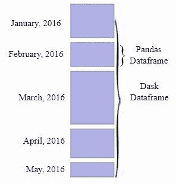

# Dask —大规模分析的并行性

> 原文：<https://medium.com/analytics-vidhya/dask-parallelism-for-analytics-at-scale-88cdc404b80f?source=collection_archive---------24----------------------->

Dask 是 Python 生态系统中的优秀工具之一，它允许为通常不适合“典型”工作站内存的数据集扩展数据工作负载。我将列出为什么我觉得它有用，为什么它在扩展现有的 Python 包时效果如此之好。

图片提供—[https://tutorial.dask.org/](https://tutorial.dask.org/)

Dask 的核心是 Python 的并行计算库。虽然有其他并行计算框架，如 Apache Spark 等，但 Dask 的一个关键优势是它如何在传统数据结构(如数组和数据帧)上进行扩展，这种扩展几乎是以增量的方式进行的，这些数据结构由 Numpy 和 Pandas 等流行的包提供，用于典型的内存处理。由于 Dask 原生支持 Numpy、Pandas 和 Scikit-learn 工作流，因此它是数据科学家和数据工程师开发和定制大规模数据管道和模型的强大工具。此外，Dask 还支持多核(这意味着您可以优化现有的计算能力)和分布式并行执行(类似于 Spark，您可以在集群中并行处理数据)

# Dask 中的数据结构和 API

Dask 中主要有 3 种类型的数据结构或集合。它们如下:

1.  Dask 数组——想想语法相似但处于分布式模式的 Numpy 数组。

图片由 https://docs.dask.org/en/latest/array.html[提供](https://docs.dask.org/en/latest/array.html)

2.Dask 包——类似于低级 PySpark 弹性分布式数据集(RDD)数据结构。

3.Dask 数据帧—一个大型并行数据帧，可以认为是由较小的 Pandas 数据帧组成，并扩展了相同的语法。

图片提供—【https://docs.dask.org/en/latest/dataframe.html 

就 API 而言，还有其他构建在 Dask 上的组件，比如 Dask-ML，它在语法上与 Scikit-Learn 非常相似。还有一个延迟接口，它可以作为包装器或装饰器函数来扩展 Dask 中的一般 Pythonic 代码。

# 行程安排

Dask 通过生成任务图来运行，然后在并行化的硬件上执行。

Dask 通常有两大类调度程序:

1.  单机调度器:单机调度器在本地进程或线程池级别提供基本特性。此计划程序是默认的。虽然它只能在单台机器上使用，并且使用简单，但应该注意的是，它不可伸缩。
2.  **分布式调度器**:这个调度器可以在本地运行，也可以分布在一个集群中。它也更加复杂，提供了更多的功能，但也需要更多的努力来设置。

图片提供—[https://docs.dask.org/en/latest/scheduling.html](https://docs.dask.org/en/latest/scheduling.html)

这只是对 Dask 世界的一个非常简短的介绍，我希望它将有助于您概括地理解它如何适合扩展现有的“单节点”生态系统来并行分析大规模数据。