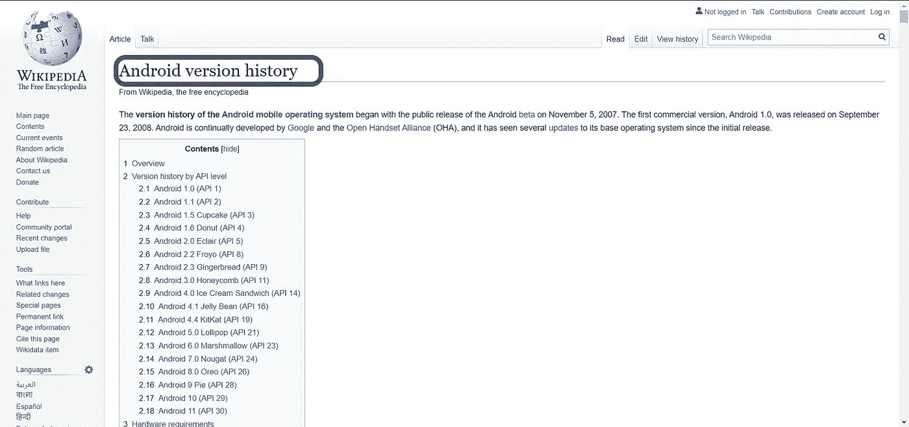
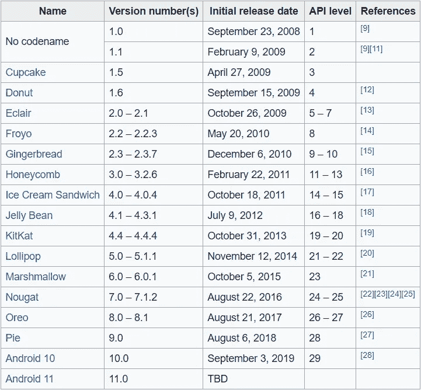
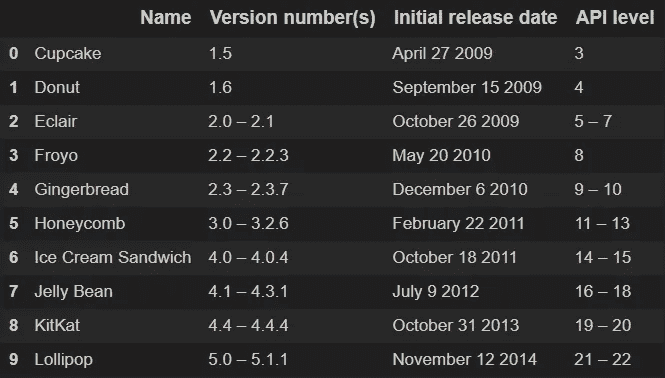

# 使用网络抓取、网络爬虫和 API 获取数据(第 1 部分)

> 原文：<https://medium.com/analytics-vidhya/data-acquisition-using-web-scraping-web-crawlers-and-apis-part-1-93f63ffa5e24?source=collection_archive---------18----------------------->

# **简介**

本文将介绍使用不同方法从 web 上删除数据的基本技术，例如使用爬虫和库(如 BeautifulSoup、urllib)以及以高效方式获取和解析数据的请求。

所有代码都在一个 GitHub 库中提供，请点击这里的[](https://github.com/aryanchugh816/Data-Science/blob/master/01%20-%20Data%20Acquisition/01%20-%20Data%20Acquisition%20-%20Web%20Scrapping%20using%20BeautifulSoup.ipynb)*查看代码。*

# ***使用 BeautifulSoup 进行网页抓取***

*Beautiful Soup 是一个 Python 库，用于从 HTML 和 XML 文件中提取数据。它与您喜欢的解析器一起工作，提供导航、搜索和修改解析树的惯用方式。*

*在本练习中，我们将从页面中提取基于 android 版本历史的表格(第一个表格):[https://en.wikipedia.org/wiki/Android_version_history](https://en.wikipedia.org/wiki/Android_version_history)*

***使用 urllib 获取 HTML 页面数据***

```
*from urllib.request import urlopen
android_url = "[https://en.wikipedia.org/wiki/Android_version_history](https://en.wikipedia.org/wiki/Android_version_history)"
android_data = urlopen(android_url) 
# android_data is an http response objectandroid_html = android_data.read()
# we can get the whole html of that page by using the read() method on the android_data (object)android_html = android_data.read()
android_data.close()*
```

*我们使用 **urlopen(url)** 向给定的 url 发送一个 HTTP 请求，并得到一个响应，我们使用这个响应对象通过 **read()** 内置方法提取页面 Html。记得在最后关闭连接。*

*现在我们将使用 **BeautifulSoup** 库来解析我们获得的 Html 代码。*

```
*from bs4 import BeautifulSoup as soupandroid_soup = soup(android_html, 'html.parser')
tables = android_soup.findAll('table', {'class':'wikitable'})
print("Number of Tables: {}".format(len(tables)))*
```

***输出:***

```
*Number of Tables: 31*
```

*我们首先必须使用创建一个 soup 类对象，并将解析器指定为“html.parser”。然后我们将使用 **findall()** 方法来检测一个特定的元素，并以字典的形式给出任何进一步的搜索属性作为第二个参数，在我们的例子中，我们想要属于类“wikitable”的表。*

*我们可以使用浏览器的内置 inspect 元素来查找元素标记和任何用于搜索的元素，如类名或特定 id，并将其作为字典传递。*

# ****findall():***的例子*

*我们将尝试查找带有“h1”标签的所有元素:*

```
*a = android_soup.findAll('h1', {})
# it return a list of matching objectsprint(a)
print(type(a))
print(len(a))*
```

***输出:***

```
*[<h1 class="firstHeading" id="firstHeading" lang="en">Android version history</h1>]
<class 'bs4.element.ResultSet'>
1*
```

*我们对ℎ1h1 标签的搜索只得到 1 个输出，因为此网页只包含一个 h1 标签，它是页面的标题，如下所示:*

**

# *在继续之前，我们将看一下我们试图刮擦的表*

**

*正如我们所看到的，前两行不能使用，因为这些 android 版本没有代码名称。*

*类似地，最后一行是无用的，因为它包含丢失的值，我们也可以删除最后一列，**引用**列，因为它不包含任何信息。*

*我们将选择第一个表数据，并从中提取列标题:*

```
*android_table = tables[0]
headers = android_table.findAll('th')# We will use these headers as columns names hence we have to store them in a variable
column_titles = [ct.text for ct in headers]# slice out the carriage return (\n)
column_titles = [ct.text[:-1] for ct in headers]# We wont be using the last column('References') hence we will remove it from our column names:
column_titles = column_titles[:-1]
print(len(column_titles))
print(column_titles)*
```

***输出:***

```
*4
['Name', 'Version number(s)', 'Initial release date', 'API level']*
```

*我们现在将获取表中的行，并通过将所有内容存储在一个 **table_rows** 变量中来完成对数据的排序和清理:*

```
*rows_data = android_table.findAll('tr')[1:]
print("Total number of rows: {}".format(len(rows_data)))# We will start with the third row as the first two rows have no name for the software versions
rows_data = rows_data[2:]
print("Number of rows we are going to display: {}".format(len(rows_data)))*
```

***输出:***

```
*Total number of rows: 18
Number of rows we are going to display: 16*
```

*整合所有内容的最终代码片段:*

```
*table_rows = []
for row_id, row in enumerate(rows_data):

    # We will skip the last row as it contains missing value
    if row_id == 15:
        continue

    current_row = []
    row_data = row.findAll('td', {})

    for col_id, data in enumerate(row_data):

        # We will skip the last column(References) as it does not contain any major information
        if col_id == 4:
            continue

        # We will also replace any commas(',') present in the data as we have to store the data in a csv
        # file
        text = data.text
        text = text.replace(",", "")[:-1] # We are slicing the data as all the elemnets contain a carriage
        # return('\n') at the end
        current_row.append(text)

    table_rows.append(current_row)*
```

*变量 **table_rows** 是一个嵌套列表，包含所有行的数据，我们可以将这些数据保存在一个 CSV 文件中，稍后将其显示为一个数据框(使用 pandas):*

```
*import pandas as pd
pd.DataFrame(table_rows, columns=column_titles).to_csv("Data/android_version_history_pandas.csv", index=False)# Reading CSV file and Displaying data
data_1 = pd.read_csv("Data/android_version_history.csv")
data_1.head(10)*
```

*最终结果如下所示:*

**

# ***结论***

*本文展示了使用 beautiful soup 作为 Html 解析器来清理和检索所需信息的基础知识。*

*在本文的第二部分，我将讨论如何从 API 中检索数据: [*【使用 Web 抓取、网络爬虫和 API 的数据采集(第二部分)】*](/@chugharyan816/data-acquisition-using-web-scraping-web-crawlers-and-apis-part-2-b85afddb5f9e) 。*