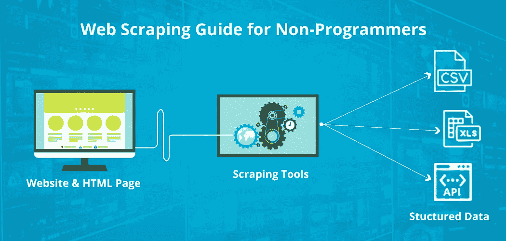

# 使用网络抓取、网络爬虫和 API 获取数据(第 2 部分)

> 原文：<https://medium.com/analytics-vidhya/data-acquisition-using-web-scraping-web-crawlers-and-apis-part-2-b85afddb5f9e?source=collection_archive---------15----------------------->

网页抓取

# **简介**

本文将介绍什么是 API，以及形成有效查询、从 API 获取数据和将数据组织成 JSON、CSV 等有效格式的基础知识。

所有代码都在我的 [Github 库](https://github.com/aryanchugh816/Data-Science/blob/master/01%20-%20Data%20Acquisition/02%20-%20Data%20Acquisition%20-%20Using%20Web%20APIs.ipynb)中提供，请点击这里直接跳转代码。