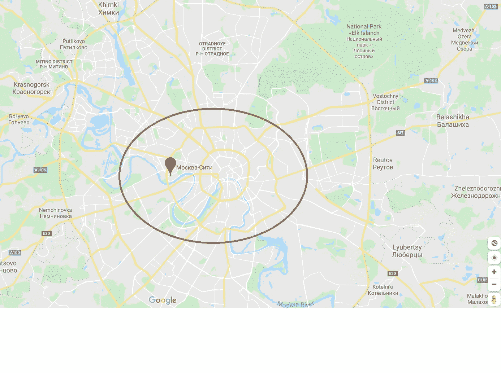

# 数据分析—麦肯锡大数据黑客马拉松

> 原文：<https://medium.com/analytics-vidhya/data-analyses-mckinsey-big-data-hackathon-bbe91ae4d29c?source=collection_archive---------11----------------------->

## 人群分析(CAX)——麦肯锡大数据黑客马拉松，预测某个司机接受报价的概率。

[https://www.boredpanda.com/fairy-lake-baikal-in-siberia/?UTM _ source = Google&UTM _ medium = organic&UTM _ campaign = organic](https://www.boredpanda.com/fairy-lake-baikal-in-siberia/?utm_source=google&utm_medium=organic&utm_campaign=organic)

在这篇博客中，我准备了由 CAX(Crowd AnalytiX)进行的关于麦肯锡大数据黑客马拉松的数据分析。本研究涵盖了双变量分析和多变量分析，并借助 Tableau 工具展示了一些有趣的模式和图像。

数据分析基于[麦肯锡大数据黑客马拉松](https://www.crowdanalytix.com/contests/mckinsey-big-data-hackathon)预测某个司机接受报价的概率。

特征分析也导致了数据科学项目中的一个重要实践—特征选择和工程。特征选择和工程更倾向于在数据集中选择合适的预测变量。

在本文中，我只展示了特性分析。

关于完整的项目，请访问 Github 资源库。

 [## rutvijbhutaya/麦肯锡大数据黑客马拉松

### 来源:艾新闻本次比赛的目的是预测某个公司接受要约的概率…

github.com](https://github.com/RutvijBhutaiya/McKinsey-Big-Data-Hackathon) 

为了进行特征分析，我们决定在 Tableau 中进行分析。Tableau 是以可视化形式分析数据的强大工具。因为我们的目标特性是 driver _ responce，所以我们的分析包含了最多的特定变量。

照片由[达蒙·赖斯](https://unsplash.com/@dame_visuals?utm_source=medium&utm_medium=referral)在 [Unsplash](https://unsplash.com?utm_source=medium&utm_medium=referral) 上拍摄

## 唯一的驱动程序代码—驱动程序对报价的响应

在上表中我们可以看到 1421 个驱动程序代码得到了最大的报价，然而，驱动程序接受的报价只有 90 个。同样，3371 驱动程序代码，得到了大约 500 个报价，但驱动程序接受的报价是 382。因此，这个司机通过接受报价做了最大的生意。

这种模式也显示在下面的地图中，

正如我们在地图上看到的，根据经度和纬度，数据来自俄罗斯莫斯科市。正如我们在地图上看到的，靠近莫斯科河的地方，与主城区的郊区相比，司机获得更多优惠和接受更多优惠的比例也很高。观察点，地图上显示的 3371、3665 和 6580 的司机 ID 在报价接受度上得到了很好的计数。

因此，我们可以说，在市中心的司机能够得到更多的认可，由于距离短。

正如我们在下面的图表中所看到的，红色的市场集群是在城市中心的司机，而圆圈的大小显示了以公里为单位的平均距离。然而，正如我们在蓝色集群中看到的，随着圆圈的大小变大，城市外的距离也变长了。

这通常发生在城市中，其中城市的中心由于距离短，司机可以更早得到，因此也可以接受下一个最近的乘车。

**一周中的某一天——相对于当天的总计数，驾驶员响应(接受)的百分比**

在这里，0-是星期天，而升序的工作日 6 是星期六。

正如我们在下图中看到的，周日和周五司机的接受率较低，在特定工作日司机接受的所有报价中，分别为 70%和 71.1%。

然而，我们能看到的最佳录取率是周三。还有周四。

周一、周五和周六的低接受率，也意味着司机的可用性？这些天我们是否观察到乘客过度拥挤？然而，我们不能完全否认车手们在周一或周六都很理想，没有接受报价。然而，周日的情况可能会有所不同，因为它只是一周的假期。

**一周中的某个小时——相对于一个小时内的总计数，驾驶员响应(接受)的百分比**

类似地，当我们观察酒吧聊天一周，我们也观察模式一小时。

如下面的条形图所示，条形线的高度是驾驶员响应的总计数，绿色份额表示驾驶员的接受率。

因此，正如我们在条形图中看到的，从早上 8 点到下午 3 点，司机的接受率很高。

然而，在晚上 7 点到 9-9.30 之间，优惠数量最多。但是由于司机的可用性，超过 25%的报价没有被接受。

这是一个时间框架，该公司需要努力将酒吧变成绿荫。

**提供课程——带着对 Avg 的敬意。距离和驾驶员对报价等级总体规模的反应(接受)**

正如我们在下面的条形图中看到的，乘客更喜欢预订 XL 类长途汽车，因此 XL 类的平均距离最大，约为 20 公里。

我们还观察到，对于 VIP+和 VIP 类别，司机接受顺风车的责任较高。然而，以公里为单位的距离对于 VIP+舱而言要少一些，主要是因为额外收费。

另一方面，在饼图上，经济舱和标准舱类别的驾驶员群体是接受乘客报价最少的群体之一。同样，这可能主要是因为低交易会导致特定级别组中的高峰，因此，司机无法接受即将到来的报价。

**平均基于小时键**的一周速度

速度是我们根据距离和持续时间创建的一个特征。在下面的多元分析中，我们取了一个小时内的平均速度，并检查了一周中哪一天有低流量和高流量。我们认为低速意味着高流量。

根据图表，在一天的早些时候，平均。速度高于平均水平，随着营业时间的开始，速度下降到平均线以下。然而，如我们所见，周日(用橙色表示)的速度高于平均水平。这表明，由于更少的交通出租车能够实现以上的平均。周日速度。

我们还可以在图表中看到一些异常值，从午夜到清晨。

**驾驶员反应——相对于平均值。距离和平均值。特定日期的速度**

基于平均值。基于小时关键分析的一周内的速度，我们也不能根据交通状况联系驾驶员的反应。

这里，0 表示驾驶员不接受报价，1 表示驾驶员接受报价。司机不接受报价时，平均。以公里为单位的距离很高，平均。速度很慢。
此外，在条形图中，我们可以观察到，在周一，乘客的报价高于平均水平，但司机的接受率低于平均水平。周六，情况正好相反。

**%的驾驶员响应(接受)—关于给定工作日的报价类别**

根据下面的饼图，标准舱和经济舱群体的市场份额最大，这可以从这两个舱位的优惠数量中轻松了解——如条形图所示。

基于红色和贪婪的背离，我们可以确定经济舱司机在工作日接受的报价更少。对于标准班，我们可以看到，只有在周日接受的比例较低(可能是因为司机较少和放假)。

本文仅限于数据分析和特性分析，但是，我也分享了一种数据清理方法，在 Git 存储库中进行探索性的数据分析和模型构建——更多详情[请点击此处](https://github.com/RutvijBhutaiya/McKinsey-Big-Data-Hackathon)。

 [## Github |机器学习|数据科学 I 项目

### 这个网页反映了我对机器学习和数据科学项目及其实施的理解。

rutvijbhutaiya.wixsite.com](https://rutvijbhutaiya.wixsite.com/newage)