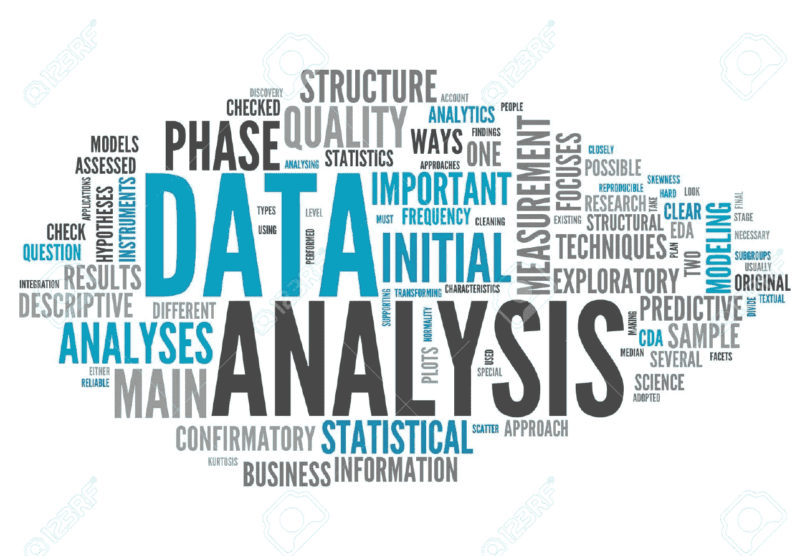
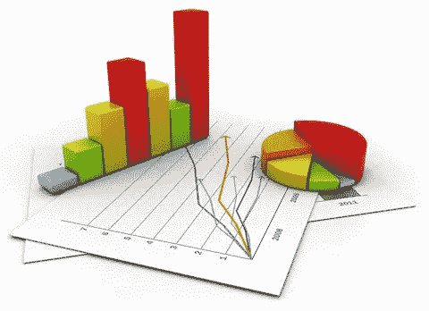

# 数据分析及其类型

> 原文：<https://medium.com/analytics-vidhya/data-analysis-and-its-types-88d001a9ea5a?source=collection_archive---------8----------------------->

大数据一词是由 O'Reilly Media 的 Roger Mougalas 创造的。它指的是使用传统的商业智能工具几乎不可能管理和处理的大量数据。

如今，大数据概念已经席卷了几个行业。在此之前，直觉在市场竞争决策中发挥着重要作用。现在，潮流已经改变，大多数组织已经意识到数据应该是他们决策的核心。

通过利用唾手可得的数字洞察财富和商业智能的力量，有可能做出更明智的决策，从而实现商业增长、发展和增加利润。

在了解我们将如何使用这些数据来做出这样的决定之前？我们需要了解如何分析数据，从中得出有价值的见解。从中获取真正价值的关键是理解不同的数据分析技术，这些技术将决定您的数据驱动型决策有多成功。

# **数据分析类型**

所有行业都在使用四种类型的数据分析。虽然我们将它们分成不同的类别，但它们都是相互联系、相互依存的。当您开始从最简单的分析类型转移时，难度和所需资源会增加。同时，增加的洞察力和价值的水平也增加了。有 4 种数据分析类型/技术:

*   描述性分析
*   诊断分析
*   预测分析
*   规定性分析

现在，我们将通过一个示例来研究所有类型，让您有一个简单的了解。

## **描述性分析**

这种分析是第一种类型，它为其他类型奠定了基础。描述性分析顾名思义只是描述性的。除了手头的数据，他们不会进行归纳。它是最简单的，也是当今商业中最实用的。

描述性分析通过总结过去的数据(通常以仪表板的形式)来回答“发生了什么”。它有助于以各种业务读者容易理解的格式描述和呈现数据。它很少试图调查或建立因果关系。

由于这种形式的分析通常不会超出表面分析，结果的有效性更容易实现。描述性分析中常用的方法有观察、案例研究和调查。因此，这种类型的分析可能涉及大量数据的收集和解释。

描述性分析的一个例子包括:

网飞、亚马逊 Prime 等视频流媒体平台拥有监控工具和情感分析工具，可以帮助你识别谁是你的潜在客户，什么对他们最重要，以及他们在不同社交平台上的行为倾向。《今日网飞》使用元数据，不仅是为了通过推荐引擎让你看得更好，也是为了通过根据观众的要求为新作品提供资金来提高内容本身的质量。并提高自身的盈利能力。

## **诊断分析**

通过问“发生了什么”为我们的分析打下基础后，我们通常想知道“为什么会发生”的原因这通过诊断分析来回答。

诊断分析采用从描述性分析中发现的洞察力，并向下钻取以找到该结果的原因。它的特征可以通过下钻、数据发现、数据挖掘和关联等技术来体现。组织利用这种类型的分析来识别数据中的行为模式。

同样的一个重要方面是创建详细的信息。让我们举个例子，你的 CEO 问你一个问题“尽管你在 LinkedIn 营销方面投入了更多，但为什么你 10 月份的销售额减少了 20%？”。经过调查，您注意到在“活动/目标”中，LinkedIn 的一些用户将产品添加到购物车，但没有结账。数据显示，当客户被要求提供送货地址和付款细节时，退出率极高。很多事情都可能出错:

*   表单加载不正确
*   运费太高了
*   表单太长，不支持移动设备
*   没有足够的支付选项可用

诊断分析的目标是帮助您找到问题的根本原因。为了做到这一点，算法使用自有的专有数据，并利用外部信息来了解到底发生了什么，并帮助您找到快速解决方案。

## **预测分析**

现在的问题是“可能会发生什么？”在这里，预测分析帮助我们理解为什么某些事情会发生，然后建立一个模型来预测在不久的将来会发生什么。

预测分析比以前的类型更上一层楼。诊断分析使用描述性分析帮助我们在组织良好的数据中找到模式，而预测性分析使用两种类型，并试图对事件的结果做出逻辑预测。

预测分析对企业非常有益，因为它可以作为一种指南，通过降低成本来提高运营效率。通过使用预测分析优化营销活动，组织还可以产生新的客户响应或购买，以及促进交叉销售机会。预测模型可以帮助企业吸引、保留和培养他们最有价值的客户。

预测分析还可用于检测和阻止各种类型的犯罪行为，以免造成严重损害。通过使用预测分析来研究用户行为和行动，组织可以检测出异常活动，从信用卡欺诈到企业间谍活动再到网络攻击。

## **规定性分析**

规范分析是业务分析的一个领域，致力于为任何给定的情况找到最佳的行动方案。除了回答“可能会发生什么？”它还解决了“我们应该做些什么来达到期望的结果？”组件。规范分析是数据分析的前沿，它考虑了所有先前分析的见解，以确定问题或决策的最佳行动方案。

说明性分析的最佳实例是谷歌的无人驾驶汽车。驱动它们的算法考虑了每次旅行的几次预测。预测时牢记道路规则，例如在白色车道之间行驶，将车速保持在限速之下，从一个目的地到达另一个目的地所需的车速，行驶车辆之间的安全距离以避免撞车，等等。

随着技术的不断进步和更多专业人士接受数据教育，我们将看到更多公司进入数据驱动领域。

# **结论**

根据寻找最被接受的数据分析工具类型的各种调查，对于 2016 年全球数据和分析调查:重大决策，普华永道要求 2000 多名高管选择一个最能描述他们公司决策过程的类别。结果表明，描述性分析占主导地位，其次是诊断，然后是预测。

对于另一项调查，BARC 的 BI 趋势监测 2017，引入了一个新术语高级分析。这是预测性和规范性分析类型的总称。根据 2018 年高级和预测分析市场研究，大多数受访者首次认为高级和预测分析“至关重要”或“非常重要”。

如上所述，我们可以得出结论，这些类型的数据分析在一定程度上都是部分依赖的。所有这些都服务于不同的目的，并为我们提供不同程度的见解。这些调查让我们更好地了解了数据分析工具的需求及其在我们行业决策中的重要性。

我将从商业角度发表几篇关于大数据概念的博客。敬请关注。你可以到 akshamb2@gmail.com 的[找我。](mailto:nihit.saxena@outlook.com)

谢谢&学习愉快。:)