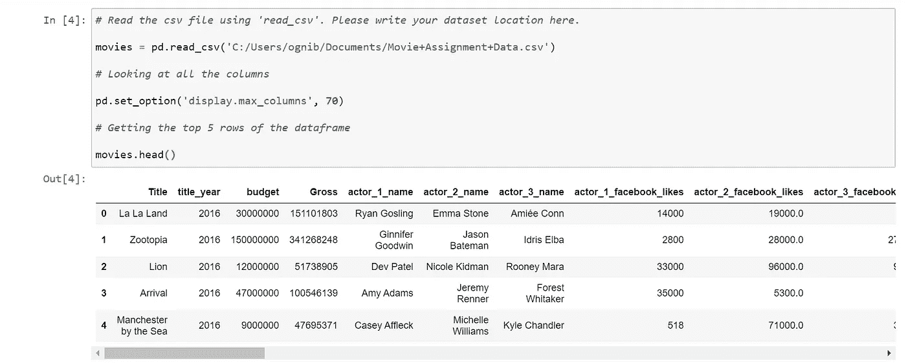
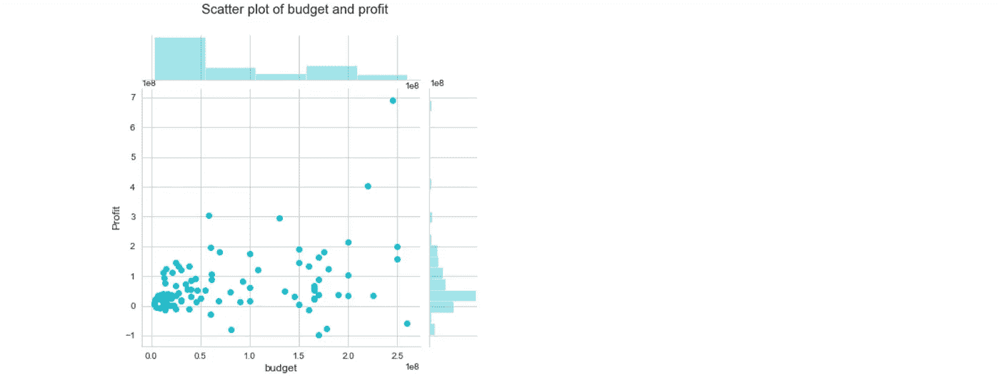

# 数据分析端到端 IMDb 数据集

> 原文：<https://medium.com/analytics-vidhya/data-analysis-end-to-end-imdb-dataset-2b6d9976ebc2?source=collection_archive---------1----------------------->

IMDb 数据的数据分析

## 介绍

因为这是我第一篇关于媒体的文章。我想写一份详细的解释，说明我对 IMDB 电影评级上非常流行但常见的数据集的分析。任何一个新手和开始数据科学之旅的人肯定都遇到过这个数据集。不同类型的分析、预测模型、文章等在网上随处可见，但即使你没有，也不用担心。在写这篇文章之前，我还浏览了许多博客、Kaggle 内核和 GitHub 笔记本，我仍然相信这篇分析与其他分析大相径庭，我决定与那些对主流之外的学习感兴趣的读者分享:-D

简单介绍一下我的背景，我的职业生涯始于一名分析师，现在正在攻读数据科学和机器学习领域的 PG，这项分析是我们课程的一部分。因此，我将在本文中介绍的所有不同的可视化和分析都是由我们的教师和行业专家精心制作的，因此也是它脱颖而出的原因。

## 我们将如何进行

我想声明的是，整个分析已经在 **Python** 上完成，平台是 **Jupyter notebook** 。任何对这种语言有初步了解的人都能很容易理解这种代码。如果有人想拥有它的 R 版本，请告诉我，我将开始制作 R- notebook。但是我建议你自己试着复制同样的东西！那会帮助你学习。

在我开始之前，我想设定这篇文章的期望。这篇文章旨在让你像分析师一样思考，如何分析性地处理商业问题，背后的商业逻辑是什么，等等。它包含简单的 python 代码、基本的 viz，没有预测性建模——因为这里的目标不是分享关于编码或任何高级统计的知识。因为这是一个有点长的博客，我给读者的建议是不要一次读完，试着分成几部分，当你觉得太多的时候，就停下来！给页面加书签，喝完咖啡再回来！！

说够了，让我们开始吧:

**链接到 IMDb 数据集和数据描述**

[*IMDb 数据集*](https://drive.google.com/drive/folders/1WiD9EC0Qqc_bWdn93-_kxYtiP48Wlb-v?usp=sharing)

> **“你的方法是你成功的关键”**

应该遵循科学的方法，使用我们手头的数据来解决任何业务问题，以获得有价值的见解和建议。

数据分析流程

我给每个人的建议是，一开始不要看代码或解释。阅读不同的步骤，尝试自己解决它，给它一些时间，当你认为足够了，然后查看不同的代码块和解释！

**祝你好运！！:-D**

*首先，我们将执行分析所需的常规步骤，然后慢慢地我们将开始构建上下文并解决问题。*

## **导入库**

导入 numpy、pandas、seaborn 和 matplotlib，并为它们分配别名以便于使用

## 读取数据

*   ***读取电影数据***

读取提供的电影数据文件，并将其存储在数据帧电影中，并获取数据帧的前 5 行

> **现在想想！**

看完数据，下一步怎么办？其实接下来我们该怎么办？答案是理解我们数据的**高层结构，我们如何做到这一点？**

这些是分析师通常遵循的一些常用方法，通过检查他们的:

1.  卷
2.  形状
3.  特征类型
4.  特征统计
5.  缺少值

知道为什么分析师总是这样做吗？ —有时，当他们处理具有数百列和数百万行的庞大数据集时，将它们作为一个整体来管理是一项艰巨的任务。因此，让他们清楚地了解自己的数据非常重要。

*   ***检查数据帧***

检查数据帧中不同列的**尺寸、空值和摘要**

*现在，没有添加某些代码结果来限制文章的大小。*

好吧！那么，我们在这里得到了什么？我们有维度、所有特征及其数据类型、缺失值和基本统计数据。这些信息足以让我们对数据框架有一个概念

> 现在，暂停一会儿…

点亮心灵！

在我们进入分析部分之前，我希望你以下列方式对**和**进行头脑风暴:

1.  我们要解决的业务问题是什么，我的目标是什么？想想吧！
2.  我想做什么样的分析，为什么？想想吧！
3.  **我的结果能产生什么样的商业影响？想想吧！**
4.  **谁是我的报告的最终用户或消费者？想想吧！**

有 n 种方法可以解决这个问题。其中一个在这里被提到-

想象一下我在一家大型制作公司工作。我的经理除了投资回报率什么都不知道。她/他告诉我，‘我打算投资一部新电影。给我一份报告，帮助我决定投资什么类型的电影，这样我就能获得最大利润

就是这样！！

我要做的第一件事是把我的问题分成几个部分，然后好好想想，首先，让我看看这些不同的电影在投资回报率方面表现如何，然后看看谁是表现最好的。为此，我需要这些基本信息:

1.  电影属性
2.  这部电影的预算
3.  电影赚取的利润

酷！！我们开始吧

> **“折磨你的数据，它会招供！!"**

## 数据分析

*   ***减少数字以提高可读性***

`budget`和`gross`中的数字太大，影响了可读性。让我们先将`budget`和`gross`列的单位从`$`转换为`million $`

*   ***让我们谈谈利润吧！***

1.  创建一个名为`profit`的新列，其中包含两列之间的差异:`gross`和`budget`
2.  使用`profit`列作为参考对数据帧进行排序
3.  按降序提取前十部盈利电影，并将它们存储在一个新的数据帧中— `top10`

4.在列`budget`和`profit`之间绘制散点图或联合图，并写下您观察到的情况

你可以忽略上面的步骤，使用默认的样式和颜色。

***我的数据到底想说什么…..？***

这是我们的第一次可视化，我们能推断出什么？

我的**观察**如下:

*   单独检查预算和利润，两者都稍微向右倾斜，这意味着大多数电影都有正利润，预算也很高
*   我们可以观察到，有几部电影的预算非常高，但仍然有负利润
*   我们可以看到“预算”和“利润”之间略有上升的趋势，即预算增加，利润也增加
*   在 0-1 亿美元预算之间，我们可以看到很多电影提供 0-3 亿美元的利润(不包括负利润电影)

该数据集包含了 2010 年至 2016 年间表现最好的 100 部电影。然而，散点图讲述了一个不同的故事。你可以注意到有一些电影是负利润的。虽然好电影确实会亏损，但似乎也有不少电影亏损。这背后的原因可能是什么？让我们通过寻找负利润的电影来更仔细地看看这一点。

5.提取利润为负的电影，并将它们存储在新的数据帧中— `negative_profit`

你能在数据集中找到电影`Tangled`吗？你可能知道电影《纠结》。尽管它是有史以来票房最高的电影之一，但根据这一结果，它的利润为负。如果你交叉检查这部电影的总值([链接:https://www.imdb.com/title/tt0398286/](https://www.imdb.com/title/tt0398286/))，你可以看到数据集中的总值只占国内总值，而不是全球总值。这也适用于名单上的其他电影。

***太棒了！！我们已经完成了第一次分析…..***

> **接下来呢？**

做一个数据侦探！

现在，假设我想找出受欢迎的电影，受欢迎的意思是它们有良好的公众反应。

***我们如何发现这一点？…***

您可能已经注意到了这个数据集中的列`MetaCritic`。这是一个非常受欢迎的网站，通过顶级评论家给出的分数来确定平均分数。其次，你还有另一个栏目`IMDb_rating`，告诉你一部电影的 IMDb 评分。这个评级是通过取普通观众的十万个评级的平均值来确定的。

*   ***普通观众和评论家***

作为这一分析的一部分，我们将找出最受评论家和观众喜爱的电影。

1.  首先，你会注意到`MetaCritic`的分数是在`100`的范围内，而`IMDb_rating`的分数是 10 分。首先，将`MetaCritic`列转换为 10 的刻度。
2.  现在，要找出既受评论家也受观众喜爱，而且总体评价很高的电影，你需要-

*   创建一个新列`Avg_rating`，它将包含`MetaCritic`和`Rating`列的平均值
*   按 Avg_rating 降序获取电影列表

所以，我们按照平均受欢迎程度的降序排列了所有的电影

现在，我想**多挖掘一点**来找出哪些电影是`MetaCritic`和`IMDb_rating`都在更高的尺度上并且非常受欢迎的。

有什么主意可以着手去做吗？想想吧！

*“记住，并不是你想要的一切都来自数据，有时你需要足够的创新，像一个* ***数据侦探一样思考，想出你自己认为可以加强分析艺术的公式。这才是一个分析师的真正力量。他们总是跳出框框思考！!"***

与此同时，事情是这样的:

*   仅保留`IMDb_rating`和`Metacritic`列之间的**绝对差值(使用 abs()函数)**小于 0.5 的电影。参考此链接了解 abs()函数如何工作- [abs()](https://www.geeksforgeeks.org/abs-in-python/)
*   按照`Avg_rating`的降序对这些值进行排序，仅保留评级等于或高于`8`的电影，并将这些电影存储在新的数据帧`UniversalAcclaim`中

***太棒了！我们创造了自己的新标准。***

现在，你的制作公司想拍一部轰动一时的电影。在你的电影中主要有三个主角，公司希望选出最受欢迎的演员。

既然你的经理不想冒险，他让你找一个之前已经在电影中合作过的三人组。

所以我们的下一个任务是-

*   ***寻找最受欢迎的三重奏— I***

我选择的衡量受欢迎程度的标准是脸书对这些演员的喜爱程度

数据框架有三列来帮助您完成相同的任务，即。`actor_1_facebook_likes`、`actor_2_facebook_likes`和`actor_3_facebook_likes`

我们的目标是:

1.  找出脸书喜欢的人数最多的三重奏。也就是说，`actor_1_facebook_likes`、`actor_2_facebook_likes`、`actor_3_facebook_likes`之和应该最大。
2.  找出**最受欢迎的五首**三重奏，并列表输出他们的名字

嗯，我得到了最受欢迎的演员，但是我对结果不满意。让我们更进一步

*   ***寻找最受欢迎的三重奏— II***

在上一个子任务中，您根据脸书的总赞数找到了流行三重奏。再加个**小条件**吧，保证三个演员都受欢迎。条件是**三个演员中脸书喜欢的一个都不能少于另外两个**的一半。例如，下面是一个有效的组合:

*   actor _ 1 _ facebook _ 赞:70000
*   actor _ 2 _ facebook _ 赞:40000
*   actor _ 3 _ facebook _ 赞:50000

但是下面这个不是:

*   actor _ 1 _ facebook _ 赞:70000
*   actor _ 2 _ facebook _ 赞:40000
*   actor _ 3 _ facebook _ 赞:30000

因为在这种情况下，`actor_3_facebook_likes`是 30000，不到`actor_1_facebook_likes`的一半

有了这个条件，就能确保**你的三人组**中没有任何不受欢迎的演员(因为上一个问题中计算的总喜欢数并不能说明三人组中每个演员的个人受欢迎程度。)

你可以手动检查你在前一个子任务中找到的前 5 个流行的三重奏，并检查这些三重奏中有多少满足这个条件。还有，套用上面的条件后，哪个是最受欢迎的三重奏？

> **又到了应用逻辑的时候了！**

逻辑和科学的结合

1.应用上面讨论的逻辑

2.得到所有满足条件的三元组

3.此外，检查在这个结果和之前的结果之间是否有任何共同的三元组

现在我对自己的结果很满意。名单上甚至还有我最喜欢的超级明星。你们呢？你能在名单上找出你最喜欢的明星吗？

在数据帧中有一个名为`Runtime`的列，主要显示电影的长度。看看这个变量是如何分布的可能会很有趣。画一个《海伯恩》的`histogram`或`distplot`，找到大多数电影落入的`Runtime`范围。

*   ***运行时分析***

好的，我们的另一个观察结果是，我们可以看到大多数电影都在 120-130 分钟的运行时间内。

下面我们来分析一下 **R 级电影**。虽然 R 级电影是限制 18 岁以下年龄组的电影，但仍然有来自该年龄组的投票数。在所有由 18 岁以下年龄组投票选出的 R 级电影中。

*屋子里所有的家长，结果就是你们这些人要好好检查一下自己的孩子:- P*

*   ***限制级电影***

1.过滤掉限制级的电影

2.按“CVotesU18”降序排列

3.获得前 5 名

嗯。看来《死侍》、《华尔街之狼》在年轻人中很受欢迎。

现在继续，你是否注意到在不同的人口统计中有很多列名为**【cvo tes】**和**【Votes】**。我们能从他们身上得到些什么吗？*想一想！*

如果我没错的话，我的经理想拍一部高投资回报率的电影。**(总是回到商业目标)**高投资回报率意味着电影应该受到人们的欢迎，这样他们才会买票。我们如何做到这一点？我们如何利用这些 ***人口统计数据来进行我们的分析！***

如果你看一下数据帧中的最后几列，它们提供了一个很好的投票者的数量感(在最后的分析中，我们使用了其中的一列——cvotesu 18 ),并且还有三个类型列指示特定电影的类型。我们能对他们做些什么吗？想想吧！

好的，**这将是我们分析的最后一个阶段**，我们将分析所有人口统计中的投票者，并了解不同类型的投票者之间的差异。所以事不宜迟，让我们从`demographic analysis`开始吧

## 人口统计分析

人口统计分析

*   ***按流派组合数据帧***

数据帧中有 3 列— `genre_1`、`genre_2`和`genre_3`。作为此分析的一部分，我们需要聚合这 3 列中的一些值。

1.  首先，创建一个新的数据框架`df_by_genre`，它包含`genre_1`、`genre_2`和`genre_3`以及来自`movies`数据框架的与 **CVotes/Votes** 相关的所有列。总共有 47 列要提取。
2.  现在，将名为`cnt`的列添加到 dataframe `df_by_genre`中，并将其初始化为 1。在本次分析结束时，我们将认识到该列的用途
3.  将数据帧`df_by_genre`按`genre_1`分组，找出所有数字列的总和，如`cnt`，与 CVotes 和 Votes 列相关的列，并将其存储在数据帧`df_by_g1`中
4.  对`genre_2`和`genre_3`进行同样的操作，分别存储数据帧`df_by_g2`和`df_by_g3`

5.现在我们已经有了通过分别对`genre_1`、`genre_2`和`genre_3`分组来执行的 3 个数据帧，是时候将它们组合起来了。为此，添加三个数据帧并将其存储在一个新的数据帧`df_add`中，以便为每个流派添加相应的 Votes/CVotes 值。熊猫有一个叫`add()`的功能可以让你这么做。你可以参考这个链接来了解这个函数是如何工作的。 [*熊猫添加()*](https://pandas.pydata.org/pandas-docs/version/0.23.4/generated/pandas.DataFrame.add.html)

6.关于聚合的专栏`cnt`基本上跟踪了每个流派的出现次数。根据`cnt`列值，将至少包含 10 部电影的类型划分到一个新的数据帧`genre_top10`中。

7.现在，将所有数字列的平均值除以列值`cnt`，并将其存储回同一个数据帧。**在本任务中，我们将使用该数据帧进行进一步分析，除非明确提到使用数据帧** `movies`

8.因为投票数不能是分数，所以将所有与投票相关的列转换为整数。此外，将所有与投票相关的列四舍五入到小数点后两位数。

如果我们看一下你得到的最终数据框架，你会看到你现在有了关于前 10 大流派的所有人口统计(**投票和与投票相关的**)栏的完整信息。我们可以使用这个数据集来提取关于选民的令人兴奋的见解！

> **“图表”时间到了！！！**

分析图表

*   ***流派计数***

我们现在将使用 seaborn 制作一个条形图，绘制不同的**类型与 cnt** 类型，并从这个数据框架中获得一些见解

好吧！！前 100 部电影的数据集有**戏剧**流派最多。就目前而言，我们不能简单地通过这个图表来判断流派的受欢迎程度。这张图表只给出了数字，没有别的。

***让我们深潜更远！！***

如果您仔细查看了与投票和 CVotes 相关的列，您可能会注意到后缀`F`和`M`表示女性和男性。既然我们有不同年龄组的男性和女性的投票数，现在让我们来看看**在数据框架**中，不同性别的流行类型是如何变化的

*   ***性别和流派***

***注:使用***`*genre_top10*`***data frame 进行此分析***

1.  我们将制作第一张热图，看看男性的平均投票数在不同类型中是如何变化的。使用 seaborn 热图进行此分析。X 轴应包含男性的四个年龄组，即`CVotesU18M`、`CVotes1829M`、`CVotes3044M`和`CVotes45AM`。Y 轴将显示类型，热图中的注释显示该年龄男性群体的平均投票数
2.  制作第二张热图，看看女性的平均投票数在不同类型中是如何变化的。使用 seaborn 热图进行此分析。X 轴应包含女性的四个年龄组，即`CVotesU18F`、`CVotes1829F`、`CVotes3044F`和`CVotes45AF`。Y 轴将显示类型，热图中的注释显示该年龄段女性的平均投票数

*太好了！现在让我们从上图*中获得一些见解和观察

**推论:**从上面的热图中可以看出，男性的投票率高于女性，科幻小说似乎在 18-29 岁年龄组中最受欢迎，与性别无关。从绘制的两张热图中，我们还能推断出什么？

*   推论 1:年龄在 18-44 岁之间的人投票最多，与性别无关
*   推论 2:即使科幻小说的票数比其他类型少(之前的条形图),它仍然拥有最高的票数
*   推论三:U18M 比 U18F 投票多。总的来说，U18 和 45A 的人看电影较少，不管他们的年龄如何，或者他们看了电影但没有投票
*   推论 4:平均而言，女性(年龄从 18 岁到 44 岁)比男性更倾向于动作片、冒险片、动画片、喜剧片、爱情片和惊悚片(排在科幻片之后)
*   推论 5:与其他类型相比(只考虑男性性别)，无论年龄大小，浪漫是男性投票最少的，投票数可能高于女性，但如果只考虑男性性别，他们投票最少的是浪漫。

3.制作第二张热图，看看女性的平均投票数在不同类型中是如何变化的。使用 seaborn 热图进行此分析。X 轴应包含女性的四个年龄组，即`VotesU18F`、 `Votes1829F`、`Votes3044F`和`Votes45AF`。Y 轴将显示类型，热图中的注释显示该年龄段女性的平均投票数

**推论:**科幻似乎是 U18 年龄组中男性和女性评价最高的类型。此外，这个年龄组的女性对它的评价比同年龄组的男性高一点。其他一些推论可以是-

*   推论 1:有趣的是，尽管男性对爱情片的平均投票数较少，但平均评分与女性大致相同，这意味着爱情片一般来说较少被男性观看或投票，但电影是好的，因为无论性别如何，特别是对 U18 来说，它们的评分都很高
*   推论 2:不考虑性别，年龄在 30-45 岁之间的人对不同类型的平均评分在 7.7 到 7.8 之间，大多数人没有超过 8。可以做一个轻微的观察(没有因果关系),随着年龄的增长，你倾向于成为一个批评家
*   推论 3:我们可以看到，随着年龄的增长，动画类型在女性中的投票率稳定，而在男性中有显著的差异(下降),有趣的是观察到所有年龄的女性都喜欢动画电影

您可能需要链接来格式化您的 [*热图。*](https://stackoverflow.com/questions/56942670/matplotlib-seaborn-first-and-last-row-cut-in-half-of-heatmap-plot)

我们能再来点什么吗？作为一个分析师，你应该总是不满足和好奇:-P .总是试图击中下一英里！！

你能看到数据集既包含美国电影**又包含非美国电影**吗？让我们分析一下美国和非美国选民对美国和非美国电影的反应

*   ***美国 vs 非美国交叉分析***

**注意:使用** `movies` **数据框完成该子任务。利用此文档格式化您的方框图**-[-*方框图*-](https://seaborn.pydata.org/generated/seaborn.boxplot.html)

1.  我们将在数据帧`movies`中创建一个列`IFUS`。如果电影的`Country`是“美国”,`IFUS`列应该包含值“美国”。对于除美国以外的所有其他国家，`IFUS`应该包含值`non-USA`。
2.  现在制作一个箱线图，显示美国人民的投票数，即`CVotesUS`在美国和非美国电影中的变化。利用列`IFUS`制作此图。同样，制作另一个次要情节，通过为美国和非美国电影绘制`CVotesnUS`来显示非美国选民如何投票给美国和非美国电影。

**推论:**

*   推论 1:我们可以观察到，无论美国或非美国电影的来源如何，非美国人的平均投票数都比美国人多
*   推论 2:我们可以观察非美国电影，与美国电影相比，投票数是均匀分布的
*   推论 3:我们可以看到美国人对美国电影和非美国电影的投票数量有显著差异。美国人投票支持非美国电影的人数较少
*   推论 4:从这两个图中，我们可以看到美国电影的一些异常值
*   推论 5:总的来说，美国电影比非美国电影获得了更多来自美国人和非美国人的投票

3.我们将再次进行类似的分析，但使用评级。制作一个箱线图，显示美国人的评分，即`VotesUS`在美国和非美国电影中的变化。同样，制作另一个支线剧情，展示`VotesnUS`在美国和非美国电影中的变化。

**推论:**

*   推论 1:平均来说，我们可以看到美国人的平均评分比非美国人高(大约 7.9 到 8 分)
*   推论 2:有趣的是，美国人和非美国人对非美国电影的评价明显低于美国电影(非美国人的差异大于美国人)
*   推论 3:与其他人相比，美国人对非美国电影的评级分布具有均匀分布

**综合推断:**从这一对箱线图中可以得出一个重要的观察结果，即尽管非美国人的中值票数远高于美国人，但他们的中值评分低于美国人，其中一个可能的原因是

*   假设美国以外的人口意味着来自亚洲国家、欧洲国家等的选民占了很大一部分，所以随着人口的增加，我们也可以有更多的批评家
*   ***前 1000 名投票者 vs 流派(最后一次分析！！):P***

您可能也注意到了列`CVotes1000`。该列代表 IMDb 的前 1000 名投票者，并给出为特定电影投票的这些投票者的数量。让我们看看前 1000 名投票者是如何跨流派投票的。

1.  根据`CVotes1000`的值对 dataframe genre_top10 进行降序排序。
2.  为`genre` vs `CVotes1000`制作一个航海柱状图

**推论:**

*   在前 1000 名投票者中，爱情片被评为最少
*   在前 1000 名投票者中，科幻小说最受欢迎
*   动作片、惊悚片和冒险片的受欢迎程度没有显著差异，这也是为什么这三部电影通常是齐头并进的
*   如果我们将这个条形图与之前的条形图进行比较，我们可以看到 IMDb 前 1000 名投票者更喜欢科幻而不是戏剧，并且数据集包含的戏剧电影比其他类型的电影更多
*   我们可以看到，即使科幻在数据集中的电影很少(如前面的 count- bar 图所示)。总的来说，他们从男性、女性以及 Imdb 前 1000 名投票者那里获得了最多的选票，并且在他们的年龄组中，他们拥有最高的性别评分

说完这些，我们的分析就结束了。我知道这很多，所以我会再次强调不要一下子做完这些，当你感到筋疲力尽的时候停下来，过一段时间再回来。同样，这个分析的目的是让你像一个分析师一样思考，而不仅仅是做一个端到端的项目。 利用您的空闲时间，自己进一步探索数据集，看看您能从各种其他专栏中获得什么样的其他见解。

我很想得到你的反馈，因为这也能让我保持动力。一定要让我知道我可以修改什么东西，让它更有吸引力，更容易理解。你也可以就具体的主题给我一些建议，我会在以后的文章中继续努力。

你可以通过我的[***LinkedIn***](https://www.linkedin.com/in/ognish-banerjee)账号联系我

> **快乐分析！**