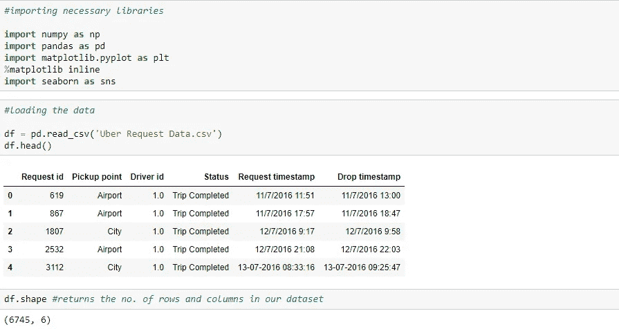

# 出租车服务供需缺口的数据分析

> 原文：<https://medium.com/analytics-vidhya/data-analysis-for-cab-service-supply-demand-gap-d0c9c55ed961?source=collection_archive---------9----------------------->

你可能有一些往返机场或城市的经历。你这次旅行使用过出租车服务吗？你有没有遇到过没有车的问题？如果这些是客户面临的问题，那么这些问题也会影响公司的业务。如果司机取消乘客的请求，或者没有车，公司就会损失收入。
该分析旨在找出问题的根本原因，并推荐改善情况的方法。

让我们从导入必要的库和研究我们拥有的数据开始。

在我们的数据集中，我们有 6745 个数据点和 6 个特征。我们的数据的特征是请求 id、定义出租车预订地点的取车点。司机 id、状态定义行程是否已完成、取消或出租车是否可用。请求时间戳定义了预订出租车的时间和日期，丢弃时间戳定义了丢弃客户的时间和日期。

从上面可以看出，驱动程序 id 中几乎有 39%的值缺失，Drop timestamp 列中有 58%的值缺失。基本上，我们对缺失值所做的是估算或使用其他方法来处理缺失值，但在这种情况下，如果我们清楚地查看两个列，Driver id 是一个唯一值列，它对数据分析没有用，Drop timestamp 对我们的分析也没有用，因此我们不需要担心这两个列。

让我们将预订的日期和时间提取到单独的列中。

现在我们可以做的是从日期和时间列中提取预订的时间，然后编写一个函数，返回一天中不同的时间，比如早上、午夜、晚上等。利用我们提取的时间。

由于我们的主要关注点是供需缺口，因此从定义行程是已完成、已取消还是不可用的状态栏中，我们可以编写一个函数，如果行程已完成，则返回供应，如果行程已取消或不可用，则返回需求。并删除不必要的列。

从上面我们可以看到，在删除和添加一些列之后，我们剩下了 5 个特性。现在让我们开始可视化我们的数据。

从上面的图中我们可以看到，与机场相比，城市中的预订数量更多，当你从城市和机场的人口规模的角度来看，我们可以说机场对出租车有更多的需求。

上面的图是一个 [iplot](https://stackoverflow.com/questions/49880314/what-is-difference-between-plot-and-iplot-in-pandas) (交互式图)，它向我们精确地显示了一天中特定时间的预订数量。在早上 5 点，有 445 辆出租车被预订，同样，我们可以使用 iplot 来了解一天中每个小时的预订数量。

我们发现，更多的预订是在夜间进行的，即晚上 7 点到 11 点，其次是早上 7 点到 11 点，中午 12 点到 1 点的预订量最少。

完成的车次和无车几乎相等。我们可以推断对出租车的需求很大，但供应很少。让我们找出机场和城市的需求和供给百分比，然后我们可能会得出一个结论，在哪些地方我们可以增加出租车的供应。

让我们找出这两个地方的需求和供给的百分比。我们将编写一个函数，当您将预订地点作为参数传递给该函数时，该函数将返回需求和供应的百分比。

我们可以看到，机场和城市的需求几乎相等，而出租车的供应不能满足城市和机场客户的需求。让我们看看在一天中的什么时间和地点会有更多的预订。

从上面的图中，我们可以看到在晚上 6 点到 10 点之间有很多需求，但供应太少。我们可以看到，在机场早上 5 点到 9 点和下午 5 点到 9 点之间，越来越多来自城市的预订。

该图描述了一天中不同时段的出行状态计数，早上和晚上完成了近 700 次出行，而大多数出租车也在早上和清晨被取消，对出租车的需求主要出现在晚上，我们可以看到在该时间段没有出租车可用，这导致了公司和客户的损失。

从上面的可视化中，我们可以看到，早上 7 点到下午 2 点之间城市和机场的汽车数量在下午 5 点到晚上 8 点之间不可用。早上 6 点到 9 点之间城市和机场的取消出租车数量在下午 1 点到 8 点之间发生。

从上面的图中我们可以看到，在上午 4 点到 9 点的时间间隔内，城市中的需求更多，而供应太低，现在当你看一个机场时，在此时间段内的供应高，而需求低。类似地，机场在下午 4 点到晚上 11 点之间有更多的需求，而供应很少，在这个时间间隔内，城市的供应更多，需求更少。

## 结论

为了满足供需缺口，我们可以做的一件事是，我们可以帮助少数出租车司机在下午 4 点至晚上 11 点期间从城市前往机场，因为在这段时间内，机场的需求更多，供应更少，而城市的需求更少，供应更多。同样，在早上 4 点到 9 点期间，城市的需求大于机场，因此我们可以帮助一些出租车司机在该时段前往城市以满足需求，而不是在需求较少而供应较多的机场等待。通过这种方式，我们可以缩小供需差距，最终对客户和公司都有利。

感谢阅读。