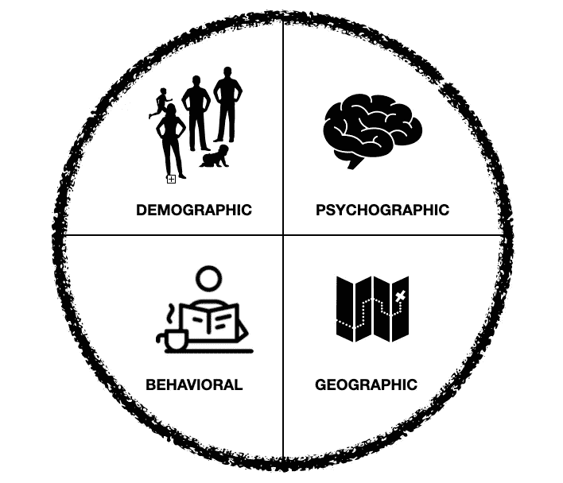
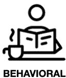
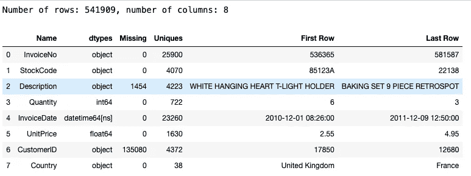
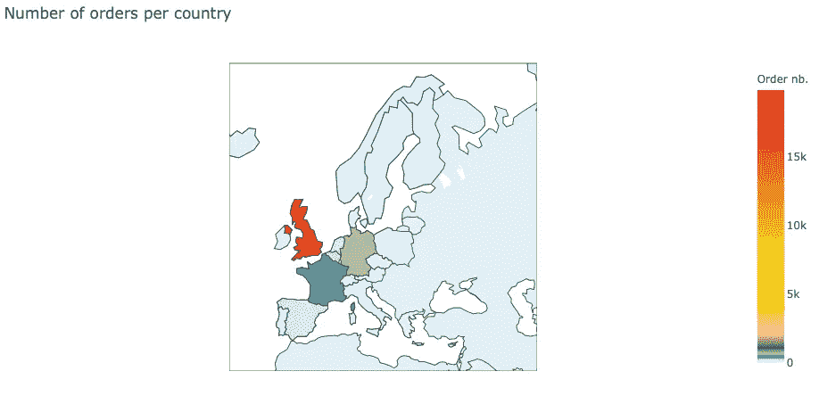
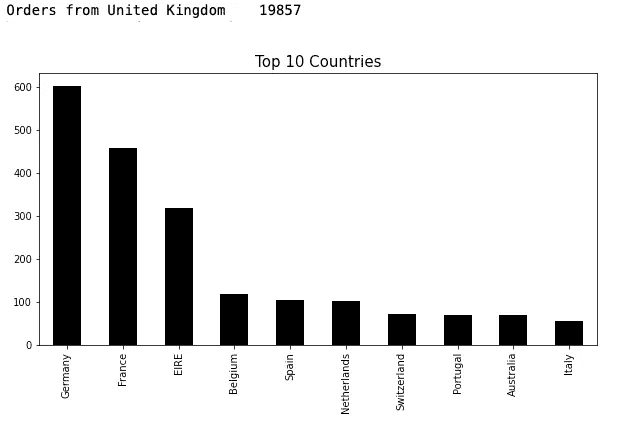
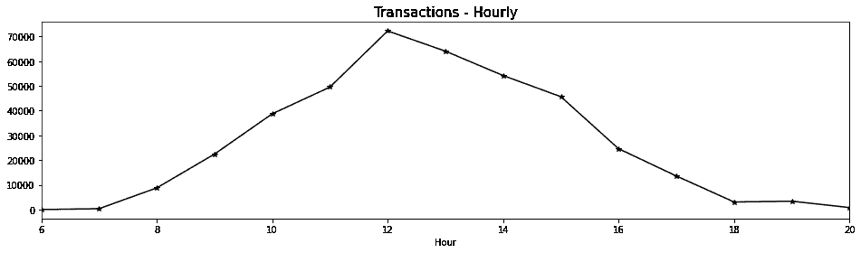
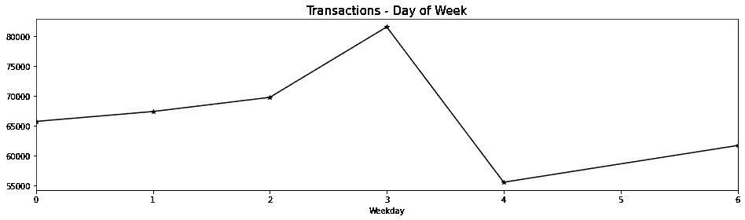
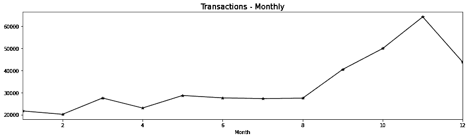
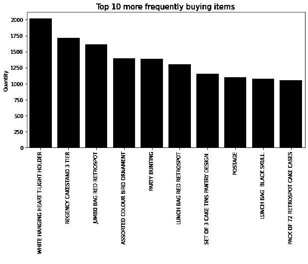
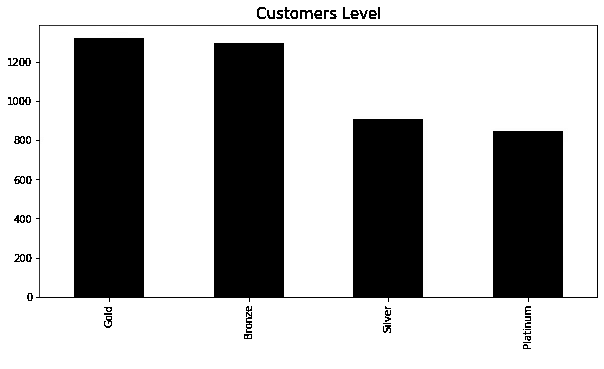

# 市场细分的数据分析

> 原文：<https://medium.com/analytics-vidhya/data-analysis-for-market-segmentation-a5a475095e8c?source=collection_archive---------4----------------------->

戴维·沃布鲁克在 [Unsplash](https://unsplash.com?utm_source=medium&utm_medium=referral) 上拍摄的照片

数据科学家有很多有用的工具来帮助公司做出正确的决策。一个强有力的工具:分段。如果我们在市场上使用这个工具，它可以让企业了解他们的客户。还有助于确定这一特定细分市场的需求，并确定企业如何通过其产品或服务最好地满足这些需求。

# 市场细分有什么帮助？

*   创造更强有力的营销信息
*   创造最有效的营销策略
*   创建定向广告

这意味着当营销信息清晰、直接、有针对性时，它们会吸引正确的人。

市场细分

# 我们如何细分市场？

*   人口细分
*   心理细分
*   行为细分
*   地理分割

**人口统计细分**是指关于一群人的统计数据。这是公司最流行和最常用的市场细分类型之一。

这是最流行的细分标志:

*   年龄
*   性别
*   收入
*   岁入
*   教育

**心理细分**根据与客户个性和特征相关的因素对客户进行细分。但这比人口统计学更难识别，因为它们是主观的。它们不是以数据为中心的，需要更多的研究来发现和理解。

例如:

*   性格特征
*   兴趣和生活方式
*   动机和优先事项

**行为细分**评估客户的行为。这些活动可能与客户如何与公司品牌互动有关，也可能与你的品牌之外的其他活动有关。

可能是:

*   购买习惯(客户购买的频率)。
*   消费习惯(顾客每次购买花费多少)。
*   用户状态(客户有会员卡吗？)
*   品牌互动

**地理细分**是最简单的市场细分类型。它根据地理区域对客户进行分类:

*   邮政区码
*   城市
*   国家
*   某个位置周围的半径

为了说明客户细分，我使用了一个[电子商务 Kaggle](https://www.kaggle.com/carrie1/ecommerce-data) 数据集，其中包含了客户在英国的购买信息。在一年的时间里(从 2010 年 12 月 1 日到 2011 年 12 月 9 日)有将近 4000 个客户和他们的购买。

数据集包含以下列:

*   发票号
*   股票代码
*   描述
*   量
*   发票日期
*   单价
*   CustomerID
*   国家

仅根据列名，我就可以确定此时可以进行什么样的客户细分。首先我可以做一些地理上的细分，找出这家店在哪里比较受欢迎。然后是行为细分，显示在选定时间段内采取了共同行动的客户。比如，他们购买相同的产品或同时购买。

每次我开始处理一个数据集，从导入、清理到收集关于数据集的信息。在下一张图中，我们可以看到数据集有多少缺失值和重复值。

在清理和一些数据类型工作之后，我可以开始我的分段分析工作。

**地理细分:**我发现我们的商店有来自 37 个国家的订单，大多数订单来自英国。

按国家分配订单

然后我列出了接下来 10 个最活跃的国家。

英国之后的国家

**总结:**正如我们所见，该商店的主要市场是英国，但看起来该商店在所有欧洲市场都能取得成功。

**行为细分:**这些数据给了我们一个检查客户行为的大领域。我可以检查每天，每周，每月的购买情况。我还可以找到什么产品最受欢迎。

按小时排序

该图显示:商店中的订单在早上 7:00 左右开始增加，订单高峰在中午 12:00，从晚上 6:00 开始，趋势缓慢下降到早上水平。

按星期排序(0-星期一，1-星期二，2-星期三，3-星期四，4-星期五，5-星期六，6-星期天)

这个剧情说明:哇！我没想到人们更喜欢在周一到周四购物。

按月排序

该图显示:订单呈逐月增长趋势。12 月份的突然缺口是因为数据集只有截至 12 月 9 日的数据。

我们来看看这家店的订单里有什么。该图显示了订单中最受欢迎的项目。

受欢迎的项目

行为细分的下一步—检查客户忠诚度。我使用 RFM 模型研究忠诚度。

> 新近性、频率、货币价值是一种[营销](https://www.investopedia.com/terms/m/marketing.asp)分析工具，用于通过使用某些措施来识别公司或组织的最佳客户。RFM 模型基于三个定量因素:
> 
> *** R** ecency:一个[客户](https://www.investopedia.com/terms/c/customer.asp)最近进行了一次购买
> 
> 频率:客户购买的频率
> 
> 一元值:顾客在购物上花了多少钱

我是怎么一步步做到的:
1。使用数量
2 将所有客户分为 4 组。使用 RFM 功能
3 对所有客户进行排名，从 1 到 4。根据 RFM 的特征对所有客户进行分组，并给每个组打电话

RFM 集团

***白金*** :这些是你最忠实的客户，他们最近购买，最频繁，并且是重金购买者。
***黄金*** :这些是你最近的顾客，频率一般，消费金额不错。
***白银*** :这些是你的客户，他们购买了很多次，花费了很多钱，但是最近没有购买。

# 摘要

我向你们展示了营销分析和数据科学在商业中的主要工作之一——识别顾客的行为。这是一个非常有用的技术，在确定业务和营销战略。