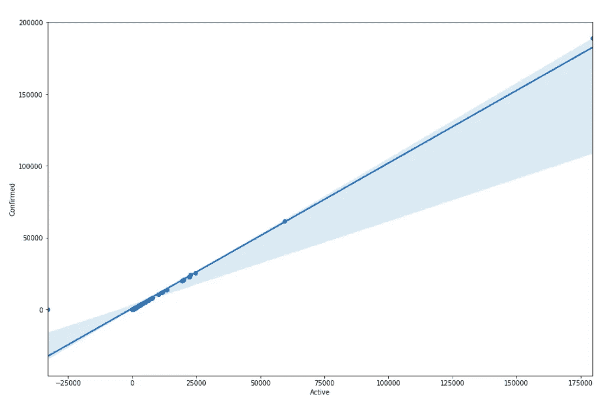
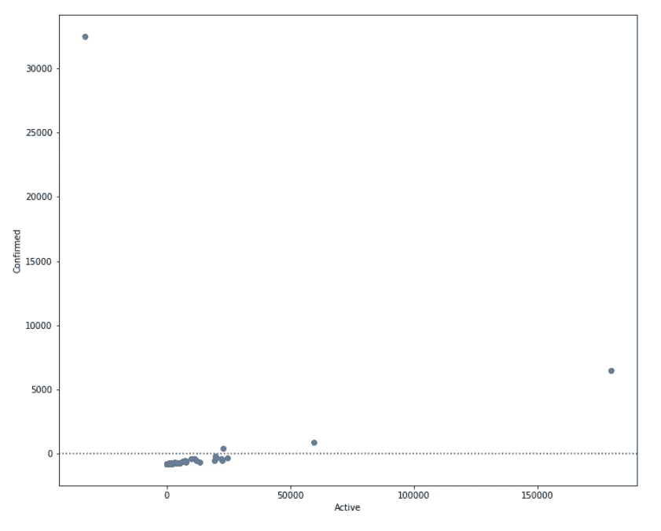
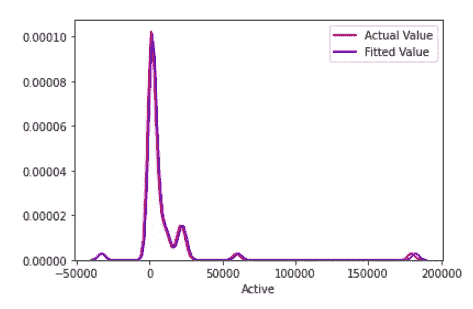
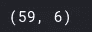
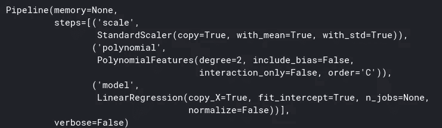
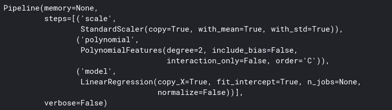
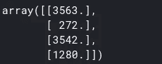
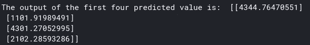
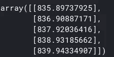
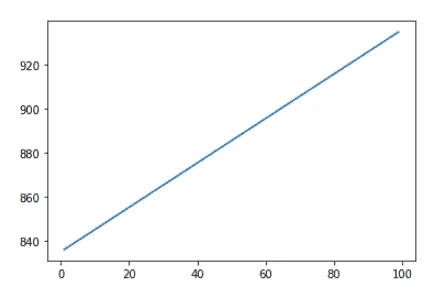

# 数据分析的模型开发

> 原文：<https://medium.com/analytics-vidhya/data-analysis-for-model-development-f7819e62fe28?source=collection_archive---------31----------------------->

> “让我们训练、构建和可视化我们的数据”


## 内容

1.  什么是模型开发
2.  简单线性回归
3.  使用可视化进行模型评估
4.  管道
5.  样品内评估的方法
6.  预测和决策

# 1.什么是模型开发？

> 模型开发被认为是我们用来预测结果的数学方程。基本上，我们将一个或多个自变量与其他因变量联系起来。换句话说，我们可以说我们在不同变量之间建立了精确的关系，这些变量被用来预测值。
> 如果我们考虑更多的相关数据，我们可以有一个更准确的模型。

# 2.简单线性回归

> 简单的线性回归是两个变量之间的关系。其中一个独立变量用于预测。


> **独立(预测)变量** → X
> 
> **相关(目标)变量** → Y
> 
> **线性关系** →Y=(b_0) +(B_1)X
> 其中，(B_0) → **截距**和，(B_1) → **斜率**
> 
> 如果我们假设这些变量之间存在线性关系，那么我们可以建立一个模型来确定预测。

```
**#Import Linear_model from Scikit_learn**
from sklearn.linear_model import LinearRegression**#Linear Regression object using constructor**
lm = LinearRegression() 
lm**#Defining the Independent and Dependent Variable**
X = df[["Active"]]     
Y = df[["Confirmed"]]**#Fit the model i.e., find the parameters (B_0) and (B_1)** lm.fit(X,Y)**#Obtain the Prediction** yhat = lm.predict(X)
yhat[0:10]           #the output is an array**#Obtain Intercept** lm.intercept_**#Obtain Slope** lm.coef_
```

# 3.使用可视化进行模型评估

> **回归图:**显示散点图和拟合线性回归的组合。它很好地估计了:

1.  两个变量之间的关系
2.  相关强度
3.  关系的方向(积极或消极)

```
import seaborn as sns
import matplotlib.pyplot as plt
%matplotlib inlinewidth = 15
height = 10
plt.figure(figsize=(width, height))
sns.regplot(x="Active", y="Confirmed", data=df)
```



> **残差图:**给出(或表示)实际值之间的误差，检查预测值和实际值。我们通过子跟踪预测和实际目标值来获得该值。

```
width = 12
height = 10
plt.figure(figsize=(width, height))
sns.residplot(df['Active'], df['Confirmed'])
plt.show()
```



> **分布图:**统计预测值 v/s 实际值。它们对多个独立变量非常有用。独立值和从属值是连续的。

```
ax1 = sns.distplot(df["Active"], hist=False, color="r", label = "Actual Value")
sns.distplot(Yhat, hist=False, color="b", label="Fitted Value", ax=ax1)
```



我们可以看到，拟合值接近实际值，因为两个分布重叠。

# 4.管道

> 数据管道简化了处理数据的步骤。

```
from sklearn.preprocessing import PolynomialFeatures
from sklearn.pipeline import Pipeline
from sklearn.preprocessing import StandardScalerpr=PolynomialFeatures(degree=2)
prZ = df[["Active", "Confirmed"]]
Z_pr=pr.fit_transform(Z)Z.shape
```


```
Z_pr.shape
```



```
Input=[('scale',StandardScaler()), ('polynomial', PolynomialFeatures(include_bias=False)), ('model',LinearRegression())]pipe=Pipeline(Input)
pipe
```



```
pipe.fit(Z, Y)
```



```
ypipe=pipe.predict(Z)
ypipe[0:4]
```



# 5.样品内评估的方法

> 通过这种方式，我们可以从数字上定义模型在数据集上的拟合程度。

```
lm.fit(X, Y)
print('The R-square is: ', lm.score(X, Y))
```


我们可以说，97.09%的确诊病例的变异可以用这个简单的线性模型来解释。

```
Yhat=lm.predict(X)
print('The output of the first four predicted value is: ', Yhat[0:4])
```



```
from sklearn.metrics import mean_squared_errormse = mean_squared_error(df['Confirmed'], Yhat)
print('The mean square error of Confirmed cases and predicted value is: ', mse)
```


# 6.预测和决策

## 预言；预测；预告

> 以确定最终的最佳匹配。
> 生成指定范围内的值序列。

```
import matplotlib.pyplot as plt
import numpy as np
%matplotlib inlinenew_input=np.arange(1, 100, 1).reshape(-1, 1)lm.fit(X, Y)
lm
```


```
yhat=lm.predict(new_input)
yhat[0:5]
```



```
plt.plot(new_input, yhat)
plt.show()
```



## 决策制定:确定一个合适的模型

> 既然我们已经可视化了模型，并生成了拟合的 R 平方和 MSE 值，那么我们如何确定一个好的模型拟合呢？

***什么是好的 R 平方值？***

> 具有较高 R 平方值的模型更适合该数据。

***什么是好的 MSE？***

> MSE 值最小的模型更适合该数据。

**让我们来看看价值观。**

> **简单线性回归:**用**的**作为**的预测变量确认**。
> 
> R 平方值:0.9709046123701057
> 均方误差:1918514

# 结论

> 在这篇文章中，我们学习了如何训练和可视化我们的数据。学习了如何构建简单的管道来处理数据。显示我们的模型如何适应数据集的计算值。并且最后执行预测和决策以发现如何确定良好的模型拟合。

# 参考

> 你可以在我的 Github 上找到上面的代码:

[](https://github.com/kpiyush04/covid-19-Data-Analysis-beginner-level) [## kpiyush 04/新冠肺炎-数据分析-初级

### 数据分析初级。有助于 kpiyush 04/新冠肺炎-数据分析-初级水平的发展，创造一个…

github.com](https://github.com/kpiyush04/covid-19-Data-Analysis-beginner-level) 

> 祝你旅途顺利。
> 
> 如果这篇文章有帮助，请留下掌声。
> 
> 如果你有疑问，那么评论区就是你的了。我会尽我所能回答你的问题。
> 
> 感谢 you❤